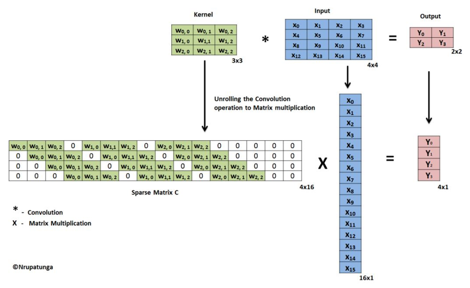
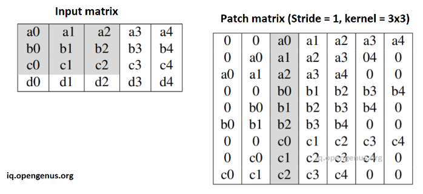
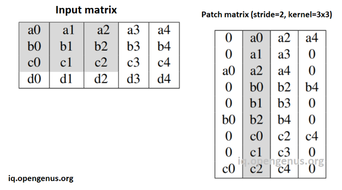
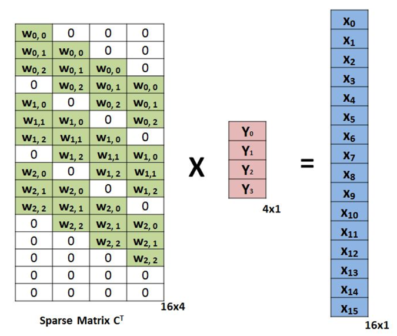
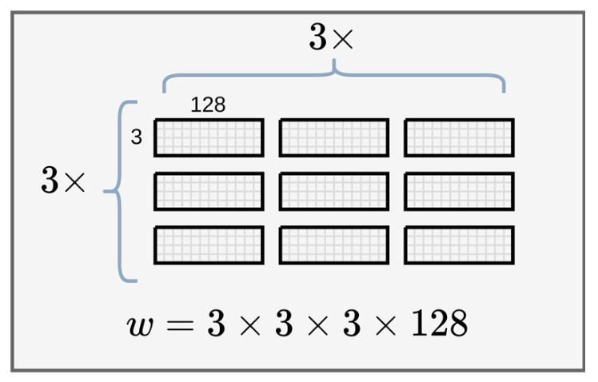
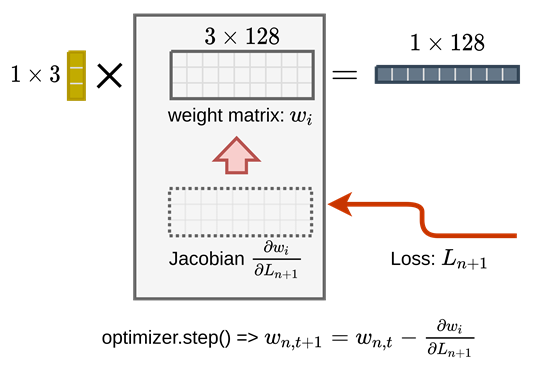
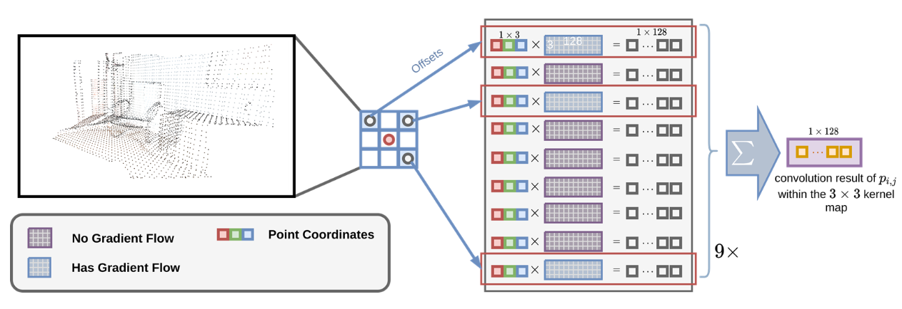
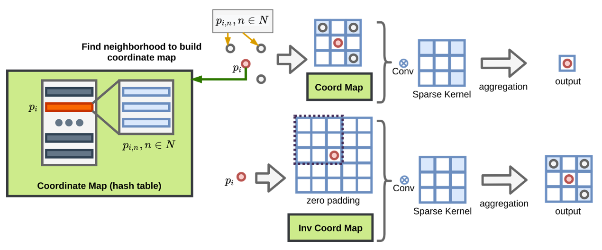
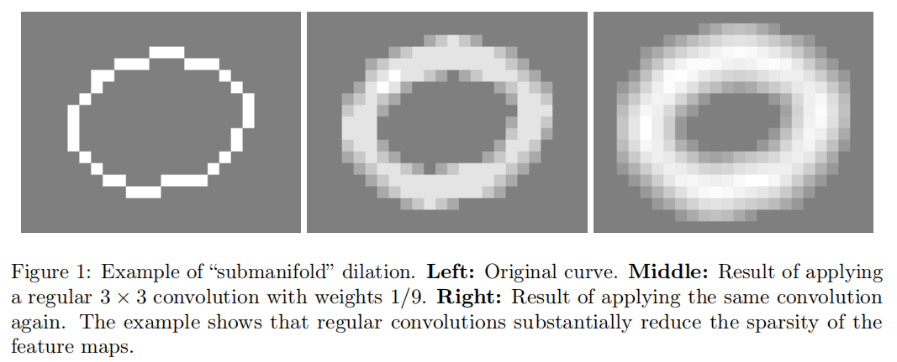

# 稀疏卷积

（sparse convolution）

本文介绍稀疏卷积的大概计算方式，详细见《SECOND》笔记。

[图片参考](https://rancheng.github.io/Sparse-Convolution-Explained/)

## 相关文献

- [Spatially-sparse convolutional neural networks](https://arxiv.org/abs/1409.6070)

	提出一般的稀疏卷积。

- [Submanifold Sparse Convolutional Networks](https://arxiv.org/abs/1706.01307)

	提出子流形稀疏卷积。

- [3D Semantic Segmentation with Submanifold Sparse Convolutional Networks](https://arxiv.org/abs/1711.10275)

	对子流形稀疏卷积做了更详尽的阐述和应用。

- [SECOND: Sparsely Embedded Convolutional Detection](https://www.mdpi.com/1424-8220/18/10/3337)

	基于 GPU 实现了一种快速稀疏卷积。

## 矩阵计算

### 一般卷积

可以将 kernel 表示成矩阵，image 表示为列向量进行运算：



也可采用 im2col 的方式：

将 kernel 看作一个向量，将 image （$O(HWC)$）看作 patches matrix（$O(HW(K^2)C)$）：

stride = 1，kernel = 3x3：



stride = 2，kernel = 3x3：



### 转置卷积

计算方式与一般卷积类似，转置 weight matrix（即图中的 sparse matrix）并调换 output 和 image 的位置即可：




## 点位计算

不同于矩阵计算，点位计算更易由 GPU 加速计算过程。

### 卷积权重

对于 3 通道的输入 feature 的计算（以下称图片或 image）：

```python
import torch.nn as nn

# input channel = 3（RGB）
# output channels = 128
# kernel size = 3
conv = nn.Conv2d(3, 128, 3)

print(a.weight.shape)

# output
torch.Size([128, 3, 3, 3])
```

为什么卷积的 weight 的 shape 为 `[128, 3, 3, 3]` ？

- 输出有 128 个通道，说明有 128 个 filter 。
- 每个 filter 有 3 个通道的 3 x 3 的 kernel 。

实际计算时的维度分布为：



### 原子操作

输入：

- image 的一个像素数据（$1 \times 3$，跨通道）。
- filter 在 kernel 上的一个点位的数据（$1 \times 3$，跨通道），有 $128$ 个 filter（$1 \times 3 \times 128 = 3 \times 128$）。

输出：

- filter 在 kernel 一个点位的卷积结果（$1 \times 128$，跨通道）



注意，上图的 $1 \times 3$ 的向量应当是一个行向量，而不是列向量，画错了。

其中，计算出的 loss 在 jacobian 处积累，一个 batch 积累完后，更新 weight matrix 。

- filter 的每个 kernel 内 $9$ 个点位的卷积结果需要再加起来，得到 output feature map 的一个点位（ $1 \times 128$，跨通道）。


其中，$p_{i,j}$ 表示各像素（点位）。

这个过程表示为公式即：
$$
x_u = \sum W_ix_{i+u}, u \in C_{out}
$$
其中，$u$ 表示卷积输出特征图 $C_{out}$ 的一个点位，$i$ 表示 $u$ （$u \in N$）位置的 kernel 的共 $3 \times 3$ 个点位，$C_{out}$ 共有 $N$ 个点位。

注意，转置卷积在计算时，在 weight matrix 上各点位结果加和（$\sum$）的方向和一般卷积一样，但权重 matrix 已经转置，可在矩阵计算中对比。

若通道数特别大，将其切分后送入 GPU 即可

## 点位映射

对于稀疏的数据，进行稀疏卷积：

- 稀疏卷积只计算 kernel 中对应有数据的点位（下图中 has gradient flow 的部分）。
- 如果整个 kernel 都没有对应数据，那么就不计算这个 kernel （从而这个 kernel 在 feature map 的对应位置就没有输出）。



可以用 hash 表记录含有数据的 kernel 的位置点位 $n$（$n \in N$，输出特征图共 $N$ 个点位），同时记录这个 kernel 内含有数据的点位 $i$ 。

对于一般卷积的点位计算，（一般卷积也可以进行坐标空间的缩小）使用 coord map（坐标映射，输入中的非空点位 $I$  $\to$ 输出的点位 $O$ ）。

对于转置卷积的点位计算，先用 zero padding 扩展整体坐标空间（需要对映射的坐标值进行一定的调整），然后使用 inverse coord map（逆坐标映射， $O$ 作为输入的点位 $\to$ $I$ 作为输出的点位）。



## 相关概念

相关文献中常提到的概念。

卷积处理的图片一般是 dense 的，但也存在 sparse 的数据，比如点云，RGB-D，纸上画出的线条等数据。

$d$ 维的卷积网络可以看作输入 $d+1$ 维 tensor 的卷积网络，其中，input tensor 包含了 $d$​ 维的时空维度（spatiotemporal dimensions）(such as length,

width, height, time, *etc.*) ，和 $1$​ 维的 additional feature space dimension (for instance, RGB color channels, surface normal vectors, *etc.*) 。

一个稀疏的输入可表示为 $d$ 维的 grid ，其中每个 grid 格子称为 site，每个 site 关联一个 feature vector 。（图片为例，每个点位为 site ，每个像素为三个通道元素构成的 feature vector）

在输入中，一个 site 为 active 需要其 feature vector 中任何一个元素都不处在 ground state（基态），比如非零（注意，基态不一定为 0），实际上，就是指有有意义的输入的 site 即是 active 。

如果 input data 只包含单个 active site ，应用 $3^d$ 卷积后，将有 $3^d$ 个 active sites ，再次应用相同 size 的卷积后，将产生 $5^d$ active sites 。

这种 active sites 快速增长的现象是一般卷积网络的 poor 方面，特别是对于稀疏数据，这会导致大量无用的消耗。（submanifold dilation problem）

稀疏的数据是表示空间中密集数据流形中的一个子流形（submanifold ）。



上图是在二维 grid 中的一维曲线，在卷积后，feature map 的稀疏性快速消失（即 active 的区域扩大）。

如果只输入一维曲线经过的点的数据，卷积网络将不能捕获到足够多的信息，两个相邻的组件将被完全独立处理。
