# 拟合

（Fitting）

检测出边缘后，可以找到更高层次的特征，比如拟合出图形。

拟合实际是在做图形检测以及图形相关的目标检测任务。

以得到图中线的方程（Line Detection）为例。

## 阻碍

- 噪声（Noise）

	不属于图像的点。

- 外点（Extraneous Data）

	不属于需要模型的点。

- 数据丢失（Missing Data）

	遮挡等造成的数据丢失。

## 最小二乘

（Least Square）

对于一些散落的点，可以用最小二乘求出一条线：

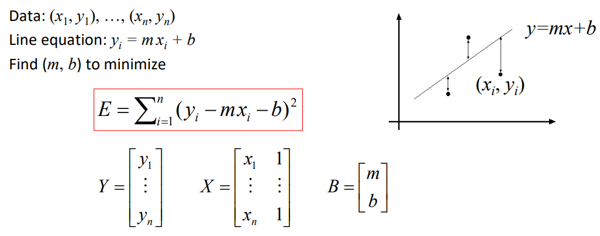

其中，$E$ 称为能量函数（也就是损失函数），最小化其即可求得直线参数。

但使用点到直线的竖直距离不适用于垂直直线的情况，为了应对直线的**旋转**，可以使用**全最小二乘（Total Least Square）**，即使用点到直线的距离：

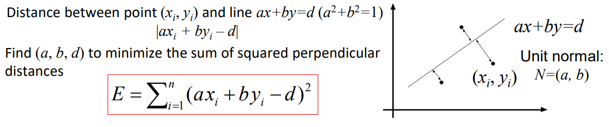

## 极大似然估计

（Likelihood Maximization）

可以将最小二乘理解为极大似然估计，观测点是直线上的点由于噪声产生偏移产生的，该噪声（即偏移）符合正态分布，离直线越近，观测到点的概率越大：

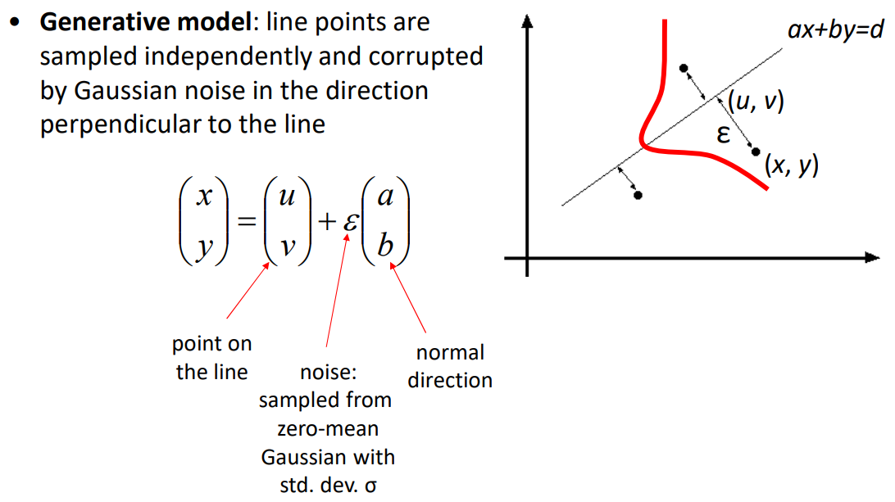

每个噪声点独立 sample 出，有：

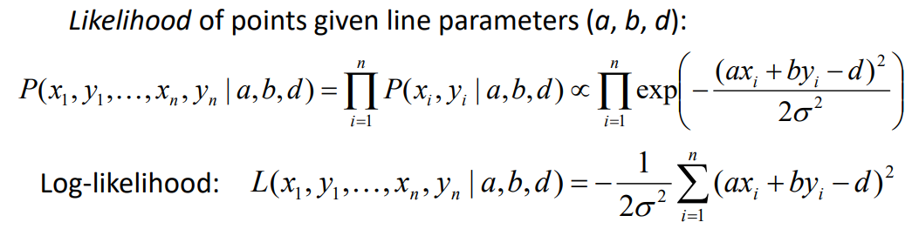

- **鲁棒估计（Robust Estimation）**

	当某些点距离直线较远时，单个离群点会对直线的拟合造成很大的影响，可以设定一个门限 $\sigma$ ，限定距离，到直线距离超过门限的点判定为不属于直线的点，从而提升鲁棒性。

一般选取 $\sigma$ 为 $1.5$ 倍的平均残差。

## RANSAC

- 随机采样一致（Random Sample Consensus，RANSAC）

基本操作流程：

1. 随机选取可以构成目标的最少的 $s$ 个点的集合。（目标为直线就是找两个点）
2. 用这些点构建出目标模型。（构建出直线方程）
3. 评估当前模型
	- 计算所有点相对模型的 loss 。
	- 相对于模型的距离在门限 $t$ 内的点的数量 $d$ 作为 score 。
4. 迭代上述三步 $N$ 次。

以拟合一条直线为例。

这是最小二乘的结果：（显然不正确）

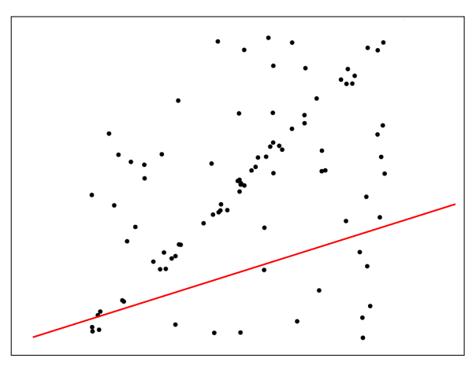

RANSAC：

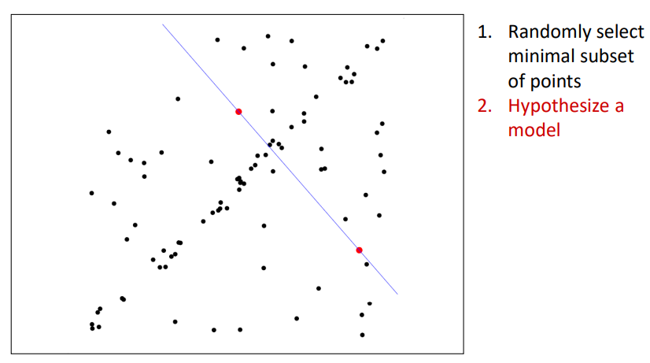

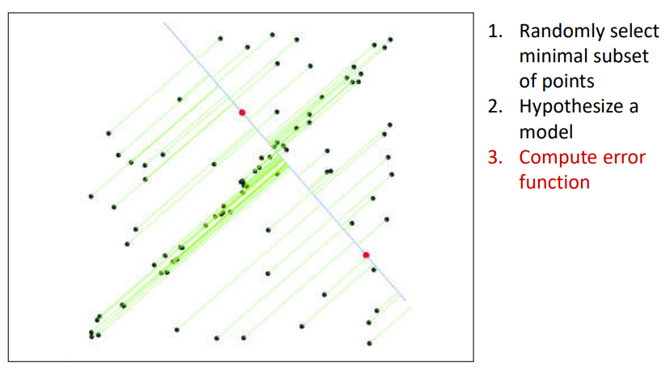

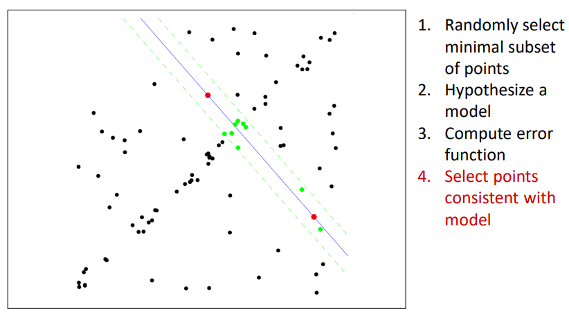

不断迭代：

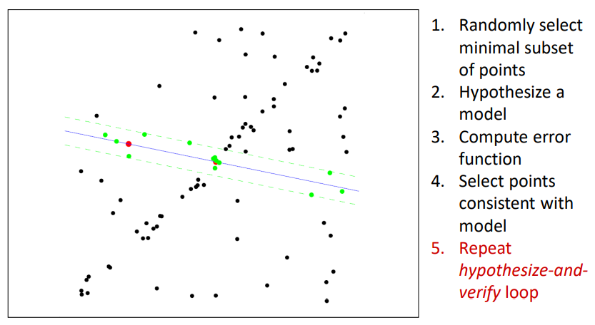

得到最优结果：

假设能在 $N$ 次迭代内以 $p$ 的概率找到最优的直线，假设外点（不在直线上及不在阈值内的点）的比例为 $e$ ，有：
$$
(1 - (1 - e)^s )^N = 1 - p
$$
其中，$(1 - e)^s$ 表示采样 $s$ 个点都在直线上，即正确的概率。

由此可计算出 $s,e$ 的情况下达到 $p$ 需要的 $N$ 的次数。

当没有先验知识可以直接选择外点率 $e$ 时，可以采用自适应的外点率：

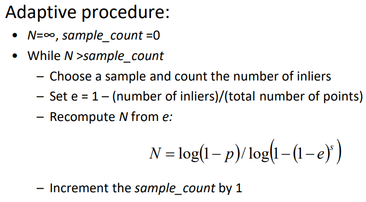

即找到更好的模型，就依据其状态更新 $N$ ，没有找到更好的模型，就保持 $N$ （确切地说是减少 $1$）。

找到最好的模型后，再依据所有内点做最小二乘，得到最终更精确的模型。

RANSAC 适合高维的图形检测，低维的图形检测可以使用霍夫变换。

## 霍夫变换

（Hough Transform）

### 假设

- 使用图像上的点给不同模型参数投票。
- 认为噪声点的投票没有确定的指向，不会都给某一个模型投票；而图像上的真实直线上的点的投票必定是集中的。
- 只要还有足够的特征能够投票选出一个好的模型，那么直线丢失的一部分数据就无关紧要。

### 原理

图像中的一条直线对应于 hough space （parameter space）中的一个点：

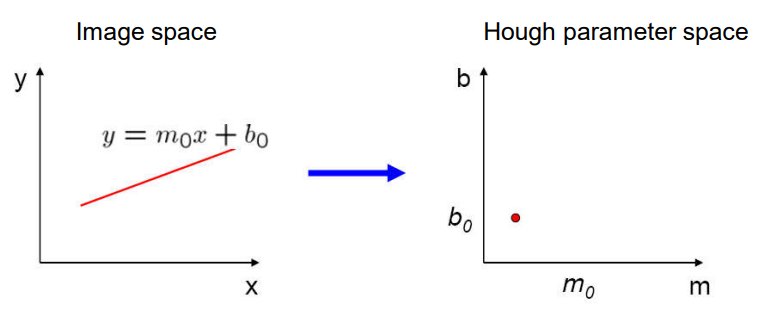

图像中的一个特征点对应于 hough space 中的一条直线：

hough space 中两条相交的直线，就代表图像中共线的两个点：

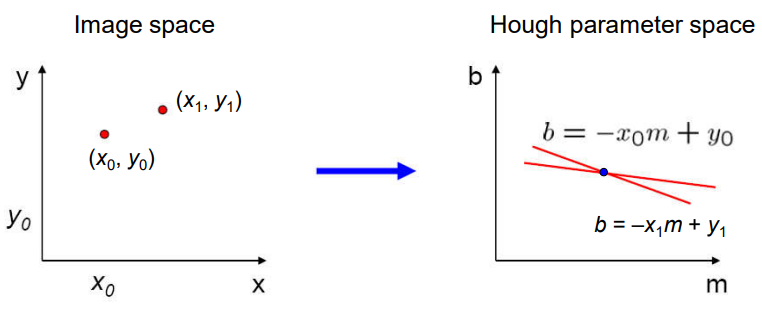

其中， hough space 中直线的交点就是图像中两点共线的那条直线。

图像中的每个特征点给能够生成该点的模型参数投票，即每个特征点给其对于 hough space 中的直线经过的每个空间位置投票，最后找到票数最多的空间位置，即是最优的模型参数。

### 离散化

交点不一定是绝对密集的，需要用网格（grid）对参数空间进行离散化：

交点最密集的格子即可用来确定参数。

#### 硬投票

离散程度（即网格的疏密）需要精密的调整：

- 网格大（稀）
	- 大量的随机噪声可能会使得某个格子内的投票数非常多，从而产生非真实的线。
- 网格小（密）
	- 点的投票不容易密集，不容易求出直线。

#### 软投票

为了对抗噪声，可以对 hough space 进行平滑处理，即每次投票时对周边格子也投票，只是中间的格子分数较高，各个投票格子的分数和为 $1$ 。

软投票的思想很常用。

在标签平滑中，将软化表示类别的 one-hot 向量，然后进行 cross entropy 。

### 极坐标系

- 参数空间是无限的。
- 垂直的直线的方程的斜率参数是无穷值。

可以使用极坐标系表示直线。此时图像中的一个点对应 hough space 中的一条曲线。

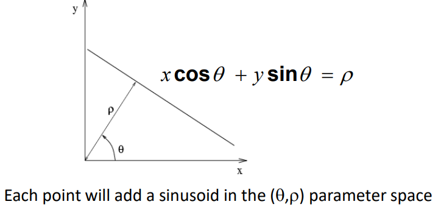

### 投票流程

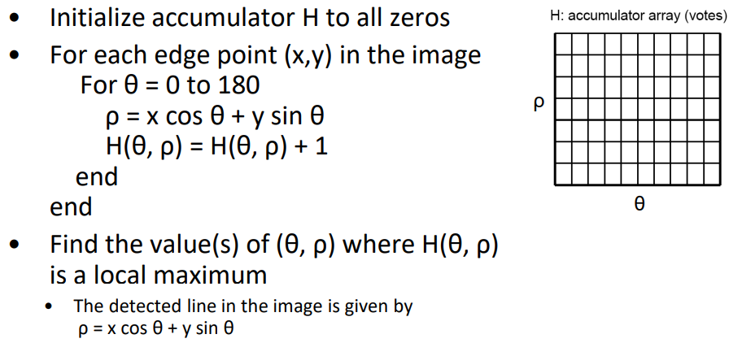

图像中有多条线，在 hough space 中就会有多个密集的交点：

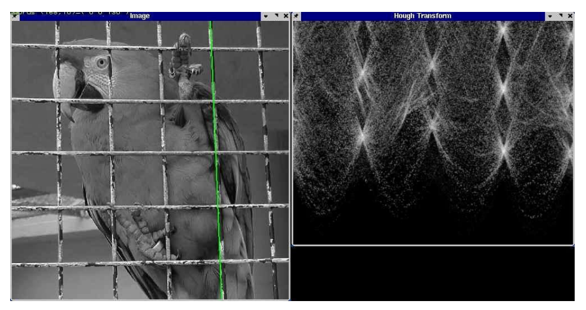

### 边缘

- 只使用检测到的边缘上的点进行投票。
- 检测便时可以知道边的梯度方向，这意味着也知道真实直线的方向，从而在参数空间中可以固定住一个参数，使得投票更准确。

### 圆的 hough

对于圆的检测 $x^2 + y^2 = r^2$，其中，圆的半径为 $r$ ，在图像的边缘上的一点，结合梯度方向，可知其对应的圆心有两个可能的位置，一个在真实圆内，一个在真实圆外，随着 $r$ 的增大，这两个可能的圆心的距离会越来越大（hough space 中两条直线的开口越来越大）：

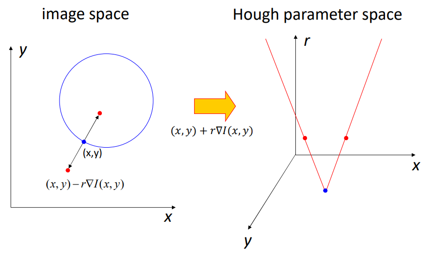

其中，hough space 的 $x,y,r$ 轴都是有边界的，最多到图像边界，由此可以对圆心可能位置投票。

真正的圆心在许多三角形面的交点上，如果没有利用梯度信息，就是在许多椎体面的交点上。

### 反投票

投票也可视情况反向，对 hough space 中的每个点计算其在图像中对应的圆，然后计算其置信度。

### 投票模型

可以设定一些投票的模型，即某些图形对应于什么特征，可以通过对特定图形附加参数位置向量（displacement vector）实现。

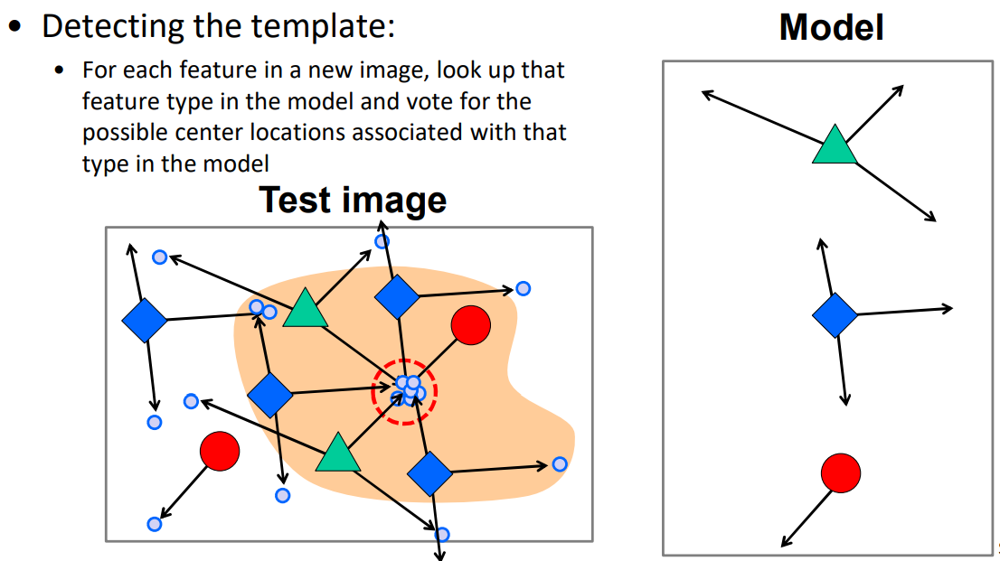

比如轮子可能对应汽车，可通过两个轮子的投票确定汽车的（中心）位置：

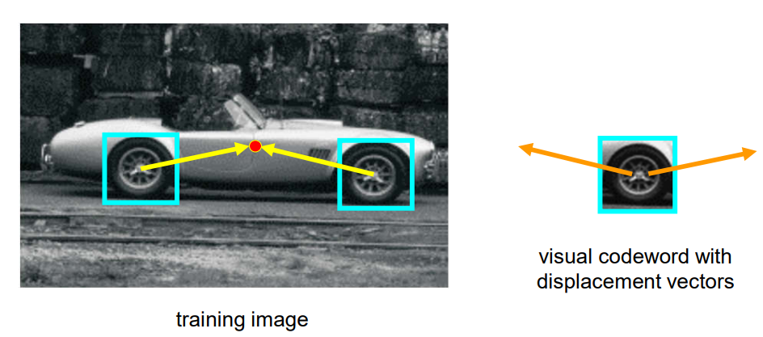

