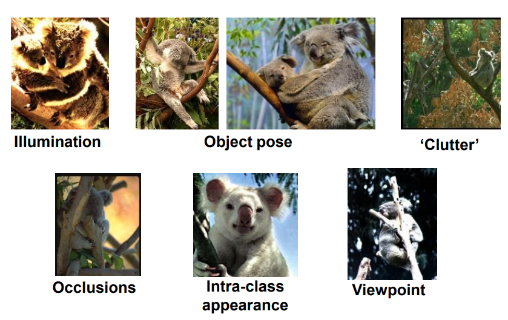
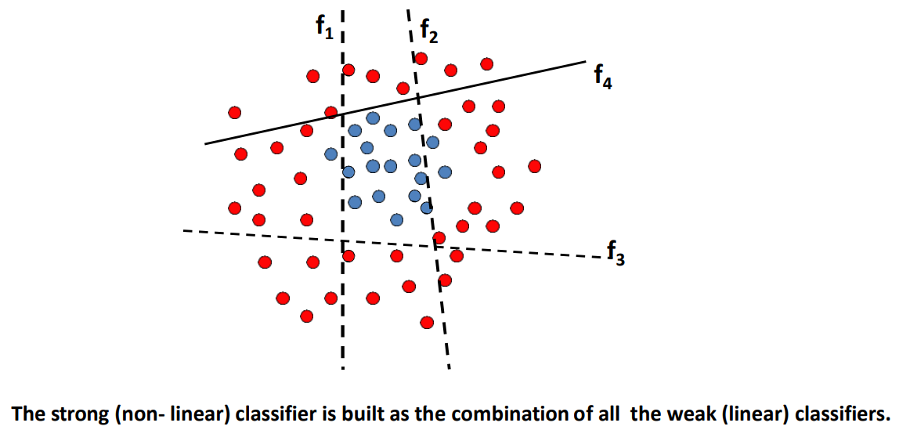
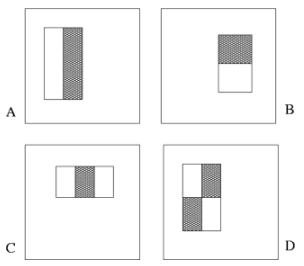
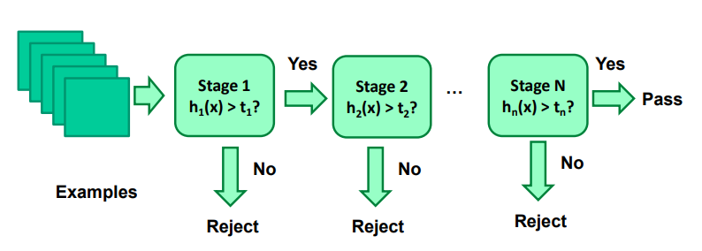
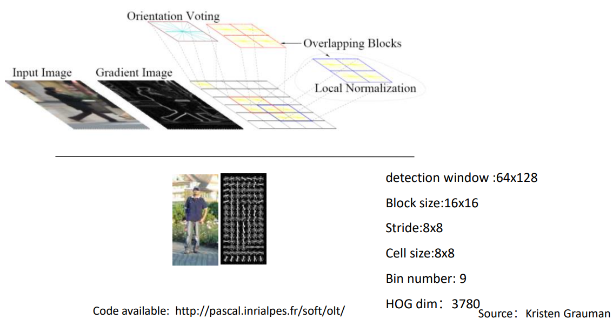
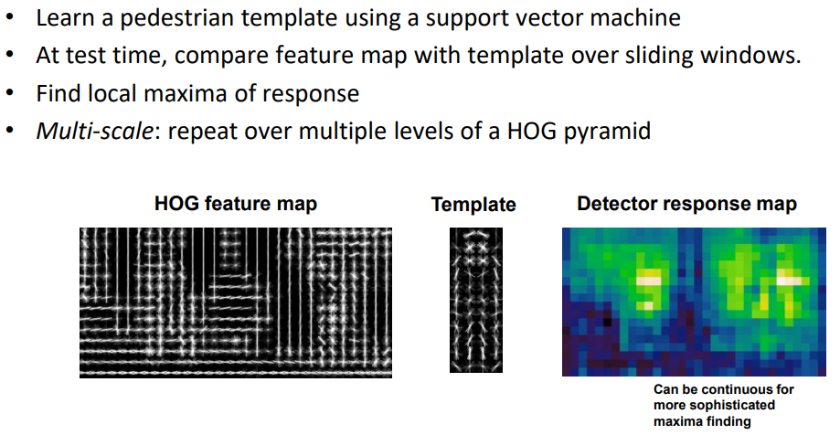

# 目标检测

（Object Detection）

识别目标是什么，并指出在哪里。

changes：

- 光照
- 目标姿态
- 混乱
- 遮挡
- 个体内差异
- 视角

- Sliding Window

	直观的方法是使用滑动窗口做 recognition，看该窗口位置是否有指定物体。

	- 采用窗口类的算法对人脸，行人等较固定特征的物体（特征形变不大的情况）识别效果较好，因为可以针对特定特征设计分类器。

## viola & Jones algorithm

P. Viola and M. Jones. Rapid object detection using a boosted cascade of simple features. CVPR 2001.

采用 boosting 的策略进行人脸检测（Face Detection）。

### boosting

以一个二分类任务为例：

1. 设置多个弱分类器进行分类。
2. 选择其中正确率最高的模型。（一般要大于 50% ，没有大于的时，二分类下可以选择正确率最低模型的反面结果）
3. 将该模型判断失误的点的权重放大，使模型更易将其分开。
4. 重复操作，直到各次选择的模型的叠加能够得到一个较好的结果。

可表示为：
$$
H(x) = \alpha_1h_1(x) + \alpha_2h_2(x) + \alpha_3h_3(x) \dots
$$
其中，$H(x)$ 为 strong classifier ，$h_i(x)$ 为 weak classifier ，$\alpha$ 为弱分类器的权重。

弱分类器可表示为：
$$
h_i(x) = \begin{cases}
1, \ f_i(x) \gt \theta_i \\\\
0, \ \rm otherwise
\end{cases}
$$
其中 $1$ 和 $0$ 为类别，$f(x)$ 为某种算法， $\theta$ 为门限。

最终的强分类器为：
$$
H(x) = \begin{cases}
1, \ \sum \alpha_i h_i(x) \gt \frac 1 2 \sum \alpha_i \\\\
0, \ \rm otherwise
\end{cases}
$$

### 弱分类器

假设共使用四种卷积核 $ A, B, C, D $ ，都有参数 $\rm type, postition(x,y),size(weight,height)$  ，用白色区域像素和减去黑色区域像素和，其大于门限则响应 $1$ ：

一种参数情况（一种窗口形式）即是一种弱分类器。

其中计算区域像素和可以采用**积分图（integral image）**（在离散情况下就是二维前缀和）进行预处理优化。

### 训练流程

1. 计算响应

	在每个样本上计算弱分类器的响应值。

2. 选取门限

	对每个弱分类器，将正样本和负样本的对应卷积核的响应分数放在一起作直方图，选取区分正确率最高的那个值作为门限。

3. 归一化

	将所有样本的响应归一化。

4. 错误率

	对每个弱分类器计算总错误率。

5. 选取

	选取一个错误率最低的弱分类器。

6. 调整权值

	将该此前分类器成功分类的样本权重缩小（意味着分类错误的样本权重相对变大）。

### Cascade

全部弱分类器的计算消耗非常大，可以采取 Cascade（级联）策略优化计算量。

- 首先使用分类效果较弱了，计算快的分类器，接受尽可能多的正样本。（拒绝一部分负样本）
- 往后使用分类效果更强，计算更慢的分类器，进一步判断。

## HOG Feature

方向梯度直方图（Histogram of Oriented Gradient，HOG）

N. Dalal and B. Triggs, Histograms of Oriented Gradients for Human Detection, CVPR 2005

以行人检测（Pedestrian Detection）为例。

在 64x128 的检测窗口内，划分出 16x16 的 Block 其偏移为 8x8 （存在 overlap），在 Block 中再划分大小为 8x8 的 Cell ，对每个 Cell 作梯度方向直方图，将梯度方向直方图的信息离散化为 9 维的特征向量，整个检测窗口的特征向量总维度为 3780 维：

使用这些特征向量训练一个线性 SVM（维数较高，使用线性即可）：

其中的亮点就代表有行人。
