# 可视化

可用于检查模型关注的像素分布，感兴趣的区域等是否合理。

对原图进行翻转，平移，旋转，如果可视化关注的目标合理，说明这个模型能够应对这些操作，如果不能，改进模型。

salinecy map 和 activation maximization 可通过 Flashtorch [Github](https://github.com/MisaOgura/flashtorch) 实现， [参考](https://www.cvmart.net/community/detail/2031)。

grad-CAM 可通过 [Github](https://github.com/jacobgil/pytorch-grad-cam) 实现。

## Salinecy Map

（显著图）

给定一张图像时，图像中哪些像素对分类结果贡献大。

[Deep Inside Convolutional Networks: Visualising Image Classification Models and Saliency Maps 2013](https://arxiv.org/pdf/1312.6034.pdf)

### 输入的影响

神经网络通过权重为输入分配关注度，并加权求和输出分类分数 $y$ ：
$$
y = w_1x + w_2x + b
$$
输出对输入求导能够得到该输入相关的梯度对分类结果的影响程度，梯度值越大，说明它对应的输入越重要，对输出影响越大：
$$
\frac {\partial y} {\partial x} = w_1 + w_2 = w
$$

其中，对输入求导的结果必然与输入的 shape 相同，选取 RGB 三个通道中最大的那一个，即可作图：

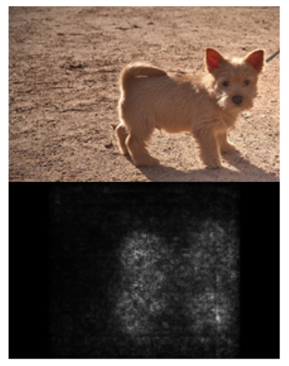

### Guided backpropagation

（引导反向传播）

[Striving for Simplicity: The All Convolutional Net](https://link.zhihu.com/?target=https%3A//arxiv.org/abs/1412.6806) 

该技术可以将对目标类的预测值没有影响或有负面影响（负的值会导致目标类的预测类别的 score 下降，所以是负面影响）的神经元屏蔽并忽略，可以减少梯度计算中的噪声，优化可视化效果：

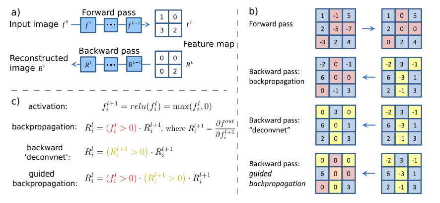

其中 ，使用 RELU 作为激活函数， $R$ 为对各层输入值求导的结果（权重的综合）。

对于 b）部分：（通过的值是什么见 c） 部分）

1. 第一个箭头：一般的前向传播，通过 RELU ，负的值变为 $0$ 。（通过的是响应值）
2. 第二个箭头：一般的反向传播（对输入求导），通过 RELU，前向传播中为 $0$ 的位置通过的值为 $0$ （因为该层输出 $y^{(l)} = 0$ ），负值可通过。（通过的是对输入的梯度，不是对权值的梯度）
3. 第三个箭头：反卷积网络（deconvnet）的反向传播，负的值都不能通过。（通过的是对输入的梯度）
4. 第四个箭头，引导反向传播：（通过的是对输入的梯度）
	- 前向传播为 $0$ 的位置，在引导反向传播时为 $0$ 。（对目标类预测值没有影响的位置）
	- 为负的值不通过。（有负面影响的位置，对输入的负梯度会导致对应输出变小，这里需要输出尽可能大）

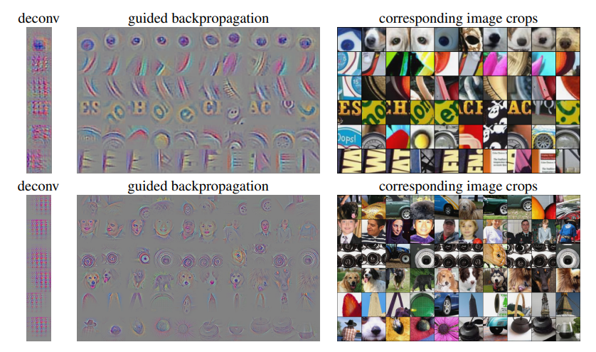

## Grad-CAM

（梯度激活热力图，Gradient Class Activation Mapping）

salinecy map 可能出现像素响应非常散乱的情况（存在噪声似的梯度），重要区域不明显，可以使用 Grad-CAM 。

Grad-CAM 能够让重要区域更明显，并以热力图的形式表现影响的强度分布（但并不意味着其它区域没有影响，只是突出了重要区域）。

[Grad-CAM: Why did you say that? Visual Explanations from Deep Networks via Gradient-based Localization 2016](https://arxiv.org/pdf/1610.02391v1.pdf)

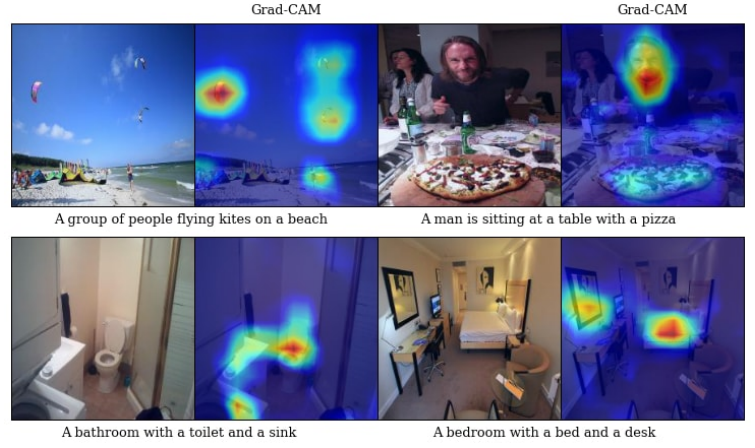

## Activation Maximization

（激活最大化）

[Deep Inside Convolutional Networks: Visualising Image Classification Models and Saliency Maps 2013](https://arxiv.org/pdf/1312.6034.pdf)

[Understanding Neural Networks Through Deep Visualization 2015](https://arxiv.org/pdf/1506.06579.pdf)

卷积层的滤波器学习了什么特征，网络是根据什么特征来分类的。

迭代地更新输入图像，以生成最大程度激活目标神经元的输入图像。

使用 gradient ascent 方法。

### Gradient Ascent

（梯度上升）这个梯度上升指在输入图上的不断累加上升，而不是优化算法的梯度上升。

gradient ascent 也可采用 guided backpropagation 的方式。

迭代地生成指定神经元（卷积核）感兴趣的输入图像（感兴趣的特征）。（可以指定不止一个的任意层任意神经元）

使用一个训练完毕的网络，先初始化一个空图：

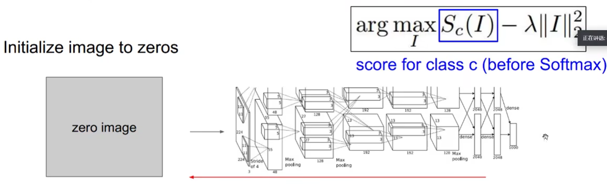

其中，$S_c(I)$  表示类 $c$ 的 score，要最大化某些神经元的输入图像，加正则项是为了减少高频信息的影响，使变化更平滑，得到更自然更具可解释性的可视化结果。

然后迭代：

1. 前向传播，计算 score 。
2. 反向传播，得到指定神经元关于图片像素的梯度值。（对输入求导，不更新权重，更新输入）
3. 用得到的梯度值更新输入图片（并再次输入）。（反复迭代寻找满足上述最大化式子的输入 $I$ ）

注意：神经网络是一个特别复杂的函数，反向传播对输入 $I$ 求导，在代入 $I$ 计算结果时，虽然权值不更新，但不断更新的 $I$ 能够产生新的影响（对 $I$ 求导时，$I$ 并不一定会被消去，比如 sigmoid 的导数）。

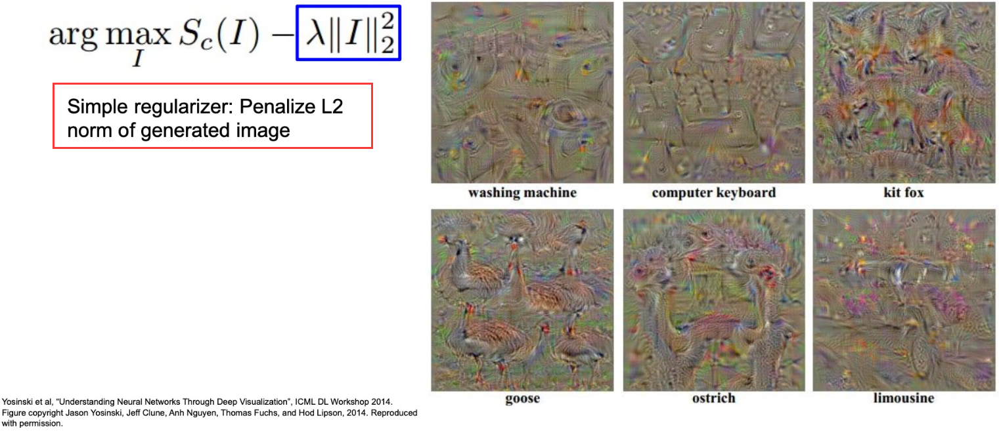

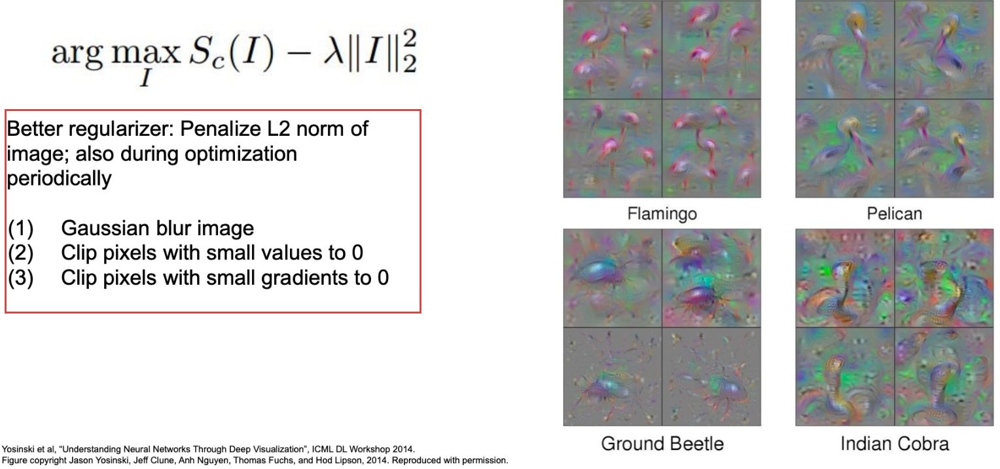

攻击神经网络：对梯度感兴趣的位置添加一定的权值，就很可能激活其它神经元，导致神经网络做出错误的预测。

将神经元感兴趣的特征进行大量的叠加，可以生成一些“艺术化”的图像，参见 Google Deep Dream 的原理： [A Neural Algorithm of Artistic Style 2015](https://arxiv.org/pdf/1508.06576v1.pdf) 。

## Style Transfer

网络的不同层学习了不同级别的特征，低级别如像素颜色，边缘，纹理等；高级别如对象，语义等

提取**某些层**表示的特征可以进行风格迁移。

[image style transfer using convolutional neural networks 2016](https://openaccess.thecvf.com/content_cvpr_2016/papers/Gatys_Image_Style_Transfer_CVPR_2016_paper.pdf) 。

### Gram Matrix

（格拉姆矩阵）

$n$ 维欧式空间中任意 $k$ 个向量两两之间的内积组成的矩阵，即为 $k$ 个向量的格拉姆矩阵，它必然是一个对称矩阵：

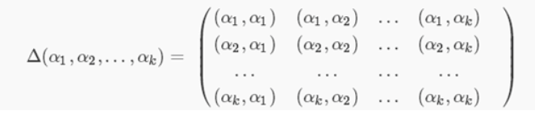

亦为：

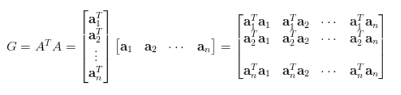

将特征图的每个通道展开为一维向量，然后计算这些向量的 gram matrix ：

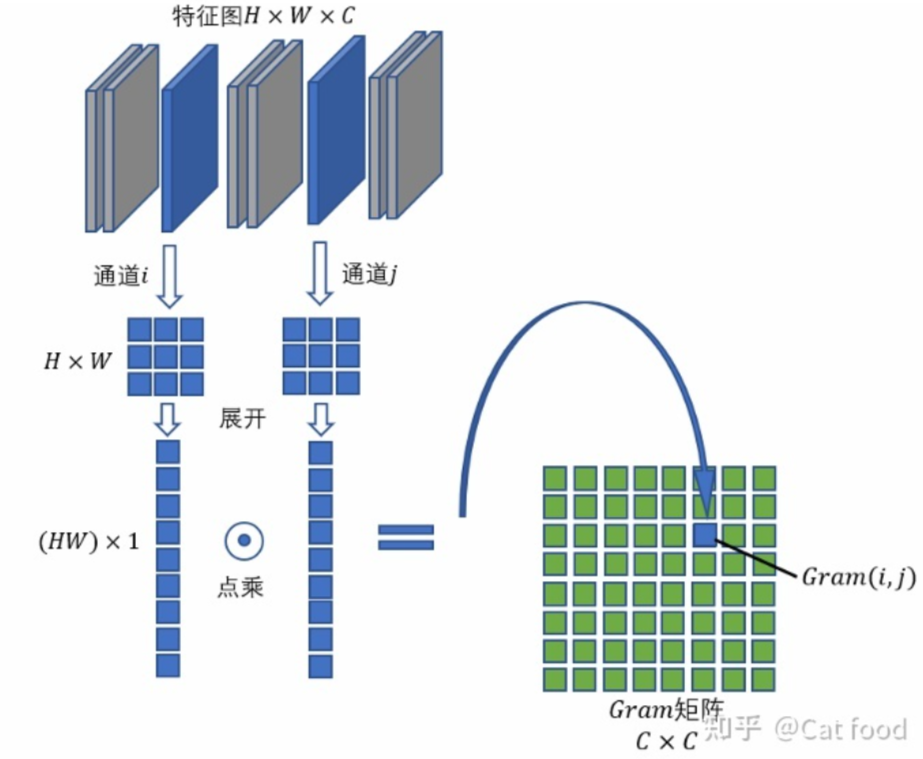

上图，每两个向量的内积为 gram matrix 的一个元素。

向量内积可以体现向量的相关性，所以 gram matrix 可以体现**有哪些特征和特征之间的相关性**，即可以体现多个特征间的模式，从而可以用来表示图像风格。

### 多层 loss

迭代：

1. 输入 style ，更新网络权重。
2. 输入 content ，更新网络权重。
3. 输入 output ，梯度上升。

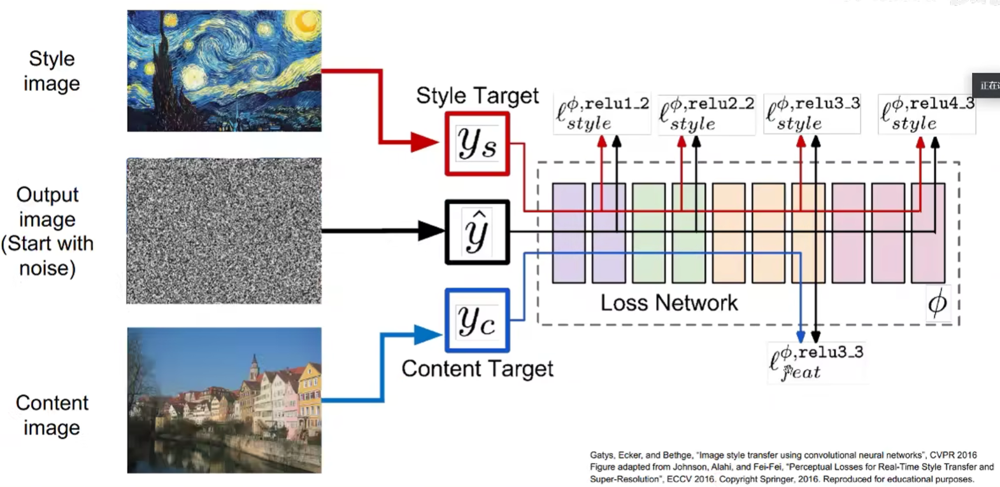

其中，使用多个 loss（图像的 Gram 矩阵的差异最小化为优化目标）拉近某些层的特征（style and content）和 content ，使其相似。

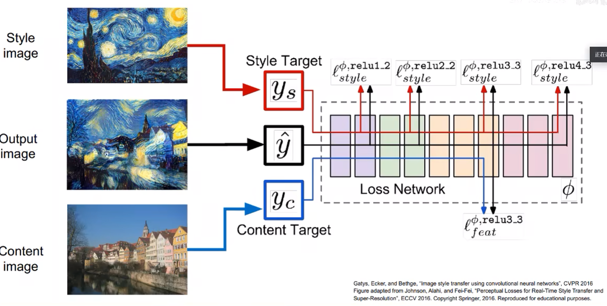

通过训练完成迁移需要多次迭代，可以使用神经网络学习风格特征，直接输出风格化后的图像：

[perceptual losses for real-time style transfer and super-resolution 2016](https://arxiv.org/pdf/1603.08155.pdf)

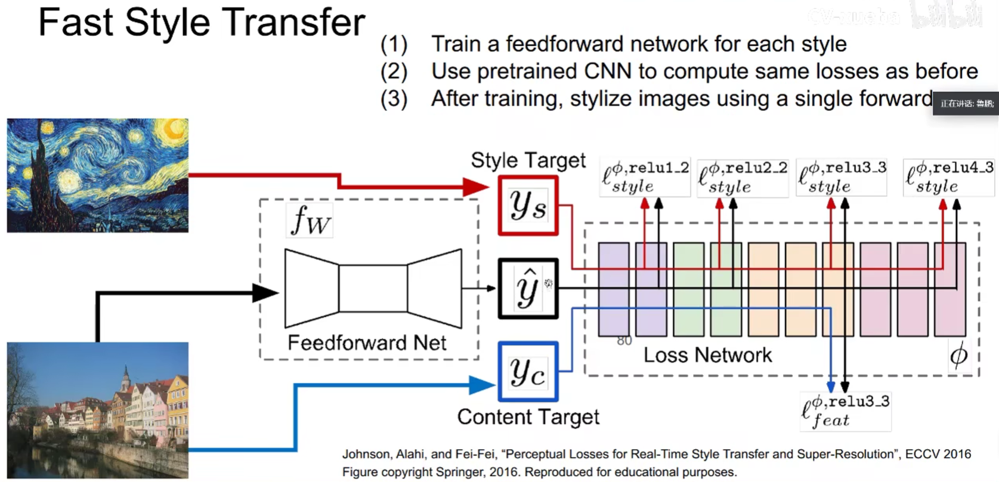

其中，Feedforward Net 的输出的各层特征与风格图的某些层特征的 loss 越小越好（相似性），即直接学习特征的映射。

