# 常见数据集

## 通用规则

数据集一般含有：

- 基本数据
- 实例标注
- 评测指标
- 评测服务

不同数据集格式转换的代码可由框架或网络提供。

## COCO

（Common Objects in COtext）

[官网](https://cocodataset.org/#home)

可使用官网的 explore 功能在线搜索浏览样本的信息。

标注支持 object detection, segmentation, captioning，keypoint detection 等任务。

### 格式

COCO 数据集格式是目前流行的标注格式。

以下以 coco2017 版本为例。

目录结构：

```shell
-coco/
    |-train2017/
    	|-1.jpg
    	|-2.jpg
    |-val2017/
    	|-3.jpg
    	|-4.jpg
    |-test2017/
    	|-5.jpg
    	|-6.jpg
    |-annotations/
    	|-instances_train2017.json
    	|-instances_val2017.json
    	|-*.json
```

annotation 文件数据结构：

```json
{
	"info": info, 
	"images": [image], //列表
	"annotations": [annotation], //列表
	"categories": [category], //列表
	"licenses": [license], //列表，协议许可信息
}

// info 为整个数据集的信息，一般没什么用。
info{
	"year": int, 
	"version": str, 
	"description": str, 
	"contributor": str, 
	"url": str, 
	"date_created": datetime,
}

// 图像
image{
	"id": int, //必要
	"width": int, //必要
	"height": int, //必要
	"file_name": str, //必要
	"license": int,
	"flickr_url": str,
	"coco_url": str,
	"date_captured": datetime, 
}

// 标注
annotation{
	"id": int, //标注id
	"image_id": int, //所属图像id
	"category_id": int, //类别id
	"segmentation": RLE or [polygon], //图像分割标注
	"area": float, //区域面积
	"bbox": [x,y,width,height], //目标框左上角坐标以及宽高
	"iscrowd": 0 or 1, //是否密集
}

// 其中，标注的类别信息具体如下：
category{
	"id": int, //类别序号
	"name": str, //类别名称
	"supercategory": str, //父类别
}
```

### 指标

COCO 提供了 12  种用于衡量目标检测器性能的评价指标：

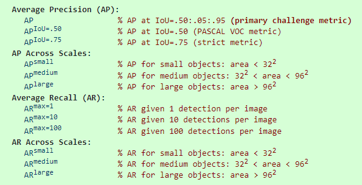

其中，$\rm AP^{IoU=.50}$ 表示 IOU 在 0.5 以上的 AP，$\rm AP$ 表示 IOU 分别在 $0.50$ 到 $0.95$ 中 10 个间隔 $0.05$ 的 threshold 之上的平均 AP。

area 表示面积。

## VOC

（Visual Object Classes）

[官网](http://host.robots.ox.ac.uk/pascal/VOC/)

标注支持 Object Classification、Object Detection、Object Segmentation、Human Layout、Action Classification 等任务。

目录结构：

```shell
-VOC/
	|-JPEGImages/
		|-1.jpg
		|-2.jpg
	|-Annotations/
		|-1.xml
		|-2.xml
	|-ImageSets/
		|-Layout/
			|-*.txt
		|-Main/
			|-train.txt
			|-val.txt
			|-trainval.txt
			|-test.txt
		|-Segmentation/
			|-*.txt
		|-Action/
			|-*.txt
	|-SegmentationClass/
	|-SegmentationObject/
```

annotation ：

```xml
<annotation>
	<folder>VOC</folder>            # 图像所在文件夹
	<filename>000032.jpg</filename> # 图像文件名
	<source>                        # 图像源
		<database>The VOC Database</database>
		<annotation>PASCAL VOC</annotation>
		<image>flickr</image>
	</source>
	<size>                          # 图像尺寸信息
		<width>500</width>    # 图像宽度
		<height>281</height>  # 图像高度
		<depth>3</depth>      # 图像通道数
	</size>
	<segmented>0</segmented>  # 图像是否用于分割，0代表不适用，对目标检测而言没关系
	<object>                  # 一个目标对象的信息
		<name>aeroplane</name>    # 目标的类别名
		<pose>Frontal</pose>      # 拍摄角度，若无一般为Unspecified
		<truncated>0</truncated>  # 是否被截断，0表示完整未截断
		<difficult>0</difficult>  # 是否难以识别，0表示不难识别
		<bndbox>            # 边界框信息
			<xmin>104</xmin>  # 左上角x
			<ymin>78</ymin>   # 左上角y
			<xmax>375</xmax>  # 右下角x
			<ymax>183</ymax>  # 右下角y
		</bndbox>
	</object>
    # 下面是其他目标的信息，这里略掉
	<object>
        其他object信息，这里省略
	</object>
</annotation>
```

## YOLO

YOLO 格式没有固定的要求，可以修改配置文件改变加载方式。

YOLO 的标注中将目标框的位置信息进行了归一化处理：

```
{目标类别} {归一化后的目标中心点 x 坐标} {归一化后的目标中心点 y 坐标} {归一化后的目标框宽度 w } {归一化后的目标框高度 h }
```

## 简略总览

- [参考 1/3](https://hub.baai.ac.cn/view/15444)
- [参考 2/3](https://hub.baai.ac.cn/view/15752)
- [参考 3/3](https://hub.baai.ac.cn/view/16749)

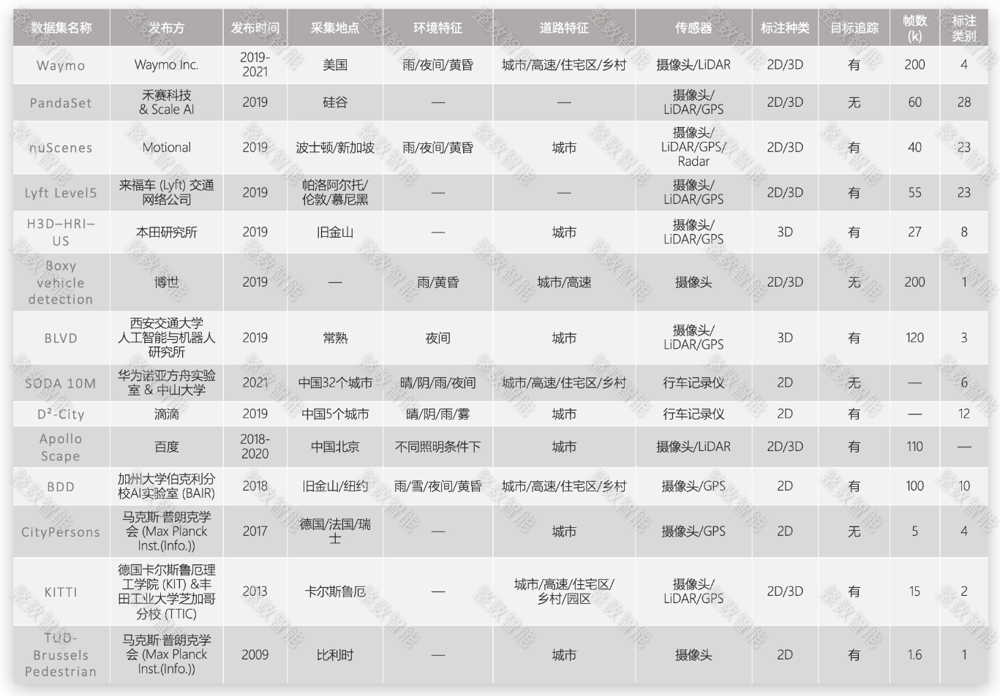

## KITTI

（A project of Karlsruhe Institute of Technology and Toyota Technological Institute at Chicago）

[官网](https://www.cvlibs.net/datasets/kitti/)

论文：

- [Vision meets Robotics: The KITTI Dataset](https://www.cvlibs.net/publications/Geiger2013IJRR.pdf)
- benchmarks and evaluation metrics：[Are we ready for autonomous driving? The KITTI vision benchmark suite](https://projet.liris.cnrs.fr/imagine/pub/proceedings/CVPR2012/data/papers/424_O3C-04.pdf)

支持自动驾驶场景下的多种任务，包括立体图像（stereo），光流（optical flow），视觉测距（visual odometry），3D 物体检测（object detection）和 3D 跟踪（tracking）等。

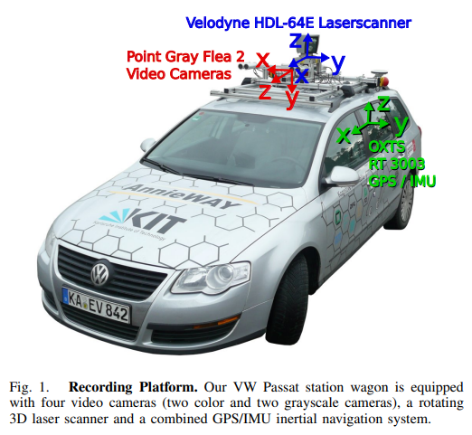

KITTI 对各分任务提供了专门的数据集。

KITTI 分为了五个类别，包含 Road、City、Residential、Campus、Person 场景下的数据：

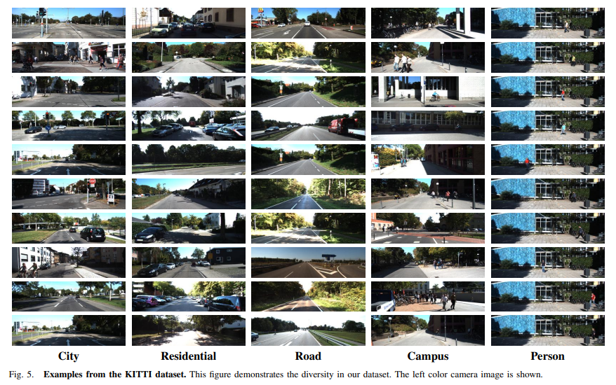

### 传感器

- 2 个一百四十万像素的 PointGray Flea2 灰度相机，1392×512 pixels；
- 2 个一百四十万像素的 PointGray Flea2 彩色相机，1392×512 pixels；
- 4 个 Edmund 的光学镜片，水平视角约为 90°，垂直视角约为 35° ；
- 1 个 64 线的 Velodyne 旋转激光雷达，10Hz，角分辨率为 0.09 度，每秒约一百三十万个点，水平视场 360°，垂直视场 26.8°，至多 120 米的距离范围；
- 1 个 OXTS RT3003 组合导航系统，6 轴，100Hz，分别率为 0.02 米，0.1°。
- 构成的双目相机的两个单目镜头之间的距离为 0.54 米

​	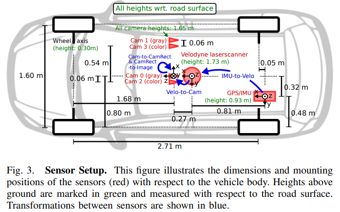

### 数据形式

- 原始和经同步与校正处理的双目灰度图像序列，以 png 格式存储，大小 1240*370 左右；
- 原始和经同步与校正处理的双目彩色图像序列，以 png 格式存储，大小 1240*370 左右；
- 3D Velodyne 点云，每帧约 10 万个点，以 bin 的方式存储；
- 3D GPS/IMU 数据，包括位置、速度、加速度、元信息等，以 txt 方式存储；
- 校正文件，包括相机参数、相机与 GPS/IMU 之间、相机与 Velodyne 转换，以 txt 存储；
- 3D 目标检测标签，含汽车、卡车、有轨电车、行人、骑自行车的人，以 xml 的形式储存。

使用时只需要使用经过处理（synced+rectified）过后的数据。

### 目录结构

以下是论文中的目录结构，在实际使用中的目录结构可能有不同。

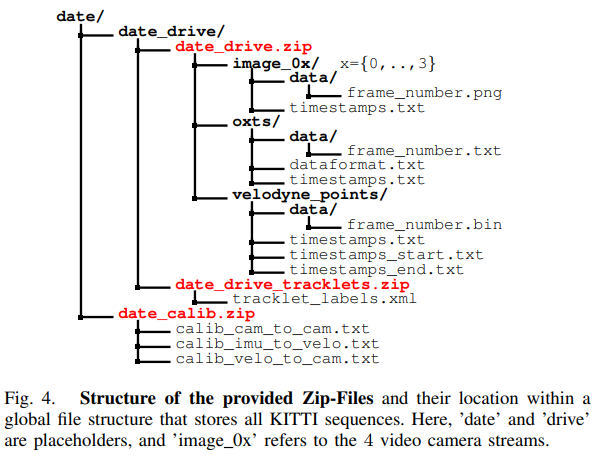

- timestamps.txt 文件是时间戳文件，记录了生成每条数据的具体时间；
- image_0x 文件夹下的 frame_number.png 文件是图像文件，格式是 8 位 PNG 图，已经裁剪掉了天空和引擎盖，文件夹后的数字x表示不同相机（ 01 灰色 23 彩色），图像经校正后大约 50 万像素；
- oxts 文件夹下的 frame_number.txt 文件是 GPS/IMU 信息，包括方向、速度、加速度在内的30余种信息，可以在 dataformat.txt 文件中查看具体信息；
- velodyne_points 文件夹下为雷达点云文件，由浮点数组成，含坐标 xyz 和角度 r 信息，具体含义如下图所示。每一帧对应的点数量不一定相同，大约有 12 万个点。

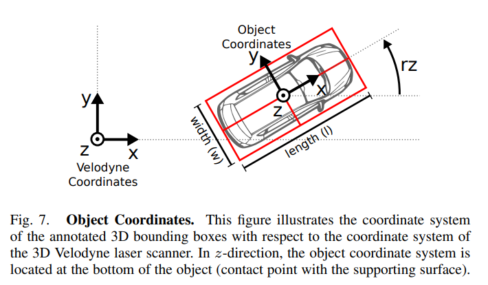

- tracklet_labels.xml 文件为标注文件，包括 “Car”“Van”“Truck”“Pedestrian”“Person（sitting）”“Cyclist”“Tram”“Misc” 几类。每个对象都有类别标签和对应的大小信息。每一帧中，都提供了物体的变换旋转矩阵信息。
- data_calib.zip 文件中为校正文件，包括投影矩阵，坐标转换矩阵等信息。

## nuScenes

[官网](https://www.nuscenes.org/)

论文：[nuScenes: A multimodal dataset for autonomous driving](https://arxiv.org/abs/1903.11027)

nuScenes的数据采集自不同城市的 1000 个场景（scene），每个场景是一段视频，包含多个 sample（采样帧）。

nuScenes 的数据以 token 为唯一标识。

[标注详细说明及示例](https://github.com/nutonomy/nuscenes-devkit/blob/master/docs/instructions_nuscenes.md)

### 传感器

包括了 6 个相机（CAM）、1 个激光雷达（LIDAR）、5 个毫米波雷达（RADAR）、IMU 和 GPS 。

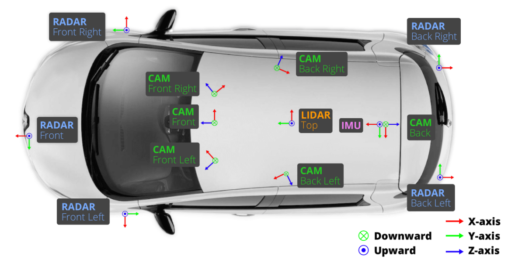

1x spinning LIDAR (Velodyne HDL32E):

- 20Hz capture frequency
- 32 beams, 1080 (+-10) points per ring
- 32 channels
- 360° Horizontal FOV, +10° to -30° Vertical FOV, uniform azimuth angles
- 80m-100m Range, Usable returns up to 70 meters, ± 2 cm accuracy
- Up to ~1.39 Million Points per Second

6x camera (Basler acA1600-60gc):

- 12Hz capture frequency
- Evetar Lens N118B05518W F1.8 f5.5mm 1/1.8"
- 1/1.8'' CMOS sensor of 1600x1200 resolution
- Bayer8 format for 1 byte per pixel encoding
- 1600x900 ROI is cropped from the original resolution to reduce processing and transmission bandwidth
- Auto exposure with exposure time limited to the maximum of 20 ms
- Images are unpacked to BGR format and compressed to JPEG

See camera orientation and overlap in the figure below：

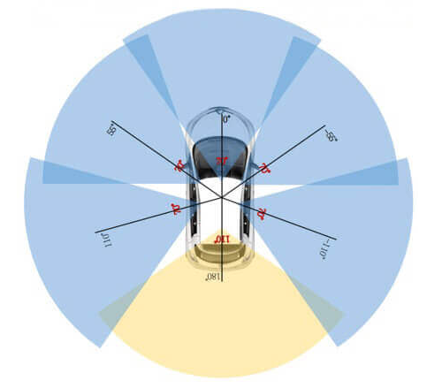

## Waymo

（Waymo Open Dataset，WOD）

[官网](https://waymo.com/open/)

论文：[Scalability in Perception for Autonomous Driving: Waymo Open Dataset](https://arxiv.org/abs/1912.04838)

### 传感器

WOD有 5 个 RGB 相机，5 个 LiDAR sensor，RGB 相机在车顶排列，分别拍摄了右侧、右前方、前方、左前方、左侧 5 个方位；LiDAR 在车前有 3 个，在车顶有一个，在车后有一个：

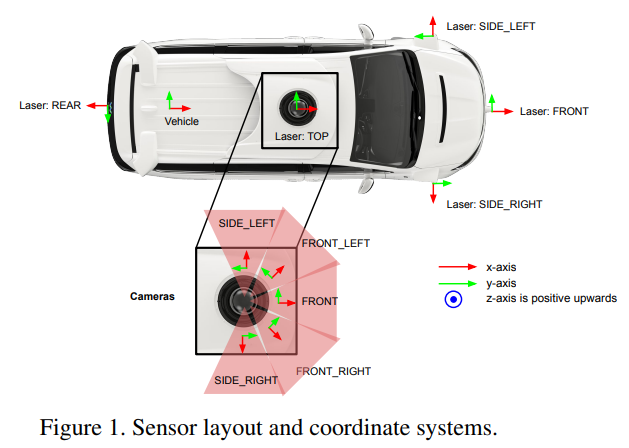

其 LiDAR 一共有 5 个，车顶（TOP）的比较特殊，其扫描距离达到 75m，其他的几个（F,SL,SR,R）只能达到 25m 。

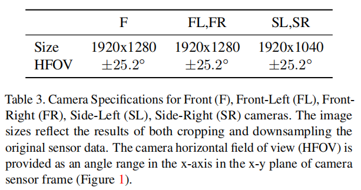