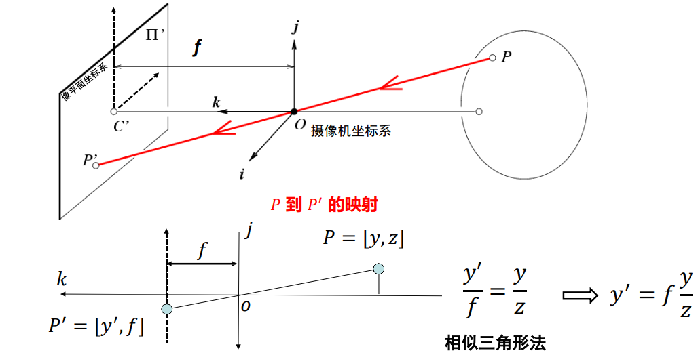
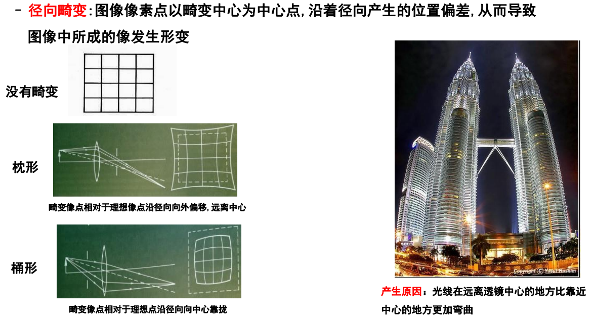
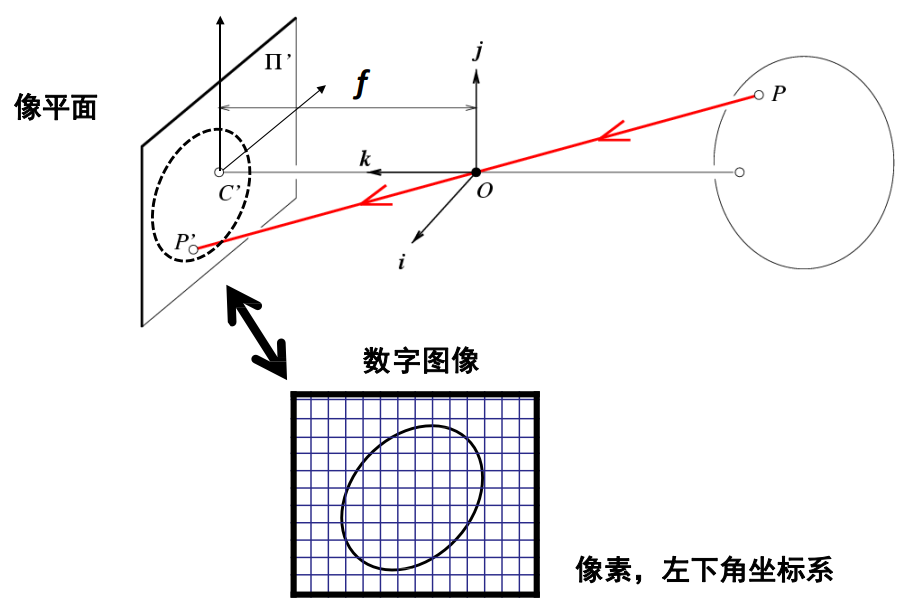
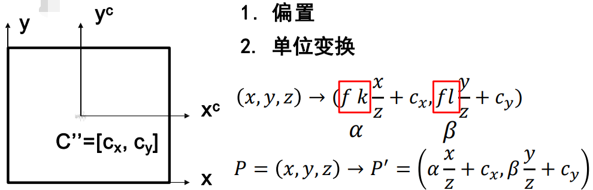
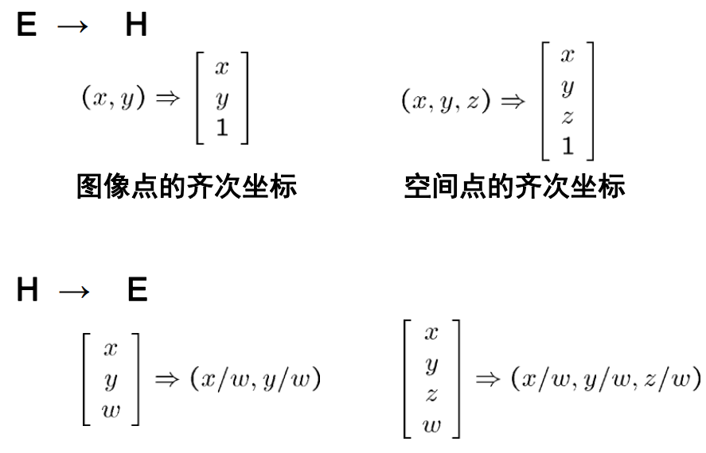
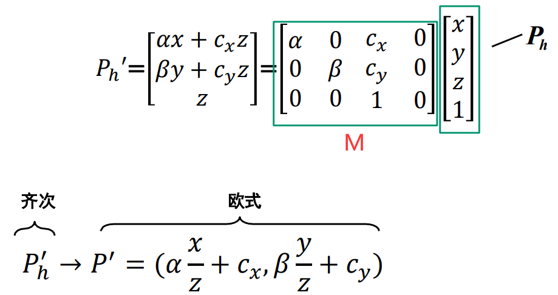
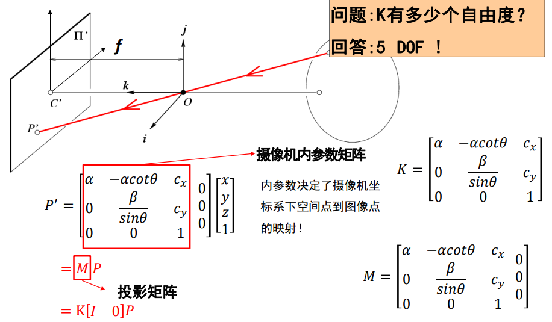
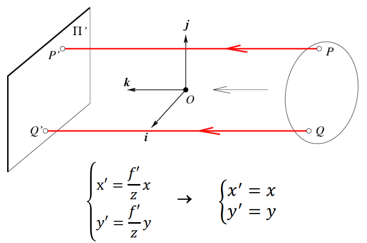

# 摄像机

## 旋转

### 二维旋转

设二维平面中，有点 $P = (x,y)$ ，其极坐标的极角为 $\alpha$ 。

将其绕原点，逆时针旋转 $\gamma$ 角度，得到 $ P' = (x', y')$ 。

假设点到原点的距离为 $r$ ，有 $P$：
$$
x = r \cos \alpha \\
y = r \sin \alpha
$$
有 $P'$：
$$
x' = r \cos(\alpha + \gamma) = r\cos\alpha\cos\gamma - r\sin\alpha\sin\gamma \\
y' = r \sin(\alpha + \gamma) = r\sin\alpha\cos\gamma + r\cos\alpha\sin\gamma
$$
将 $P$ 代入 $P'$ 得：
$$
x' = x \cos\gamma - y \sin\gamma \\
y' = y \cos\gamma + x \sin\gamma
$$
写为矩阵形式：
$$
\begin{bmatrix}
x' \\ y'
\end{bmatrix}
=
\\
\begin{bmatrix}
\cos\gamma & -\sin\gamma \\
\sin\gamma & \cos\gamma
\end{bmatrix}
\\
\begin{bmatrix}
x \\ y
\end{bmatrix}
$$
此即为二维的逆时针旋转矩阵。

### 三维旋转

- 绕 Z 轴逆时针旋转 $\gamma$ 角度

可以将上文中二维的逆时针旋转矩阵看做绕水平向上的 Z 轴逆时针旋转 $\gamma$ 角度，此时 $z$ 坐标保持不变，可写为：
$$
R_Z(\gamma) = 
\begin{bmatrix}
x' \\ y' \\ z
\end{bmatrix}
=
\begin{bmatrix}
\cos\gamma & -\sin\gamma & 0 \\
\sin\gamma & \cos\gamma & 0 \\
0 & 0 & 1
\end{bmatrix}
\begin{bmatrix}
x \\ y \\ z
\end{bmatrix}
$$

- 绕 X 轴逆时针旋转 $\alpha$ 角度

$$
R_X(\alpha) = 
\begin{bmatrix}
x \\ y' \\ z'
\end{bmatrix}
=
\begin{bmatrix}
1 & 0 & 0 \\
0 & \cos\alpha & -\sin\alpha \\
0 & \sin\alpha & \cos\alpha
\end{bmatrix}
\begin{bmatrix}
x \\ y \\ z
\end{bmatrix}
$$

- 绕 Y 轴逆时针旋转 $\beta$ 角度

$$
R_Y(\beta) = 
\begin{bmatrix}
x' \\ y \\ z'
\end{bmatrix}
=
\begin{bmatrix}
\cos\beta & 0 & \sin\beta \\
0 & 1 & 0 \\
-\sin\beta & 0 & \cos\beta
\end{bmatrix}
\begin{bmatrix}
x \\ y \\ z
\end{bmatrix}
$$

总的三维的旋转矩阵为三者的乘积：
$$
R(\alpha, \beta, \gamma) = R_X(\alpha)R_Y(\beta)R_Z(\gamma)
$$
其中，$\alpha, \beta, \gamma$ 即是旋转矩阵的三个参数。

## 摄像机基础

### 针孔

直接使用胶片感光会导致光与光的重叠，无法看到清晰的图像：

使用小孔可以减少重叠导致的模糊：

#### 针孔摄像机

其中：

- 焦距是针孔到像平面的距离。
- 一般分析虚拟像平面，其与像平面大小一致，到针孔的距离也是焦距。

#### 坐标变换

- 摄像机坐标系

	以针孔为中心。

- 像平面坐标系

	以针孔对应的像平面上的平移位置为中心。

可利用相似三角形求得从物体到像平面的映射：

即：
$$
P = \begin{bmatrix}
x \\
y \\
z
\end{bmatrix}
\to
P^\prime = \begin{bmatrix}
x^\prime \\
y^\prime
\end{bmatrix}
, \ 
\begin{cases}
x^\prime = f \frac x z \\ \\
y^\prime = f \frac y z 
\end{cases}
$$

### 透镜

光圈减小时，图像越来越清晰（重叠程度减小），但也越暗（总能量小）。

可以使用透镜将多条光线聚焦到胶片上，增加亮度：

透镜的特性：

- 平行于光轴的光线都会汇聚到透镜的焦点，其到透镜中心的距离为焦距。
- 直接从透镜中心（光心）穿过的光线的方向不发生改变。 

#### 近轴折射模型

此时透镜焦点起了小孔的作用。

- 摄像机焦距

	透镜焦距与小孔到像平面（胶片）的距离之和。（上图中的 $z^{\prime}$）

#### 透镜问题

##### 失焦

只有与透镜保持特定距离的物体的部分才能清晰聚焦（该距离称为景深），否则会失焦：

其中，绿点靠近了一些，导致失焦。（远了一些也会失焦）

##### 径向畸变

相机畸变的其中一种，光线在远离透镜中心的位置比靠近中心的位置更加弯曲：

由相机自身性质产生的畸变有 5 个畸变参数，在实际成像时，需要进行畸变矫正（去畸变）。

## 摄像机几何

除了得到物体到像平面的坐标变换，还需要得到像平面到像素平面的坐标变换：

### 非线性变换

坐标系中心的偏置：

其中，$(c_x, c_y)$ 为像平面中心在像素坐标系上的坐标。

米到像素的单位变换：

其中，$k,l$ 分别表示水平和垂直方向的变换，单位为像素每毫米，由**电荷耦合器件（charge coupled device，CCD）**自身性质决定。

常将 $fk,fl$ 记为 $\alpha, \beta$，也记为 $f_x, f_y$ ，表示像素每一倍焦距，即一倍焦距有多少像素。

$\frac x z, \frac y z$ 是变动的比例。

其中 $x,z$ 两个变量存在分数关系，所以该 $P \to P^\prime$ 的映射是非线性变换。

### 线性变换

#### 齐次坐标

- 在欧氏空间（Euclidean Space）中，同一平面的两条平行线不会相交。

	- 笛卡尔坐标（Cartesian Coordinate）

- 在透视空间（Perspective Space）中，同一平面的两条平行线可以在无穷远处相交。

	欧氏空间是透视空间的子集。

	- 齐次坐标（Homogeneous Coordinate）

笛卡尔坐标不适合处理透视空间问题，如果一个点在无穷远处，它的坐标变为 $(\infty, \infty)$ ，这在欧氏空间中没有意义。

齐次坐标就是用 $N + 1$ 维表示 $N$ 维欧氏坐标。

二维的欧氏坐标 $(X,Y)$ 表示为齐次坐标即为 $(x,y,w)$ ，且有 $X = \frac x w, Y = \frac y w$ 。

当 $(X,Y)$ 移动到无穷远时，只需要令 $w = 0$ 即可用齐次坐标表示。

由于 $w$ 可能约分，从而类似于 $(xa, ya, wa)$ 的点，都对应笛卡尔坐标系里的 $(\frac x w, \frac y w)$ ，因此它们是 homogeneous 的。

齐次坐标相当于引入了对点的缩放（由 $w$ 表示），当 $w = 0$  时，会将所有点汇聚到一个点上（在无穷远相交），从而平面上的点在三维空间中的缩放可以表示如下：

近处（$w$ 较大）的大间距到远处（$w$ 较小）会缩小为小间距，即是近大远小（透视）的现象，这样可以更好地描述现实中的视觉现象。

在实际应用中，相机的图像中的元素在无穷远相交的情况（或者说接近这种情况的情况）比较常见，而在过近的地方是无法成像的区域，因此 $w$ 在数的可表示的值域上，用 $0$ 表示无穷远是合理的。

#### 投影矩阵

可将上述非线性变换，写为齐次坐标的线性变换，然后进一步转换为欧氏坐标：

（线性变换才能表示为一般的矩阵形式，非线性变换可能要使用函数矩阵，即内部元素含有函数）

其中，下标 $h$ 表示齐次坐标。$M$ 称为**投影矩阵（Projection Matrix）**，其取决于摄像机元件本身的物理性质。

可见，欧氏坐标中的 $\frac x z,\frac y z$ 有非线性关系，一般的矩阵形式无法表达这个欧氏坐标的映射：
$$
\begin{bmatrix}
\alpha\frac x z + c_x \\
\beta\frac y z + c_y
\end{bmatrix}
=
\begin{bmatrix}
? & ? & ? \\
? & ? & ? 
\end{bmatrix}
\begin{bmatrix}
x \\ y \\ z
\end{bmatrix}
$$

### 摄像机偏斜

由制造工艺影响，有些像素平面可能不是矩形，此时需要考虑两个轴的夹角 $\theta$ ，修改投影矩阵：

#### 内参数

将投影矩阵去掉右边的  $0$ ，称为摄像机的内参数矩阵 $\boldsymbol K$ ：

其中，$\boldsymbol K$ 有 5 个参数（即自由度）（除 $0,1$ 外有 $5$ 个参数位）。

### 外参数矩阵

世界坐标系中的点 $P_{w}$ 在旋转（$\boldsymbol R$）和平移（$\boldsymbol T$）后就成为摄像机坐标系上的 $P$ 点，并可通过内参数矩阵进一步变换到像素平面的点 $P^{\prime}$ ：

其中：

- $\boldsymbol K$ 为摄像机的内参数矩阵（$3 \times 3$）。
- $I$ 为单位矩阵，$[I, 0]$ 表示投影矩阵内右边的被去掉的 $0$ 。
- $\begin{bmatrix} R & T \end{bmatrix}$ 为摄像机的外参数矩阵（$3 \times 4$），由三维空间中选取的坐标系设置决定。
	- 负责从世界坐标系变换到摄像机坐标系。
	- 对于  x，y，z 轴，旋转有 3 个自由度，平移有 3 个自由度，共 6 个自由度。
	- $R:3\times 3$ ，$T: 3 \times 1$ 。（三维的旋转和平移）
- $\boldsymbol M$ 为最终的**投影矩阵**，也叫**透视矩阵**，其将世界坐标系上的点投影到像素坐标系上。
	- 有内参数矩阵 5 个自由度。
	- 有外参数矩阵 6 个自由度。
	- 共 11 个自由度。

也可以将 $\begin{bmatrix} R & T \\ 0 & 1 \end{bmatrix}$ 称为外参数矩阵（$4 \times 4$）。

### 投影变换的性质

从现实世界到像素图像：

- 点投影为点。
- 线投影为线。
- 近大远小。
- 角度不再保持。
- 平行线相交。（相交于“影消点”）

## 总览

### 相机参数

以下指一般单目相机。

10 个内部参数（由相机自身性质确定）:

- 5 个内参，$f, dx,dy,u_0,v_0$

  $f$ 为相机焦距，$dx,dy$ 表示一个像素的宽高，单位毫米（表示毫米每像素），$u_0, v_0$ 表示像平面中心（主点）在像素平面上的坐标（即上文 $c_x,c_y$）。

  - 一说 4 个，$f_x,f_y,u_0,v_0$ ，其中 $f_x = \frac f {dx}, f_y = \frac f {dy}$ ，表示像素每一倍焦距。（$\frac 1 {dx}$ 表示像素每毫米）

- 5 个畸变参数。

	不同畸变模型可能有不同数量的参数。

	- 3 个径向畸变参数，$k_1,k_2,k_3$
	- 2 个切向畸变参数，$p_1,p_2$

6 个外部参数（三维旋转与平移）：

- 3 个旋转参数，$\boldsymbol R$ （$3 \times 3$）（正交旋转矩阵，保证一对正交基向量在该矩阵变换下仍然是正交的）
- 3 个平移参数，$\boldsymbol T$ （$1 \times 3$）

### 坐标系变换

- 世界坐标系（$O_w$）

	点为 $P_w$，中心点为以 world 而定。

- 相机坐标系（$O$）

	点为 $P$，齐次点为 $P_h$，中心点为针孔，或透镜的交点，或摄像机中心点。

- 像平面坐标系（$O_c$）

	点为 $P_c$ 。

- 像素坐标系（$O_p$）

	点为 $P'$，齐次点为 $P'_h$，以像素左上角或左下角为原点。

### 公式表达

以下使用齐次坐标表达。

详细准确的过程可见张正友的论文：[Flexible camera calibration by viewing a plane from unknown orientations](https://www.microsoft.com/en-us/research/wp-content/uploads/2016/11/zhan99.pdf)

#### 外参数

负责世界坐标系到相机坐标系的转换。

这里可以使用齐次坐标，也可以不使用齐次坐标。

以使用齐次坐标为例：
$$
P \leftarrow P_w
\\
P = \begin{bmatrix}
R & T \\
0 & 1
\end{bmatrix}
P_w
\\
\begin{bmatrix}
x \\ y \\ z \\ 1
\end{bmatrix}
=
\begin{bmatrix}
r_{11} & r_{12} & r_{13} & t_1 \\
r_{21} & r_{22} & r_{23} & t_2 \\
r_{31} & r_{32} & r_{33} & t_3 \\
0 & 0 & 0 & 1
\end{bmatrix}
\begin{bmatrix}
x_w \\ y_w \\ z_w \\ 1
\end{bmatrix}
$$
其中，$R$ 为正交旋转矩阵 $R(\alpha, \beta, \gamma)$ 。

#### 内参数

负责相机坐标系到像素坐标系的转换（中间经过了像平面坐标系）。

这里需要使用齐次坐标才能表示为一般矩阵形式：

$$
P'_h \leftarrow P_h
\\
P'_h = M P_h
\\
\begin{bmatrix}
x'_h \\ y'_h \\ z
\end{bmatrix}
=
\begin{bmatrix}
\alpha & -\alpha\cot\theta & c_x & 0 \\
0 & \frac {\beta} {\sin\theta} & c_y & 0 \\
0 & 0 & 1 & 0
\end{bmatrix}
\begin{bmatrix}
x \\ y \\ z \\ 1
\end{bmatrix}
$$
也可简写为：
$$
\begin{bmatrix}
x'_h \\ y'_h
\end{bmatrix}
=
\begin{bmatrix}
\alpha & -\alpha\cot\theta & c_x \\
0 & \frac {\beta} {\sin\theta} & c_y \\
\end{bmatrix}
\begin{bmatrix}
x \\ y \\ z
\end{bmatrix}
$$
得到像素点的齐次坐标后，还需要进一步转换为真正的像素点坐标：
$$
P' \leftarrow P'_h
\\
\begin{bmatrix}
x' \\ y'
\end{bmatrix}
=
\frac 1 z
\begin{bmatrix}
x'_h \\ y'_h
\end{bmatrix}
$$
这个过程中，$z$ 坐标的信息丢失。

注意，投影矩阵不可逆，所以这个计算过程是不可逆的。

一般情况像素平面是矩形，常用如下表示：
$$
\begin{bmatrix}
f_x & 0 & c_x & 0 \\
0 & f_y & c_y & 0 \\
0 & 0 & 1 & 0
\end{bmatrix}
$$

#### 细分过程

过程也可写为：

其中，$S$ 表示最后一步齐次坐标到像素坐标的变换。

#### 畸变矫正

畸变参数负责的求得的像素坐标进行矫正，得到矫正后的像素坐标。

设矫正前的坐标为 $x', y'$ ，矫正后的坐标为 $x, y$ 。

径向畸变：（利用了泰勒展开，所以有这个形式）
$$
x' = x(1 + k_1r^2 + k_2r^4 + k_3r^6) \\
y' = y(1 + k_1r^2 + k_2r^4 + k_3r^6)
$$
切向畸变：
$$
x' = x + [2p_1xy + p_2(r^2 + 2x^2)] \\
y' = y + [2p_2xy + p_1(r^2 + 2y^2)]
$$
其中，$r = x^2 + y^2$ 为

解出 $x,y$ 即可。

#### 成像过程的数学描述

在实际的相机成像过程中，图像通过感光材料反映到像素上，我们也不知道真正的三维空间坐标，以上计算过程只是成像过程的数学模拟。

内外参数与畸变参数是成像过程的数学描述，其是为了图像的进一步应用，实际成像过程是物理过程，这些参数是不参与的。

## 摄像机模型

### 透视投影

即上述透视模型，针孔模型也属于透视投影。

将三维世界的点尽量保持相对关系地映射到像素平面。

- 投影矩阵共 11 个参数，对 3D 和 2D 的映射更准确。
- 常用于运动恢复结构或 SLAM 。

### 仿射投影

属于透视投影，差别在于其投影矩阵中的 $v_{1 \times 3}$ 全为 $0$ ，详见弱透视投影的投影矩阵形式。

放射投影直接在欧氏空间通过仿射变换完成三维空间点到二维像素点的转换，不使用齐次坐标：
$$
P^\prime = \boldsymbol {A P_w} + \boldsymbol b
$$

### 弱透视投影

一种特殊的仿射投影。

忽略物体的前后距离，将其当作在一个平面上：

上图，$v$ 应当为 $1\times3$ 。

- 减少了投影矩阵的 3 个参数，只剩 8 个参数，在数学上更好计算。
- 当物体较小和较远（相对场景深度较小于其与相机的距离）时较准确，常用于图像识别任务。

### 正交投影

摄像机中心到像平面的距离无限远时：

- 常应用在建筑设计（AUTOCAD）和工业设计领域。

## 摄像机标定

（Camera Calibration）

使用一张或多张图片估算摄像机的内参数（矩阵）和外参数（矩阵）：
$$
P^\prime = \boldsymbol {M P_w} = \boldsymbol {K \begin{bmatrix} R & T \end{bmatrix} P_w}
$$
其中 $P$ 表示世界点 $P_w$ ，使用 $p$ 表示像素点 $P^\prime$ 。

使用（带坐标系图像）标定装置的多张照片，通过多个世界点坐标和像素点坐标的对应关系列方程组求解 $M$ ：

投影矩阵 $M$ 共有 $11$ 个未知量，需要选取 $6$ 对及以上（不在同一个平面上）的点。

摄像机参数在出厂时会标定好，但随着使用，摄像机自身性质会发生变化，参数也会随之变化，需要重新确定其数学描述的参数，重新进行标定。

目前常用的是**张正友标定法**。

## 单应性变换

（Homography Transformation）

一个平面上的点到另一个平面上的点的映射关系，两个平面都处在各自的透视空间中。

可表示为：

其中，两个平面中的点都用齐次坐标表示，$h_i$ 构成的矩阵即是单应性变换矩阵。
