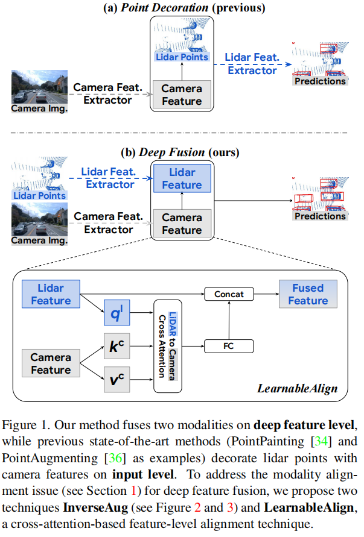
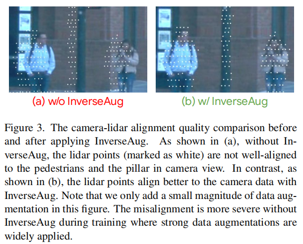
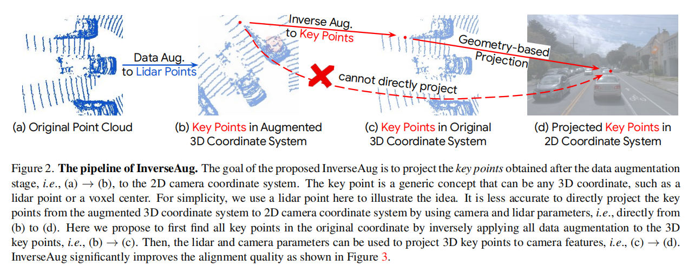

# DeepFusion: Lidar-Camera Deep Fusion for Multi-Modal 3D Object Detection

CVPR 2022

[中译参考](https://mp.weixin.qq.com/s?__biz=MzU1MjY4MTA1MQ==&mid=2247641920&idx=3&sn=975b3c97e030d9ccf63eebaa477163b8&chksm=fbf28074cc85096297a6aadd2fa81d2aed1fa1b5fc2846ed512647c9b217fd364a450a3f5e46&mpshare=1&scene=23&srcid=0331ZUfZ4SnTx3qGDljjHkLN&sharer_sharetime=1680218107618&sharer_shareid=caca8483480630bec3b7bb7ec0c2f3a1#rd)

提出一个通用框架，包含两个组件（可用于其它模型）：

- InverseAug

	对关键点反向进行几何相关的 data augmentation 。

- LearnableAlign

	使用一个 cross-attention layer 关联 LiDAR 和 camera 的特征。

能够用到大部分 voxel-based 3D detection 模型上。

各种模态有自己的 data augmentation 策略，会导致后续 feature alignment 的困难，本文解决了增强后的多模态数据的 alignment 。

## pipeline

以前的方法将 camera feature 放到 Lidar points 里，然后用 Lidar feature extractor 体素化提取特征，但 voxelization module 不是专为 camera 信息设计的。

一个 voxel 可能包含多个 camera features ，这些特征对检测不一定是同等重要的。

fused feature 输入各种 3D detection framework 即出结果。

## Boosting Alignment Quality

deep features 的 alignment 不准会导致信息的匹配难度增加。**？？？点和像素的对齐还是 feature 的对齐？？？**

### InverseAug

点云和图像有各自的数据增强策略，这给 alignment 带来了挑战。

InverseAug 保存数据增强的参数（geometry-related data augmentation），在 fusion 阶段，对关键点（比如体素中心点）做反向增强，恢复 original 坐标系。

**？？？在 fusion 阶段具体怎么反向增强？？？**

这提升 alignment（使用）的效果。

### LearnableAlign

对 extractor 提取的特征使用三个全连接层分别将 voxel 转换为 Q 、将 camera feature 转换为 K、V，然后对 QKV 进行 cross-attention ，然后通过 FC ，再与 Lidar feature concat ，得到 fused feature 。**？？？三个连接层？？？**

fused feature 再用到任意现有 3D 目标检测模型中。