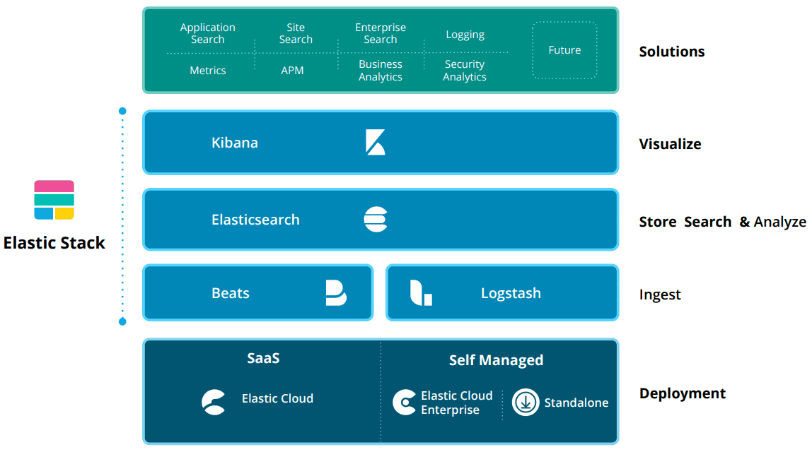
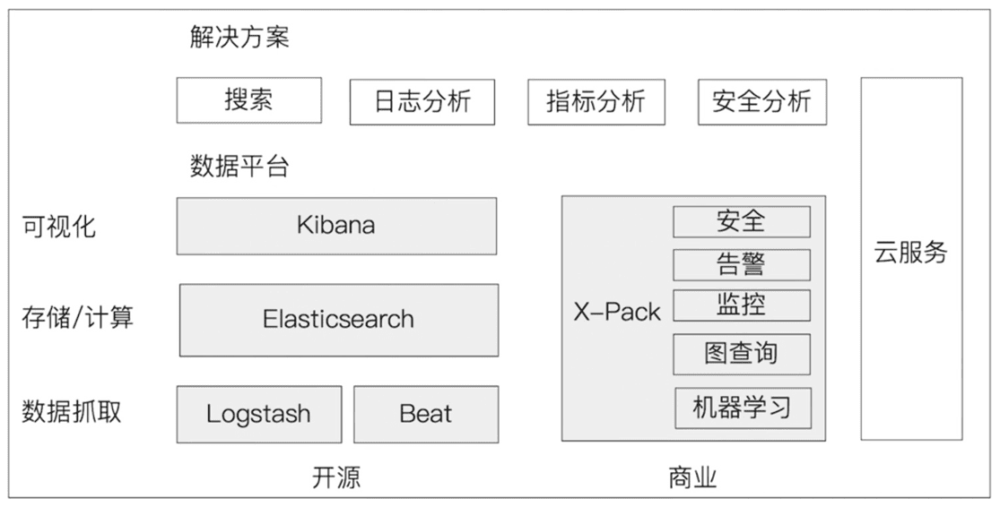
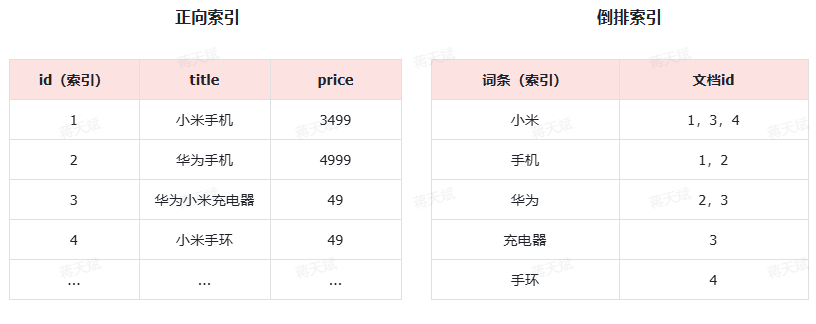
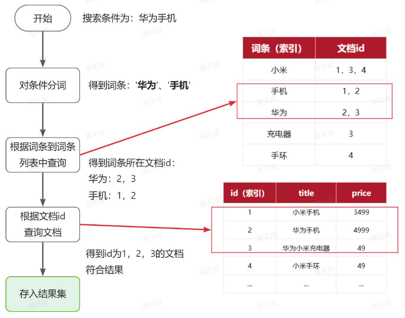
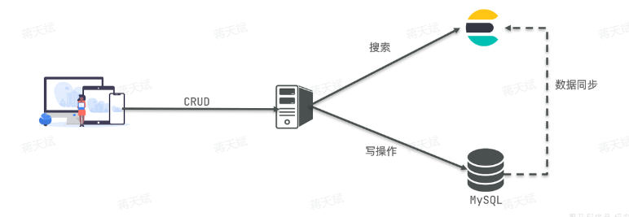
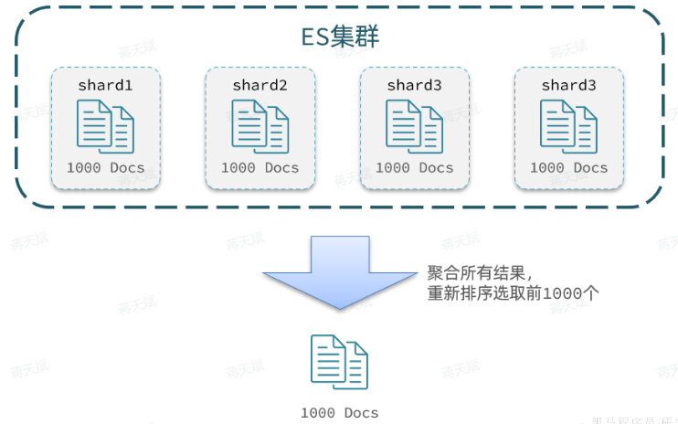

# Elasticsearch

Elasticsearch 是由 elastic 公司开发的一套搜索引擎技术，它是 elastic 技术栈中的一部分。完整的技术栈包括：

- Elasticsearch（ES）

	用于数据存储、计算和搜索

- Logstash + Beats

	用于数据收集

- Kibana

	用于数据可视化，可以可视化操作 ES （通过其 Dev tools）。

- X-Pack

	ES 的商用收费扩展包，包括安全，警告，监视，图形和报告功能。

整套技术栈被称为 ELK，经常用来做日志收集、系统监控和状态分析等等。

以下是 ELK 生态以及基于 ELK 的场景解决方案：





## 基本概念

### 倒排索引

- 正向索引（从 id 到词条）

	适合于根据索引字段的精确搜索，不适合基于部分词条的模糊匹配。

- 倒排索引（从词条到 id）

	是对正向索引的一种特殊处理和应用。

倒排索引创建流程如下：

- 通过分词算法对文档（Document）进行分词，得到词条（Term）。
- 创建表（倒排索引表），每行数据包括词条、词条所在文档id、位置等信息。
- 因为词条唯一性，可以给词条创建**正向**索引。



倒排索引的搜索流程如下（以搜索"华为手机"为例），如图：



其中：

- 词条有索引，查询效率高。
- id 也有索引，查询效率高。避免了单纯正向索引中模糊查询需要的全表扫描。

### 专业术语

ES 中每份文档以 Json 格式存储。

| **MySQL** | **Elasticsearch** | **说明**                                                     |
| :-------- | :---------------- | :----------------------------------------------------------- |
| Table     | Index             | 索引(index)是文档的集合，数据库的表(table)是行的集合。       |
| Row       | Document          | 文档（Document），就是一条条的数据，类似数据库中的行（Row），文档都是JSON格式 |
| Column    | Field             | 字段（Field），就是JSON文档中的字段，类似数据库中的列（Column） |
| Schema    | Mapping           | Mapping（映射）是索引中文档的约束，例如字段类型约束。类似数据库的表结构（Schema） |
| SQL       | DSL               | DSL是elasticsearch提供的JSON风格的请求语句，用来操作elasticsearch，实现CRUD |

- Mysql

	擅长事务类型操作，可以确保数据的安全和一致性 

- Elasticsearch

	擅长海量数据的搜索、分析、计算 

因此在企业中，往往是两者结合使用：

- 对安全性要求较高的写操作，使用 mysql 实现
- 对查询性能要求较高的搜索需求，使用 elasticsearch 实现
- 两者再基于某种方式，实现数据的同步，保证一致性



### IK 分词器

IK 分词器是一个常用的中文分词工具，包含两种模式：

- ik_smart

	智能语义切分。

- ik_max_word

	最细粒度切分 ，所有可能长度的词都会被提取出来。

IK 分词器还支持：

- 扩展词典
- 停止词典（排除的字词）

## 索引结构操作

Elasticsearch 采用的是 Restful 风格的 API 。

### Mapping 定义

要向 ES 存储数据，需要首先创建 Index 和 Mapping 。

Mapping 是对索引库中文档的约束，常见的属性包括：

- `type`：字段数据类型，常见类型如下： 
	- 字符串：`text`（可分词的文本）、`keyword`（精确值，例如：品牌、国家、ip地址）
	- 数值：`long`、`integer`、`short`、`byte`、`double`、`float`、
	- 布尔：`boolean`
	- 日期：`date`
	- 对象：`object`（嵌套属性）
- `index`：是否创建索引（是否需要通过其进行搜索），默认为`true`
- `analyzer`：使用哪种分词器
- `properties`：该字段的子字段

### 创建

需要进行 mapping 定义。

```json
# PUT /heima   // 执行索引库名
{
  "mappings": {   // mapping 定义
    "properties": {
      "info":{
        "type": "text",
        "analyzer": "ik_smart"
      },
      "email":{
        "type": "keyword",
        "index": "false"
      },
      "name":{
        "properties": {   // object 类型的子属性
          "firstName": {
            "type": "keyword"
          }
        }
      }
    }
  }
}
```

注意：

- 在 Restful 中，PUT 方法用于 update 数据，POST 用于新增数据。
- 但在 ES 中，mapping 的定义相当于 update 整个系统原有的所有 mapping 定义，所以使用 PUT 表示。
- 同时，ES 中 PUT 既表示 update（更新）也表示 append（追加）。

### 查询

```Plain
GET /heima
```

### 修改

索引库一旦创建，无法修改 mapping，只能新增字段，以避免重新分词和重新创建索引时的对数据大量计算。

```JSON
PUT /heima/_mapping   // 需要指定索引库的 _mapping
{
  "properties": {
    "age":{   // 新增字段 age
      "type": "integer"
    }
  }
}
```

### 删除

```Plain
DELETE /heima
```

## 索引操作

Elasticsearch 中的数据都是 JSON 风格的文档。

### 新增

```JSON
POST /heima/_doc/1   // 指定 _doc，其中的 1 为文档 id
{
    "info": "黑马程序员Java讲师",
    "email": "zy@itcast.cn",
    "name": {
        "firstName": "云",
        "lastName": "赵"
    }
}
```

### 查询

```JavaScript
GET /heima/_doc/1
```

### 删除

```JSON
DELETE /heima/_doc/1
```

### 修改

修改有两种方式：

- 全量修改：先删除原来的文档，然后新增。（原来的文档不存在也会新增）
- 局部修改：修改文档中的部分字段

全量修改：

```JSON
PUT /heima/_doc/1   // 使用 PUT
{
    "info": "黑马程序员高级Java讲师",
    "email": "zy@itcast.cn",
    "name": {
        "firstName": "云",
        "lastName": "赵"
    }
}
```

局部修改：

```JSON
POST /heima/_update/1   // 指定 _update
{
  "doc": {   // 指定 "doc"
    "email": "ZhaoYun@itcast.cn"
  }
}
```

### 批处理

```Java
POST _bulk   // 指定 _bulk 进行批处理
{ "index" : { "_index" : "test", "_id" : "1" } }  // 新增
{ "field1" : "value1" }   // 新增的数据

{ "create": { "_index": "my_index", "_id": 1 } }   // 新增，如果文档已经存在则返回错误
{ "title": "New Document", "content": "This is a newly created document." }   // 新增的数据

{ "delete" : { "_index" : "test", "_id" : "2" } }  // 删除

{ "update" : {"_id" : "1", "_index" : "test"} }   // 更新，指定 id 和 index（索引）
{ "doc" : {"field2" : "value2"} }   // 更新的字段数据
```

## API 客户端

ES 官方提供了各种不同语言的客户端，这些客户端的本质就是组装DSL语句，通过http请求发送给ES。

- Rest High Level Client (已弃用)
	提供了对常用 API 的封装，包括索引、搜索、聚合等。它基于 RESTful API，但封装了更高层次的操作，使得开发者无需手动处理 HTTP 请求和响应。
- **Elasticsearch Java Client**（官方新客户端，推荐使用）
	自 Elasticsearch 7.15 起推出（也称为 "Java REST Client"）。该客户端提供了更接近原始 HTTP API 的接口，并且支持同步和异步操作。
- Elasticsearch Transport Client（已弃用）
	它通过二进制协议直接连接到 Elasticsearch 节点，不依赖于 HTTP。这个客户端在 Elasticsearch 7.x 中已被弃用。
- Jest Client（第三方客户端）
	Jest 是一个第三方客户端，提供了 Elasticsearch 的 RESTful API 接口，支持常见的操作如索引、搜索、删除等。它相对简单易用，适合不想依赖官方客户端的开发者。
- **Spring Data Elasticsearch**（推荐使用）
	对于使用 Spring Framework 的开发者，可以通过 Spring Data 的存储库模式与 Elasticsearch 进行交互。它不仅支持传统的 Elasticsearch 操作，还集成了 Spring 的依赖注入、事务管理等功能，简化了开发。

## DSL 查询

ES 的查询分两类：

- 叶子查询（Leaf query clauses）

	针对一个字段的特定值进行查询。

- 复合查询（Compound query clauses）

	以指定形式组合多个叶子查询。

### 叶子查询

查询示例：

```JSON
GET /items/_search   // 指定索引，指定 _search
{
  "query": {   // 指定查询参数
    "match_all": {   // 查询类型（不同类型有不同作用）
        // 指定字段等约束，match_all 不用指定，因为匹配所有字段。
    }
  }
}
```

ES 默认只返回 top 10 的数据。（为了保证安全，避免返回大量数据减少消耗资源，减少数据泄漏）

常见查询类型有：（具体语法见官网或 AI）

- 全文检索查询（Full Text Queries）

	利用分词器对用户输入搜索条件先分词，得到词条，然后再利用倒排索引搜索词条。

	- `match`

		匹配一个字段。

	- `multi_match`

		同时匹配多个字段。

- 精确查询（Term-level queries）

	不对用户输入搜索条件分词，根据字段内容精确值匹配。但只能查找keyword、数值、日期、boolean类型的字段。

	- `ids`

		依据 id 查询。

	- `term`

		依据关键词查询。（可分词）

	- `range`

		依据数值范围查询。

- 地理坐标查询

	用于搜索地理位置。

	- `geo_bounding_box`：按矩形搜索
	- `geo_distance`：按点和半径搜索

### 复合查询

常用的复合查询类型有：

- 基于逻辑运算组合叶子查询，实现组合条件，例如：

	- bool
		- must：必须匹配 must 列表中所有条件（合取）。
		- should：选择性匹配 should 列表中的条件（析取）。
		- must_not：必须不匹配该子查询，不参与算分。
		- filter：必须匹配该子查询，不参与算分。
		- 出于性能考虑，与搜索关键字无关的查询尽量采用must_not或filter逻辑运算，避免参与相关性算分。

- 基于某种算法修改查询时的文档相关性算分（score），从而改变文档排名。例如：

	- function_score

		可指定算分的算法。

	- dis_max

- 排序

	- sort

		指定排序字段，升序或降序。（指定字段则不会再有算分）

```JSON
GET /items/_search
{
  "query": {
    "bool": {
      "must": [
        {"match": {"name": "手机"}}
      ],
      "should": [
        {"term": {"brand": { "value": "vivo" }}},
        {"term": {"brand": { "value": "小米" }}}
      ],
      "must_not": [
        {"range": {"price": {"gte": 2500}}}
      ],
      "filter": [
        {"range": {"price": {"lte": 1000}}}
      ]
    }
  }
}
```

### 基础分页

可以使用以下参数来控制要返回的分页结果：

- `from`

	从第几个文档开始

- `size`

	总共查询几个文档

```JSON
GET /items/_search
{
  "query": {
    "match_all": {}
  },
  "from": 0, // 分页开始的位置，默认为0
  "size": 10,  // 每页文档数量，默认10
  "sort": [
    {
      "price": {
        "order": "desc"
      }
    }
  ]
}
```

### 深度分页

ES 中的数据往往采用分片存储，一个索引的数据分别存储到 n 个分片上，这种存储方式比较有利于数据扩展，但给分页带来了一些麻烦。

#### 聚合深度分页

如果要查询分页前 1000 条数据。

可以将每个分片的前 1000 条数据查询出来，然后再分页：



但当查询分页深度较大时（比如分页前 10000 条数据），汇总数据过多，对内存和CPU会产生非常大的压力，因此 ES 会禁止`from + size > 10000 `的查询请求。

大多数情况下，在业务上限制分页深度，然后采用聚合深度分页就可以了。查看百度、京东等网站，会发现其分页都有限制。例如百度最多支持77页，每页不足20条。京东最多100页，每页最多60条。

再分页深度较小时，聚合深度分页相对于 search after 深度分页具备并行上的优势。

#### search after 深度分页

依次对每个分片进行查询，查询某个分片时，对结果进行排序，将排序结果的字段值作为新的查询条件，再查询下一个分片。（这是官方推荐使用的方式）

比如：查询 `price > 1000` 的前 10000 条数据。过程如下：

1. 查询第 1 个分片时，查询 `price > 1000` 的前 10000 条数据，得到第 10000 条数据的 `price = 2000` 。
2. 查询第 2 个分片时，查询 `price > 1000 && price > 2000` 的前 10000 条数据（从这个节点中，往往不会再得到 10000 条数据这么多了），得到第 10000 条数据的 price 。
3. 以此类推。

### 数据聚合

聚合（aggregations）用于对数据的统计，分析，计算。

ES 的数据聚合比 SQL 快非常多，可以达到近实时（Near Realtime，NRT）的搜索效果。

聚合常见的有三类：

- 桶（Bucket）聚合

	用来对文档做分组 

	- `Term Aggregation`：按照文档字段值分组，例如按照品牌值分组、按照国家分组
	- `Date Histogram`：按照日期阶梯分组，例如一周为一组，或者一月为一组

- 度量（Metric）聚合

	用以计算一些值，比如：最大值、最小值、平均值等 

	- `Avg`：求平均值
	- `Max`：求最大值
	- `Min`：求最小值
	- `Stats`：同时求`max`、`min`、`avg`、`sum`等

- 管道（pipeline）聚合：其它聚合的结果为基础做进一步运算 

注意：参加聚合的字段必须是 keyword、日期、数值、布尔类型等精确类型，不能是可分词的类型。

基本示例：

查询价格高于3000的手机品牌（带条件的 bucket 聚合），并获取每个品牌价格的最小值、最大值、平均值（metric 聚合）。

```JSON
GET /items/_search
{
  "query": {
    "bool": {   // 指定查询条件
      "filter": [   // 过滤器
        {
          "term": {   // 指定字段，使用 term 关键字
            "category": "手机"   // 指定 category 字段为 手机
          }
        },
        {
          "range": {
            "price": {   // 指定 price 字段
              "gte": 300000   // 高于 3000 元（数据库中，金额小数被放在了整数里）
            }
          }
        }
      ]
    }
  }, 
  "size": 0,    // 每页查0条，结果中不包含文档，只包含聚合
  "aggs": {   // 聚合关键字（bucket 聚合）
    "brand_agg": {   // 自定义的聚合名称
      "terms": {   // 指定字段，使用 term 关键字
        "field": "brand",   // 指定 brand（品牌）字段
        "size": 20   //希望返回的聚合结果的最大数量
      },
      "aggs": {   // 子聚合（metric 聚合）
        "stats_meric": {   // 自定义的聚合名称
          "stats": {   // 聚合类型，stats 是 metric 聚合的一种
            "field": "price"
          }
        }
      }
    }
  }
}
```

## 数据同步

将 MySQL 数据同步到 Elasticsearch 有几种常见的方法，取决于数据的量、同步的频率和对实时性的要求。

以下是几种常见的方法：

- 使用 Logstash 

	Logstash 是 Elastic Stack 的一部分，专门用于数据的采集、转换和加载（ETL）。可以配置 Logstash 从 MySQL 拉取数据并推送到 Elasticsearch。

- 使用 Canal 或 Debezium 或 Maxwell's Daemon

	binlog 进行增量同步，可以用于实时同步，适合处理大规模和高频更新的情况。
