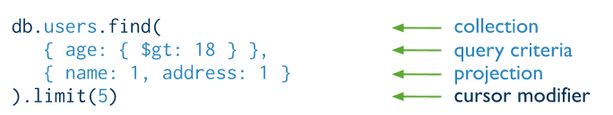
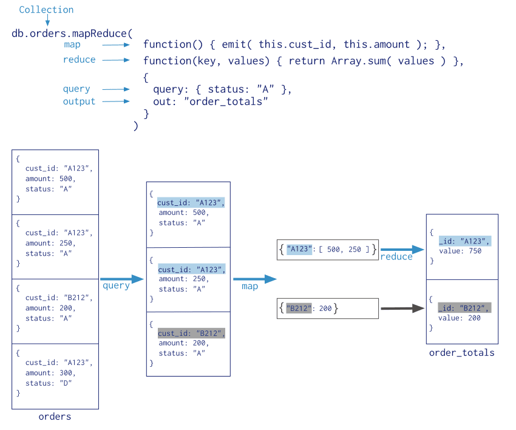

# 基本概念

[详细见官网文档](https://www.mongodb.com/zh-cn/docs/manual/)

常见术语：

| SQL术语/概念 | MongoDB术语/概念 | 解释/说明                           |
| ------------ | ---------------- | ----------------------------------- |
| database     | database         | 数据库                              |
| table        | collection       | 数据库表/集合                       |
| row          | document         | 数据记录行/文档                     |
| column       | field            | 数据字段/域                         |
| index        | index            | 索引                                |
| table joins  |                  | 表连接,MongoDB不支持                |
| primary key  | primary key      | 主键,MongoDB自动将_id字段设置为主键 |

------

## 库操作

```shell
// 连接
mongo --host 127.0.0.1:27017

// 查看所有库
show dbs;

// 建库
> use testdb;
switched to db testdb
```

## CRUD

每个文档都有一个**默认的_id键**，它相当于关系型数据库中的主键，这个键的值在同一个集合中必须是唯一的，**_id键值默认是ObjectId类型**，在插入文档的时候，如果用户不设置文档的_id值得话，MongoDB会自动生成生成一个唯一的ObjectId值进行填充。

### Insert


其中，`users` 是 collection 。

### Query



其中， projection 的部分表示选择字段。

查询全部使用：

```sh
db.users.find(
	{}
)
```

### Update


其中，带 `$` 的是mongoDB 关键字， status 字段只是表示用户数据。

### Delete


### BulkWrite

可以将 CRUD 操作语句放在一起批量化执行。

```sh
try {
   db.characters.bulkWrite(
      [
         { insertOne :
            {
               "document" :
               {
                  "_id" : 4, "char" : "Dithras", "class" : "barbarian", "lvl" : 4
               }
            }
         },
         { insertOne :
            {
               "document" :
               {
                  "_id" : 5, "char" : "Taeln", "class" : "fighter", "lvl" : 3
               }
            }
         },
         { updateOne :
            {
               "filter" : { "char" : "Eldon" },
               "update" : { $set : { "status" : "Critical Injury" } }
            }
         },
         { deleteOne :
            { "filter" : { "char" : "Brisbane"} }
         },
         { replaceOne :
            {
               "filter" : { "char" : "Meldane" },
               "replacement" : { "char" : "Tanys", "class" : "oracle", "lvl" : 4 }
            }
         }
      ]
   );
}
catch (e) {
   print(e);
}
```

## 聚合

(Aggregation )

类似于将SQL中的group by + order by + left join ... 等操作管道化。

类似 Java Strem 操作。

### 基本使用


### pipeline

pipeline 将文档的处理分为顺序的多个 stage 。

常用的 Stages：

- `$project`：修改输入文档的结构。可以用来重命名、增加或删除域，也可以用于创建计算结果以及嵌套文档。
- `$match`：用于过滤数据，只输出符合条件的文档。$match使用MongoDB的标准查询操作。
- `$limit`：用来限制MongoDB聚合管道返回的文档数。
- `$skip`：在聚合管道中跳过指定数量的文档，并返回余下的文档。
- `$unwind`：将文档中的某一个数组类型字段拆分成多条，每条包含数组中的一个值。
- `$group`：将集合中的文档分组，可用于统计各组的组内结果。
- `$sort`：将输入文档排序后输出。
- `$geoNear`：输出接近某一地理位置的有序文档。
- `$bucket`: 分组（分桶）计算。
- `$facet` : 多次分组计算。
- `$out`: 将结果集输出，必须是Pipline最后一个Stage。

### Map - Reduce



## 索引

默认对_id 进行索引。

以对users中score进行索引时查询的效果为例：


#### 常见索引类型

- 单一索引


- 复合索引（联合索引）


- 多键索引

	对嵌套属性的索引。


## Spring 集成

MongoDB提供的原生的 JavaAPI ，但大多数公司使用 Spring 框架，会使用 Spring Data MongoDB（这是对原生 JavaAPI 的封装）。

## 数据建模

使用 MongoDB 一般有两种数据结构的设计方式：

- 嵌套文档设计

	子项目包含在当前文档中。

	- 优点
		- 查询效率高，查询当前文档时，一次可以查询出所有子项目。
	- 缺点
		- 只适合更新较少的场景，因为每次更新一个子项目需要更新整个嵌套文档。
		- 当子项目非常多时，文档可能非常大。

- 引用文档设计

	子项目作为单独的文档，然后将其引用（_id）包含在当前文档中。

	- 优点
		- 数据更为结构化，避免了单个文档过大。
		- 更新频繁时，更容易进行增删改查。
		- 可以灵活地扩展和维护数据结构。
	- 缺点
		- 查询时可能需要进行多个集合的关联操作，可能会影响性能。
		- 需要额外的索引和查询优化来提高查询效率。

