# SQL 语句执行流程

以 MySQL 为例。

## 总览

### 写操作

写操作需要先查询页，载入到 buffer pool 中，然后在 buffer pool 的页中查询（找到需要修改的数据），最后进行修改。

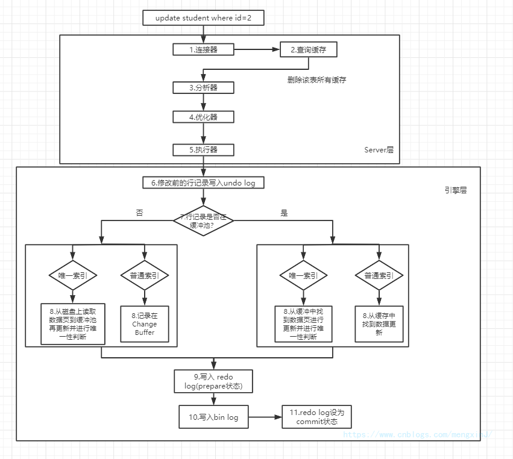

### 读操作

与写操作类似，读操作需要先查询页，载入到 buffer pool 中，然后在 buffer pool 的页中查询。

## MySQL 驱动

Java 应用系统需要与 MySQL 建立连接才能发送请求。 

Java 系统的 MySQL 驱动在系统和 MySQL 进行交互之前就会建立好连接。

一次 SQL 请求就会建立一个连接。

MySQL 驱动和 MySQL 数据库的连接基于 TCP/IP 协议。

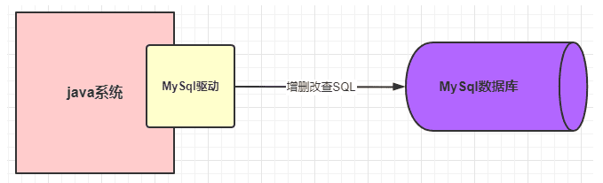

#### 数据库连接池

一次 SQL 请求就需要一个连接，一个连接一般由一个线程维护。

为了防止并发的多个请求的多个连接（线程）的不断连接和销毁，可以提供一些固定的用来连接的线程。

数据库连接池维护一定的连接数，当应用系统需要连接时可以直接获取。

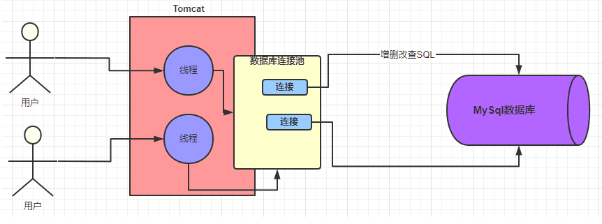

其中，java 应用系统可以部署在 Tomcat 容器中，数据库连接池是 MySQL 驱动中实现的功能。

## Server 层

### 连接器

#### 数据库连接池

MySQL 也提供了一个数据库连接池用来维护连接。

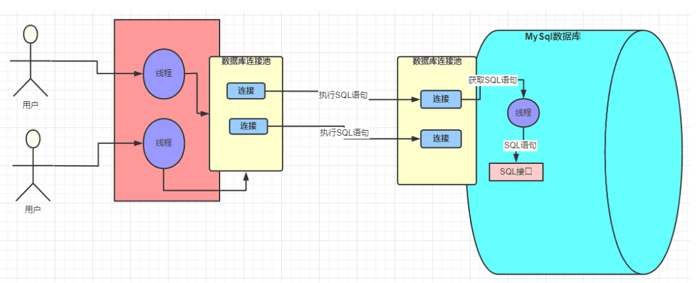

#### 权限验证

验证用户名和密码，以及各级别的数据访问权限。（全局级别、数据库级别、表级别、列级别、配合 db 的数据库级别，这些信息存储在 MySQL 各系统表中）

#### 查询缓存（MySQL 8.0 已弃用）

（query cache， Q cache， QC）

以键值对的形式存储 SQL 语句和结果，如果 SQL 语句以及记录在缓存中，直接返回结果。

缓存失效场景：

- 查询语句不一致。前后两条查询SQL必须完全一致。
- 查询语句中含有一些不确定的值时，则不会缓存。比如 now()、current_date()、curdate()、curtime()、rand()、uuid()等。
- 不使用任何表查询。如 select 'A';
- 查询 mysql、information_schema 或 performance_schema 数据库中的表时，不会走查询缓存。
- 在存储的函数，触发器或事件的主体内执行的查询。
- 如果表更改，则使用该表的所有高速缓存查询都变为无效并从缓存中删除。

业务数据库往往写操作占有相当的比例，QC 会影响到查询的效率（需要维护缓存的数据一致性）。

QC 一般是默认关闭的，在 MySQL 8.0 中已被弃用。

目前，QC 往往由 java 应用系统的业务层来处理，使用 redis 等技术，这样也可以节约与数据库通信的时间。

### 线程处理

每次连接有一个请求，MySQL 对每个请求使用一个线程进行处理。

线程获取到请求中的 SQL 语句后，会调用 MySQL 的 SQL 接口处理该请求。

### 解析器

解析器会解析 SQL 接口传递过来的 SQL 语句：

- 预处理
- 语法检查与解析
- 变量校验

构建解析树，将 SQL 语句编译为易于 MySQL 处理的表示的 SQL 语句。

### 优化器

优化器会对 SQL 语句进行优化，然后生成最优的执行计划。

优化器主要考虑两方面的成本：

- IO 成本

	比如读取的页的大小，每次会读取一整页（局部性）。

- CPU 成本

	数据读入内存后，估计进行数据检查条件或排序等操作的时间。

优化器会采用估计总成本最低的索引方案来制定执行计划。

#### 贪心索引

当存在多个索引候选时（比如多表连接时），优化器会使用贪心算法尽量快地选择一个较优的连接方案。

假设表 T 有对 A、B、C 列建立联合索引(A,B,C)，在进行查询时，假设查询条件是：`select xx where  B=x and A=x and C=x`，根据最左前缀原则，应当无法命中索引，但优化器会优化这种情况，会将其变为 `select xx where  A=x and B=x and C=x` 的情况。以上例子只有三个列，当列较多时，优化器可能无法在短时间内选择出全局最优解（因为使用贪心算法），当书写时是最优顺序时，命中索引的概率更高，所以在实际书写时，尽量以优化器不存在为前提书写 SQL 。

#### 索引评估方式

优化器主要依据：

- 扫描行数

	扫描行数可以通过表的统计信息进行估算，也就是随机取一部分页面作为样本，进而估算所有页面的情况。

- 是否使用临时表

- 是否排序

等来判断是否使用某个索引。

### 执行器

执行器根据一系列的执行计划调用存储引擎接口，从而执行 SQL 。

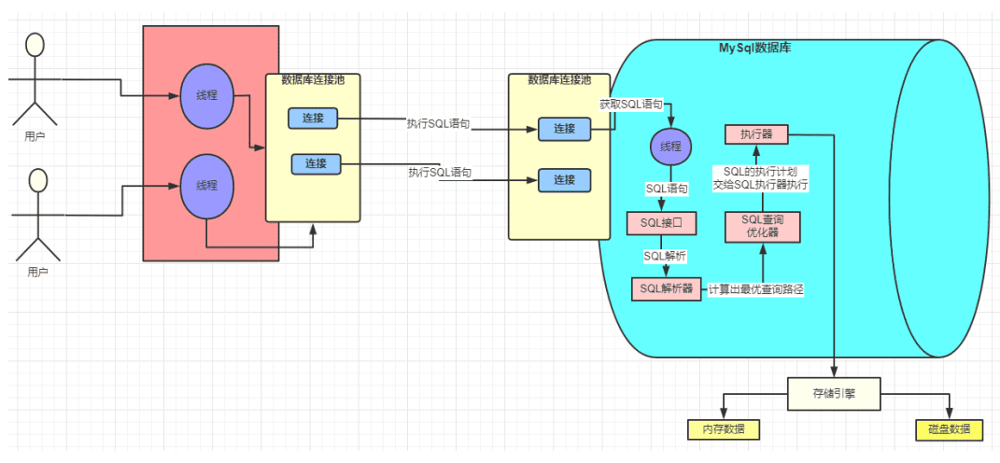

## 存储引擎层

以 InnoDB 为例。

### Buffer Pool

（缓冲池，也称为 Change Buffer）

数据是存储在磁盘上的，MySQL 先在内存中的缓冲池中查找需要的**数据页**是否存在，不存在就将数据页载入到缓冲池中，并进行加锁操作。

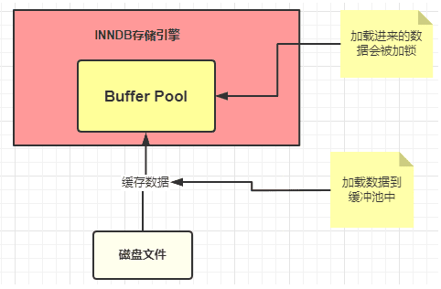

### undo log

undo 就是没有发生事情，所以 undo log 就是记录数据原本样子的日志。

将数据加载到 Buffer Pool 中的时候同时会往 undo 日志文件中插入一条日志，记录数据原本的值，用于应对回滚。

Innodb 存储引擎的最大特点就是支持事务，如果本次更新失败，也就是事务提交失败，那么该事务必须回滚，保证对原始数据没有影响。

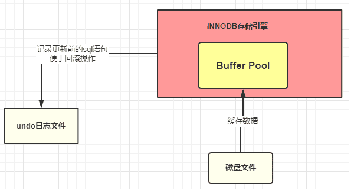

数据被加载到 Buffer Pool 中后，语句的操作是针对 Buffer Pool 中的数据进行的，此时 Buffer Pool 中的数据是脏数据，与磁盘中的数据不一致。

### redo log

内存中的数据容易断电丢失，当服务器宕机时， Buffer Pool 中的数据会全部丢失，redo log 用于应对这种情况。

redo log 是 InnoDB 特有的，是存储引擎级别的，不是 MySQL 级别的。

redo log 记录数据修改之后的值（保存到 redo log buffer），不管事务是否提交都会记录下来。

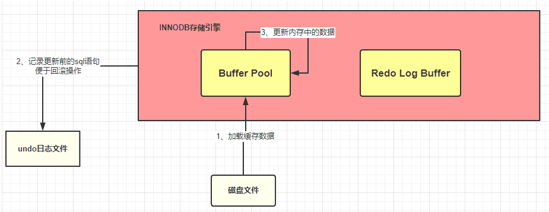

redo log buffer 中的数据会被不断刷入磁盘的 redo log 文件（一般是立即刷入磁盘）。

redo log 存储的内容是对数据页的修改逻辑。

刷磁盘可以通过 innodb_flush_log_at_trx_commit 参数设置：

- 值为 0 表示不刷入磁盘
- 值为 1 表示立即刷入磁盘
- 值为 2 表示先刷到 os cache

注意：

- 如果 redo log buffer 刷入磁盘前 MySQL 宕机，那么本次事务失败，事务未提交，磁盘中的数据不变。
- 如果 redo log buffer 刷入磁盘后宕机，事务未提交，下次重启时，MySQL 会将已刷入的数据恢复到 redo log buffer 中。
- 如果正常运行，事务提交，redo log buffer 会被循环写。
	- redo log buffer 大小固定，采用循环写。
	- write_pos 指针表示正在写入的位置，checkpoint 指针表示检查点，checkpoint 与 write_pos 之间是有效记录。
	- write_pos 会在写到文件末尾后跳到开头继续写。
	- 如果 write_pos 追上 checkpoint ，则需要先等当前数据刷入磁盘（checkpoint 向前移动）后，再继续写。

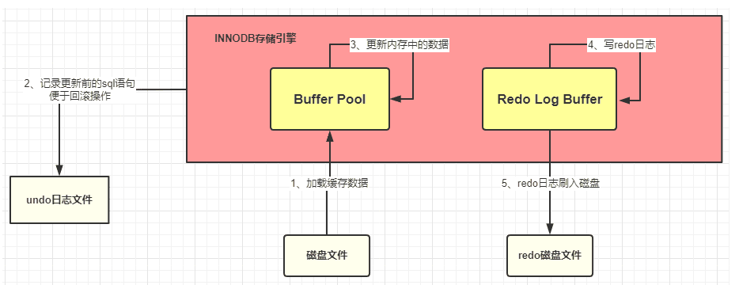

### bin log

bin log 用于记录日志。

对比：

| 性质     | redo Log                                                     | bin Log                                                      |
| -------- | ------------------------------------------------------------ | ------------------------------------------------------------ |
| 记录内容 | 低级物理逻辑，“对什么位置，做了什么修改”                     | 高级语义逻辑，“对 students 表中的 id 为 1 的记录做了更新操作” |
| 文件大小 | redo log 大小固定（可以修改，但一般默认的就足够）            | bin log 可设置大小（但是一般不建议修改）                     |
| 实现方式 | redo log  是 InnoDB 引擎层实现的（Innodb 存储引擎独有）      | bin log 是 MySQL 层实现的，所有引擎都可以使用 bin log 日志   |
| 记录方式 | redo log 采用循环写的方式记录，当写到结尾时，会回到开头循环写日志 | bin log 通过追加的方式记录，当文件大小大于给定值后，后续的日志会记录到新的文件上 |
| 使用场景 | redo log 适用于崩溃恢复(crash-safe)                          | bin log 适用于主从复制和数据恢复                             |

bin log 文件的刷盘策略：（可通过 sync_bin log 设置）

- 默认为 0 ：先写入 os cache 。
	- 在提交事务时，数据会先到 os cache 中，如果此时宕机，数据会丢失，建议设置为 1 。
- 数值 1：直接写入磁盘。

#### bin log 的记录模式

- STATMENT

	基于 SQL 语句的复制（statement-based replication, SBR），每一条会修改数据的 SQL 语句会记录到 bin log 中。

	- 优点：不需要记录每一行的变化，减少了日志量，节约了 IO 。
	- 缺点：在某些情况下会导致主从数据不一致，比如执行 sysdate()、sleep() 等。

- ROW

	基于行的复制（row-based replication, RBR），不记录每条SQL语句的上下文信息，仅记录哪条数据被修改了。

	- 优点：不会出现某些特定情况下的存储过程、或 function、或 trigger 的调用和触发无法被正确复制的问题。
	- 缺点：会产生大量的日志，尤其是 alter table 的时候会让日志量暴涨。

- MIXED

	基于 STATMENT 和 ROW 两种模式的混合复制（mixed-based replication, MBR）。

	- 一般的复制使用 STATEMENT 模式保存 bin log 。
	- 对于 STATEMENT 模式无法复制的操作使用 ROW 模式保存 bin log 。
	- 仍然可能发生主从不一致的情况。

### 提交事务

MySQL 在准备提交事务时：

1. 将 redo log buffer 中的数据写入到 redo log 磁盘文件中，完成后将 redo log 状态设置为 prepare 。
2. 将本次修改的数据记录到 bin log 文件中。
3. 将记录本次修改的 bin log 文件名和修改的内容在 bin log 中的位置记录到 redo log 中。
4. 将 redo log 的状态设置为 commit ，表示本次事务已被成功提交。

只要 redo log 最后没有 commit 标记，说明本次的事务一定是失败的，但是数据没有丢失，因为已经被记录到 redo log 的磁盘文件中了，可以在重启后恢复。

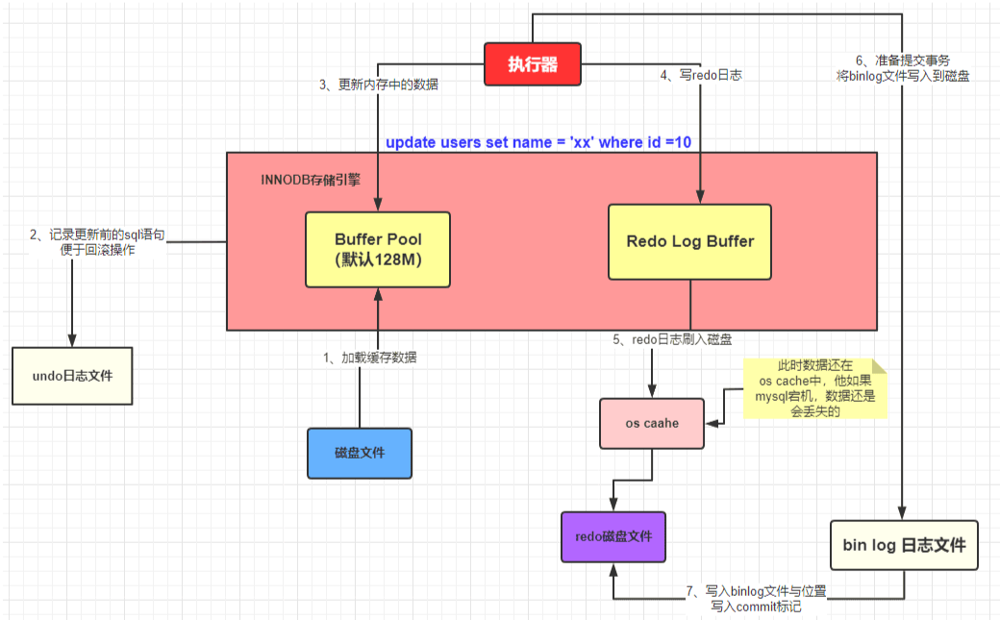

### 同步线程

更新记录是在内存中的 buffer pool 执行的，如果宕机又恢复了，仅仅是将更新后的记录加载到 Buffer Pool 中，这个时候 MySQL 数据库中的这条记录依旧是旧值，也就是说此时内存中的数据依旧是脏数据。

MySQL 会有一个后台线程，它会在某个时机将 Buffer Pool 中的脏数据刷到数据库中：

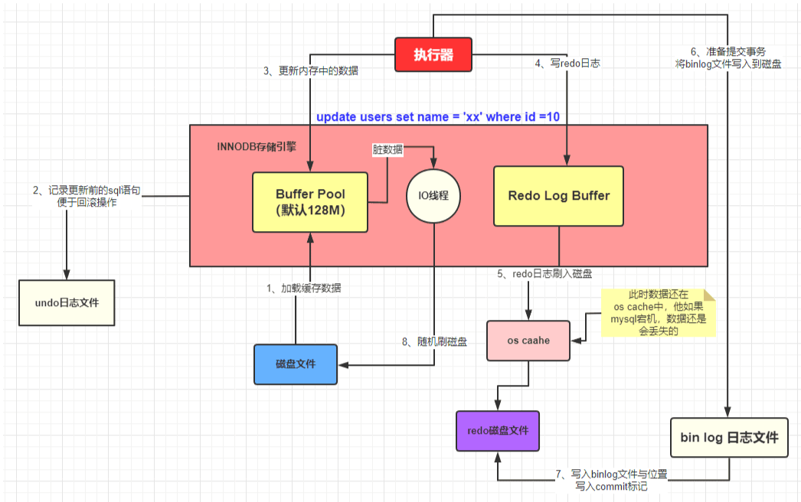

## 日志简单对比

- undo log

	记录数据改动前的样子，用于回滚。

- redo log

	记录数据改动后的样子，用于应对宕机。

- bin log

	SQL 操作日志，可用于排查错误，备份，主从复制。
