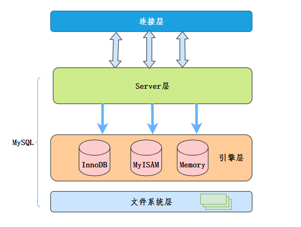

# 基本事项

## 服务环境

### 启动 MySQL

- 启动 

	`service mysql start`

- 停止

	`service mysql stop`

### 连接 MySQL

- 命令行

	- MySQL 客户端命令行。

	- 系统命令行。

		`mysql [-h 127.0.0.1] [-P 3306] -u root -p  (IP，端口，用户，使用密码登录)` （任意处使用需配置 PATH 环境变量）
		
		```sql
		mysql [options] [database]
		
		选项:
		-u, --user=name   # 指定用户名
		-p, --password[=name]   # 指定密码
		-h, --host=name   # 指定服务器 IP 或域名
		-P, --port=port   # 指定连接端口。注意，指定端口时，即使是本地连接也要指定 IP 。
		-e, --execute=name   # 执行SQL语句并退出，可以在命令行执行 SQL 语句，而不用进入 MySQL 数据库，常用于脚本
		```

### Linux 安装 MySQL 可能遇到的问题

安装缓存错误：https://serverfault.com/questions/1028593/mysql-packages-skipped-dependency-problems

版本错误：https://segmentfault.com/a/1190000022348569

缺失许可证错误：https://support.cpanel.net/hc/en-us/articles/4419382481815

## MySQL 体系结构

1. 连接层
2. 服务层
3. 引擎层
4. 存储层（文件系统层）



## 系统数据库

- mysql
	存储 MySQL 服务器正常运行所需要的各种信息（时区、主从、用户、权限等）。
- information_schema
	提供了访问数据库元数据的各种表和视图，包含数据库、表、字段类型及访问权限等。
- performance_schema
	为 MySQL 服务器运行时状态提供了一个底层监控功能，主要用于收集数据库服务器性能参数。
- sys
	包含了一系列方便 DBA 和开发人员利用 performance_schema 性能数据库进行性能调优和诊断的视图。

