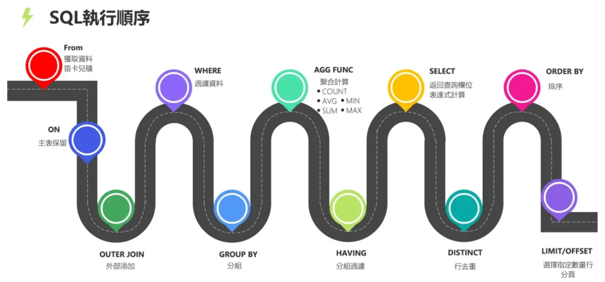

# 基本语法

## MySQL 与 SQL Server 的区别

参考：

- 常见区别：https://developer.aliyun.com/article/317024
- 更多区别：https://www.cnblogs.com/weibanggang/p/9609629.html

## 注释

- 单行注释 `-- 或 #`
- 多行注释 `/*   */`

## 常用数据类型

### 数值

| 类型            | 大小                               | 范围（有符号）                  | 范围（无符号）     | 用途                |
| :-------------- | :--------------------------------- | :------------------------------ | :----------------- | :------------------ |
| TINYINT         | 1 Bytes                            | (-128，127)                     | (0，255)           | 小整数值            |
| SMALLINT        | 2 Bytes                            | (-32 768，32 767)               | (0，65 535)        | 整数值              |
| MEDIUMINT       | 3 Bytes                            | (-8 388 608，8 388 607)         | (0，16 777 215)    | 整数值              |
| INT  或 INTEGER | 4 Bytes                            | (-2 147 483 648，2 147 483 647) | (0，4 294 967 295) | **整数值**          |
| BIGINT          | 8 Bytes                            |                                 |                    | 大整数值            |
| FLOAT           | 4 Bytes                            |                                 |                    | 单精度 浮点数值     |
| DOUBLE          | 8 Bytes                            |                                 |                    | **双精度 浮点数值** |
| DECIMAL         | 每 9 位十进制数需要 4 个字节存储。 | 依赖于M和D的值                  | 依赖于M和D的值     | 高精度小数值        |

DECIMAL(M, D) 表示总共 M 位（缺省为 10），有 D 位小数位（缺省为 0）。

### 字符串

| 类型     | 大小           | 用途                            |
| :------- | :------------- | :------------------------------ |
| CHAR     | 0-255 bytes    | **定长字符串**                  |
| VARCHAR  | 0-65535 bytes  | **变长字符串**                  |
| TINYBLOB | 0-255 bytes    | 不超过 255 个字符的二进制字符串 |
| TINYTEXT | 0-255 bytes    | 短文本字符串                    |
| BLOB     | 0-65 535 bytes | 二进制形式的长文本数据          |
| TEXT     | 0-65 535 bytes | 长文本数据                      |

MySQL 把每个 BLOB 和 TEXT 值当做一个独立的对象处理。当 BLOB 和 TEXT 值太大时，InnoDB 会使用专门的“外部”存储区域来进行存储，此时每个值在行内需要 1~4 个字节存储一个指针，然后在外部存储区域存储实际的值。

MySQL 对 BLOB 和 TEXT 列进行排序时，只对每个列的最前 max_sort_length 个字节而不是整个字符串做排序。

同样的，MySQL 也不能将 BLOB 或 TEXT 列全部长度的字符串进行索引。

### 日期与时间

当指定不合法的 MySQL 不能表示的值时使用"零"值。

| 类型      | 大小 ( bytes) | 范围                                                         | 格式                | 用途                     |
| :-------- | :------------ | :----------------------------------------------------------- | :------------------ | :----------------------- |
| DATE      | 3             | 1000-01-01/9999-12-31                                        | YYYY-MM-DD          | **日期值**               |
| TIME      | 3             | '-838:59:59'/'838:59:59'                                     | HH:MM:SS            | **时间值或持续时间**     |
| YEAR      | 1             | 1901/2155                                                    | YYYY                | 年份值                   |
| DATETIME  | 8             | 1000-01-01 00:00:00 到 9999-12-31 23:59:59                   | YYYY-MM-DD HH:MM:SS | **混合日期和时间值**     |
| TIMESTAMP | 4             | 1970-01-01 00:00:00 到 结束时间是第 **2147483647** 秒，北京时间 **2038-1-19 11:14:07**，格林尼治时间 2038年1月19日 凌晨 03:14:07 | YYYYMMDD HHMMSS     | 混合日期和时间值，时间戳 |

### 杂项

如果计划在列上创建索引，就应该尽量避免设计成可为 NULL 的列，如果查询中包含可为NULL的列，会使得索引、索引统计和值比较都更复杂，对MySQL来说更难优化。

应该避免使用字符串类型作为标识列，因为它们很耗空间，并且比数字类型慢。 

对于完全随机的字符串，例如 MD5, SHA 或者 UUID 产生的字符串，这些函数生成的新值会任意分布在很大的空间内，这会导致 INSERT 以及一些 SELECT 语句变得很慢：

- 因为插入值会随机的写入到索引的不同位置，所以使得INSERT语句更慢。这会导致页分裂、磁盘随机访问。
- SELECT语句会变得更慢，因为逻辑上相邻的行会分布在磁盘和内存的不同地方。
- 随机值导致缓存对所有类型的查询语句效果都很差，缓存赖以工作的局部性原理失效。

## DDL

### 库操作

- 查询所有数据库：`show databases;`
- 查询当前数据库：`select database();`
- 创建：`create database [if not exists] 数据库名 [default charset 字符集] [collate 排序规则];`
- 删除：`drop database [if exists] 数据库名`
- 使用：`use 数据库名`

### 表操作

#### 查询

- 查询当前数据库的所有表：`show tables;`
- 查询表结构：`desc 表名`
- 查询指定表的建表语句：`show create table 表名`

#### 创建

```sql
create table 表名 (
	id int comment '宇宙第一',   # 字段注释
	name varchar(10) comment '惠惠'   # 最后一个字段后无逗号
) comment '可爱';   # 表注释   注意表末尾的分号
```

comment 不是指代码注释，而是意义注释。

设计表时，一般会添加两个时间字段：

- create_time：记录的是当前这条数据插入的时间。 

- update_time：记录当前这条数据最后更新的时间。

#### 修改

- alter table
	- add 添加字段
	- change 更改字段
	- modify 更改字段类型
	- drop 删除字段
	- rename to 修改表名

#### 删除

```sql
drop table [if exists] 表名;   # 删除表

truncate table 表名;   # 清空表
```

## DML

### 插入

```sql
# 指定字段
insert into 表名(字段1, 字段2) values(值1, 值2)；

# 全部字段
insert into 表名 values(值1, 值2)；

# 批量
insert into 表名(字段1, 字段2) values(值1, 值2), (值1, 值2)；
insert into 表名 values(值1, 值2), (值1, 值2)；
```

字符串和日期类型包含在引号内。

### 修改

```sql
update 表名 set 字段名1 = 值1, 字段名2 = 值2 [where 条件];   # 没有 where 会修改整张表
```

### 删除

```sql
delete 表名 [where 条件];
```

## DQL

查询与 Transact-SQL 相似度非常高，以下列出部分区别内容或补充内容。

- 逻辑符号

	MySQL 同时支持 `!= 和 <>`，`&& 和 and（类比此类符号）` 。

- 分页查询 **limit**：`select * from 表名 limit 起始位置, 显示记录数` 。

	limit 从查询**结果集**起始位置开始，指定显示的记录数。（省略起始位置默认从 $0$ 开始）。

	- 起始位置也可由 **offset** 指定：`limit 3 offset 4` 从下标 $4$ 开始，查询 $3$ 条数据。

### DQL 顺序



所有的查询语句都是从 FROM 开始执行，在执行过程中，每个步骤都会生成一个虚拟表，这个虚拟表将作为下一个执行步骤的输入，最后一个步骤产生的虚拟表即为输出结果。

```sql
(9) SELECT 
(10) DISTINCT <column>,
(6) AGG_FUNC <column> or <expression>, ...
(1) FROM <left_table> 
    (3) <join_type>JOIN<right_table>
    (2) ON<join_condition>
(4) WHERE <where_condition>
(5) GROUP BY <group_by_list>
(7) WITH {CUBE|ROLLUP}
(8) HAVING <having_condtion>
(11) ORDER BY <order_by_list>
(12) LIMIT <limit_number>;
```

## DCL

### 管理用户

user 表的相关操作，主机字段表示能够允许访问数据库的位置。

- 查询用户

	```sql
	use mysql;
	select * from user;
	```

- 创建用户

	`create user '用户名'@'主机名' identified by '密码'`

- 修改用户密码

	`alter user '用户名'@'主机名' identified with mysql_native_password by '新密码'`

- 删除用户

	`deop user '用户名'@'主机名';`

### 权限控制

- 查询权限

	`show grants for '用户名'@'主机名';`

- 授予权限

	`grant 权限列表 on 数据库名.表名 to '用户名'@'主机名';`

- 撤销权限

	`revoke 权限列表 on 数据库名.表名 from '用户名'@'主机名'`

## 函数

### 流程函数

```sql
if()

ifnull()

case when then else end   

1.
select
	( case address when '北京' then '一线城市' when '上海' then '一线城市' else '二线城市' end ) as '地址'
from employee;

2.
select
	( case when math >= 85 then '优秀' when math >= 60 then '及格' else '不及格' end) as '成绩'
from exam;
```

## 子查询

### 分类

1. 按子查询出现的位置分
    - select 后面
		仅支持标量子查询
    - from 后面
		支持表子查询
    - where 或 having 后面 
		- 标量子查询(用的最多)
		- 列子查询(用的较多)
		- 行子查询
    - exists 后面(相关子查询)
		- 表子查询
2. 按结果集的行列数不同分
    - 标量子查询 (结果集只有一行一列)
    - 列子查询 (结果集只有一列多行)
    - 行子查询 (结果集有一行多列)
    - 表子查询 (结果集有多行多列)

### 注意

- 一般多字段比较可：

```
a = 1 and b = 2 ....

或

(a, b ...) = (1, 2 ...) # 元组形式
```

- 行子查询的比较条件可：

```
(a, b ...) = (select ...) # 行（元组）比较
```

- 表子查询的比较条件可：

```
(a, b ...) in (select ...) # 行（元组）比较
```


## 视图

（View）

视图是虚拟的表（可当做表操作），行和列的数据是在使用视图时通过查询（基表）动态生成的。

### 基本语句

- 创建视图

	```sql
	create [or replace] view 视图名[(列名列表)] as select 语句 [with [cascade | local ] check option];
	
	设置选项
	with cascade check option:（默认为 cascade）
		通过视图更新数据时，数据必须满足视图的限制条件才能插入。
		若不设置该选项，可能通过视图更新的数据能在基表中看到，但在视图中看不到，因为不符合视图建立的限制条件。
		若对视图操作的语句又基于了其它视图，则共同检查限制条件。
		假设设置了该选项的语句只有 B，现 A 引用了 B，B 又引用了 C，则执行 A 时会检查 B, C 的限制条件，不会检查 A 的限制条件。
	with local check option:
		假设设置了该选项的语句只有 B，现 A 引用了 B，B 又引用了 C，则执行 A 时只检查 B 的限制条件。
	```

- 查询视图

	```sql
	show create view 视图名;   # 查看创建视图的语句
	
	select * from 视图名 ...;   # 查看视图
	```

- 删除视图

	```sql
	drop view [if exists] 视图名 [, 视图名] ...;
	```

- 修改视图

	```sql
	alter 
	# 或
	alter view 视图名 as select 语句 ...;
	
	只有视图中的数据行与基表中的数据行相对应时，才能修改视图。
	```

### 视图的作用

- 简化操作

	将一些复杂查询定义为视图。可重用 SQL 语句。

- 权限

	MySQL 最多只能把权限赋予到表上，不能对表中的行和列（字段）进行权限管理，可以使用视图使用户只能看到视图呈现的部分。

- 数据独立

	视图可帮助用户屏蔽真实表结构变化带来的影响。

## 存储过程

相当于函数。

- 封装，复用
- 可接收参数，可返回数据。
- 减少客户端与服务端的交互，提升效率。

### 操作

- 创建

  ```sql
  create procedure 存储过程名([参数列表])
  begin
  	-- SQL 语句（要加分号）
  end;
  
  若在命令行中创建：
  因为读到分号就执行语句，所以读不到 end 就开始执行，于是报错。
  应使用 delimiter 关键字更换语句结束字符，然后 end<设置的结束符> 内部 SQL 语句仍要以分号结尾。
  ```

- 调用

  ```sql
  call 存储过程名([参数列表]);
  ```

- 查看

  ```sql
  show create procedure 存储过程名;   # 查看定义
  ```

- 删除

  ```sql
  drop procedure [if exists] 存储过程名;
  ```

### 参数

- 类型

	- IN（默认）

		传入参数

	- OUT

		传出参数（传入一个参数用于接收返回值）

	- INOUT

		既可作传入也可作传出参数。

```sql
create procedure 存储过程名([ IN/OUT/INOUT 参数名 参数类型])
begin
	# SQL 语句
end;
```

## 变量

### 系统变量

- 全局变量（Global）

- 会话变量（Session）

- 查看系统变量

	```sql
	show [session | global] variables;   # 查看所有系统变量
	show [session | global] variables like '...';   # 通过 like 匹配变量
	select @@[session | global].系统变量名;   # 查看指定变量值
	```

- 设置系统变量

	```sql
	set [session | global] 系统变量名 = 值;
	set @@[session | global].系统变量名 = 值;
	```

- 注意

	- 默认是 session。
	- 服务重启后恢复默认值，若要永久设置，要修改配置文件 `/etc/my.cnf` 。

### 用户变量

作用域为当前会话。 `@变量名`

用户变量不需要声明，直接赋值即可，若未赋值便使用，则为 `null` 。

### 局部变量

需要 `declare` 声明，作用域为其声明的 `begin end` 块。

```sql
# 也可如下赋值（用 into）
select count(*) into @变量名 from 表名;
```

## 流程控制

#### if

```sql
if 条件1 then
	...
elseif 条件2 then
	...
else
	...
end if;
```

#### case

```sql
# 形式一
case 值
	when 值1 then SQL_语句;
	when 值2 then SQL_语句;
	else SQL_语句
end case;

# 形式二
case
	when 条件 then SQL_语句;
	when 条件 then SQL_语句;
	else SQL_语句
end case;	
```

#### 循环

```sql
# while 循环
while 条件 do
	SQL_语句
end while;

# repeat 循环
repeat
	SQL_语句
	until 条件   # 满足条件退出循环。
end repeat;

# loop 循环
[label_name:] loop
	SQL_语句
end loop [label_name];

	# 配合使用，若不在 loop 中使用 leave 则是死循环。
leave: 作用为 break
iterate: 作用为 continue

leave label_name;   # 退出指定标记的循环体。
iterate label_name;   # 直接进入指定标记的下一次循环。
```

## 游标

游标（Cursor）用来存储查询结果集，并对结果集进行**逐行**处理。

- 声明游标

	```sql
	declare 游标名 cursor for 查询语句;
	```

- 打开游标

	```sql
	open 游标名;
	```

- 获取游标记录

	```sql
	fetch 游标名 into 变量 [, 变量];   # 取数据赋值给变量
	```

- 关闭游标

	```sql
	close 游标名;
	```


## 条件处理程序

（Handler）

可根据产生的错误状态码执行某些操作。（当 SQL 产生错误时，系统会提示状态码，可将其写入）

```sql
declare 指定行为 handler for 状态码 [, 状态码] 指定SQL_语句;

指定行为：
	continue：继续当前程序。
	exit：终止当前程序。
状态码：
	如：'02000'
	SQLWARNING: 所有以 01 开头的状态码的简写
	NOT FOUND： 所有以 02 开头的状态码的简写
	SQLEXCEPTION： 所有非 01 或 02 开头的状态码的简写
指定SQL_语句:
	指定行为发生前执行。
```

## 存储函数

存储函数是有返回值的存储过程，存储函数的参数只能是 in 类型。

```sql
create function 存储函数名([参数列表])
returns 返回值类型 [characteristic...]
begin
	SQL_语句
	return ...;
end;

characteristic 说明：
	deterministic: 相同的参数总是产生相同的结果
	NO SQL：不包含 SQL 语句
	READS SQL DATA： 包含读取数据的语句，但不包含写入数据的语句。
```

## 触发器

触发器是与表有关的数据库对象，指在 `insert, update, delete` 之前或之后触发的语句的集合。

- 使用**别名 OLD 和 NEW 对象**引用触发器中发生变化的记录内容，其中包含了变化的记录的信息，如获取变化后的 id 字段值： `new.id`。

	- insert 型触发器

		new 表示将要或者已经新增的数据。

	- update 型触发器

		old 表示修改之前的数据，new 表示将要或已经修改过的数据。

	- delete 型触发器

		old 表示将要或者已经删除的数据。

- 创建

	```sql
	create trigger 触发器名
	before/after insert/update/delete
	on 表名 for each row   # 行级触发器（影响几行，触发几次）
	begin
		语句;
	end;
	```

- 查看

	```sql
	show triggers;
	```

- 删除

	```sql
	drop trigger [数据库名.]触发器名;   # 默认为当前数据库
	```

	
