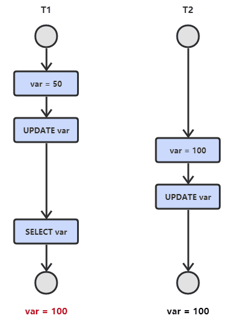
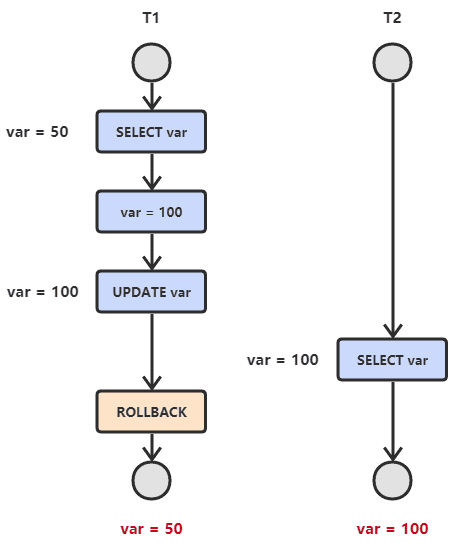
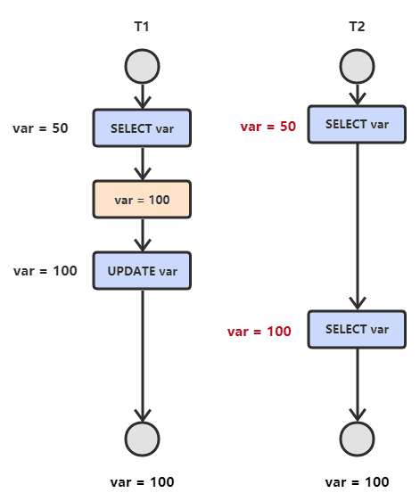
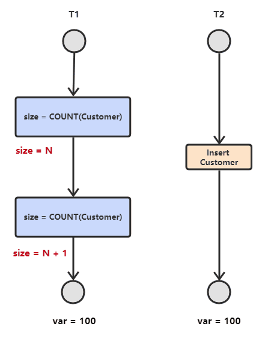

# 并发机制

## 事务

事务指的是满足 ACID 特性的一组操作，可以通过 Commit 提交一个事务，也可以使用 Rollback 进行回滚（特别是在发生错误时）。

### 基本事务操作

MySQL 默认采用自动提交模式，如果不显式使用`START TRANSACTION`语句来开始一个事务，那么每个查询都会被当做一个事务自动提交。

- 查看事务提交方式

	`select @@autocommit;` 为 $0$ 代表手动，为 $1$ 代表自动。

- 设置事务提交方式

	`set @@autocommit = 0;`

- 开启事务

	`start transaction 或 begin;`

- 提交事务

	`commit;` 未提交时，数据库不会被更新。

- 回滚事务

	`rollback;` 出错时使用回滚。

### 事务四大特性

(ACID)

1. 原子性（ Atomicity ）

	  一个事务要么全部完成，要么全部不完成，是一个不可分割的整体。

2. 一致性（ Consistency ）

	 一个事务独立执行的结果应该保证不会破坏数据库，即保持数据库的一致性。

3. 隔离性（ Isolation ）

	  多个事务并发执行时，应当与各事务先后单独执行的结果一样。即多个事务并发时，要保证执行结果不依赖于多个事务。

4. 持久性（ Durability ）

	  一个事务一旦完成（即提交或回滚），它对数据库的所有更新应永久地反映在数据库中。即使以后系统发生故障，也应有日志记录。

ACID 之间的关系：

- 只有满足一致性，事务的执行结果才是正确的。
- 在无并发时，事务串行执行，隔离性一定能够满足；此时只要能满足原子性，就一定能满足一致性。
- 在并发的情况下，多个事务不仅要满足原子性，还需要满足隔离性，才能满足一致性。
- 事务满足持久性是为了能应对数据库崩溃的情况。

保证措施：
- 原子性：undo log
- 一致性：undo log + redo log
- 隔离性： 锁 + MVCC
- 持久性：redo log

### 并发一致性问题

注意描述的主体视角是事务 1 还是事务 2 ，视角不同会导致描述不同，进而产生混淆。

#### 丢失更新（ lost update ）

丢失更新分为两类问题：

- 一类，回滚丢失，还原丢失

	事务 1 执行期间，事务 2 更新了数据但未提交，然后事务 1 回滚后还原了该数据。

	- 实际上等同于脏读问题，事务读取了其它事务修改后**未提交**的数据。

- 二类，提交丢失，覆盖丢失

	事务 1 执行期间，事务 2 更新了数据并已提交，然后事务 1 提交后覆盖了该数据。

	- 实际上等同于不可重复读问题，事务读取了其它事务修改后**已提交**的数据。




#### 读脏数据（ read dirty data ）

（ dirty read， 脏读 ）

一个事务读了另一个事务未提交（或回滚）的数据，这些数据是无效数据。



#### 不可重复读（ non-repeatable reads ）

一个事务前后两次读取间，数据被其它事务更新了，这些数据是有效数据。（事务在提交前，数据被其它事务修改并提交）



#### 幻读（ phantom reads ）

一个事务前后进行读取，发现数据量不一致。（多了或少了行）



### 事务隔离级别

并发一致性问题总结：

- 丢失更新
	- 一类：更新提交前被读
	- 二类：更新提交前被改
- 脏读：提交前被读
- 不可重复读：提交前被改
- 幻读：提交前被加减行

并发控制可以通过封锁来实现，但是封锁操作需要用户自己控制，相当复杂。数据库管理系统提供了事务的隔离级别，让用户以一种更轻松的方式处理并发一致性问题。

- 未提交读（Read uncommitted，RU）（不提交可被读）

	隔离事务的最低级别，只能保证不读取物理上损坏的数据，事务中的修改即使没有提交，对其它事务也是可见的。

- 已提交读（Read committed，RC）（提交前不可被读）

	SQL Server 的默认级别。可**避免脏读**。一个事务只能读取已经提交的事务所做的修改。换句话说，一个事务所做的修改在提交之前对其它事务是不可见的。

- 可重复读（Repeatable Read，RR）（提交前不可被改）

	MySQL 的默认级别。可**避免脏读，不可重复读**。保证在同一个事务中多次读取同样数据的结果是一样的，中间不可被其它事务修改。

- 可序列化（Serializable，S）

	隔离事务的最高级别，强制事务串行执行。可**避免脏读，不可重复读，幻读**。

隔离级别越高，安全性越高，但并发性能越低。

```sql
查看事务隔离级别
select @@transaction_isolation;

设置事务隔离级别
set [session | global]   # session 代表当前会话
transaction isolation level <隔离级别的英文>
```

## 锁

### 封锁粒度

MySQL 提供了两种封锁粒度: 

- 行级锁
- 表级锁

在选择封锁粒度时，需要在锁开销和并发程度之间做一个权衡：

- 并发程度

	应该尽量只锁定需要修改的那部分数据，而不是所有的资源。锁定的数据量越少，发生锁争用的可能就越小，系统的并发程度就越高。

- 锁开销

	加锁需要消耗资源，锁的各种操作(获取锁、释放锁、检查锁状态等)都会增加系统开销，因此封锁粒度越小，系统开销就越大。

### 锁概念

对于某个对象，它的锁可记为：

- 排它锁(Exclusive)，简写为 X 锁，又称写锁。

	一个事务对数据对象 A 加了 X 锁，就可以对 A 进行读取和更新（独占）。

	- 加锁期间其它事务不能对 A 加任何锁，即其它事务不能读取或更新 A 。

- 共享锁(Shared)，简写为 S 锁，又称读锁。

	一个事务对数据对象 A 加了 S 锁，可以对 A 进行读取操作，但是不能进行更新操作。

	- 加锁期间其它事务能对 A 加 S 锁，但是不能加 X 锁。

DQL 语句默认不加任何锁。

加锁**策略**可以分为：

- 悲观锁（Pessimistic Locking）

	一种悲观的假设“并发冲突常会发生”的策略，系统在操作数据之前会对数据加锁，以确保其他事务无法同时访问或修改这些数据。

	- 实现方式

		依赖于数据库的原生锁机制。

	- 适用场景

		悲观锁适用于并发冲突频繁发生的场景，比如一些涉及大量写操作的系统。在这些场景下，确保数据一致性优先于性能。

- 乐观锁（Optimistic Locking）

	一种乐观的假设“并发冲突不常发生”的策略，系统不会在操作数据之前加锁，而是允许多个事务并发地操作相同的数据，并在提交时检查是否发生了冲突。

	- 实现方式

		乐观锁通常通过版本号（Version）或时间戳（Timestamp）来实现。

		- 例如在每条记录中增加一个版本号字段，每次修改数据时更新版本号，在提交时检查版本号是否与最初读取时一致。
		- MVCC 接近于乐观锁策略，但与传统实现乐观锁的方式不同。

	- 适用场景

		乐观锁适用于读操作较多、写操作较少的场景，或者并发冲突较少的系统。它可以提高并发性，同时保持较好的性能。

### 全局锁

锁定数据库中的所有表。

- 全局排他锁

	加锁后处于独占状态。

- 全局共享锁

	加锁后处于只读状态，写操作被阻塞，一般在备份数据库时使用。

### 表级锁

每次操作锁定整张表。

#### 表锁

- 表读锁（read lock，表共享锁）

	所有客户端只允许读，其它操作阻塞。

- 表写锁（write lock，表排他锁，表独占锁）

	当前客户端可读可写，其它客户端不可读不可写。

```sql
lock tables 表名... read/write; # 加锁

unlock tables; 或者断开客户端连接   # 释放锁
```

#### 元数据锁

（meta data lock，MDL）

MDL 由系统自动控制，访问一张表时会自动加上，用于维护元数据的一致性，加上后不可以对元数据进行写入操作。

元数据相当于表结构，即在有活动事务时，不允许修改表结构。

- 当对一张表进行增删改查的时候，加 MDL 读锁（共享）;
- 当对表结构进行变更操作的时候，加 MDL 写锁（排他）。

#### 意向锁

（Intention Locks）

在存在行级锁和表级锁的情况下，事务 T 想要对表 A 加 X 锁，就需要先检测是否有其它事务对表 A 或者表 A 中的任意一行加了锁，那么就需要对表 A 的每一行都检测一次，这是非常耗时的。

InnoDB 引入了意向锁，表示是否有在对表中的行进行读或写操作，使得加表锁时不必检查每行数据是否已经加了行锁。

DML 语句在执行时：

- 自动加行锁，同时对表加意向锁（意向排他锁）
- 当另一个进程要对**该表加表锁**时，直接检查表的意向锁（不必检查行锁），查看是否与表锁冲突，若冲突则阻塞。

分类：

- 意向共享锁（IS）

  与表锁共享锁（read）兼容，与表锁排他锁（write）互斥。（“互斥”表示不能再被加互斥的锁）

  ```sql
  select ... lock in share mode   # 加行锁共享锁，同时为表加意向共享锁
  ```

- 意向排他锁（IX）

  与表锁共享锁（read）和表锁排他锁（write）都互斥，**意向锁之间不会互斥**。

  ```sql
  insert, update, delete 自动添加
  
  select ... for update 手动添加
  ```

注意：

- 一个事务在获得某个数据行对象的 S 锁之前，必须先获得表的 IS 锁或者更强的锁；
- 一个事务在获得某个数据行对象的 X 锁之前，必须先获得表的 IX 锁。

### 行级锁

每次操作锁定行级别的数据。（可多行）

#### 行锁

（Record Lock）

事务通过索引读写时会对索引项加行锁（读锁或写锁）。在 RC、RR 隔离级别下都支持。

InnoDB 的数据是由索引组织的，行锁是通过在索引项加锁实现的，而不是对记录加锁。

InnoDB  的索引是 B+ 树，对树结构的索引项加锁，可以方便地锁定区间的多行。

#### 间隙锁

（Gap Lock，Gap 锁）

事务通过索引写操作时，对索引项的间隙（不含该记录）加间隙锁，确保索引记录间隙不变，防止其它事务在这个间隙进行 insert 产生幻读，（**主要用于避免幻读**）。在 RR 隔离级别下都支持。

这个间隙表示一个数值范围。

间隙读锁可以共存，多个事务可叠加对统一间隙加间隙读锁。

#### 临键锁

（Next-Key Lock）

临键锁 = 行锁 + 间隙锁；锁住数据和数据前面的间隙。在 RR 隔离级别下支持。

InnoDB 在 RR 隔离级别下默认使用 **next-key 锁和 MVCC 配合**进行搜索和索引扫描，以**防止幻读** 。

#### 加锁规则

对于不同 where 条件下情况对区间的加锁策略（**结果区间**是**满足 where 条件**的索引项组成的左闭右闭区间）：

- 通过索引
	- 范围查询，普通索引（不保证唯一）
		- 对区间内所有索引项加行锁。
		- 对区间内所有间隙加间隙锁。
		- 区间左右边界的位置，next-key lock 退化为两个间隙锁。（对该值前一个间隙和后一个间隙加间隙锁，相当于对区间左右外第一个间隙加间隙锁）

	- 范围查询，唯一索引
		- 对区间内所有索引项加行锁。
		- 唯一索引下不存在等值的间隙，不加间隙锁。

	- 等值查询，普通索引（不保证唯一）
		- 区间内加行锁。
		- 区间内加间隙锁。
		- 在满足查询条件区间端点位置，next-key lock 退化为两个间隙锁。（具体端点位置依 where 条件的符号而定）
	- 等值查询，唯一索引
		- 区间内加行锁。
		- 不加间隙锁。

- 没有通过索引
	- 全表扫描
		- InnoDB 将对表中的所有记录加锁，此时就会升级为表锁。（不通过索引就要扫描整张表，所以升级为表锁）

## MVCC

多版本并发控制（Multi-version Concurrency Control，MVCC）

MVCC 是一种并发控制的方法规范，而非具体实现，其主要目的是维持一个数据的多个版本，使得读写操作没有冲突。

MySQL 的 InnoDB 存储引擎具体实现了 MVCC ：

- MVCC 可以实现提交读和可重复读这两种隔离级别。
	- 对于未提交读隔离级别，隔离程度很低，没有必要使用 MVCC 。
	- 可串行化隔离级别需要对所有读取的行和间隙都加锁，单纯使用 MVCC 无法实现。
- 单独的 MVCC 仍然存在幻读的问题，在可重复读下，使用 MVCC + Next-Key Locks 可以解决幻读问题。

### 当前读

读取的是记录的最新版本，读取时要保证其它事务不会修改记录，需要加锁。

```sql
# 共享锁
select ... lock in share mode

# 排他锁
select ... for update
update
insert
delete

# 以上都是当前读
```

### 快照读

简单的 select 语句就是快照读，读取的是  ReadView 上的记录，有可能是历史版本，**不加锁**，是非阻塞读。

- Read Commited 下： 每次 select 都生成一个快照，能读取到最新数据。
- Repeatable Read 下：开启事务后第一个 select 产生一个快照，后续 select 都读取该快照，可能不是最新数据。
- Serializable 下：快照读退化为当前读，每一次读取都加锁。

InnoDB 通过 RR 下的快照读实现了 MVCC：

- 解决了读写冲突的加锁开销（读和读不存在冲突），可以快照读和写同时进行，实现了**无锁并发控制**，减少了阻塞时间。
- **快照读可以读取到记录行的最新版本，但无法控制记录行的增加，所以仍然可能存在幻读。**
	- 可以控制记录行的减少。
	- 行的增加需要 next-key lock 才能控制，MCVV + next-key lock 才能避免幻读。


#### 隐藏字段

MySQL 自动为表添加三个隐藏字段。（名称依据不同数据库的实现有不同）

- `DB_TRX_ID`

	最近修改事务 ID，记录插入这条记录或最后一次修改该条记录的事务 ID 。

- `DB_ROLL_PTR`

	回滚指针，指向这条记录的上一个版本。

- `DB_ROW_ID`

	隐藏主键，如果表结构没有指定主键，将会生成该字段。

实际上，还有一个隐藏字段 `deleted_bit` ：

- InnoDB 在更新或者删除时，只是设置该记录的 deleted_bit 。
- purge 线程自己维护了一个 ReadView 避免影响 MVCC 的正常工作（这个 read view 相当于系统中非常老的事务的 read view ）。
- InnoDB 有专门的 purge 线程来清理它的 ReadView 中 deleted_bit 为 true 的记录。

#### Undo log 版本链

读操作（SELECT）并不会修改任何用户记录，所以不需要记录相应的 undo log。

从而 undo log 主要分为 3 种：

- Insert undo log 

	插入一条记录时，至少要把这条记录的主键值记录下来，回滚的时候把主键值对应的记录删掉。

- Update undo log

	修改一条记录时，至少要把修改这条记录前的旧值记录下来，回滚时把这条记录更新为旧值。

- Delete undo log

	删除一条记录时，至少要把这条记录中的内容记录下来，回滚时把由这些内容组成的记录插入到表中。 

	- 删除操作都只是设置一下旧记录的 DELETED_BIT，并不真正将过时的记录删除。

数据行的每一个版本都包括：

- DB_TRX_ID

	执行操作的事务 ID 。

- DB_ROLL_PTR

	指向上一个版本，构成版本链，undo log 用于回滚出旧的数据版本。

#### ReadView

每个事务会生成一个 ReadView（为了节约资源，也可能复用旧的 ReadView），控制快照读。

ReadView 包含针对当前事务合法的数据的指针，指向版本链中合法版本的数据。（普通表中的数据也是通过指针取用，所以 ReadView 不会影响读取效率）

ReadView 的生成依赖 undo log 版本链和 4 个重要的变量：

- m_ids

	此时有哪些事务正在 MySQL 里执行，还没提交。

- min_trx_id

	m_ids 里最小的值。（事务 ID 是自增的，可有一定的步长（ID 间隔））

- max_trx_id

	mysql 下一个要生成的事务 id，就是最大事务 id 。

- creator_trx_id

	当前这个事务的 id 。

事务查询数据时：（可能数据库不同版本的实现不一样）

- 如果当前数据 `数据版本 TRX_ID < min_trx_id`

	该数据版本已提交，可以读取。

- 如果当前数据 `max_trx_id <= 数据版本 TRX_ID `

	说明有新的事务修改了数据并提交了，当前事务不能读取该版本数据，否则破坏了隔离性。

- 如果当前数据 `数据版本 TRX_ID = creator_trx_id`

	该数据版本由事务自身创建，可以读取。

- 如果当前数据 `min_trx_id < 数据版本 TRX_ID < max_trx_id `

	已有事务修改了当前数据但未提交，需要回溯版本链，找到可以读取的数据版本。


