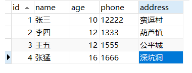
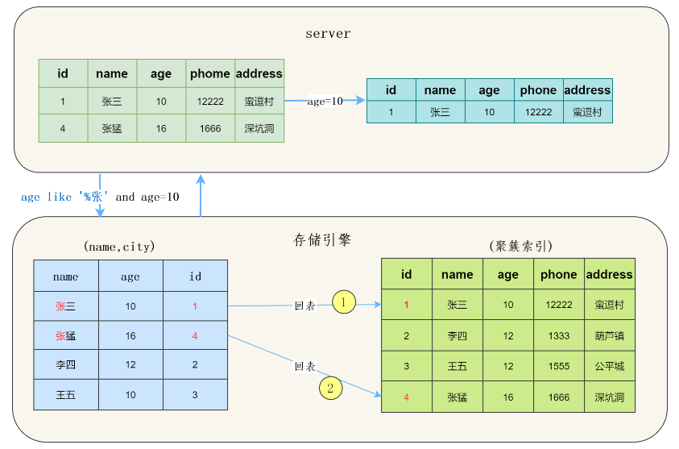
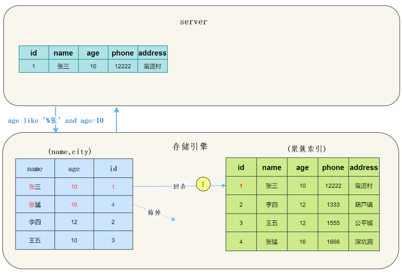

# 索引

索引（Index）是实现高效获取数据的有序**数据结构**。

- 优点
	- 提升了数据检索的效率。
	- 通过索引对数据排序，降低数据排序的成本。
- 缺点
	- 索引要占用空间。
	- 索引提高了查询效率，但降低了插入，更新，删除等操作的效率。
		- 需要同步维护索引
		- 实际场景中大部分操作都是查询。

## 索引结构

MySQL 的索引是在存储引擎层实现的，不同的存储引擎有不同的结构，主要包含以下几种:

- B+ Tree 索引 （InnoDB，MyISAM，Memory 都支持）

	最常见的索引类型，大部分引擎都支持 B+ 树索引。

- Hash 索引（只有 Memory 支持）

	哈希表实现，只有精确匹配索引列的查询才有效（精确查询），不支持范围查询。

- R-tree （空间索引）（只有 MyISAM 支持）

	是 MyISAM 引擎的一个特殊索引，主要用于地理空间类型数据。

- Full-text （全文索引）（InnoDB，MyISAM 支持）

	一种倒排索引，可以快速匹配文档，较少使用。

InnoDB 存储引擎有一个特殊的功能叫“自适应哈希索引”，当某个索引值被使用得非常频繁时，会在 B+Tree 索引之上再创建一个哈希索引，这样就让 B+Tree 索引具有哈希索引的一些优点，比如快速的哈希查找。·

## 索引分类

| 分类     | 含义                                     | 个数                     | 关键字   |      |      |
| -------- | ---------------------------------------- | ------------------------ | -------- | ---- | ---- |
| 主键索引 | 针对主键创建的索引。                     | 默认自动创建，只有一个。 | primary  |      |      |
| 唯一索引 | 避免同一表中某数据列重复。               | 可有多个。               | unique   |      |      |
| 常规索引 | 快速定位特定数据                         | 可有多个。               |          |      |      |
| 全文索引 | 查找文本中的关键字，不是比较索引中的值。 | 可有多个。               | fulltext |      |      |

在 InnoDB 中，根据索引的存储形式，又可以分为：

- 聚集索引

	将数据与索引放在一起，索引结构的**叶子结点**保存**行数据**（包括主键）。必须有，且只有一个（因为行数据只存放一份）。

	1. 如果存在主键，主键索引就是聚集索引。
	2. 如果没有主键，将使用第一个唯一索引（unique）作为聚集索引。
	3. 都没有，则 InnoDB 会自动生成一个 rowid 作为隐藏的聚集索引。

- 二级索引

  将数据与索引分开存储，索引结构的**叶子结点**存储关联的**主键**。可有多个。

**回表查询**：查询数据使用二级索引，得到主键后，还要查询聚集索引获得最终数据。

根据索引关联的数据列数，可以分为：

- 单列索引

	关联单列数据。

- 联合索引（组合索引）

	关联多列数据。

## 索引语句

- 创建索引

	`create [ unique | fulltext ] index index_name on table_name (index_col_name, ...);`

	- 单列索引（关联单列）
	- 联合索引（组合索引）（关联多列）

- 查看索引

	`show index from table_name;`

- 删除索引

	`drop index index_name on table_name;`

## 索引使用规则

考虑在各字段的 B+Tree 中的条件搜索方向和结果的扫描边界。

- 最左前缀法则

  对于使用联合索引的查询，其查询从左到右进行，一但出现某个字段的索引失效，则该字段及以后的索引列均失效。（创建联合索引时要考虑好字段顺序）（某索引列就是某字段）

- 范围查询

  - 联合查询中如果出现范围查询中的（`> < like 后缀匹配`），则范围查询语句右侧的索引列失效。（若是 `<= >=` （等值查询）则不会失效）

  - 模糊匹配

  	- 前缀模糊匹配（头部的值是模糊的），该索引列失效。

  	- 后缀模糊匹配有效，但会导致后面的索引列失效。（后缀模糊可能匹配多个值，该列不再是等值条件）

- 索引列运算

	若在索引列上进行运算操作，则该列索引失效，不会使用该列索引。

- 字符串引号

	字符串类型字段不加引号，其索引将失效。

- or 连接的条件

	or 涉及的列必须**都有**索引，否则涉及到的索引都失效。

- 数据分布影响

	如果 MySQL 评估使用索引比全表扫描更慢，则不使用索引。

- SQL 提示语句

	```sql
	use index   # 指定使用的索引（建议）
	
	ignore index   # 忽略某个索引
	
	force index   # 强制使用某索引
	
	select from tableName use index(index_name);   # 使用位置
	```

- 覆盖索引

  尽量让要查询的列在该索引中都能够找到，减少使用 `select *` ，以减少回表查询。（主键值一般在二级索引的叶结点中能够找到，所以 `select 主键, name, age;` 在联合索引`（name，age）`中不必回表查询）

- 前缀索引

  当字段类型为字符串（varchar，text 等），需要索引很长的字符串，会让索引变得很大，影响效率。此时可以只将字符串的一部分前缀建立索引。

  ```sql
  create index indexName on tableName(columnName(n));   # 取前 n 个字符建立索引。
  ```

- 索引顺序

	选择性强的索引列放在多个索引列的前面。

- 表的大小

	- 对于非常小的表、大部分情况下简单的全表扫描比建立索引更高效。
	- 对于中到大型的表，索引就非常有效。
	- 但是对于特大型的表，建立和维护索引的代价将会非常大，可以使用分区，分表技术。

### 联合索引有效性

在使用索引检索数据时：

1. 在 B+ 树中，索引键逐级排序，即对于联合索引（A，B），先按 A 排序，A 相等再按 B 排序（B 局部有序）。
2. 先在 B+ 树中找到数据的开始点，然后在索引中向后扫描，直到不符合条件。
3. 无法使用索引中的数据进行判定的条件，会在 server 层进行判定筛选。

#### 范围查询

假设对 A，B 字段有联合索引（A，B），则联合索引的键值是由 A，B 字段共同构成的。（默认键值升序排序）

##### 对于查询条件 `A > 1` ：

- 此时忽略 B 索引列的键值。
- 条件比较，查找深入。
- 能够定位到满足 A > 1 的一个叶结点 a（扫描边界），其它满足条件的结点在 a 的右侧连续出现（因为比较条件为 `>`，键值一般为升序 ），可以通过扫描并判断条件得到。

	- A 全局有序。

##### 对于查询条件 `A > 1 and B = 2` ：

**错误的**查询过程：

- 同时使用 A，B 索引列的键值。

- 条件比较，查找深入。

- 如果到达叶结点 b

	- b 满足 A > 1 and B = 2 （联合条件）。

	- 不能保证其它满足联合条件的结点在 b 的一侧连续出现。（b 不一定是扫描边界）

		- A 全局有序，但 B 局部有序，也就是说，在 A > 1 的区间内，满足 B = 2 的结点的位置不确定，不一定在边界上。
		- 对于`> <` 这两种范围查询条件，后面并列的无论是什么查询条件，都是局部有序的。

正确的查询过程：

- 主动忽略 B 索引列的键值（B 索引列失效，但在索引下推时仍会使用 B 索引列中的数据）

	在满足 A 的范围内，B 是局部有序的，不能用于 B+ 树二分查找。

- 条件比较，查找深入。

- 能够通过 A 定位到满足 A > 1 的叶结点 a 。（扫描边界）
	
- 扫描获取其它可能的结点
	
	- 在 MySQL 5.6 之前，扫描时的条件使用 A > 1，条件 B = 2 会在 server 层进行筛选。
	- 在 MySQL 5.6 及之后，扫描时的条件可以索引下推，使用 A > 1 and B = 2 。

##### 对于查询条件 `B = 2` ：

- 无法使用联合索引的 B 部分。

	B 是局部有序的，无法用于 B+ 树二分查找，此时需要遍历表。

##### 对于查询条件 `A >= 1 and B = 2` ：

- 可以同时使用联合索引的 A 和 B 。（A 含有等值查询，B 索引列有效）
- 条件比较，查找深入。
	- A > 1 的范围内，B 只是局部有序的。
	- A = 1 的范围内，B 是全局有序的。
	- 因为有 A = 1 的范围包含在查询条件中，所以 B 索引列可以用于索引二分查找。
- 能够通过（A, B）定位到满足条件的一个叶结点 x 。（扫描边界）
	- 满足 A = 1 的其它叶结点必定在 x 的一侧连续出现。
	- 满足 A > 1 的其它叶结点必定在 x 的一侧出现，不一定连续，需要持续扫描。
	- 条件中包含的 A = 1 使得索引能够明确扫描边界。
	- 即使满足 A = 1 的叶结点不存在，条件中包含的 A = 1 这个比较条件，仍然可以保证能定位到一个扫描边界。
- 扫描获取其它可能的结点
	- 在 MySQL 5.6 之前，扫描时的条件使用 A >= 1，条件 B = 2 会在 server 层进行筛选。
	- 在 MySQL 5.6 及之后，扫描时的条件可以索引下推，使用 A >= 1 and B = 2 。

##### between

MySQL 中 between 是左闭右闭区间。

有两个端点，可以分两次定位到两个扫描边界。

##### 模糊匹配 like

- 头部模糊匹配（头部的值是模糊的），该索引列失效。

- 尾部模糊匹配有效，但会导致后面的索引列失效。
	- 模糊匹配 `like('a%')` 同时满足（相当于相等）数据 `a1, a2, a3 ...` ，但可能 `a1` 对应 `b1`，`b3`（局部有序），`a2` 对应 `b2`，`b4`（局部有序），从而无法对 `b1, b3, b2, b4` 应用 B 索引。
	- 后缀模糊可能匹配多个值，该列不再是等值条件。


## 索引下推

（Index Condition Pushdown，ICP，索引条件下推）

ICP 是 MySQL5.6 版本开始的新特性，它将索引的条件从 server 层下推到引擎层，能减少回表查询次数，提高查询效率。

没有 ICP 时的查询：

1. 存储引擎检索索引；
2. 根据索引中的主键值，检索聚集索引并读取完整的行记录；（回表查询）
3. 存储引擎把记录交给 Server 层去检测该记录是否满足 WHERE 条件。（都在 server 层进行条件过滤）

有 ICP 时的查询：

1. 存储引擎检索索引；
2. 在检索索引的的过程中，使用索引中存储的字段值检查 WHERE 条件某些部分；（索引中，引擎层进行部分条件过滤）
3. 使用索引中的主键检索聚集索引并读取完整的行记录；（回表查询）（更少过滤后的记录数，更少次数的回表查询）
4. 存储引擎把记录交给 Server 层，Server 层检测该记录是否满足 WHERE 条件的其余部分。

使用限制：

- 只能用于 InnoDB 和 MyISAM 存储引擎及其分区表。

- 对 InnoDB 存储引擎来说，索引下推只适用于二级索引，不适用聚集索引

	索引下推是为了减少回表次数，而对于 InnoDB 的聚集索引，数据和主键在一起，不需要回表。

### 实例

假设有用户表`tuser`，表里有联合索引（name, age）：



考虑该语句：

```sql
select * from tuser where name like '张%' and age=10;
```

其中，模糊匹配导致了 age=10 索引失效。

#### 没有 ICP

在 MySQL 5.6 之前，存储引擎通过联合索引找到 `name like '张%'` 的主键id（1、4），逐一进行回表扫描，去聚簇索引找到完整的行记录，server 层再对数据根据 `age=10 进行筛选`：



其中，需要回表两次，age 索引列没有有效利用到。

#### 有 ICP

在 MySQL 5.6 及以后， 存储引擎根据（name，age）联合索引，找到`name like '张%'`，由于联合索引中包含`age`列，所以存储引擎直接再联合索引里按照`age=10`过滤。按照过滤后的数据再逐一进行回表扫描：



其中，只回表了一次。
