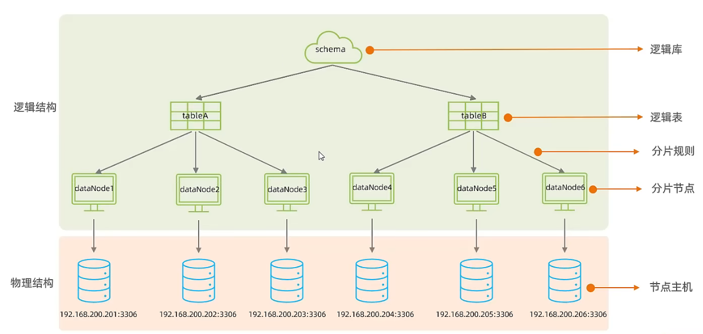

# Mycat

由阿里巴巴发起，基于 Java 编写的 MySQL 开源中间件，可以像使用 MySQL 一样使用 Mycat 。

[Mycat 项目及配置入门](https://github.com/MyCATApache/Mycat-Server)

[Mycat 详细文档](https://github.com/MyCATApache/Mycat-doc)

- 支持 Windows 和 Linux
- 需要安装
	- 中间件服务器：Mycat
	- 分片服务器：MySQL

## 核心概念



- 分片节点也叫数据节点。
- Mycat 不存储实际的数据，实际的数据存储在 MySQL 中。

## 基本指令

```shell
mycat start
mycat restart
mycat stop
# 默认占用端口号 8066
```

连接 Mycat（像连接 MySQL 一样）：

```shell
mysql -h <IP address> -P 8066 -u <user name> -p <password>
```

注意，即使是在本机也不能缺少 `-h` 参数。

## 配置文件

配置以下文件可实现分库分表和读写分离。

- 在`schema.xml` 文件中配置映射规则

	- 逻辑库（schema 标签）

	- 逻辑表（table 标签）

	- 数据节点（dataNode 标签）

	- 分片规则（rule 属性）（若表未被拆分，则 table 标签不添加 rule 属性，比如垂直分库时）

	- 节点主机（dataHost 标签）

- 在 `server.xml` 中配置用户及用户权限信息，需要配置用户访问逻辑库的权限。

- 在 `rule.xml` 配置分片规则。

配置表的同时要配置用户。

配置好表后，要在 Mycat 中用 SQL 语句创建逻辑表，从而各数据库的物理表也会被映射从而创建。

## 使用限制

[可参考文档](https://www.cnblogs.com/joylee/p/7513038.html)

- Mycat 配合数据库本身的复制功能，可以解决读写分离的问题，但是针对分库分表的问题，不是完美的解决。或者说，至今为止，业界没有完美的解决方案。
	
	- 分库分表写入能完美解决
	
	- 不能完美解决主要是**联表查询的问题**
	
		Mycat 支持两个表联表的查询，**多余两个表的查询不支持**。 其实，很多数据库中间件关于分库分表后查询的问题，都是需要自己实现的，而且基本都不支持联表查询，Mycat 已经算做地非常先进了。分库分表之后联表查询问题，可以通过合理数据库设计来避免。
	
- 全局表
	
	- 对于数据字典表（经常要访问到的用于解释表项意义的表，数据量小且无变动），最好在每个数据库中都存放，在 Mycat 中设置为**全局表**（`type=global`），以利于业务操作。
	- 注意，多表联查时，Mycat 只能把 SQL 语句路由到某一个分片（库），而不能同时路由到多个分片，所以就只能使用那个分片中的表，若分片中不存在该表，则查询失败。

## Mycat 管理

- Mycat 默认使用两个端口

	- 8066 数据访问端口，进行 DML 和 DDL 操作。

	- 9066 数据库管理端口，进行 Mycat 管理。

		```shell
		mysql -h <host> -P 9066 -u <user> -p <password>
		```

连接上 Mycat 9066 端口后，可使用 Mycat 管理命令：

| 命令 | 含义 |
| ---- | ---- |
| show @@help | 查看 Mycat 管理工具帮助文档 |
| show @@version | 查看 Mycat 的版本 |
| reload @@config | 重新加载 Mycat 的配置文件 |
| show @@datasource | 查看 Mycat 的数据源信息 |
| show @@datanode | 查看 MyCat 现有的分片节点信息 |
| show @@threadpool | 查看 Mycat 的线程池信息 |
| show @@sql | 查看执行的 SQL |
| show @@sql.sum | 查看执行的 SQL 统计 |

- Mycat-eye

	一款 Mycat 图形管理与监控工具，也可直接用于 MySQL 。

## 常见分片规则

- 范围

	某个范围的数据落入某一个分片中。

- 取余

	依取余结果落入某一个分片。

- 哈希

	字符串等不能计算的字段值，可以用计算哈希值，然后根据哈希值落入某一分片。

- 枚举

	按照某一字段的值落入某一分片。

- 应用指定

	按照某一字段的字符串子串（必须是数字）的表示落入某一个分片。（如 “01234123” 前两位为 ”01“，则落入 1 号分片）

- 固定分片哈希

	用位与运算取数字字段的二进制低位，然后按十进制解读为下标，依据一个数组（该数组内部为多个分片号，可重复）中的内容落入分片。（类似于依据解读出的下标大小范围分片）

- 字符串哈希解析

	截取指定字段的子字符串，进行 hash，从而得出分片。

- 按天分片（日期）

- 按自然月分片（日期）