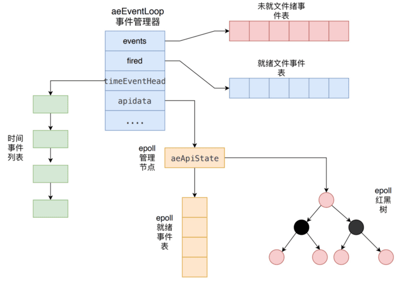
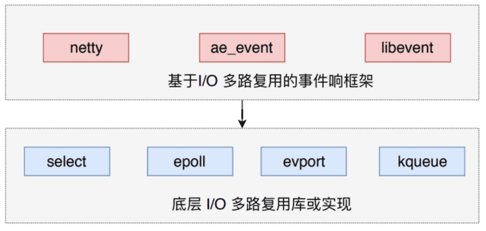
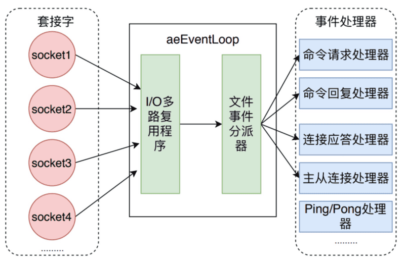
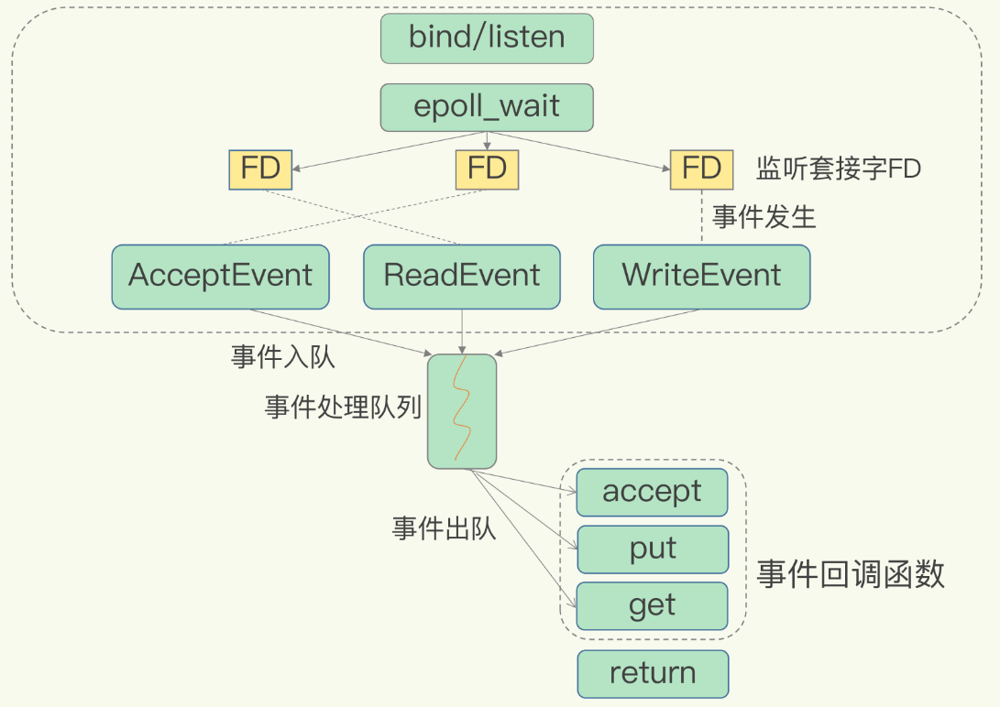
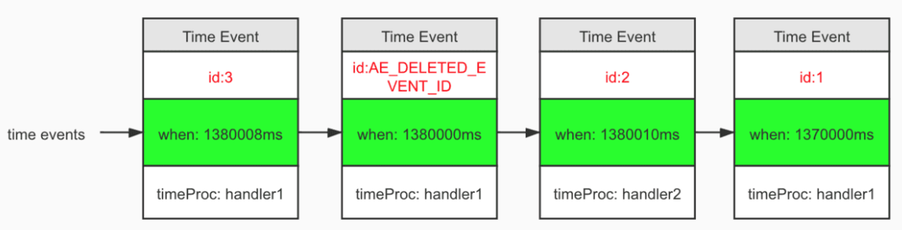

# Redis 事件机制

Redis 中的事件驱动库只关注网络 IO，以及定时器，这对应以下两类事件：

- 文件事件（file event）

	用于处理 Redis 服务器和客户端之间的网络 IO（Socket 连接）。

- 时间事件（time event）

	Redis 服务器中的一些操作（比如 serverCron 函数）需要在给定的时间点执行，而时间事件就是处理这类定时操作的。

serverCron 函数用于：

- 更新服务器的各类统计信息；
- 清理数据库中的过期键值对，这个可以具体分为惰性删除和定时删除；
- 关闭和清理连接失效的客户端，为了不浪费内存资源；
- 尝试进行AOF或RDB持久化操作；
- 同步数据。如果服务器是主服务器，还需要对从服务器进行定期同步；
- 心跳检测。如果处于集群模式，对集群进行定期同步和连接测试；

`aeEventLoop` 是整个事件驱动的核心，它管理着文件事件表和时间事件表，不断循环处理着就绪的文件事件和到期的时间事件：

## 文件事件

Redis 基于 **Reactor 模式**（反应器设计模式）开发了自己的网络事件处理器，也就是文件事件处理器。

文件事件处理器使用 **IO多路复用技术**，同时监听多个套接字，并为套接字关联不同的事件处理函数，当套接字的可读或者可写事件触发时，就会调用相应的事件处理函数。

### 事件响应框架 ae_event

Redis 采用事件驱动机制来处理大量的网络 IO，它并没有使用 libevent 或者 libev 这样的成熟开源方案，而是自己实现一个非常简洁的事件驱动库 ae_event 。其中，aeEventLoop 是事件响应的核心组件。

Redis 使用的 IO 多路复用技术主要有：`select`、`epoll`、`evport`和`kqueue`等。

Redis 会根据不同的操作系统，按照不同的优先级选择多路复用技术。事件响应框架一般都采用这种方式，比如 netty 和 libevent 。

### 文件事件处理器

文件事件处理器有四个组成部分：

- 套接字

	文件事件是对套接字操作的抽象。

	- 每当一个套接字准备好执行 `accept`、`read`、`write`和 `close` 等操作时，就会产生一个文件事件。
	- 因为 Redis 通常会连接多个套接字，所以多个文件事件有可能并发的出现。

- I/O多路复用程序

	负责监听多个套接字，并向文件事件派发器传递那些产生了事件的套接字。

	- 尽管多个文件事件可能会并发地出现，但I/O多路复用程序总是会将所有产生的套接字都放到同一个队列(也就是后文中描述的aeEventLoop的fired就绪事件表)里边。
	- 文件事件处理器会以有序、同步、单个套接字的方式处理该队列中的套接字，也就是处理就绪的文件事件。

- 文件事件分派器

- 事件处理器

### Redis IO 多路复用模型

在 Redis 只运行单线程的情况下，**该机制允许内核中，同时存在多个监听套接字和已连接套接字**。内核会一直监听这些套接字上的连接请求或数据请求。一旦有请求到达，就会交给 Redis 线程处理，这就实现了一个 Redis 线程处理多个 IO 流的效果。

下图就是基于多路复用的 Redis IO 模型。图中的多个 FD 就是刚才所说的多个套接字。

Redis 网络框架调用 epoll 机制，让内核监听这些套接字。

**此时，Redis 线程不会阻塞在某一个特定的监听或已连接套接字上，也就是说，不会阻塞在某一个特定的客户端请求处理上。正因为此，Redis 可以同时和多个客户端连接并处理请求，从而提升并发性。**

基于多路复用的 Redis 高性能 IO 模型为了在请求到达时能通知到 Redis 线程，select/epoll 提供了基于事件的回调机制，即针对不同事件的发生，调用相应的处理函数。

回调机制中，select/epoll 一旦监测到 FD 上有请求到达时，就会将触发的相应的事件放进一个事件队列：

- Redis 对该事件队列不断进行处理（虽然是单线程），从而无需一直轮询是否有请求实际发生，这就可以避免造成 CPU 资源浪费。
- 同时，因为 Redis 一直在对事件队列进行处理，所以能及时响应客户端请求，提升 Redis 的响应性能。

### 单线程的 Redis 为什么那么快？

- Redis 采用了多路复用机制使其在网络 IO 操作中能并发处理大量的客户端请求，实现高吞吐率。
	- Redis的瓶颈主要在IO而不是CPU，所以为了省开发量，在6.0版本前是单线程模型；
	- Redis 是单线程主要是指 **Redis 的网络 IO 和键值对读写是由一个线程来完成的**，这也是 Redis 对外提供键值存储服务的主要流程。
	- 但 Redis 的其他功能，比如持久化、异步删除、集群数据同步等，是由额外的线程执行。
- Redis 只需不断调用事件队列中的事件的相应的处理函数， 而无需阻塞在事件监听上。（由 Linux 内核监听请求，而不是 Redis 轮询监听请求）
- Redis 基于 C/C++ 编写。
- Redis 对数据结构的使用方式做了大量优化，比如根据不同数据规模自动切换底层数据结构。

## 时间事件

Redis 的时间事件分为两类：

- 定时事件

	让一段程序在指定的时间之后执行一次。

- 周期性事件

	让一段程序每隔指定时间就执行一次。

一个时间事件到达时会由**时间处理器（timeProc）**处理：

- 定时事件到达后就会被删除。
- 周期性事件到达后，事件处理器会对时间事件的 when 属性进行更新，让这个事件在 whne 时间后再次到达

服务器所有的时间事件都放在一个无序链表中，每当时间事件执行器运行时，它就遍历整个链表，查找所有已到达的时间事件，并调用相应的事件处理器。

正常模式下的 Redis 服务器只使用 serverCron 一个时间事件，而在 benchmark 模式下，服务器也只使用两个时间事件，所以不影响事件执行的性能。