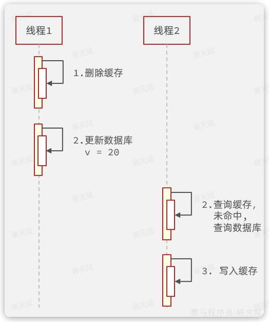
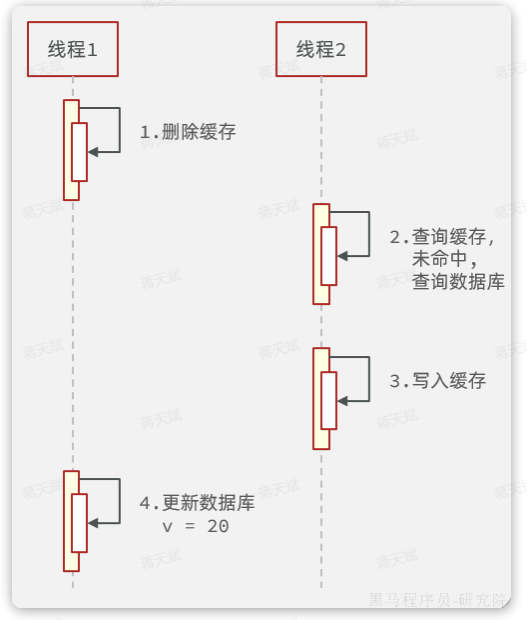
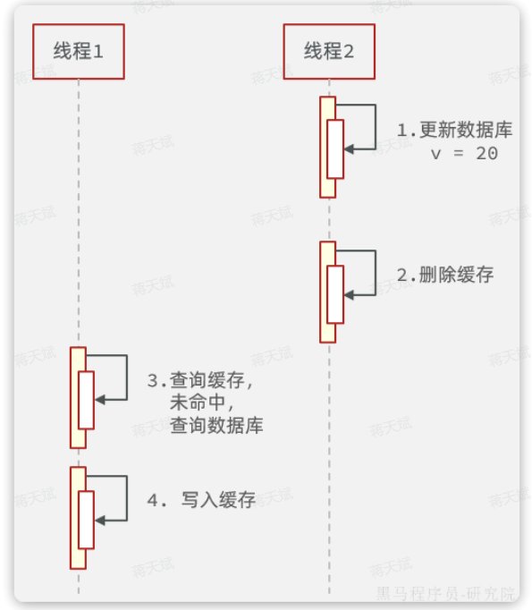
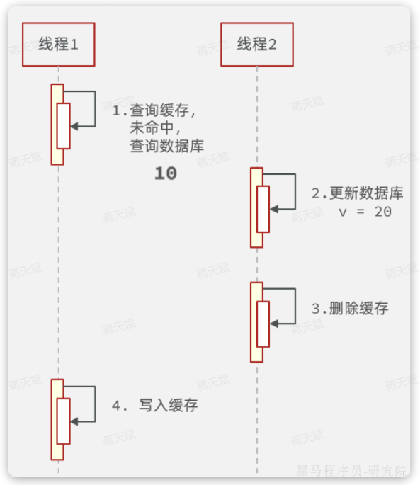
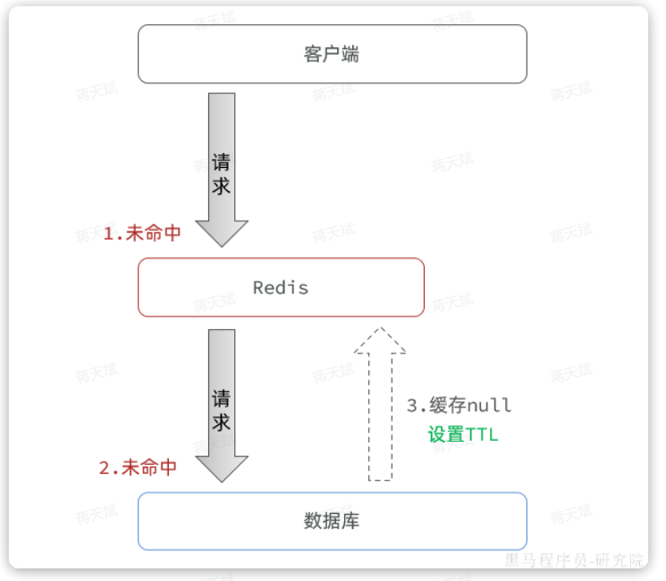
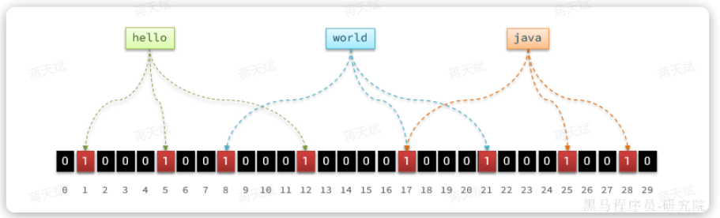
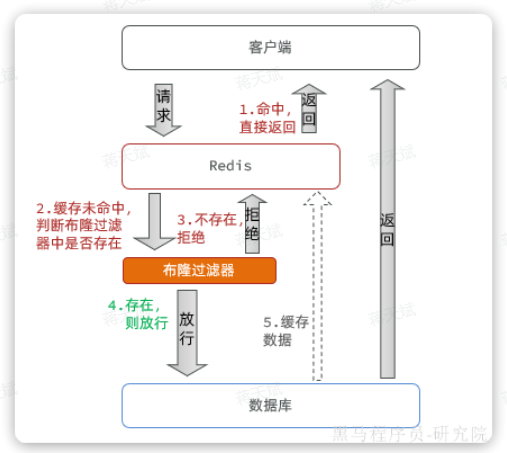
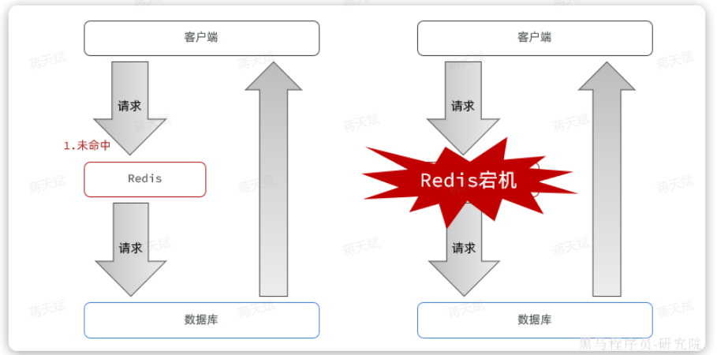
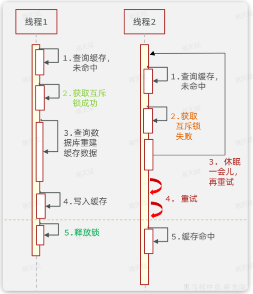
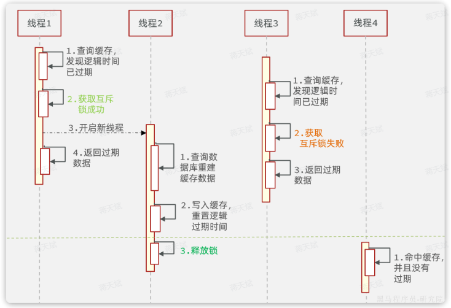

# Redis

## 基本概念

Redis 是一个基于**内存**的 key-value 结构数据库（C 语言开发）。

Redis 是互联网技术领域使用最为广泛的**存储中间件**。

特点：

- 基于内存存储，读写性能高  
- 适合存储热点数据（热点商品、资讯、新闻）
- 企业应用广泛

用途：

- 当数据只有一个字段或非常少的数据时，用一张表存储意义不大，可以考虑用 redis 存储。
- 高访问的微量数据。
- 存储某些全局变量。

### 对比

- 全局变量

	本地缓存，存储在内存或本地文件中。

	- 本地缓存依赖本地机器，当一个服务部署了多份，本地缓存就不太适用了。

	- 本地缓存比 redis 性能更好，实际开发中会两者结合使用。

- redis

	分布式缓存。

	- 提供持久化、发布、订阅、事务性操作等，在分布式场景下具有优异表现。
	- 可跨越不同进程、服务器和编程语言进行数据共享。
	- 需要网络通信和序列化、反序列化等额外开销。（缺点）

## 启动服务

- Redis 服务默认端口号为 **6379** 。
- Ctrl + C 可停止 Redis 服务。

```shell
# windows

# 启动 redis 服务
.\redis-server.exe redis.windows.conf

# 建立客户端，连接 redis 服务
.\redis-cli.exe
# 进一步可使用参数：
-h ip地址
-p 端口号
-a 密码（如果需要）
```

设置密码：

1. 修改配置文件，添加 `requirepass 123456` 。

2. 修改后服务端仍可无密码启动。

3. 客户端如果不带密码，仍然可以进入，但无法执行指令。

	可用指令 `keys *` 测试，会提示 `(error) NOAUTH Authentication required.` 。

## 数据类型

Redis 存储的 key-value 结构的数据。

其中：

- key 只能是字符串类型。
- value 有 5 种常用数据类型
	- value 在 redis 内部序列化后存储。
	- 在 redis 内部查询出的 value 是序列化后的结果。
	- 从 redis 取出 value 后，要进行反序列化（即类型转换）。

value 有以下类型：

- 字符串 string

	普通字符串，Redis中最简单的数据类型。

- 哈希 hash

	也叫散列，一个哈希表，类似于 Java 的 HashMap 结构。

- 列表 list

	按照插入顺序排序，可以有重复元素，类似于 Java 的 LinkedList 。

- 集合 set

	无序集合，没有重复元素，类似于 Java 的 HashSet 。

- 有序集合 sorted set / zset

	集合中每个元素关联一个分数(score)，根据分数升序排序，没有重复元素。

 

## 控制台命令和数据类型操作

可在 `redis-cli`（redis 客户端）中使用。

### 字符串操作

Redis 中字符串类型常用命令：

- **SET** key value 			    设置指定key的值
- **GET** key                                        获取指定key的值
- **SETEX** key seconds value         设置指定key的值，并将 key 的过期时间设为 seconds 秒
- **SETNX** key value                        只有在 key 不存在时设置 key 的值

### 哈希操作

Redis hash 是一个string类型的 field 和 value 的映射表，hash特别适合用于存储对象，常用命令：

- **HSET** key field value             将哈希表 key 中的字段 field 的值设为 value
- **HGET** key field                       获取存储在哈希表中指定字段的值
- **HDEL** key field                       删除存储在哈希表中的指定字段
- **HKEYS** key                              获取哈希表中所有字段
- **HVALS** key                              获取哈希表中所有值

 

### 列表操作

Redis 列表是简单的字符串列表，按照插入顺序排序，常用命令：

- **LPUSH** key value1 [value2]         将一个或多个值插入到列表头部
- **LRANGE** key start stop                获取列表指定范围内的元素
- **RPOP** key                                       移除并获取列表最后一个元素
- **LLEN** key                                        获取列表长度
- **BRPOP** key1 [key2 ] timeout       移出并获取列表的最后一个元素， 如果列表没有元素会阻塞列表直到等待超时或发现可弹出元素为止

 

### 集合操作

Redis set 是string类型的无序集合。集合成员是唯一的，这就意味着集合中不能出现重复的数据，常用命令：

- **SADD** key member1 [member2]            向集合添加一个或多个成员
- **SMEMBERS** key                                         返回集合中的所有成员
- **SCARD** key                                                  获取集合的成员数
- **SINTER** key1 [key2]                                   返回给定所有集合的交集
- **SUNION** key1 [key2]                                 返回所有给定集合的并集
- **SREM** key member1 [member2]            移除集合中一个或多个成员

 

### 有序集合操作

Redis有序集合是string类型元素的集合，且不允许有重复成员。每个元素都会关联一个double类型的分数。常用命令：

常用命令：

- **ZADD** key score1 member1 [score2 member2]     向有序集合添加一个或多个成员
- **ZRANGE** key start stop [WITHSCORES]                     通过索引区间返回有序集合中指定区间内的成员
- **ZINCRBY** key increment member                              有序集合中对指定成员的分数加上增量 increment
- **ZREM** key member [member ...]                                移除有序集合中的一个或多个成员

 

### 通用命令

Redis 的通用命令是不分数据类型的，都可以使用的命令：

- KEYS pattern 		查找所有符合给定模式( pattern)的 key 
- EXISTS key 		检查给定 key 是否存在
- TYPE key 		返回 key 所储存的值的类型
- DEL key 		该命令用于在 key 存在是删除 key

## 数据结构

常用的Redis数据类型有5种，分别是：

- String
- List
- Set
- SortedSet
- Hash

还有一些高级数据类型，比如 Bitmap、HyperLogLog、GEO 等，其底层都是基于上述5种基本数据类型，因此在 Redis 的源码中，其实只有5种数据类型。

### RedisObject

redis 中任何一种数据类型（key 或 value），最终都会封装为 RedisObject 格式，它是一种 C 语言结构体。


其中，仅仅是这些对象头信息，内存占用的大小为4+4+24+32+64 = 128bit，也就是16字节。

所以 RedisObject 的内存开销较大，需要在使用时选择合适的数据结构存储，以节约存储对象头的空间。

属性中的 `encoding` 表示当前对象底层采用的**数据结构**或**编码方式**，有11种：

| **编号** | **编码方式**            | **说明**               |
| :------- | :---------------------- | :--------------------- |
| 0        | OBJ_ENCODING_RAW        | raw编码动态字符串      |
| 1        | OBJ_ENCODING_INT        | long类型的整数的字符串 |
| 2        | OBJ_ENCODING_HT         | hash表（也叫dict）     |
| 3        | OBJ_ENCODING_ZIPMAP     | 已废弃                 |
| 4        | OBJ_ENCODING_LINKEDLIST | 双端链表               |
| 5        | OBJ_ENCODING_ZIPLIST    | 压缩列表               |
| 6        | OBJ_ENCODING_INTSET     | 整数集合               |
| 7        | OBJ_ENCODING_SKIPLIST   | 跳表                   |
| 8        | OBJ_ENCODING_EMBSTR     | embstr编码的动态字符串 |
| 9        | OBJ_ENCODING_QUICKLIST  | 快速列表               |
| 10       | OBJ_ENCODING_STREAM     | Stream流               |
| 11       | OBJ_ENCODING_LISTPACK   | 紧凑列表               |

Redis 中 5 种不同的数据类型采用的底层数据结构和编码方式如下：

| **数据类型** | **编码方式**                                                 |
| :----------- | :----------------------------------------------------------- |
| STRING       | `int`、`embstr`、`raw`                                       |
| LIST         | `LinkedList和ZipList`(3.2以前)、`QuickList`（3.2以后）       |
| SET          | `intset`、`HT`                                               |
| ZSET         | `ZipList`（7.0以前）、`Listpack`（7.0以后）、`HT`、`SkipList` |
| HASH         | `ZipList`（7.0以前）、`Listpack`（7.0以后）、`HT`            |

其中，一般数据量少是某数据类型会采用一个编码方式，数据量超过阈值后，会更换另一个编码方式。

### SkipList

SkipList（跳表）首先是双端链表，然后有特点：

- 元素按照升序排列存储。
- 节点可能包含多个指针，指针跨度不同。（一般采用二分跨度）

SkipList 内部包含跨度不同的多级指针，可以跳跃查找链表中间的元素，查找效率高。

假设要找值为 14 的元素：


跳表的结构体如下：

```C
typedef struct zskiplist {
    // 头尾节点指针
    struct zskiplistNode *header, *tail;
    // 节点数量
    unsigned long length;
    // 最大的索引层级
    int level;
} zskiplist;
```

可以看到SkipList主要属性是header和tail，也就是头尾指针，因此它是支持双向遍历的。

跳表中节点的结构体如下：

```C
typedef struct zskiplistNode {
    sds ele; // 节点存储的字符串
    double score;// 节点分数，排序、查找用
    struct zskiplistNode *backward; // 前一个节点指针
    struct zskiplistLevel {
        struct zskiplistNode *forward; // 下一个节点指针
        unsigned long span; // 索引跨度
    } level[]; // 多级索引数组
} zskiplistNode;
```

每个节点中都包含ele和score两个属性，其中score是得分，也就是节点排序的依据。ele则是节点存储的字符串数据指针。

内存结构如下：


### SortedSet

SortedSet 是有序集合，存储的每个数据都包含：

- element

	字符串值，可以根据 element 查询对应的 score 值，基于 HashTable 实现。

- score

	得分，SortedSet 会根据每个 element 的 score 值排序，并支持 score 的查找，基于 SkipList 实现。

Redis 源码中`zset`，也就是 `SortedSet` 的结构体如下：

```C
typedef struct zset {
    dict *dict; // dict，底层是 HashTable
    zskiplist *zsl; // 跳表
} zset;
```

内存结构如下：


## 内存回收

当内存达到上限，就无法存储更多数据了。

Redis 内部有两套内存回收的策略：

- 内存过期策略
- 内存淘汰策略

### 内存过期

存入 Redis 的数据可以配置过期时间（TTL），到期后会被清理。

Redis 的所有数据类型的键值映射底层都基于 HashTable 实现，在 Redis 中也叫做 Dict 。

Redis 的一个逻辑数据库定义如下：

```C
typedef struct redisDb {
    dict dict;                 / The keyspace for this DB , 也就是存放KEY和VALUE的哈希表*/
    dict *expires;              /* 同样是哈希表，但保存的是设置了TTL的KEY，及其到期时间*/
    dict *blocking_keys;        /* Keys with clients waiting for data (BLPOP)*/
    dict *ready_keys;           /* Blocked keys that received a PUSH */
    dict *watched_keys;         /* WATCHED keys for MULTI/EXEC CAS /
    int id;                     / Database ID, 0 ~ 15 /
    long long avg_ttl;          / Average TTL, just for stats /
    unsigned long expires_cursor; / Cursor of the active expire cycle. */
    list *defrag_later;         /* List of key names to attempt to defrag one by one, gradually. */
} redisDb;
```

其中，有两个 HashTable ：

- `dict`

	记录 key-value 键值对。（key 和 value 分别是一个 RedisObject ）

- `*expires`

	记录设置了过期时间的 key ，键值对为 key-TTL 。

	- 判断 KEY 是否过期查询 expires 的 dict 即可。

redis 不会在 key 过期后立刻删除 key，那样会给 CPU 非常大的负担。

redis 有两种策略删除过期的 KEY ：

- 惰性删除

	在每次访问KEY的时候判断当前KEY有没有设置过期时间，如果有，判断过期时间是否已经到期。

- 周期删除

	通过一个定时任务，周期性的抽样部分过期的key，然后执行删除。（可以删除一些一直没有被访问的 key）

	- SLOW模式

		Redis会设置一个定时任务`serverCron()`，按照`server.hz`的频率来执行过期key清理。

		- 执行频率受`server.hz`影响，默认为每秒执行10次，每个执行周期100ms。
		- 执行清理耗时不超过一次执行周期的25%，即25ms.
		- 逐个遍历db，逐个遍历db中的bucket，抽取20个key判断是否过期
		- 如果没达到时间上限（25ms）并且过期key比例大于10%，再进行一次抽样，否则结束

	- FAST模式

		Redis的每个事件循环前执行过期key清理（事件循环就是NIO事件处理的循环）。

		- 执行频率受`beforeSleep()`调用频率影响，但两次FAST模式间隔不低于2ms
		- 执行清理耗时不超过1ms
		- 逐个遍历db，逐个遍历db中的bucket，抽取20个key判断是否过期
		- 如果没达到时间上限（1ms）并且过期key比例大于10%，再进行一次抽样，否则结束

### 内存淘汰

对于某些特别依赖于 Redis 的项目而言，仅仅依靠过期 KEY 清理是不够的，内存可能很快就达到上限。

因此Redis允许设置内存告警阈值，当内存使用达到阈值时就会主动挑选部分KEY删除以释放更多内存。

Redis 在每次执行任何命令时，都会判断内存是否达到阈值：

```C
// server.c中处理命令的部分源码
int processCommand(client *c) {
    // ... 略
    if (server.maxmemory && !server.lua_timedout) {
        // 调用performEvictions()方法尝试进行内存淘汰
        int out_of_memory = (performEvictions() == EVICT_FAIL);
        // ... 略
        if (out_of_memory && reject_cmd_on_oom) {
            // 如果内存依然不足，直接拒绝命令
            rejectCommand(c, shared.oomerr);
            return C_OK;
        }
    }
}
```

选择淘汰的 key 时，redis 支持 8 种不同的内存淘汰策略：

- `noeviction`： 不淘汰任何key，但是内存满时不允许写入新数据。（默认策略）
- `volatile-ttl`： 对设置了TTL的key，比较key的剩余TTL值，TTL越小越先被淘汰（即使 TTL 没有到期也要淘汰）。
- `allkeys-random`：对全体key ，随机进行淘汰。也就是直接从db->dict中随机挑选
- `volatile-random`：对设置了TTL的key ，随机进行淘汰。也就是从db->expires中随机挑选。
- `allkeys-lru`： 对全体key，基于LRU算法进行淘汰
- `volatile-lru`： 对设置了TTL的key，基于LRU算法进行淘汰
- `allkeys-lfu`： 对全体key，基于LFU算法进行淘汰
- `volatile-lfu`： 对设置了TTL的key，基于LFU算法进行淘汰

其中：

- **LRU**（**L**east **R**ecenty **U**sed），最近最久未使用

	用当前时间减去最后一次访问时间，这个值越大则淘汰优先级越高。

- **LFU**（**L**east **F**requently **U**sed），最近最少频率使用

	会统计每个key的访问频率，值越小淘汰优先级越高。

##### LFU 计算原理

RedisObject 中的`lru` 属性就是用来记录最近一次访问时间和访问频率。

- **LRU**：以秒为单位记录最近一次访问时间，长度24bit
- **LFU**：高16位以分钟为单位记录最近一次访问时间，低8位记录逻辑访问次数。

逻辑访问次数的计算如下：

- ① 生成`[0,1)`之间的随机数`R`，作为逻辑次数 `+1` 的概率阈值。
- ② 计算 `1/(旧次数 * lfu_log_factor + 1)`，记录为`P`， `lfu_log_factor`默认为10
- ③ 如果 `R` < `P `，则计数器 `+1`，且最大不超过255。（比较阈值）
- ④ 访问次数会随时间衰减，距离上一次访问时间每隔 `lfu_decay_time` 分钟(默认1) ，计数器`-1` 。

LFU 的基于访问频率的统计更先进，因此官方推荐使用 LFU 算法。

##### LFU 抽样法

Redis 中的`KEY`可能有数百万甚至更多，每个KEY都有自己访问时间或者逻辑访问次数。

Redis 的内存淘汰是在每次执行命令时处理的，要找出时间最早的或者访问次数最小的，不可能每次执行命令都先对全量数据做内存排序。

Redis 采用抽样法，每次抽样一定数量（`maxmemory_smples`）的key，然后基于内存策略做排序，找出淘汰优先级最高的，删除这个key。所以 Redis 的算法并不是真正的**LRU**，而是一种基于抽样的**近似LRU算法**。

## 缓存问题

### 缓存一致性

缓存的通用模型有三种：

- `Cache Aside`

	由缓存调用者自己维护数据库与缓存的一致性。

	- 查询时：命中则直接返回，未命中则查询数据库并写入缓存。
	- 更新时（增删改）：更新数据库并删除缓存（直接删除更快更简单），查询时自然会更新缓存（相当于延迟更新缓存）。

- `Read/Write Through`

	数据库自己维护一份缓存，底层实现对调用者透明。

	- 查询时：命中则直接返回，未命中则查询数据库并写入缓存
	- 更新时（增删改）：判断缓存是否存在，不存在直接更新数据库。存在则更新缓存，同步更新数据库

- `Write Behind Cahing`

	读写操作都直接操作缓存，由线程异步的将缓存数据同步到数据库。

目前企业中使用最多的就是`Cache Aside`模式，因为实现起来非常简单。但缺点也很明显，就是无法保证数据库与缓存的强一致性。

Cache Aside 模式更新时，应该先更新数据库再删除缓存，还是先删除缓存再更新数据库呢？

#### 策略 1 先删除缓存再更新数据库

正常情况：



异常情况：



异常情况说明：

- 线程1删除缓存后，还没来得及更新数据库。
- 此时线程2来查询，发现缓存未命中，于是查询数据库，写入缓存。由于此时数据库尚未更新，查询的是旧数据。也就是说刚才的删除白删了，缓存又变成旧数据了。
- 然后线程1更新数据库，此时数据库是新数据，缓存是旧数据

由于更新数据库的操作本身比较耗时，在期间有线程来查询数据库并更新缓存的概率非常高，因此不推荐这种方案。

#### 策略 2 先更新数据库再删除缓存

正常情况：



异常情况：



异常情况说明：

- 线程1查询缓存未命中，于是去查询数据库，查询到旧数据
- 线程1将数据写入缓存之前，线程2来了，更新数据库，删除缓存
- 线程1执行写入缓存的操作，写入旧数据

可以发现，这种策略下异常状态发生的概率极为苛刻，在线程1 查询数据库已经完成，但是缓存尚未写入之间，线程2 必须要完成更新数据库和删除缓存的两个操作。要知道线程1执行写缓存的速度在毫秒之间，速度非常快，在这么短的时间要完成数据库和缓存的操作，概率非常之低。

同时我们还要给缓存加上过期时间，一旦发生缓存不一致，当缓存过期后会重新加载，数据最终还是能保证一致，这就可以作为一个兜底方案。

### 缓存穿透

如果访问数据库中不存在的数据，缓存中肯定也不存在，因此不管请求该数据多少次，缓存永远不可能建立，请求永远会直达数据库。

如果有人开启很多线程频繁的访问一个数据库中不存在的数据，由于缓存不可能生效，那么所有的请求都访问数据库，可能就会导致数据库因过高的压力而宕机。

解决这个问题有两种思路：

- 缓存空值
- 布隆过滤器

#### 缓存空值

当发现请求的数据不存在于缓存，也不存在与数据库时，将空值（null）缓存到 Redis（为不存在的 key 建立缓存），避免频繁查询数据库。



其中，还会设置一个较小的 TTL ，防止不存在的 key 过多，占用过多内存。

- 优点：实现简单，维护方便
- 缺点：额外的内存消耗

#### 布隆过滤器

布隆过滤是一种数据统计的算法，用于判断一个元素是否存在一个集合中。

一般的将元素存储在数据结构中的判断方法可能在大数据量下占用大量内存，布隆过滤器可以用较低的内存消耗，判断大量元素中一个元素的存在性。

布隆过滤算法如下：

1. 设置一个很长的 bit 数组，默认数组中每一位都是 0 。
2. 还需要`K`个`hash`函数，将一个元素通过这些 hash 函数的结果作为下标，将 bit 数组中这些下标的位置置为 1。
3. 要判断元素是否存在，只需要再次基于`K`个`hash`函数做运算， 得到`K`个下标，判断每个下标的位置是不是1：
	- 只要全是 1，说明元素大概率存在。（概率依哈希算法和 bit 数组长度而定）
		- 假如某个元素本身并不存在，也没添加到布隆过滤器，但是由于存在 hash 碰撞的可能性，这就会出现这个元素计算出的下标已经被其它元素置为1的情况，那么这个元素会被误判为已经存在。（误判概率很小，可以大幅降低数据库压力）
	- 任意位置为 0，就证明元素一定不存在。



可以把数据库中的数据：

1. 利用布隆过滤器进行标记。
2. 当用户请求缓存未命中时，先基于布隆过滤器判断。
3. 如果不存在则直接拒绝请求。
4. 存在则去查询数据库。



### 缓存雪崩

缓存雪崩指在同一时段大量的缓存 key 同时失效或者 Redis 服务宕机，导致大量请求到达数据库，带来巨大压力。



常见的解决方案有：

- 给不同的Key的TTL添加随机值，这样KEY的过期时间不同，不会大量KEY同时过期。
- 利用Redis集群提高服务的可用性，避免缓存服务宕机。
- 给缓存业务添加降级限流策略，及时限流熔断。
- 给业务添加多级缓存，比如先查询本地缓存，本地缓存未命中再查询Redis，Redis未命中再查询数据库。即便Redis宕机，也还有本地缓存可以抗压力。

### 缓存击穿

**缓存击穿**问题也叫**热点Key**问题，就是一个被**高并发访问**并且**缓存重建较复杂**的 key 突然失效了，无数的请求访问会在瞬间给数据库带来巨大的冲击。

重建复杂的 key 可能需要复杂的数据库查询以及运算。

当某个重建复杂的热点 key 在并发访问量比较高时突然失效，就会在一瞬间涌入大量请求，都发现缓存未命中，于是都会去查询数据库，尝试重建缓存（重建较复杂，耗时较久），可能一瞬间就把数据库压垮了。

常见的解决方案有两种：

- 互斥锁
- 逻辑过期

#### 互斥锁

对重建复杂的 key 的缓存逻辑加锁，避免多线程同时重建一个热点 key 。



其中，线程 1 获取到互斥锁后，在释放锁之前（重建 key 完成前），其它线程都获取互斥锁失败，并且不断阻塞重试。

- 优点
	- 没有额外的内存消耗
	- 保证一致性
	- 实现简单
- 缺点：
	- 线程需要等待，性能受影响。
	- 可能有死锁风险。

#### 逻辑过期

对热点 key 不设置过期时间，而是给数据添加一个过期时间的字段：

- 查询到数据时基于其中的过期时间判断key是否过期，如果过期开启独立新线程异步地重建缓存，而查询请求先返回旧数据即可。
- 这个重建缓存过程要加互斥锁，但由于是异步的，而且获取锁失败无需等待直接返回旧数据，这样性能几乎不受影响。
- 在活动结束后手动删除热点 key 。



其中：

- 线程 1 发现逻辑时间已过期
	- 于是获取互斥锁（也要加互斥锁）
	- 开启新线程 2 专门负责重建缓存。
	- 线程 1 直接返回旧的数据。
- 线程 3 在线程 2 重建缓存期间，获取锁失败则也直接返回旧的数据。
- 直到重建缓存完毕，释放锁，才返回新的数据。

整个过程中，只有一个线程重建缓存。

- 优点
	- 线程无需等待，性能较好。
- 缺点
	- 不保证一致性。（重建缓存期间不一致）
	- 有额外内存消耗。
	- 实现复杂。
