# Redis

## 基本概念

Redis 是一个基于**内存**的 key-value 结构数据库（C 语言开发）。

Redis 是互联网技术领域使用最为广泛的**存储中间件**。

特点：

- 基于内存存储，读写性能高  
- 适合存储热点数据（热点商品、资讯、新闻）
- 企业应用广泛

用途：

- 当数据只有一个字段或非常少的数据时，用一张表存储意义不大，可以考虑用 redis 存储。
- 高访问的微量数据。
- 存储某些全局变量。

### 对比

- 全局变量

	本地缓存，存储在内存或本地文件中。

	- 本地缓存依赖本地机器，当一个服务部署了多份，本地缓存就不太适用了。

	- 本地缓存比 redis 性能更好，实际开发中会两者结合使用。

- redis

	分布式缓存。

	- 提供持久化、发布、订阅、事务性操作等，在分布式场景下具有优异表现。
	- 可跨越不同进程、服务器和编程语言进行数据共享。
	- 需要网络通信和序列化、反序列化等额外开销。（缺点）

## 启动服务

- Redis 服务默认端口号为 **6379** 。
- Ctrl + C 可停止 Redis 服务。

```shell
# windows

# redis 目录下

# 启动 redis 服务
.\redis-server.exe redis.windows.conf

# 建立客户端，连接 redis 服务
.\redis-cli.exe
# 进一步可使用参数：
-h ip地址
-p 端口号
-a 密码（如果需要）
```

设置密码：

1. 修改配置文件，添加 `requirepass 123456` 。

2. 修改后服务端仍可无密码启动。

3. 客户端如果不带密码，仍然可以进入，但无法执行指令。

	可用指令 `keys *` 测试，会提示 `(error) NOAUTH Authentication required.` 。

## 控制台命令

在 `redis-cli`（redis 客户端）中可以使用命令对 redis 内容进行维护。

Redis 的命令分为：

- 通用命令（针对 key）
	- KEYS pattern 		查找所有符合给定模式( pattern)的 key 
	- EXISTS key 		检查给定 key 是否存在
	- TYPE key 		返回 key 所储存的值的类型
	- DEL key 		该命令用于在 key 存在是删除 key
- 数据类型的维护命令（针对 value）
	- 各数据类型的命令不同。

## 数据类型

Redis 存储的 key-value 结构的数据。

其中：

- key 只能是字符串类型。
- value 有 5 种常用数据类型
	- value 在 redis 内部序列化后存储。
	- 在 redis 内部查询出的 value 是序列化后的结果。
	- 从 redis 取出 value 后，要进行反序列化（即类型转换）。

value 有以下类型：

- 5 种普通类型

	- 字符串 string

		普通字符串，Redis中最简单的数据类型。

	- 列表 list

		按照插入顺序排序，可以有重复元素，用双端链表实现，类似于 Java 的 LinkedList 。

	- 集合 set

		无序集合，没有重复元素，用哈希表实现，类似于 Java 的 HashSet 。

	- 有序集合 sorted set / zset（**`zset`** 是 **`sorted set`** 的缩写，通常在命令和源码中使用）
	
		集合中每个元素关联一个分数(score)，根据分数升序排序，没有重复元素。
		
	- 哈希 hash
	
		也叫散列，一个哈希表，类似于 Java 的 HashMap 结构。

- 3 种特殊类型

	这些结构都基于 5 种普通类型。

	- HyperLogLogs（基数估算）

		可以估计一个出一组数据中的基数（不重复的数）有哪些。

		- 同一个账户可能会访问 Google 主页面多次。可以在大量的访问流水中，计算出 Google 主页面每天被多少个不同的账户访问过。
		- 同时，对于 Google 这种访问量巨大的网页而言，统计出有十亿 的访问量或者十亿零十万的访问量没有太大区别，估计结果具有价值。

	- Bitmaps (位图)

		可以用来存储用户登录，打卡状态，节省内存。

	- Geospatial （地理位置）

		支持经纬度以及空间位置相关的计算。

- Stream

	Redis5.0 中增加了一个数据结构 Stream ，相当于轻量级的消息队列（MQ）。

### String

| 命令   | 简述                   | 使用              |
| ------ | ---------------------- | ----------------- |
| GET    | 获取存储在给定键中的值 | GET name          |
| SET    | 设置存储在给定键中的值 | SET name value    |
| DEL    | 删除存储在给定键中的值 | DEL name          |
| INCR   | 将键存储的值加1        | INCR key          |
| DECR   | 将键存储的值减1        | DECR key          |
| INCRBY | 将键存储的值加上整数   | INCRBY key amount |
| DECRBY | 将键存储的值减去整数   | DECRBY key amount |

应用：

- 缓存

	经典使用场景，把常用信息，字符串，图片或者视频等信息放到redis中，redis作为缓存层，mysql做持久化层，降低mysql的读写压力。

- 计数器

	redis是单线程模型，一个命令执行完才会执行下一个，同时数据可以一步落地到其他的数据源。

- session

	常见方案spring session + redis实现session共享。

### List

| 命令   | 简述                                                         | 使用             |
| ------ | ------------------------------------------------------------ | ---------------- |
| RPUSH  | 将给定值推入到列表右端                                       | RPUSH key value  |
| LPUSH  | 将给定值推入到列表左端                                       | LPUSH key value  |
| LTRIM  | 修剪(trim)，让列表只保留指定区间内的元素，以外的删除。       |                  |
| RPOP   | 从列表的右端弹出一个值，并返回被弹出的值                     | RPOP key         |
| LPOP   | 从列表的左端弹出一个值，并返回被弹出的值                     | LPOP key         |
| BRPOP  | 移出并获取列表的最后一个元素，如果列表没有元素会阻塞列表直到等待超时或发现可弹出元素为止。 |                  |
| LRANGE | 获取列表在给定范围上的所有值                                 | LRANGE key 0 -1  |
| LINDEX | 通过索引获取列表中的元素。你也可以使用负数下标，以 -1 表示列表的最后一个元素， -2 表示列表的倒数第二个元素，以此类推。 | LINDEX key index |

使用 List 还可以模拟多种数据结构：

- lpush+lpop=Stack(栈)
- lpush+rpop=Queue（队列）
- lpush+ltrim=Capped Collection（有限集合，元素个数有限的集合）
- lpush+brpop=Message Queue（消息队列）

### Set

Redis 的 Set 是 String 类型的无序集合。

通过哈希表实现，添加，删除，查找的复杂度都是 O(1)。

| 命令      | 简述                                  | 使用                 |
| --------- | ------------------------------------- | -------------------- |
| SADD      | 向集合添加一个或多个成员              | SADD key value       |
| SCARD     | 获取集合的成员数                      | SCARD key            |
| SMEMBERS  | 返回集合中的所有成员                  | SMEMBERS key member  |
| SISMEMBER | 判断 member 元素是否是集合 key 的成员 | SISMEMBER key member |

### Hash

hash 的 field（字段）和 value（值）都是 string 类型。

| 命令    | 简述                                     | 使用                          |
| ------- | ---------------------------------------- | ----------------------------- |
| HSET    | 添加键值对                               | HSET hash-key sub-key1 value1 |
| HGET    | 获取指定散列键的值                       | HGET hash-key key1            |
| HGETALL | 获取散列中包含的所有键值对               | HGETALL hash-key              |
| HDEL    | 如果给定键存在于散列中，那么就移除这个键 | HDEL hash-key sub-key1        |

### ZSet

zset 的元素是 string 类型，不允许重复，每个元素有一个 double 类型的 score，score 可以重复。

根据 score 有序。

| 命令   | 简述                                                     | 使用                           |
| ------ | -------------------------------------------------------- | ------------------------------ |
| ZADD   | 将一个带有给定分值的成员添加到有序集合里面               | ZADD zset-key 178 member1      |
| ZRANGE | 根据元素在有序集合中所处的位置，从有序集合中获取多个元素 | ZRANGE zset-key 0-1 withccores |
| ZREM   | 如果给定元素成员存在于有序集合中，那么就移除这个元素     | ZREM zset-key member1          |

## 数据结构

### RedisObject

redis 中任何一种数据类型（key 或 value），最终都会封装为 RedisObject 格式，它是一种 C 语言结构体。

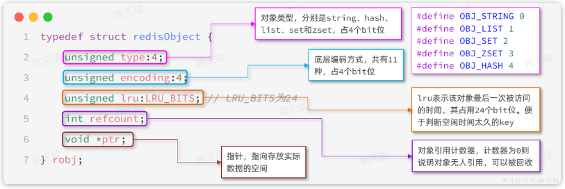

其中，仅仅是这些对象头信息，内存占用的大小为4+4+24+32+64 = 128bit，也就是16字节。

所以 RedisObject 的内存开销较大，需要在使用时选择合适的数据结构存储，以节约存储对象头的空间。

属性中的 `encoding` 表示当前对象底层采用的**数据结构**或**编码方式**，有11种：

| **编号** | **编码方式**            | **说明**               |
| :------- | :---------------------- | :--------------------- |
| 0        | OBJ_ENCODING_RAW        | raw编码动态字符串      |
| 1        | OBJ_ENCODING_INT        | long类型的整数的字符串 |
| 2        | OBJ_ENCODING_HT         | hash表（也叫dict）     |
| 3        | OBJ_ENCODING_ZIPMAP     | 已废弃                 |
| 4        | OBJ_ENCODING_LINKEDLIST | 双端链表               |
| 5        | OBJ_ENCODING_ZIPLIST    | 压缩列表               |
| 6        | OBJ_ENCODING_INTSET     | 整数集合               |
| 7        | OBJ_ENCODING_SKIPLIST   | 跳表                   |
| 8        | OBJ_ENCODING_EMBSTR     | embstr编码的动态字符串 |
| 9        | OBJ_ENCODING_QUICKLIST  | 快速列表               |
| 10       | OBJ_ENCODING_STREAM     | Stream流               |
| 11       | OBJ_ENCODING_LISTPACK   | 紧凑列表               |

Redis 中 5 种不同的数据类型采用的底层数据结构和编码方式如下：

| **数据类型** | **编码方式**                                                 |
| :----------- | :----------------------------------------------------------- |
| STRING       | `int`、`embstr`、`raw`                                       |
| LIST         | `LinkedList和ZipList`(3.2以前)、`QuickList`（3.2以后）       |
| SET          | `intset`、`HT`                                               |
| ZSET         | `ZipList`（7.0以前）、`Listpack`（7.0以后）、`HT`、`SkipList` |
| HASH         | `ZipList`（7.0以前）、`Listpack`（7.0以后）、`HT`            |

其中，一般数据量少是某数据类型会采用一个编码方式，数据量超过阈值后，会更换另一个编码方式。

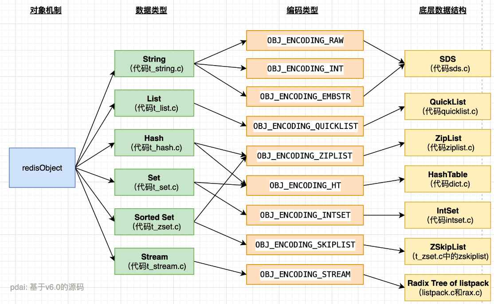

### SkipList

SkipList（跳表）首先是双端链表，然后有特点：

- 元素按照升序排列存储。
- 节点可能包含多个指针，指针跨度不同。（一般采用二分跨度）

SkipList 内部包含跨度不同的多级指针，可以跳跃查找链表中间的元素，查找效率高。

假设要找值为 14 的元素：

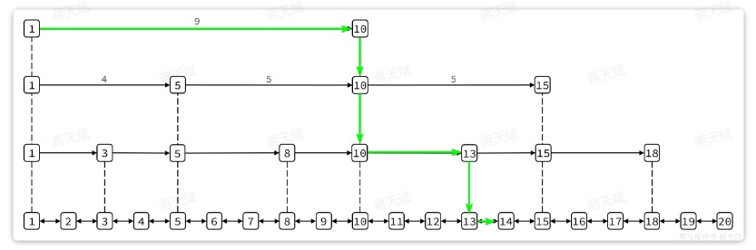

跳表的结构体如下：

```C
typedef struct zskiplist {
    // 头尾节点指针
    struct zskiplistNode *header, *tail;
    // 节点数量
    unsigned long length;
    // 最大的索引层级
    int level;
} zskiplist;
```

可以看到SkipList主要属性是header和tail，也就是头尾指针，因此它是支持双向遍历的。

跳表中节点的结构体如下：

```C
typedef struct zskiplistNode {
    sds ele; // 节点存储的字符串
    double score;// 节点分数，排序、查找用
    struct zskiplistNode *backward; // 前一个节点指针
    struct zskiplistLevel {
        struct zskiplistNode *forward; // 下一个节点指针
        unsigned long span; // 索引跨度
    } level[]; // 多级索引数组
} zskiplistNode;
```

每个节点中都包含ele和score两个属性，其中score是得分，也就是节点排序的依据。ele则是节点存储的字符串数据指针。

内存结构如下：

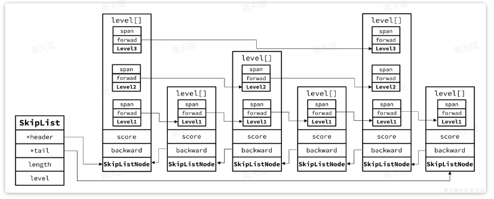

### SortedSet

SortedSet 是有序集合，存储的每个数据都包含：

- element

	字符串值，可以根据 element 查询对应的 score 值，基于 HashTable 实现。

- score

	得分，SortedSet 会根据每个 element 的 score 值排序，并支持 score 的查找，基于 SkipList 实现。

Redis 源码中`zset`，也就是 `SortedSet` 的结构体如下：

```C
typedef struct zset {
    dict *dict; // dict，底层是 HashTable
    zskiplist *zsl; // 跳表
} zset;
```

内存结构如下：

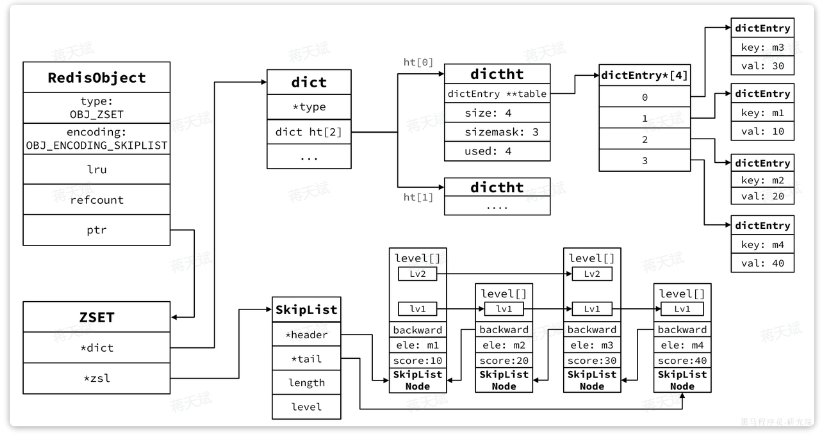

满足以下条件时使用 ziplist ：

- member 数量小于128个（可手工设置）
- 所有 member 的长度都小于 64 字节（可手工设置）

其余情况使用 zSkiplist 。

- 压缩列表(ziplist)

	ziplist是为了提高存储效率而设计的一种特殊编码的双向链表。它可以存储字符串或者整数，存储整数时是采用整数的二进制而不是字符串形式存储。它能在O(1)的时间复杂度下完成list两端的push和pop操作。但是因为每次操作都需要重新分配ziplist的内存，所以实际复杂度和ziplist的内存使用量相关

- 跳跃表（zSkiplist)

	跳跃表的性能可以保证在查找，删除，添加等操作的时候在对数期望时间内完成，这个性能是可以和平衡树来相比较的，而且在实现方面比平衡树要优雅，这是采用跳跃表的主要原因。跳跃表的复杂度是O(log(n))。

### 为什么 Redis 的 Set 使用哈希表实现，而 ZSet 使用跳表实现

- Set 的核心操作是快速查找、插入、删除，不关心顺序。

	- 哈希表提供 O(1) 的平均时间复杂度进行上述操作，非常高效。

	- Set 的语义是“无序、唯一”的集合，所以：

		- 不需要维护元素的顺序；

		- 只需要快速判断某个元素是否存在。

- ZSet 的核心功能是：按分数排序、范围查找（如取前 N 个、查某个 score 范围的元素）

	- 跳表是为了高效支持范围查询和排序操作；

	- 跳表按 score 排序的结构；

	- 插入、删除、按 score 查找是 O(log N)；

	- 范围遍历非常高效（顺序链表结构）。

## 内存回收

当内存达到上限，就无法存储更多数据了。

Redis 内部有两套内存回收的策略：

- 内存过期策略
- 内存淘汰策略

### 内存过期

存入 Redis 的数据可以配置过期时间（TTL），到期后会被清理。

Redis 的所有数据类型的键值映射底层都基于 HashTable 实现，在 Redis 中也叫做 Dict 。

Redis 的一个逻辑数据库定义如下：

```C
typedef struct redisDb {
    dict dict;                 / The keyspace for this DB , 也就是存放KEY和VALUE的哈希表*/
    dict *expires;              /* 同样是哈希表，但保存的是设置了TTL的KEY，及其到期时间*/
    dict *blocking_keys;        /* Keys with clients waiting for data (BLPOP)*/
    dict *ready_keys;           /* Blocked keys that received a PUSH */
    dict *watched_keys;         /* WATCHED keys for MULTI/EXEC CAS /
    int id;                     / Database ID, 0 ~ 15 /
    long long avg_ttl;          / Average TTL, just for stats /
    unsigned long expires_cursor; / Cursor of the active expire cycle. */
    list *defrag_later;         /* List of key names to attempt to defrag one by one, gradually. */
} redisDb;
```

其中，有两个 HashTable ：

- `dict`

	记录 key-value 键值对。（key 和 value 分别是一个 RedisObject ）

- `*expires`

	记录设置了过期时间的 key ，键值对为 key-TTL 。

	- 判断 KEY 是否过期时查询 expires 的 dict 即可。

redis 不会在 key 过期后立刻删除 key，那样会给 CPU 非常大的负担。

redis 有两种策略删除过期的 KEY ：

- 惰性删除

	在每次访问KEY的时候判断当前KEY有没有设置过期时间，如果有，判断过期时间是否已经到期。

- 周期删除

	通过一个定时任务，周期性地抽样部分过期的key，然后执行删除。（可以删除一些一直没有被访问的 key）

	- SLOW 模式

		Redis会设置一个定时任务`serverCron()`，按照`server.hz`的频率来执行过期key清理。

		- 执行频率受`server.hz`影响，默认为每秒执行10次，每个执行周期100ms。
		- 执行清理耗时不超过一次执行周期的25%，即25ms.
		- 逐个遍历db，逐个遍历db中的bucket，抽取20个key判断是否过期
		- 如果没达到时间上限（25ms）并且过期key比例大于10%，再进行一次抽样，否则结束

	- FAST模式

		Redis的每个事件循环前执行过期key清理（事件循环就是 NIO 事件处理的循环）。

		- 执行频率受`beforeSleep()`调用频率影响，但两次FAST模式间隔不低于2ms
		- 执行清理耗时不超过1ms
		- 逐个遍历db，逐个遍历db中的bucket，抽取20个key判断是否过期
		- 如果没达到时间上限（1ms）并且过期key比例大于10%，再进行一次抽样，否则结束

### 内存淘汰

对于某些特别依赖于 Redis 的项目而言，仅仅依靠过期 KEY 清理是不够的，内存可能很快就达到上限。

因此Redis允许设置内存告警阈值，当内存使用达到阈值时就会主动挑选部分KEY删除以释放更多内存。

Redis 在每次执行任何命令时，都会判断内存是否达到阈值：

```C
// server.c中处理命令的部分源码
int processCommand(client *c) {
    // ... 略
    if (server.maxmemory && !server.lua_timedout) {
        // 调用performEvictions()方法尝试进行内存淘汰
        int out_of_memory = (performEvictions() == EVICT_FAIL);
        // ... 略
        if (out_of_memory && reject_cmd_on_oom) {
            // 如果内存依然不足，直接拒绝命令
            rejectCommand(c, shared.oomerr);
            return C_OK;
        }
    }
}
```

选择淘汰的 key 时，redis 支持 8 种不同的内存淘汰策略：

- `noeviction`： 不淘汰任何key，但是内存满时不允许写入新数据。（默认策略）
- `volatile-ttl`： 对设置了TTL的key，比较key的剩余TTL值，TTL越小越先被淘汰（即使 TTL 没有到期也要淘汰）。
- `allkeys-random`：对全体key ，随机进行淘汰。也就是直接从db->dict中随机挑选
- `volatile-random`：对设置了TTL的key ，随机进行淘汰。也就是从db->expires中随机挑选。
- `allkeys-lru`： 对全体key，基于LRU算法进行淘汰
- `volatile-lru`： 对设置了TTL的key，基于LRU算法进行淘汰
- `allkeys-lfu`： 对全体key，基于LFU算法进行淘汰
- `volatile-lfu`： 对设置了TTL的key，基于LFU算法进行淘汰

其中：

- **LRU**（**L**east **R**ecenty **U**sed，最少的最近使用，很久没使用），最近最久未使用

	用当前时间减去最后一次访问时间（空转时长），空转时长越大则淘汰优先级越高。

- **LFU**（**L**east **F**requently **U**sed，最少的频率使用），最近最少频率使用

	会统计每个key的访问频率，值越小淘汰优先级越高。

##### LFU 计算原理

RedisObject 中的`lru` 属性就是用来记录最近一次访问时间和访问频率。

- **LRU**：以秒为单位记录最近一次访问时间，长度24bit
- **LFU**：高16位以分钟为单位记录最近一次访问时间，低8位记录逻辑访问次数。

逻辑访问次数的计算如下：

- ① 生成`[0,1)`之间的随机数`R`，作为逻辑次数 `+1` 的概率阈值。
- ② 计算 `1/(旧次数 * lfu_log_factor + 1)`，记录为`P`， `lfu_log_factor`默认为10
- ③ 如果 `R` < `P `，则计数器 `+1`，且最大不超过255。（比较阈值）
- ④ 访问次数会随时间衰减，距离上一次访问时间每隔 `lfu_decay_time` 分钟(默认1) ，计数器`-1` 。

LFU 的基于访问频率的统计更先进，因此官方推荐使用 LFU 算法。

##### LFU 抽样法

Redis 中的`KEY`可能有数百万甚至更多，每个KEY都有自己访问时间或者逻辑访问次数。

Redis 的内存淘汰是在每次执行命令时处理的，要找出时间最早的或者访问次数最小的，不可能每次执行命令都先对全量数据做内存排序。

Redis 采用抽样法，每次抽样一定数量（`maxmemory_smples`）的key，然后基于内存策略做排序，找出淘汰优先级最高的，删除这个key。所以 Redis 的算法并不是真正的**LFU**，而是一种基于抽样的**近似LFU算法**。

## 发布订阅

Redis 具有发布订阅的消息通信模式，使用 SUBSCRIBE 命令可以让客户端订阅任意数量的频道， 每当有新信息发送到被订阅的频道时， 信息就会被发送给所有订阅指定频道的客户端。

有两种订阅的方式：

- 基于频道（Channel）
- 基于模式（Pattern）

### 基于频道

发布者可以向指定的频道(channel)发送消息; 订阅者可以订阅一个或者多个频道(channel),所有订阅此频道的订阅者都会收到此消息。

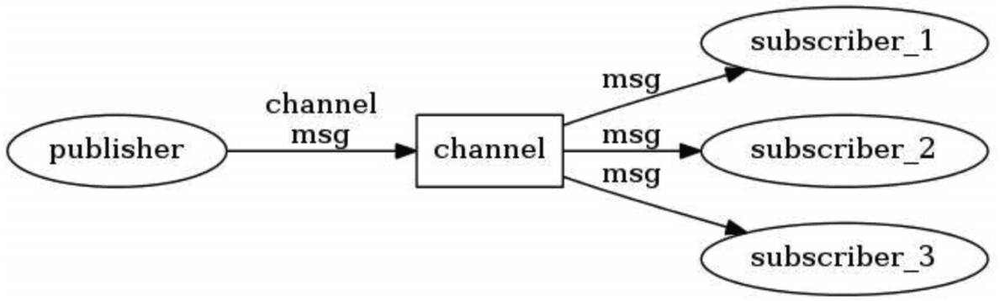


### 基于模式

基于模式就是使用通配符订阅。

Redis 使用的通配符中：

- `?`

	表示1个占位符。

- `*`

	表示任意个占位符(包括0)。

- `?*`

	表示1个以上占位符。

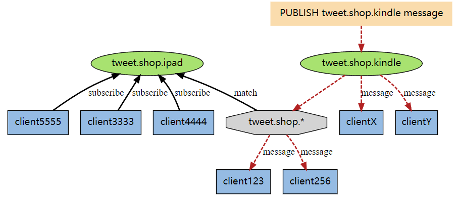

其中 tweet.shop.* 模式匹配了 tweet.shop.kindle 频道和 tweet.shop.ipad 频道， 并且有不同的客户端分别订阅它们三个。

当有信息发送到 tweet.shop.kindle 频道时，信息除了发送给 clientX 和 clientY 之外，还会发送给订阅 tweet.shop.* 模式的 client123 和 client256 。

### 实现原理

#### 基于频道

Redis 将所有频道作为 Map 的 key ，然后将所有订阅该频道的客户端存储在链表中：

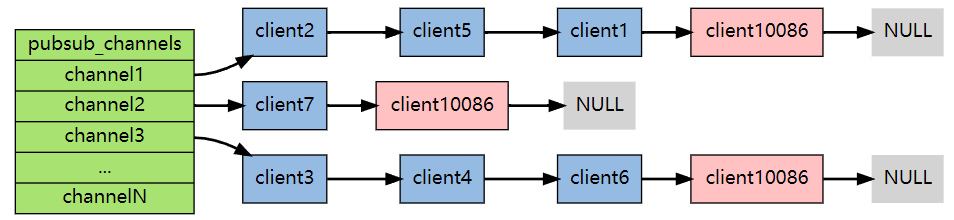

其中，client10086 订阅了三个 channel ，所有出现在了三个 channel 的链表中。

#### 基于模式

Redis 将所有订阅 pattern 的 client 以及 pattern 信息串联在一个 pubsub_patterns 链表中（而不是使用通配符展开，因为展开后的可能空间非常大）：

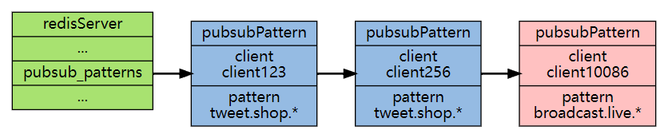

发布消息和退订都会遍历该链表，找到所有符合条件的结点。

## 持久化

为什么 Redis 需要持久化？

Redis 是个基于内存的数据库。服务一旦宕机，内存中的数据将全部丢失。通常的解决方案是从后端数据库恢复这些数据，但后端数据库有性能瓶颈，如果是大数据量的恢复，1、会对数据库带来巨大的压力，2、数据库的性能不如 Redis 。如果 Redis 能自行恢复数据，那么将能够减轻数据库压力。

### RDB

RDB（Redis DataBase）是内存的数据快照，快照中的值早于或等于内存中的值。

RDB 持久化有两种触发方式：

- 主动触发

	- save 命令

		阻塞当前Redis服务器，直到RDB过程完成为止，对于内存比较大的实例会造成长时间阻塞，线上环境不建议使用。

	- bgsave 命令

		Redis进程执行fork操作创建子进程，RDB持久化过程由子进程负责，完成后自动结束。阻塞只发生在fork阶段，一般时间很短。

		- fork 后的这段时间内发生的数据变化会以副本的方式存放在另一个新的内存区域，待快照操作结束后才会同步到原来的内存区域。

- 被动触发

	- redis.conf中配置`save m n`，即在m秒内有n次修改时，自动触发bgsave生成rdb文件；
	- 主从复制时，从节点要从主节点进行全量复制时也会触发bgsave操作，生成当时的快照发送到从节点；
	- 执行debug reload命令重新加载redis时也会触发bgsave操作；
	- 默认情况下执行shutdown命令时，如果没有开启aof持久化，那么也会触发bgsave操作；

RDB 持久化过程中，也就是在没有将数据全部写入到磁盘前，这次快照创建操作都不算成功。如果出现了服务崩溃，仍然可以使用上一次完整的RDB快照文件恢复内存数据。也就是说，RDB 持久化过程中不会影响上一次的备份数据，Redis服务会在磁盘上创建一个临时文件进行数据操作，待操作成功后才会用这个临时文件替换掉上一次的备份。

- 优点
	- RDB文件是某个时间节点的快照，默认使用LZF算法进行压缩，压缩后的文件体积远远小于内存大小，适用于备份、全量复制等场景；
	- Redis加载RDB文件恢复数据要远远快于AOF方式；
- 缺点
	- RDB方式实时性不够，无法做到秒级的持久化；
	- 每次调用bgsave都需要fork子进程，fork子进程属于重量级操作，频繁执行成本较高；
	- RDB文件是二进制的，没有可读性，AOF文件在了解其结构的情况下可以手动修改或者补全；
	- 版本兼容RDB文件问题；

针对 RDB 不适合实时持久化的问题，Redis 提供了 AOF 持久化方式来解决。

### AOF

#### 写入日志的时机

Redis 采用**写后日志**，先执行命令，把数据写入内存，然后才记录日志。日志里记录的是Redis收到的每一条命令，这些命令以文本形式保存。

大多数的数据库采用**写前日志**（WAL），例如 MySQL，通过写前日志和两阶段提交，实现数据和逻辑的一致性。

采用写后日志的原因：

- **避免额外的检查开销**

	Redis 在向 AOF 里面记录日志的时候，并不会先去对这些命令进行语法检查。所以，如果先记日志再执行命令的话，日志中就有可能记录了错误的命令，Redis 在使用日志恢复数据时，就可能会出错。

- 不会阻塞当前的写操作

但这种方式存在潜在风险：

- 如果命令执行完成，写日志之前宕机了，缺失日志会无法恢复该数据。
- 主线程写磁盘压力大时，可能导致写盘慢，阻塞后续操作。

### 写回策略

AOF日志记录Redis的每个写命令，步骤如下：

- 命令追加 （append）

	当AOF持久化功能打开了，服务器在执行完一个写命令之后，会以协议格式将被执行的写命令追加到服务器的 aof_buf 缓冲区。

- 文件写入和同步 （write & sync）

	关于何时将 aof_buf 缓冲区的内容写入AOF文件中，Redis提供了三种写回策略：

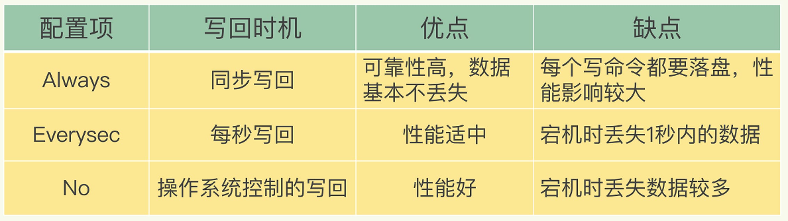

其中，对于操作系统控制的写回:

> 为了提高文件写入效率，在现代操作系统中，当用户调用write函数，将一些数据写入文件时，操作系统通常会将数据暂存到一个内存缓冲区里，当缓冲区的空间被填满或超过了指定时限后，才真正将缓冲区的数据写入到磁盘里。 
>
> 这样的操作虽然提高了效率，但也为数据写入带来了安全问题：如果计算机停机，内存缓冲区中的数据会丢失。
>
> 为此，系统提供了fsync、fdatasync同步函数，可以强制操作系统立刻将缓冲区中的数据写入到硬盘里，从而确保写入数据的安全性。

### bgrewriteaof 子进程

AOF 重写过程是由后台进程 bgrewriteaof 完成：

- 主线程fork出后台的bgrewriteaof子进程，fork会把主线程的内存拷贝一份给bgrewriteaof子进程，这里面就包含了数据库的最新数据。（fork 时会阻塞主进程）
- 然后，bgrewriteaof子进程就可以在不影响主线程的情况下，逐一把拷贝的数据写操作，记入重写日志。

### RDB和AOF混合方式（4.0版本)

Redis 4.0 中提出了一个**混合使用 AOF 日志和内存快照**的方法。简单来说，内存快照（RDB）以一定的频率执行，在两次快照（RDB）之间，使用 AOF 日志记录这期间的所有命令操作。

这样一来：

- 快照不用很频繁地执行，这就避免了频繁 fork 对主线程的影响。
- AOF 日志只用记录两次快照间的操作，不再需要记录所有操作了，因此不会出现日志文件过大的情况了，也可以避免重写开销。

### 恢复数据

想要从 RDB 和 AOF 文件中恢复数据，只需要重新启动 Redis 即可：

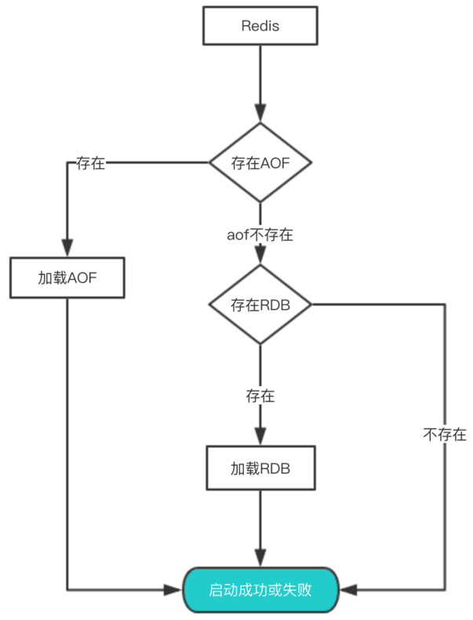

其中，优先加载 AOF 是因为AOF保存的数据更完整，AOF 基本上最多损失 1s 的数据。

