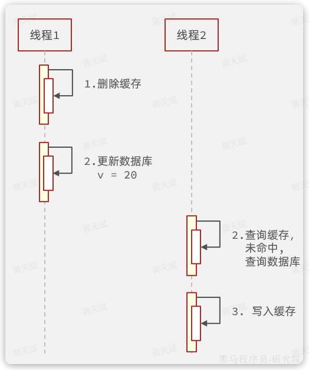
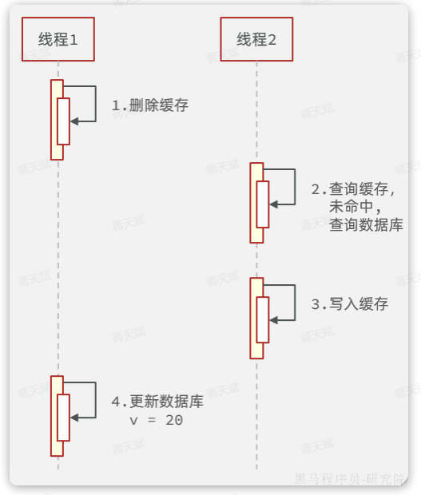
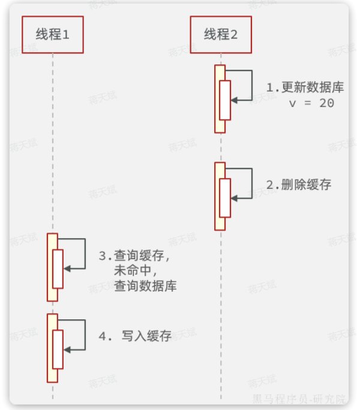
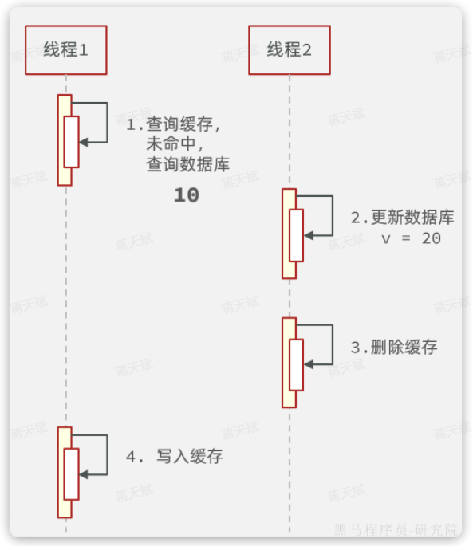
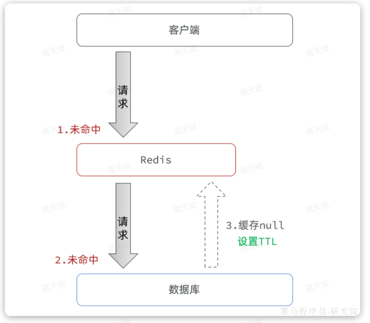
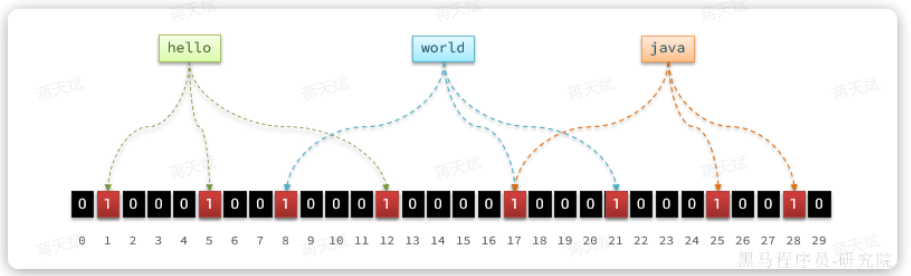
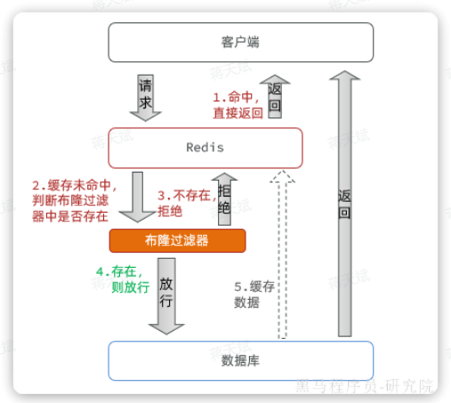
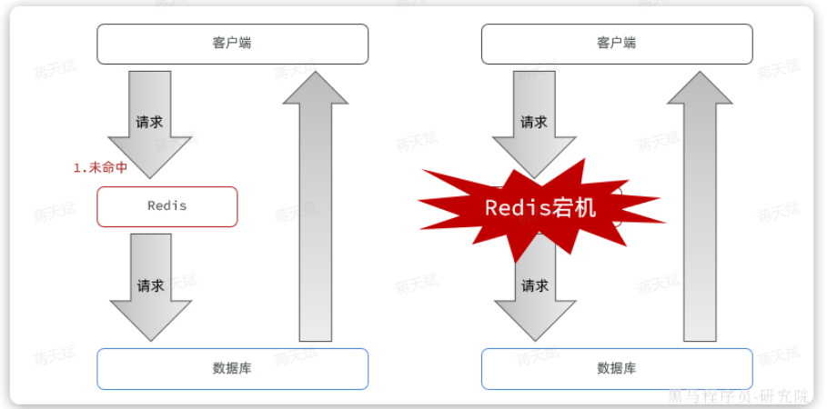
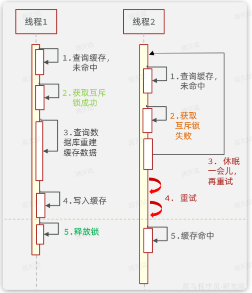
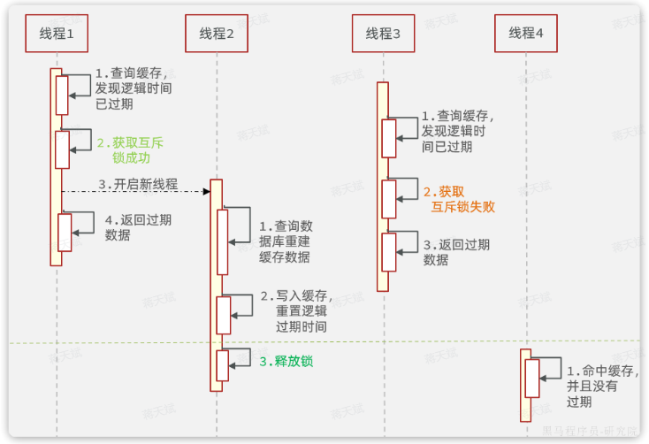

## 缓存问题

### 缓存一致性

缓存的通用模型有三种：

- `Cache Aside`

	由缓存调用者自己维护数据库与缓存的一致性。

	- 查询时：命中则直接返回，未命中则查询数据库并写入缓存。
	- 更新时（增删改）：更新数据库并删除缓存（直接删除更快更简单），查询时自然会更新缓存（相当于延迟更新缓存）。

- `Read/Write Through`

	数据库自己维护一份缓存，底层实现对调用者透明。

	- 查询时：命中则直接返回，未命中则查询数据库并写入缓存
	- 更新时（增删改）：判断缓存是否存在，不存在直接更新数据库。存在则更新缓存，同步更新数据库

- `Write Behind Cahing`

	读写操作都直接操作缓存，由线程异步的将缓存数据同步到数据库。

目前企业中使用最多的就是`Cache Aside`模式，因为实现起来非常简单。但缺点也很明显，就是无法保证数据库与缓存的强一致性。

Cache Aside 模式更新时，应该先更新数据库再删除缓存，还是先删除缓存再更新数据库呢？

#### 策略 1 先删除缓存再更新数据库

正常情况：

异常情况：

异常情况说明：

- 线程1删除缓存后，还没来得及更新数据库。
- 此时线程2来查询，发现缓存未命中，于是查询数据库，写入缓存。由于此时数据库尚未更新，查询的是旧数据。也就是说刚才的删除白删了，缓存又变成旧数据了。
- 然后线程1更新数据库，此时数据库是新数据，缓存是旧数据

由于更新数据库的操作本身比较耗时，在期间有线程来查询数据库并更新缓存的概率非常高，因此不推荐这种方案。

#### 策略 2 先更新数据库再删除缓存

正常情况：

异常情况：

异常情况说明：

- 线程1查询缓存未命中，于是去查询数据库，查询到旧数据
- 线程1将数据写入缓存之前，线程2来了，更新数据库，删除缓存
- 线程1执行写入缓存的操作，写入旧数据

可以发现，这种策略下异常状态发生的概率极为苛刻，在线程1 查询数据库已经完成，但是缓存尚未写入之间，线程2 必须要完成更新数据库和删除缓存的两个操作。要知道线程1执行写缓存的速度在毫秒之间，速度非常快，在这么短的时间要完成数据库和缓存的操作，概率非常之低。

同时我们还要给缓存加上过期时间，一旦发生缓存不一致，当缓存过期后会重新加载，数据最终还是能保证一致，这就可以作为一个兜底方案。

### 缓存穿透

如果访问数据库中不存在的数据，缓存中肯定也不存在，因此不管请求该数据多少次，缓存永远不可能建立，请求永远会直达数据库。

如果有人开启很多线程频繁的访问一个数据库中不存在的数据，由于缓存不可能生效，那么所有的请求都访问数据库，可能就会导致数据库因过高的压力而宕机。

解决这个问题有两种思路：

- 缓存空值
- 布隆过滤器

#### 缓存空值

当发现请求的数据不存在于缓存，也不存在于数据库时，将空值（null）缓存到 Redis（为不存在的 key 建立缓存），避免频繁查询数据库。

其中，还会设置一个较小的 TTL ，防止不存在的 key 过多，占用过多内存。

- 优点：实现简单，维护方便
- 缺点：额外的内存消耗

#### 布隆过滤器

布隆过滤是一种数据统计的算法，用于判断一个元素是否存在一个集合中。

一般的将元素存储在数据结构中的判断方法可能在大数据量下占用大量内存，布隆过滤器可以用较低的内存消耗，判断大量元素中一个元素的存在性。

要定时清空布隆过滤器。

布隆过滤算法如下：

1. 设置一个很长的 bit 数组，默认数组中每一位都是 0 。
2. 还需要`K`个`hash`函数，将一个元素通过这些 hash 函数的结果作为下标，将 bit 数组中这些下标的位置置为 1。
3. 要判断元素是否存在，只需要再次基于`K`个`hash`函数做运算， 得到`K`个下标，判断每个下标的位置是不是1：
	- 只要全是 1，说明元素大概率存在。（概率依哈希算法和 bit 数组长度而定）
		- 假如某个元素本身并不存在，也没添加到布隆过滤器，但是由于存在 hash 碰撞的可能性，这就会出现这个元素计算出的下标已经被其它元素置为1的情况，那么这个元素会被误判为已经存在。（误判概率很小，可以大幅降低数据库压力）
	- 任意位置为 0，就证明元素一定不存在。

布隆过滤器的缺点：

- 可能误判
- 无法获取元素本身
- 不能删除元素数据

可以把数据库中的数据：

1. 利用布隆过滤器进行标记。
2. 当用户请求缓存未命中时，先基于布隆过滤器判断。
3. 如果不存在则直接拒绝请求。
4. 存在则去查询数据库。

### 缓存雪崩

缓存雪崩指在同一时段大量的缓存 key 同时失效或者 Redis 服务宕机，导致大量请求到达数据库，带来巨大压力。

常见的解决方案有：

- 给不同的Key的TTL添加随机值，这样KEY的过期时间不同，不会大量KEY同时过期。
- 利用Redis集群提高服务的可用性，避免缓存服务宕机。
- 给缓存业务添加降级限流策略，及时限流熔断。
- 给业务添加多级缓存，比如先查询本地缓存，本地缓存未命中再查询Redis，Redis未命中再查询数据库。即便Redis宕机，也还有本地缓存可以抗压力。

### 缓存击穿

**缓存击穿**问题也叫**热点Key**问题，就是一个被**高并发访问**并且**缓存重建较复杂**的 key 突然失效了，无数的请求访问会在瞬间给数据库带来巨大的冲击。

重建复杂的 key 可能需要复杂的数据库查询以及运算。

当某个重建复杂的热点 key 在并发访问量比较高时突然失效，就会在一瞬间涌入大量请求，都发现缓存未命中，于是都会去查询数据库，尝试重建缓存（重建较复杂，耗时较久），可能一瞬间就把数据库压垮了。

常见的解决方案有两种：

- 互斥锁
- 逻辑过期

#### 互斥锁

对重建复杂的 key 的缓存逻辑加锁，避免多线程同时重建一个热点 key 。

其中，线程 1 获取到互斥锁后，在释放锁之前（重建 key 完成前），其它线程都获取互斥锁失败，并且不断阻塞重试。

- 优点
	- 没有额外的内存消耗
	- 保证一致性
	- 实现简单
- 缺点：
	- 线程需要等待，性能受影响。
	- 可能有死锁风险。

#### 逻辑过期

对热点 key 不设置过期时间，而是给数据添加一个过期时间的字段：

- 查询到数据时基于其中的过期时间判断key是否过期，如果过期开启独立新线程异步地重建缓存，而查询请求先返回旧数据即可。
- 这个重建缓存过程要加互斥锁，但由于是异步的，而且获取锁失败无需等待直接返回旧数据，这样性能几乎不受影响。
- 在活动结束后手动删除热点 key 。

其中：

- 线程 1 发现逻辑时间已过期
	- 于是获取互斥锁（也要加互斥锁）
	- 开启新线程 2 专门负责重建缓存。
	- 线程 1 直接返回旧的数据。
- 线程 3 在线程 2 重建缓存期间，获取锁失败则也直接返回旧的数据。
- 直到重建缓存完毕，释放锁，才返回新的数据。

整个过程中，只有一个线程重建缓存。

- 优点
	- 线程无需等待，性能较好。
- 缺点
	- 不保证一致性。（重建缓存期间不一致）
	- 有额外内存消耗。
	- 实现复杂。

## 缓存污染

缓存污染问题指缓存中一些只会被访问一次或者几次的的数据，被访问完后，再也不会被访问到，但这部分数据依然留存在缓存中，消耗缓存空间，随着服务的不断运行，最后导致缓存满了。

如果缓存空间满了，再往缓存里写数据时就会有额外开销，影响Redis性能。这部分额外开销主要是指写的时候判断淘汰策略，根据淘汰策略去选择要淘汰的数据，然后进行删除操作。

建议把缓存容量设置为总数据量的 15% 到 30%，兼顾访问性能和内存空间开销。

不过，缓存被写满是不可避免的, 所以需要数据淘汰策略。