# Redis 集群

单节点Redis的并发能力是有上限的，要进一步提高Redis的并发能力，就需要搭建主从集群，实现读写分离。

## 主从集群

### 结构

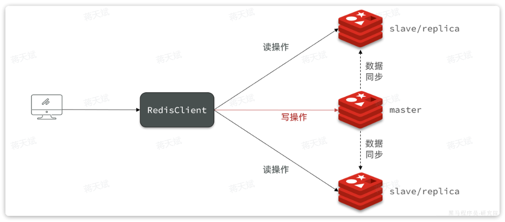

其中：

- master 节点
- slave 节点（现在叫replica）

当我们通过Redis的Java客户端访问主从集群时，应该做好路由：

- 如果是写操作，应该访问master节点，master会自动将数据同步给两个slave节点
- 如果是读操作，建议访问各个slave节点，从而分担并发压力

### 设置主从关系

启动多个 Redis 实例后，通过命令配置主从关系：

```shell
# Redis5.0以前
slaveof <masterip> <masterport>
# Redis5.0以后
replicaof <masterip> <masterport>
```

主从关系由两种模式：

- 永久生效：在redis.conf文件中利用`slaveof`命令指定`master`节点
- 临时生效：直接利用redis-cli控制台输入`slaveof`命令，指定`master`节点

### 主从同步原理

#### 数据同步

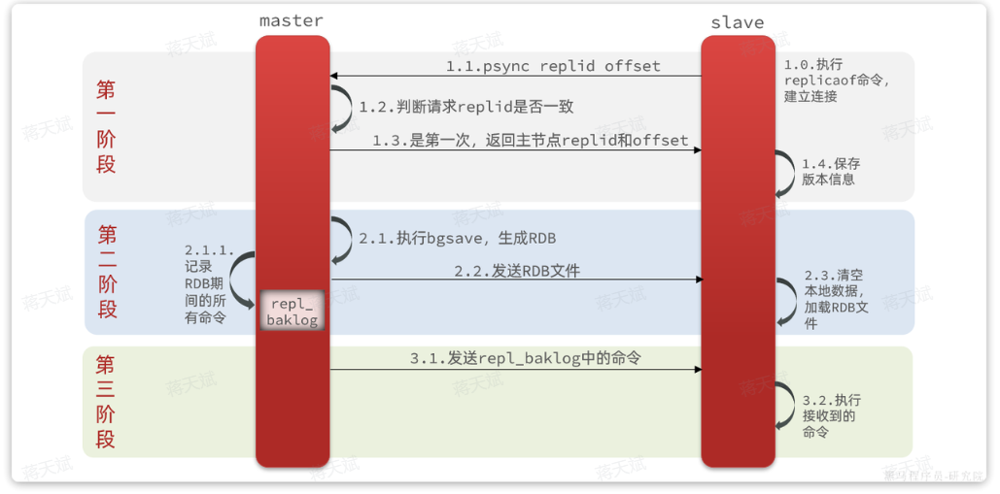

其中：

1. 第一阶段 slave 尝试与 master 连接，并判断是否是第一次连接。
2. 是第一次连接则进行第二阶段的全量同步，将master节点的所有数据都拷贝给slave节点。
3. 不是第一次连接则进行第三阶段的增量同步，只将新数据同步到 slave 节点。

#### 如何判断是第一次连接

判断依据：

- **`Replication Id`**

	简称`replid`，是数据集的标记，replid一致则是同一数据集。每个`master`都有唯一的`replid`，`slave`则会继承`master`节点的`replid` 。

- **`offset`**

	偏移量，随着记录在`repl_baklog`中的数据增多而逐渐增大。`slave`完成同步时也会记录当前同步的`offset`。如果`slave`的`offset`小于`master`的`offset`，说明`slave`数据落后于`master`，需要更新。

master 判断一个节点是否是第一次同步，就是看 replid 是否一致，不一致则是第一次同步，第一次同步后保存了 replid ，就与 master 一致了。

#### 全量同步

- `master`通过 bgsave 命令将完整内存数据生成 `RDB` 文件（内存数据快照），然后发送 `RDB` 到`slave` 。
- `slave`清空本地数据，加载`master`的`RDB` 。

全量同步执行的另一个时机是：slave节点断开时间太久，repl_baklog中的offset已经被覆盖时。

#### 增量同步

全量同步需要先做RDB，然后将RDB文件通过网络传输个slave，成本太高。因此除了第一次做全量同步，其它大多数时候slave与master都是做**增量同步**。

-  `master`会将全量同步中 `RDB` 没有记录到的命令记录在`repl_baklog`，并持续将 log 中的新的写操作命令发送给 `slave` 以保持同步。
	- `repl_baklog`文件是一个固定大小的环形数组，offset 到达数组末尾后，会再次从0开始读写，写满后会覆盖最早的数据。
	- 如果slave断开时间过久，导致尚未备份的数据被覆盖，则无法基于`repl_baklog`做增量同步，只能再次做全量同步。

`repl_baklog`中会记录Redis处理过的命令及`offset`，包括master当前的`offset`，和slave已经拷贝到的`offset`：

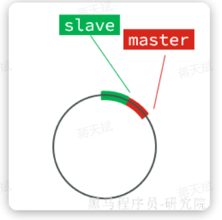

slave与master的offset之间的差异，就是salve需要增量拷贝的数据。

随着不断有数据写入，master的offset逐渐变大，slave也不断的拷贝，追赶master的offset，直到数组被填满。

此时，如果有新的数据写入，就会覆盖数组中的旧数据。不过，旧的数据只要是绿色的，说明是已经被同步到slave的数据，即便被覆盖了也没什么影响。因为未同步的仅仅是红色部分：

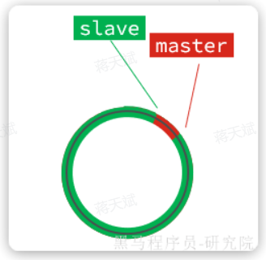

如果slave出现网络阻塞，导致master的`offset`远远超过了slave的`offset`，如果master继续写入新数据，master的`offset`就会覆盖`repl_baklog`中旧的数据，直到将slave现在的`offset`也覆盖：

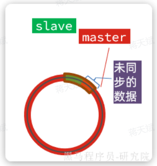

棕色框中的红色部分，就是尚未同步，但是却已经被覆盖的数据。此时如果slave恢复，需要同步，却发现自己的`offset`都没有了，无法完成增量同步了，只能做**全量同步**。

### 主从同步优化

可以从以下几个方面来优化Redis主从集群：

- 在master中配置`repl-diskless-sync  yes`启用无磁盘复制，不再先将 RDB 存入磁盘，而是直接发送给 slave 。
- Redis单节点上的内存占用不要太大，减少 RDB 导致的过多磁盘IO
- 适当提高`repl_baklog`的大小，发现slave宕机时尽快实现故障恢复，尽可能避免全量同步
- 限制一个master上的slave节点数量，如果实在需要很多 slave，则可以采用`主-从-从`链式结构，减少master压力

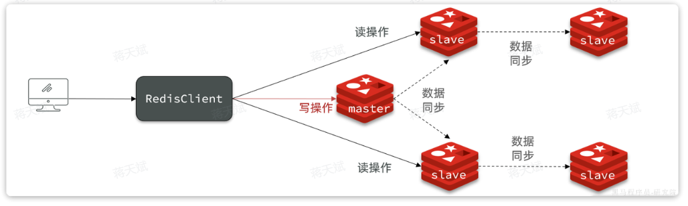

## Redis 哨兵

Redis提供了哨兵（`Sentinel`）机制来监控主从集群监控状态，确保集群的高可用性。

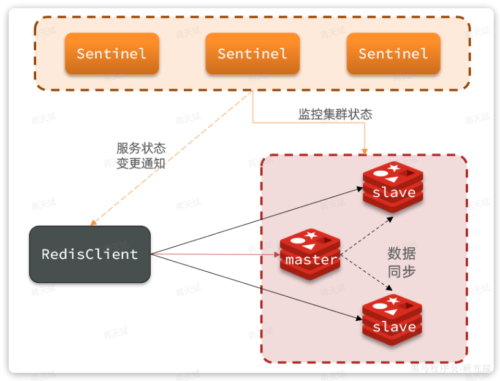

哨兵的作用：

- 状态监控

	`Sentinel` 会不断检查`master`和`slave`是否按预期工作

- 故障恢复（failover）

	如果`master`故障，`Sentinel`会将一个`slave`提升为`master`，当故障实例恢复后会成为`slave` 。

- 状态通知

	`Sentinel`充当`Redis`客户端的服务发现来源，当集群发生`failover`时，会将最新集群信息推送给`Redis`的客户端。

### 状态监控

`Sentinel`基于心跳机制监测服务状态，每隔1秒向集群的每个节点发送ping命令：

- 主观下线（sdown）

	如果某sentinel节点发现某Redis节点未在规定时间响应，则认为该节点主观下线。

- 客观下线(odown)

	若超过指定数量（通过`quorum`设置）的sentinel都认为该节点主观下线，则该节点客观下线。

	- quorum值最好超过Sentinel节点数量的一半，Sentinel节点数量至少3台。

一旦发现master故障，sentinel需要在salve中选择一个作为新的master，选择依据如下：

1. 首先会判断slave节点与master节点断开时间长短，如果超过`down-after-milliseconds * 10`则会排除该slave节点。（断开时间过长，数据过旧）

2. 然后判断slave节点的`slave-priority`值，越小优先级越高，如果是0则永不参与选举（默认都是1）。

3. 如果`slave-prority`一样，则判断slave节点的`offset`值，越大说明数据越新，优先级越高

4. 最后是判断slave节点的`run_id`大小，越小优先级越高（`通过info server可以查看run_id`）。（相当于随便选一个）

### 身份切换

当选出一个新的master后，实现身份切换还需要：

1. 在多个`sentinel`中选举一个`leader` 。
2. 由`leader`执行`failover 。`

#### 选举 leader

要成为`leader`要满足两个条件：

- 最先获得超过半数的投票
- 获得的投票数不小于`quorum`值

而sentinel投票的原则有两条：

- 优先投票给目前得票最多的
- 如果目前没有任何节点有票，就投给自己

基于以上原则，谁先发起投票，谁就会成为 leader ，也就是说，第一个确认 master 客观下线的哨兵会立刻发起投票，且一定会成为 leader 。

#### failover

假设有一个集群，初始状态下7001为`master`，7002和7003为`slave`，

假如master发生故障，slave1当选。则故障转移的流程如下：

1，`sentinel`给备选的`slave1`节点发送`slaveof no one`命令，让该节点成为`master`

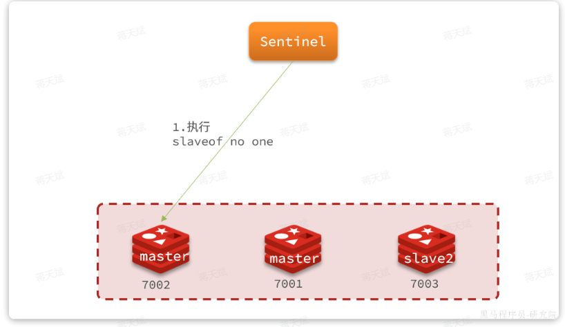

2. `sentinel`给所有其它`slave`发送`slaveof 192.168.150.101 7002` 命令，让这些节点成为新`master`，也就是`7002`的`slave`节点，开始从新的`master`上同步数据。

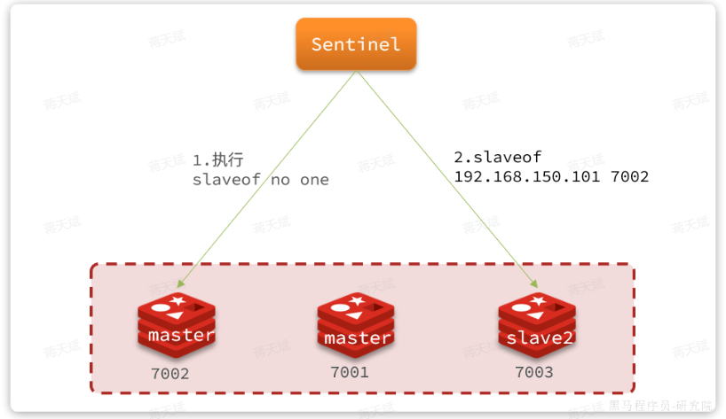

3. 最后，当故障节点恢复后会接收到哨兵信号，执行`slaveof 192.168.150.101 7002`命令，成为`slave`：

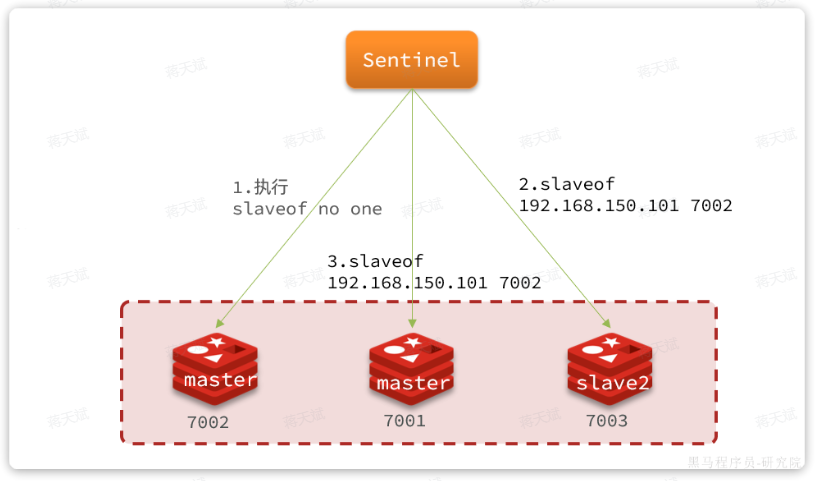

## Redis 分片集群

主从模式可以解决高可用、高并发读的问题。

但依然有两个问题没有解决：（主要是数据量的问题）

- 海量数据存储
- 高并发写

可以把数据拆分存储到不同节点，这样整个集群的存储数据量就更大了。

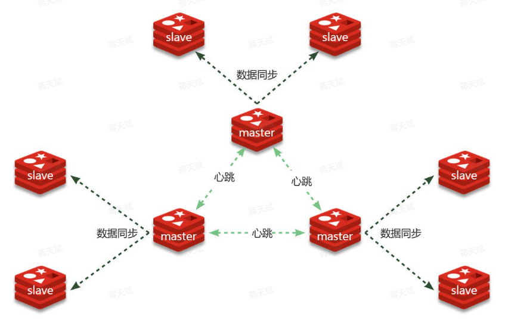

分片集群特征：

-  集群中有多个master，每个master保存不同分片数据 ，解决海量数据存储问题
-  每个master都可以有多个slave节点 ，确保高可用
-  master之间通过ping监测彼此健康状态 ，类似哨兵作用
-  客户端请求可以访问集群任意节点，最终都会被路由到数据所在节点 

### 散列插槽

每个 master 会被分配到一个 0 - 16484 的一个区间中，这个区间就是 slot 值。

客户端访问集群时通过 slot 获取数据所在节点信息。

当读写数据时，Redis 基于 `CRC16` 算法对`key`做`hash`运算，得到的结果与`16384`取余，就计算出了这个`key`的`slot`值，然后到`slot`所在的Redis节点执行读写操作。

特别的：

- 如果 key 是`user`，则根据`user`来计算 hash slot 。
- 如果 key 是`user:{age}`，则根据`age`来计算 hash slot。
- 可以通过 `{}` 来指定前缀或后缀或共有内容，使得这些 key 都存储在同一个 redis 实例上。

### 故障转移

分片集群的节点之间会互相通过 ping 的方式做心跳检测，超时未回应的节点会被标记为下线状态。

当发现 master 下线时，会将这个 master 的某个 slave 提升为 master 。

