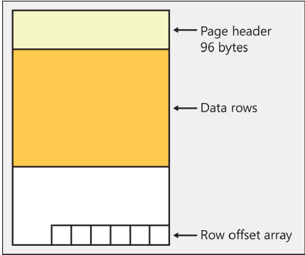

# SQLserver 系统内容

微软官方文档：https://docs.microsoft.com/zh-cn/sql/?view=sql-server-ver15

## 系统数据库

| 系统数据库                                                   | 描述                                                         |
| :----------------------------------------------------------- | ------------------------------------------------------------ |
| [master 数据库](https://docs.microsoft.com/zh-cn/sql/relational-databases/databases/master-database?view=sql-server-ver15) | 记录 SQL Server 实例的所有系统级信息。                       |
| [msdb 数据库](https://docs.microsoft.com/zh-cn/sql/relational-databases/databases/msdb-database?view=sql-server-ver15) | 用于 SQL Server 代理计划警报和作业。                         |
| [model 数据库](https://docs.microsoft.com/zh-cn/sql/relational-databases/databases/model-database?view=sql-server-ver15) | 用作 SQL Server 实例上创建的所有数据库的模板。 对 **model** 数据库进行的修改（如数据库大小、排序规则、恢复模式和其他数据库选项）将应用于以后创建的所有数据库。 |
| [Resource 数据库](https://docs.microsoft.com/zh-cn/sql/relational-databases/databases/resource-database?view=sql-server-ver15) | 一个只读数据库，包含 SQL Server 包括的系统对象。 系统对象在物理上保留在 **Resource** 数据库中，但在逻辑上显示在每个数据库的 **sys** 架构中。 |
| [tempdb 数据库](https://docs.microsoft.com/zh-cn/sql/relational-databases/databases/tempdb-database?view=sql-server-ver15) | 一个工作空间，用于保存临时对象或中间结果集。                 |

## 数据页

SQL server 将页作为数据存储的基本单位

页的大小为 8 KB

- 页头
	每页开头是 96B 的页头，用于存储页的存储信息，其中有页码，页类型，页的可用空间以及拥有该页的对象的分配单元 id。

- 行偏移数组
	行偏移数组占用 36B，记录了每一页的行偏移量，同时记录了数据行的逻辑顺序

一个数据页实际存储数据量为：
1024 x 8 - 96(页头) - 36(行偏移数组) = 8060 B

数据页有多种类型，此处省略。
