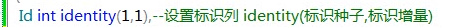

# 基本表管理

## 完整性

约束要保证三大数据完整性：

1. 实体完整性
所有行具有唯一性

2. 域完整性
指定列的数据具有正确类型，格式，和有效数据范围

3. 参照完整性（引用完整性）
位置和参照表和参照表间的数据一致性

## 约束

1. 默认值约束（ default ）（ DF ）：
插入新的数据行时，若没有指定数据，则赋给其默认值

2. 空值非空值约束（ null / not null ）（本约束严格讲不属于约束）：
是否允许为空

3. 主键约束（ primary key ）（ PK ）：
一个表只能有一个主键，且主属性不能为空

4. 外键约束（foreign key ）（ FK ）：
建立两个表（主表和从表）的一列或多列的连接，保证数据一致性
（外键约束先定义主表的主键，再定义从表的外键）

5. 唯一性约束（ unique ）（ UQ ）：
限制某些列的数据唯一性（主键不需再用此限制）

6. 检查约束（ check ）（ CK ）：
检查数据是否在有效范围内

约束名称：
（     ```简写__表名__被约束的列名```    ）（两条连着的下划线）

图形界面可以通过数据库关系图创建或修改表。


## create table 语句

创建表

```
create table < 表名 >
(
< 列名1 > < 数据类型 > < 列级约束 >
[ , ... n ]
< 表级约束 >
[ , ... n ]
)
[ on < filegroup >  | < “default” > ]
```

主键与外键的数据类型必须完全一致（因为本就是同一项值），字符类型括号里的数字也要一样。

## 列级约束

针对某一列的限制
（ constraint 关键字是为约束取名，最好取上名字 ）

- clustered（聚集索引）
	行的逻辑顺序与物理顺序一致
	- 一个表只能有一个聚集索引，因为物理顺序只能有一个
  - 聚集索引访问速度会更快

- nonclustered（非聚集索引）
	行的逻辑顺序与物理顺序不一致

1. 默认值约束
```
[ constraint < 默认值约束名 > ] default 常量表达式
```

2. 空值非空值约束
```
null / not null
```

3. 主键约束
```
[ constraint < 主键约束名 > ] 
primary key [ clustered | nonclustered ] ( < 主键列名 > ) 
（默认为聚集索引）
```

4. 外键约束
```
[ constrain < 外键约束名 >  ] 
 foreign key ( <外键列名> )  references < 父表名 >  ( < 主键列名 > ) 
```

5. 唯一性约束
```
[ constraint < 唯一性约束名 > ] unique [ clustered | nonclustered ]
（默认为非聚集索引）
```

6. 检查约束
```
[ constraint < 检查约束名 > ] check ( < 逻辑表达式 > )
```

## 表级约束

同时对多列的限制（不是分别对多列，而是将多列看做一个整体）。

```
unique( 列名1，列名2 …… )    多列单值约束
check( 逻辑表达式 )    含有多个列名的逻辑表达式的检查约束
primary key( 列名1，列名2 …… )    多列组合主键约束
foreign key( 外键 ) references 主键表( 主键 )      多列组合外键约束

默认值约束如果写到表级位置要在语句末尾用 for < 列名 >
```

## 示例

- 注意要为约束命名
- 仅做语法演示，逻辑错误请忽略
- 注意创建顺序
- 以下格式不好，看下面的“统一格式”
- use 语句以下情况可只写一个，具体几个要看语句的控制范围


**注意约束间会相互作用**。


关系图：


## 统一格式

- 第一行：列定义（列名，类型）
- 第二行：默认值约束
- 第三行：空与非空约束
- 第 n 行：唯一性约束，检查约束等（若为表级写在末尾）
- 主键约束，外键约束
- 表级约束

```sql
use myKu
create tab1e experiment(
	number nchar(9)
    	default '100025’
    	not nul1
		unique
    	check ( number like '1000[O-9][O-9]’)，
	n_name nvarchar(10)
		not nu11,
	flag bit
		default 0
		nu11,

primary key (number)，
foreign key (number) references s( sno ),

unique (number, n_name)    --表级约束
)
```

## 约束注意事项

### CK 约束注意事项

被 check 约束的列的数据类型必须与其匹配（like）的数据类型完全一致


上图： nchar 为 9，但正则表达式大小为 5，故下方插入虽匹配了正则表达式，但仍会出错（与 check 约束冲突 ）


更改后插入成功：


设置标识列：

由系统生成无重复的值，不能人为插入。



### FK 约束注意事项

两条语句（ on delete，on update ）（在外键约束语句的末尾添加）

```
[ on delete < no action | cascade | set null | set default > ]
[ on update < no action | cascade | set null | set default > ]
```

如果试图 删除 / 修改 某一行的被其它表作为外键引用的键值：
注意：一定是 删除/修改 被引用的键值，一般值的变化不会导致外键表的变化
默认为 no action

- no action
	将产生错误并回滚 delete / update 语句。
	
- cascade （级联）
	将会 删除 / 修改 其它表中所有包含该外键的行 或 更新其键值
	 (如果 timestamp 列是外键或被引用键的一部分，则不能指定 cascade )
	
- set null
	如果该外键允许为空，则设为空，否则报错

- set default
	该外键将被设定为默认值；
	需要主键表中一直具有以该默认值为主键的行才能维持外键约束的有效性
	如果没有该外键列指定默然值，但是能为空，则设为空，否则报错
	
## alter table 语句

更改表结构

- 一次只能使用一个子句，但用逗号分隔，可以修改多列。
- alter column 一次只能更改一列属性。
- 对被依赖的列作修改会受到限制，除空与非空约束外的其它约束，都必须先删除约束才能再删除列。

```
alter table < 表名 >
[ alter column < 列名 > < 列定义 > ]
| [ add < 列名 > < 数据类型 > < 约束 > [ , ... n ] ]
| [ drop column < 列名 > [ , ... n ] ]
| [ add constraint < 约束名 > < 约束 > [ , ... n ] ]
| [ drop constraint < 约束名 > [ , ... n ] ]
上方分别为：
更改列信息（ 要使用 column ）
增加列
删除列（ 要使用 column ）
增加约束（ 使用 constraint 是通过约束名，也可不使用 ）
删除约束（ 要使用 constraint ）
```


（ 添加默认值约束要在语句末尾用 for < 列名 >）

1. 不检查原有数据（ with nocheck ）
	为原有数据添加 check 约束时，原有数据不一定符合约束，此时不应删除原有数据，应在创建约束时指定  不检查原有数据，其只对新增的数据有效。
	
	

2. 禁用约束（ nocheck ）（仅对 check 及 foreign 约束有效）

	

3. 恢复约束（ check ）（仅对 check 及 foreign 约束有效）

	

4. 查看约束状态

示例：

```
exec sp_helpconstraint [dbo].[student] ;
用系统存储过程查看student表的约束；
	
select * from sys.key_constraints ; 
查看数据库中的主键约束；

select * from sys.objects where type in('C','D','F','PK','UQ') ; 
查看数据库的所有约束；

select * from sys.objects where type in('C','D','F','PK','UQ') ; 
	'C'，CHECK 约束
	'D'，默认值或 DEFAULT 约束
	'F'，FOREIGN KEY 约束
	'PK'，PRIMARY KEY 约束
	'UQ'，UNIQUE约束
```

## delete 语句

删除表数据。

```
delete from < 表名 > | < 视图名 >
[ where < 逻辑表达式 > ]
```

- 删除表和视图的一条或多条语句，每一条删除都会被日志记录。
- 不设置 where 则删除所有行。
- 应当先删除外键表记录，再删除主键表记录


## truncate table 语句

```
truncate table < 表名 >
```

清空表数据，但表结构不变（列与约束等），日志只记录数据页的释放


truncate table 语句与 delete 语句的区别：
1. truncate table 语句比 delete 语句更快，日志占用更少。
2. delete 删除后标识字段不能复用，即若用 delete 删除 id = 76 的一条记录，就不可能再插入一条数据使其 id = 76；而 truncate table 语句删除后，标识字段恢复初始状态。
3. truncate table 语句不能用于被外键约束约束的表，但可以用 delete 。
4. truncate table 语句不能激活触发器。

## drop table 语句

删除表。

- 删除表的同时，相关的约束都会消失 。
- 若有与外表相关的约束，如外键约束，必须先删除该约束。

```
drop table < 表名 >
```

## insert into 语句

插入表数据。( into 可省略 )

```
insert into < 表名 > [ ( < 列名 > [ , ... n ] ) ]
values( < 常量表达式 > | null | default [ , ... n ] )

插入部分数据，列名不得省略；插入一行数据，列名可以省略
该语句一次可以插入多行语句，在括号后用逗号分隔各行数据即可

null 选项：空项（注意约束限制）
default 选项：默认值项（注意约束限制）
```


## update 语句

修改表数据。

```
update < 表名 >
set < 列名 > = < 表达式 > [ , ... n ]
[ where < 逻辑表达式 > ]
会修改满足 where 条件的行，若省略，会修改所有行
列名不是变量名，不必加 @
```

给张三改名并更改 number：


## 表的行列互换输出

- pivot 函数：列转行
- unpivot 函数：行转列

```
pivot ( < 聚集函数 > ( < 原列名 > ) for < 新列名 > in ( < 列名表 > ) ) as p
```