# 基本语法

## 语法约定

- 尖括号 < > 的内容表示必选项
- 方括号 [ ] 的内容表示可以省略的选项或参数
- 符号 | 表示或关系
- SQL Server 系统语句不区分大小写。

## 局部变量

用户自定义变量，必须以 @ 开头，要用 declare 语句声明后才可使用。
一行可声明多个变量，用逗号分隔。

### declare

声明变量

```
declare < @变量名 > < 变量类型 > [ , < @变量名 > < 变量类型 > ... ]
变量类型可为系统支持的所有类型，包括用户自定义类型
```

初始化
```
declare < @变量名 > < 变量类型 > = < 变量值 >
```


赋值

```
select < @变量名 > = < 变量值 >
set < @变量名 > = < 变量值 >
```

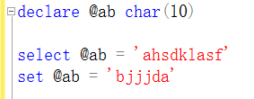

## 输出语句

### print
```
print < 变量字符串表达式等 >
```

- print 输出为文本形式。
- 每次输出都会换行，若要一行输出复杂信息，要先用一个字符串存储后再输出这个字符串。
- 输出变量要显式地将其转化为字符，后接的必须是能够转化为字符的数据类型。
- print 一次只接受一种类型的输出，可以通过函数进行转化。
- 字符类型可用 + 号连接（也仅有字符类型才能用 + 号连接）

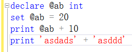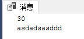

### select 
```
select <变量名>[as ‘别名（列标题）’] [ , <变量名>[as ‘别名（列标题）’] ]
```

- select 输出为表格形式，可通过 as 指定列标题。
- 一个 select 输出一张表，若有多列，增加参数即可；多个输出多张表。
- 其中别名作为结果的列标题。

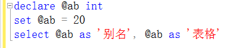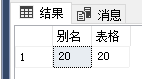

- 比较表达式的结果不能直接输出，SQL server 没有布尔类型，可以考虑用 bit 类型代替

- 输出表全部列时的 * 号只做语义标记，不是通配符，SQL 里的通配符只有 4 种，并要与 like 搭配。

	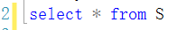

## 运算符

### 算术运算符
```
+ + - * / % 均可，但日期和时间类型只能使用加或减
```

### 比较运算符

返回布尔值，有三种： true， false，unknown
只能用于 if 等语句中，不能直接输出布尔值
注意其中三个：

```
等于为 =
不等于为 <>
unknown 类型的布尔值
```

### 逻辑运算符

```
or
and
not
```

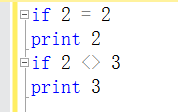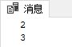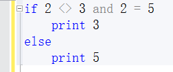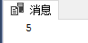

## 注释

```
--
/* */
```


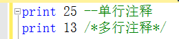

### 存在运算符

`exists`

```sql
create database [if not exists] 数据库名 ...
create table [if not exists] 表名 ...
```

## 转义字符

SQL 不支持转义字符，需要回车符和换行符时可在字符串中加入：

- char(10) —— 换行符
- char(13) —— 回车符

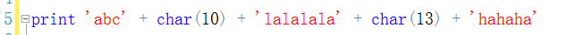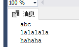

## 模糊匹配 like

`like` 与正则表达式不同，只有四种匹配模式：

- `%`

	$0$ 个或多个字符。

- `_`

	单个字符。

- `[]`

	括号内所列字符中的某一个。

- `[^ ]`

	不是括号内字符的任一个。

注意，若要匹配特殊字符，将其用 `[]` 括起来即可：`[%]` 。

## 常用系统函数

### 字符串函数

```
SubString(表达式,起始,长度)	
取子串	    SubString('ABCDEFG',3,4)

Right(表达式,长度)
右边取子串	Right('ABCDEFG',3)

Str( 浮点数 [,宽度 [,小数位] ] )
数值型转换字符型	    Str(123.4567,6,2)
不止可以传浮点数，只要是数值型都可以传

LTrim(表达式)	
去左空格		LTrim(字段名)

RTrim(表达式)
去右空格		RTrim(字段名)

CharIndex(子串,母串)
返回子串起始位置	CharIndex('BCD','ABCDEFG')
```

### 类型转换函数

```
Convert(数据类型[(长度)],表达式[,日期转字符样式])
表达式类型转换	
样式有1:mm/dd/yy，5:dd-mm-yy，11:yy-mm-dd，23:yyyy-mm-dd等等

Convert(varchar(100),GetDate(),1)
注：当前日期转换为字符串

Cast(表达式 As 数据类型[(长度)])
表达式类型转换  	

Cast(23 As nvarchar)
注：数值转字符串
```

### 数值函数

```
Abs(表达式)
取绝对值		Abs(-123)

Power(底,指数)
底的指数次方	Power(4,5)

Rand([整型数])	
随机数产生器	Rand(1)

Round(表达式,精度)	
按精度四舍五入	Round(12.3556,2)

Sqrt(表达式)	
算术平方根	Sqrt(16)
```

### 日期函数
```
GetDate()
当前的日期和时间	GetDate()

Day(表达式)
表达式的日期值	Day(GetDate())

Month(表达式)
表达式的月份值	Month(GetDate())

Year(表达式)
表达式的年份值	Year(GetDate())

DateAdd(标志,间隔值,日期)
日期间隔后的日期	
标志有YY：年份，MM：月份，DD：日

DateAdd(MM,2,GetDate())
注：两个月后的日期

DateDiff(标志,日期1,日期2)
标志有YY：年份，MM：月份，DD：日
日期2与日期1的差	

DateDiff(YY,Birthday,GetDate())
注：YY 则是计算年龄
```

### 判断函数

```
IsDate(表达式)
是否合理日期	IsDate(GetDate())

IsNULL(是否空值,替代值)
若空用指定值代替	IsNULL(Sex,'男')

IsNumeric(表达式)
是否为合理的数值	IsNumeric(表名.列名)

Exists(子查询)
检查结果集	Exists(Select * From 表名)
```

### 统计函数

（参数默认NULL）（又称聚合函数，聚集函数）

```
Avg([Distinct 列名])
取均值	Avg(列名)

Count([Distinct 列名])
行数	Count(Distinct 列名)

Max([Distinct 列名])
最大值	Max(列名)

Min([Distinct 列名])
最小值	Min(列名)

Sum([Distinct 列名])
求和Sum(列名)
```