# 多表查询

- 为避免混淆，可对列名加表名前缀。
- 对同一表，可取多个别名。

## 注意

多表查询可以分为：

1. 连接查询

  - 内连接：相当于查询A、B交集部分数据

  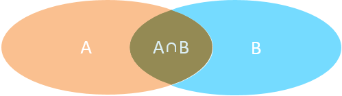 

2. 外连接

  - 左外连接：查询左表所有数据(包括两张表交集部分数据)

  - 右外连接：查询右表所有数据(包括两张表交集部分数据)

3. 子查询

对于 on 和 where：

- on 指定参与连接的行，满足的条件。
- where 对表或连接后的表的行进行筛选。

分析思维方式：

- 用左表的某些行（on 条件），分别对应右表的某些行（on 条件），对应出的过程表再用 where 条件过滤。

## 基本语法

### 直接 select

select 的 from 后直接跟多个表名（用逗号分隔）（相当于将其作笛卡尔积），然后使用条件进行约束。

### join ... on 语句

（根据连接类别关键字的不同效果不同）

```
select < 目标列 > [ , ... n ]
from < 表 1 >  [ 连接类别 ]   join < 表2 > on < 连接条件表达式 > [ , ... n ]
若没有指定连接类别则默认为内连接（等值连接）
```

## 连接类别

| 英文 | 中文 |
| ---- | ---- |
| natural			|		自然连接 |
| inner				|	内连接（等值连接）|
| left（left outer）		|	左外连接 |
| right（right outer）	|	右外连接 |
| full					|	全外连接 |
| cross（不指定 on ）	|	交叉连接（笛卡尔积） |
| 条件不是等式			|	不等值连接 |
| 自连接	|	表自己与自己连接 |

- **注意，SQLserver 不支持自然连接 ( Natural join )**
	自然连接 ( Natural join ) 是一种特殊的等值连接，要求两个关系表中进行比较的属性组（多个列）必须是名称相同的属性组，并且在结果中把重复的属性列去掉（即：留下名称相同的属性组中的其中一组）。
	- 自然连接无需指定连接条件，它以相同的属性组作为等值条件。

## 示例

有以下表：

```sql
use myKU
create table A
(
number int not null,
name nchar(10) not null,
age int null, 
sex bit not null,
)
create table B
(
number int not null,
class nchar(10) null,
teachar nchar(10) null,
)
```

如下参数：

```sql
use myKu
insert into A
values( 1000, '小明', 17, 1 )
insert into A
values( 1001, '小张', 18, 1 )
insert into A
values( 1005, '小王', 17, 1 )
insert into A
values( 1003, '小李', 21, 1 )
insert into A
values( 1004, '小红', 19, 0 )
insert into A
values( 1002, '小兰', 17, 0 )

insert into B
values( 1000, 'C语言', '老张' )
insert into B
values( 1004, 'C语言', '老张' )
insert into B
values( 1002, 'C语言', '老张' )
insert into B
values( 1003, 'C语言',  '老张' )
insert into B
values( 1000, '数据结构', '老李' )
insert into B
values( 1001, '数据结构', '老李' )
insert into B
values( 1004, '数据结构', '老李' )
insert into B
values( 1005, '数据结构', '老李' )
```

左为 A 表，右为 B 表。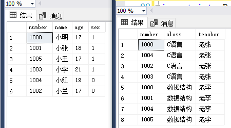

### 隐式内连接

```sql
select * A, B where A.number = B.number;
```

### 显式内连接（ inner ）（等值连接）

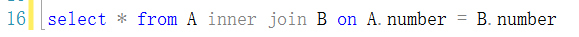

相同 number 连接起。（红框表明这是等值连接，不是自然连接）

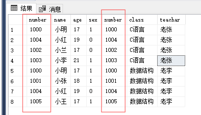

与自身连接，取两个别名：（查询学生中年龄大于等于 1001 号学生的学生信息）

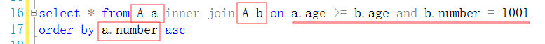

1. 注意取别名的方式；
2. 符合上图条件表达式的元组才会被连接起来，可以看出右部分的元组都相同
3. 指定了按 a.number 排序，也可按 b.number 排序

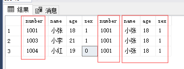

### 内连接区分

- **隐式内连接**是对两张表所有行作笛卡尔积，然后用 where 筛选。
- **显式内连接**是对符合**连接条件**（用 on 指定）的行作笛卡尔积。

### 外连接

- join ... on 是先找到满足条件的两个表的元组，再将它们连接起来 。
- 外连接只能用于两个表中。
- 外连接即是保留指定表的不满足条件的元组（即被舍弃的元组）的自然连接。
- 被舍弃的元组会被去重，即同一元组被舍弃多次时只保留一项。

以下不加 outer 效果等价

#### 左外连接（ left 或 left outer）

只保留左边表被舍弃元组，右边表的属性若不匹配则为空。

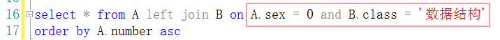

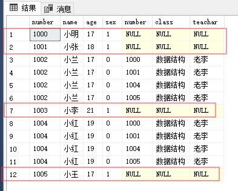

- 保留左边表被舍弃元组，相当于保留左边表所有的元组。
- 两张表连接后的新元组中，红框区域为不满足条件的元组。

### 右外连接（ right 或 right outer）

只保留右边表被舍弃元组，左边表的属性若不匹配则为空。

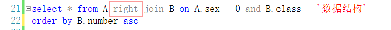

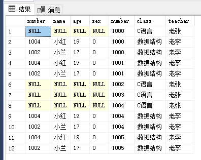

- 保留右边表被舍弃元组，相当于保留右边表所有的元组。

#### 全外连接（ full ）

左右表被舍弃的元组都被保留，不匹配的属性则为空。

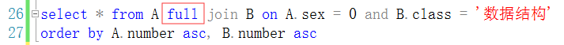

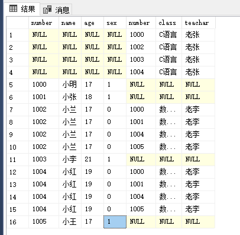

### 交叉连接（ cross ）（即笛卡尔积）

没有连接条件下两个表的连接，**分别将左表的每一行再分别与右表的每一行连接起来**（二重循环），保留两个表的所有元组。

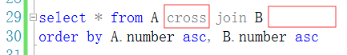

注意：join ... on 子句在此时不能指定 on 。

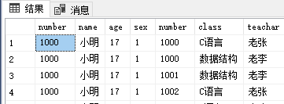

…………（省略)

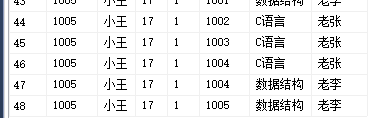

结果共48行。
