# 子查询和游标机制

- 子查询即 select 嵌套查询。
- 外层的 select 语句称为父查询或外查询。
- 内层的称为子查询或内查询。
- 可使用多个子查询，可使用 and 或 or 等关键字连接。

## 集合比较运算符

| 名称 | 意义 |
| - | - |
| all |	一系列比较都为 true，那么结果为 true |
| any 或 some	|若比较中有一个为 true，则结果为 true |
| between|	如果操作数在某个范围内，就为 true（左闭右闭） |
| exists	| 如果子查询包含一些行，即不为空，则为 true |
| not	| 以上运算符取反 |

## 无关子查询

首先执行子查询，得到的结果传递给父查询使用。

示例：查询学数据结构的所有女性的信息。

第一步：得到学数据结构的所有人

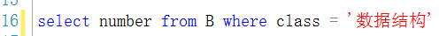

第二步：得到所有女性的信息

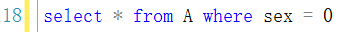

组合：

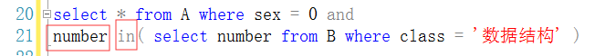

- 如果子查询的结果是 一个 数值，则可以将 in 替换为 = 号。
- 子查询的 select 不能使用 order by 语句（也没有必要），该语句只能对最终结果排序 。

## 相关子查询

子查询引用了父查询表中的表，则称相关子查询。

执行流程：

1. 父查询每处理一个元组，就将该被引用的元素传递给子查询，然后执行子查询。
2. 子查询的结果供父查询使用，父查询返回最终结果。
3. 不断重复，直到处理完父表的所有元组。

### 比较子查询

父查询使用比较运算符，子查询返回数据以供父查询比较。

### 存在子查询

子查询使用 exists，该子查询不需要返回任何数据，只产生逻辑值 true 或 false ，因此其子查询的 `< 目标列表达式 >` 一般用 `*` 表示，即 `< * >` 。

## 表数据维护的子查询

- 对于 insert 子查询：

	示例：新建一张选课表，存储学号，年龄及课程名。

	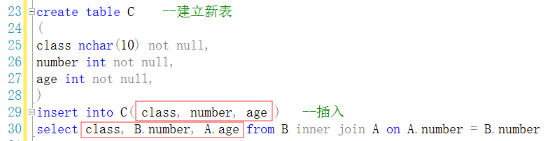

	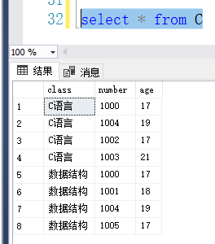

- 子查询还可以用在 update 和 delete 语句里，用于构造更新或删除条件：

	示例：删除 C 表中所有女学生的选课记录

	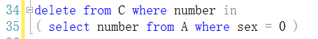

	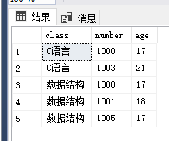

## 游标机制

游标相当于指针，指向某个元组，通过游标可以对查询结果集中的每一个元组执行不同的操作。

分类:
- Transact-SQL 游标
- API 游标
- 客户游标
（目前只学习了 Transact-SQL 游标）

## Transact-SQL 游标

操作游标的 5 个基本步骤：
1. 声明
2. 打开
3. 读取
4. 关闭
5. 释放

### 声明游标

declare cursor 语句

```
declare < 游标名 > [ insensitive ] [ scroll ] cursor
for < select 语句 >
[ for < read only | update [ of < 列名 > [ , ... n ] ] > ]

insensitive —— 定义的游标所选出的元组存放在临时表中（ temppdb 数据库），对该游标的操作都由临时表应答。对基本表的修改不会影响游标读取的数据，也无法通过游标更新基本表。如果不使用该关键字，则对基本表的修改都会反映到游标中。

scroll —— 指定读取时游标可以使用的读取选项，默认为 next，若不使用该保留字，则只能使用 next，反之能使用以下所有操作.
```

被读取的行会在读取后变为当前行.


| 选项       | 操作内容                                        |
| ---------- | ----------------------------------------------- |
| first      | 读取游标中的第一行数据                          |
| last       | 读取游标中的最后一行数据                        |
| prior      | 读取当前位置的上一行数据                        |
| next       | 读取当前位置的下一行数据                        |
| relative n | 读取当前位置之前或之后的第 n 行数据（正前负后） |
| absolute n | 读取游标中的第 n 行数据                         |

```
< select 语句 > —— 定义结果集

read only ——只读游标，不允许使用 update 或 delete 语句更新游标内的数据。默认状态允许更新。

update of < 列名 >  —— 指定游标内可以更新的列，不指定为允许所有列更新。
```

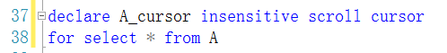

### 打开游标

open 语句。

```
open [ local | global ] < 游标名 > | < 游标变量名 >

local | global —— 指定为 局部( local )或者 全局( global ) 游标，
若未指定，则默认值由 default to local cursor 数据库选项的设置控制
如果一个全局游标与一个局部游标同名，则要使用 global 表明其是全局游标。

游标变量名：游标变量的名称，该名称可以引用一个游标。
```

- 执行打开游标语句时，将执行声明游标时使用的 select 语句。
- 若声明使用了 insensitive 选项，则会建立一个临时表，存储游标将要进行操作的结果集的副本。
- 打开游标后，游标位于结果集的第一行。


### 读取游标

fetch 语句。

```
fetch [ scrool 读取选项 ]
[ from ]
[ global ] < 游标名 > | < 游标变量名 >
[ into @变量名 [ , ... n ] ]

global	指定游标为全局游标
into	允许读取结果存放在多个变量中。在变量行中的每个变量必须与结果集中相应的属性对应。
```

读取选项：与声明游标的选项内容一直。（被读取的行会在读取后变为当前行）

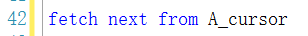

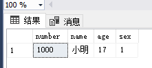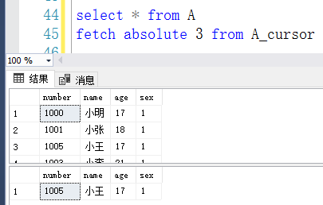

### 关闭游标

close 语句。

```
close [ global ] < 游标名 > | < 游标变量名 >
```

在处理完结果集的数据后，必须关闭游标释放结果集。close 语句关闭游标，但不释放与游标相关的资源。

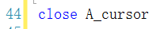

### 释放游标

deallocate 语句.

```
deallocate [ global ] < 游标名 > | < 游标变量名 >
```

不再需要游标后，释放游标，以释放与游标有关的一切资源。

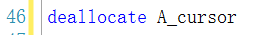

### 应用

#### update 语句利用游标修改数据

（对当前行）

```
update < 表名 >
set < 列名 > = < 表达式 > | default | null [ , ... n ]
where current of [ global ] < 游标名 > | < 游标变量名 >
```

#### delete 语句利用游标删除数据
（对当前行）

```
delete < 表名 >
where current of [ global ] < 游标名 > | < 游标变量名 >
```

#### 注意

- 声明时使用了 insensitive 选项的游标不能修改基本表

- 静态游标也不能修改数据

- 对于错误 16929 最常见的原因是引用不具有主键约束或唯一索引的表的游标。在这种情况下只需创建一个主键约束或唯一索引在表上。如果使用 16929 错误的原因是声明 CURSOR 命令违反了用于可更新游标限制，修改声明即可。

	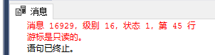

	（即对于没有主键约束或者唯一索引的表，无法使用游标修改数据）

## 游标系统变量与函数

可根据其构建循环选择等操作。

### @@cursor_rows

返回最后打开的游标中满足条件的元组数

```
返回值含义：
-m —— 游标被异步填充，返回的值 m 是键集当前的行数
-1 —— 游标为动态游标，不能确定已检索的所有符合条件的行
0 —— 游标未打开
n —— 游标已完全填充，返回值 n 是游标中的总行数
```

### @@fetch_status

返回上次执行 fetch 命令的状态。

```
返回值含义：
0 —— fetch 语句成功
-1 —— fetch 语句失败或元组不在结果集中
-2 —— 被读取的元组不存在
```

### cursor_status 函数

返回游标的存在状态。

语法：
```
cursor_status   
     (  
          { 'local' , 'cursor_name' }   —— 本地游标
          | { 'global' , 'cursor_name' }   —— 全局游标
          | { 'variable' , 'cursor_variable' }   —— 局部游标变量
     )  
```

返回值为 smallint 类型。

| 返回值 | 游标名称                                                     | 游标变量                                                     |
| ------ | ------------------------------------------------------------ | ------------------------------------------------------------ |
| 1      | 游标结果集至少有一行。 对于不敏感和键集游标，结果集至少有一行。 对于动态游标，结果集可以有零个，一个或多个行。 | 分配给这个变量的游标是打开的。 对于不敏感和键集游标，结果集至少有一行。 对于动态游标，结果集可以有零个，一个或多个行。 |
| 0      | 游标结果集为空。*                                            | 分配给此变量的游标已打开，但结果集肯定是空的。*              |
| -1     | 光标关闭。                                                   | 分配给此变量的游标已关闭。                                   |
| -2     | 不适用。                                                     | 具有以下其中一种可能性： 之前调用的过程未将游标分配给此OUTPUT变量。 先前分配的过程将光标分配给此OUTPUT变量，但过程完成时光标处于关闭状态。因此，游标被释放，并且不返回到调用过程。 没有游标被分配给声明的游标变量。 |
| -3     | 具有指定名称的游标不存在。                                   | 具有指定名称的游标变量不存在，或者如果存在，则游标尚未分配给它。 |