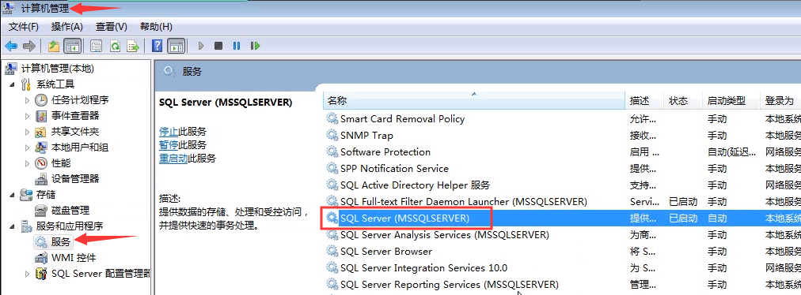

# 基本事项

## SQL

**Transact-SQL** 是微软对 SQL server 中的 SQL 语言具体实现，是微软对 SQL 的扩展，具有 SQL 的主要特点。

## SQL Server 文件扩展名

- 新建查询生成的文件扩展名为	 .sql
- 主数据文件扩展名为		 .mdf
- 辅助数据文件扩展名为		 .ndf
- 事务日志文件扩展名为		 .ldf

## 杂项

- 如果登录不上，进入图示界面，打开其服务：

	

- 数据库的构建理论参见书籍，语法与操作看此笔记

## 杂项

- Ctrl+Shift+R
（建议做出某种更改后都使用一次）
在 SQLServer 中，当设计（修改）表结构之后，再用 SQL 语句时，列名会显示无效，但执行可以通过
原因是SQL Server 的 intellisense（智能感知功能）需要重新整理一下，用快捷键 Ctrl+Shift+R 即可

- 查询选项
右键点击空白处，设置查询选项，可改变网格和消息输出框的形式。

- go
  （go 不是 Transact-SQL命令，是 SSMS 划分语句的标记）
  将 go 以上到最前端或另一个 go 之间的语句作为一个批处理，即作为一个整体。每个整体间的语句无关。
  示例：

  

  
  
  上方报错：@a 在批处理后已经失效。
  
- Ctrl + R
隐藏查询结果选项卡