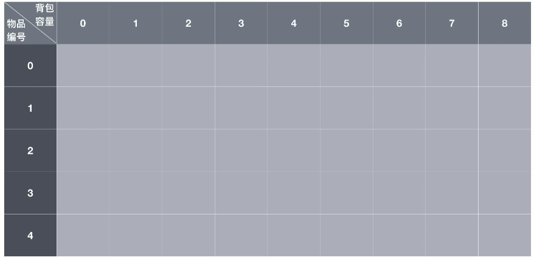
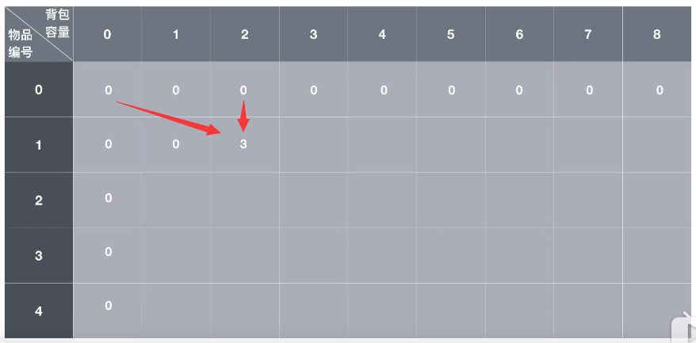
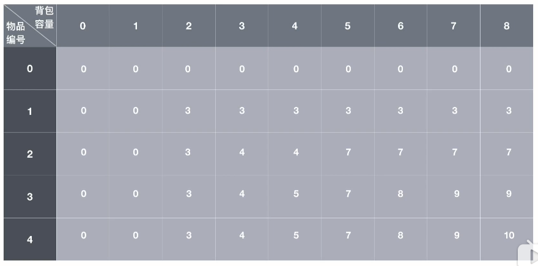

# 背包问题

是有限制选取问题的别称。

## 引例

下面由自上而下的记忆化搜索导出自下而上的背包动规。

```c++
现在有 4 个物品，背包总容量为 8，背包最多能装入价值为多少的物品？
id 物品编号：1、2、3、4
weight 物品重量：2、3、4、5
value 物品价值：3、4、5、6
```

### 递推式

设 $f(k, m)$ 为前 $k$ 个物品放入容量为 $m$ 的背包中的最大价值
我们要求得的最终答案为 $f(4, 8)$
示意图：


递推式如下：（也是状态转移方程）

$f(k, m) = max( f(k-1, m),   value[k] + f( k-1, m-weight[k] )  )$

（其中 $k-1$ 和 $m-weight[k]$ 要注意是否够减）

边界条件：

$f(k, m) = 0$, $k <= 0$ 或者 $m <= 0$ 时

### 递归（自上而下）

注：opt 意为“选择”.

```c++
#include<cstdio>
#include<algorithm>

int weight[5] = {0, 2, 3, 4, 5};
int value[5] = {0, 3, 4, 5, 6};

int opt(int k, int m) {   //处理到第 k 个物品是否选择
    if (k <= 0 || m <= 0) {   //第 0 个物品或背包容量小于 0 了
        return 0;
    }
    return std::max(opt(k-1, m), weight[k] <= m ? value[k]+opt(k-1, m-weight[k]) : 0 );   //注意查看是否放得下
}

int main(void) {
    printf("%d\n", opt(4, 8));    
    return 0;
}
```

### 记忆化搜索（自上而下）

直接递归会有许多重叠子问题，使用记忆化搜索。

```c++
#include<cstdio>
#include<algorithm>

int weight[5] = {0, 2, 3, 4, 5};
int value[5] = {0, 3, 4, 5, 6};
int bag[5][9];   //注意数组大小

int opt(int k, int m) {   //处理到第 k 个物品是否选择
    if (k <= 0 || m <= 0) {   //第 0 个物品或背包容量小于 0 了
        return 0;
    }
    if (bag[k][m] != 0) {
        return bag[k][m];
    }
    int ans = opt(k-1, m);
    if (weight[k] <= m) {   //注意这里要等号
        ans = std::max(ans, value[k] + opt(k-1, m-weight[k]));   //注意查看是否放得下
    }
    bag[k][m] = ans;
    return ans;
}

int main(void) {
    printf("%d\n", opt(4, 8));    
    return 0;
}
```

## 01 背包

一般能将 $O(2^n)$ 量级转化为 $O(n^2)$ 量级。

01 背包是”选与不选的问题“。

每种物品最多能放一个。（可为 $0$ 个或 $1$ 个）

```c++
题目数据：
现在有 4 个物品，背包总容量为 8，背包最多能装入价值为多少的物品？
id 物品编号：1、2、3、4
weight 物品重量：2、3、4、5
value 物品价值：3、4、5、6
```

### 过程分析



上图：动规数组（其中第 4 行第 8 列是要求的最终答案）


上图：初始状态

- 第 0 行都为 0，因为没有物品，所以最大价值为 0

- 第 0 列都为 0，因为背包没有空间，所以最大价值为 0


上图：第 1 行第 1 列，第一个物品无法放入容量为 1 的背包中，与第 0 行第 1 列相等，最大价值为 0



上图：第 1 行第 2 列，第 1 个物品能够放入，面临两种情况：

1、不放第 1 个物品，最大价值与容量为 2 放前 0 个物品相同，最大为 0

2、放第一个物品，第 1 个物品重量为 2，故最大价值 = 本身价值 3 + 容量为 2 - 2（背包容量减重量） 的背包放前 0 个物品的最大价值（即第 0 行第 0 列）最大价值为 3

两种情况综合，最大价值为 3


上图，类比，填满第 1 行。

对于第 2 行第 1 列，无法放入第二个物品，最大价值为 0。

对于第 2 行第 2 列，无法放入第二个物品，最大价值与容量为 2 的背包放前 1 个物品相等，为 3


上图：第 2 行第 3 列，第 2 个物品重量为 3，背包容量为 3，能够放入，面临两种情况。

1、不放第 2 个物品，最大价值与容量为 3 的背包放前 1 个物品相等，为 3

2、放第 2 个物品，第二个物品重量为 3，故最大价值 = 自身价值 4 +  容量为 3-3（背包容量减重量）的背包放前 1 个物品的最大价值（即第 1 行第 0 列）最大价值为 4,

两种情况综合，最大价值为 4



上图：类比，填满，第 4 行第 8 列就是最终答案。

### 解法归纳

@正月点灯笼

1. 如果装不下当前物品，那么前 $n$ 个物品的最佳组合和前 $n-1$ 个物品的最佳组合是一样的。
2. 如果装得下当前物品。
	1. 假设 A，装当前物品，在给当前物品预留了相应空间的情况下，前 $n-1$ 个物品的最佳组合加上当前物品的价值就是总价值。
	2. 假设 B，不装当前物品，那么前 $n$ 个物品的最佳组合和前 $n-1$ 个物品的最佳组合是一样的。
	3. 选取假设 A 和假设 B 中较大的价值，即是当前最佳组合的价值。

### 状态转移方程

$f(k, m) = max( f(k-1, m),   value[k] + f( k-1, m-weight[k] )  )$

（其中 $k-1$ 和 $m-weight[k]$ 要注意是否够减）

边界条件：

$f(k, m) = 0$, $k <= 0$ 或者 $m <= 0$ 时

### 基本代码

```c++
#include<cstdio>
#include<algorithm>

int weight[5] = {0, 2, 3, 4, 5};
int value[5] = {0, 3, 4, 5, 6};
int bag[5][9];   //注意数组大小

int dp(int k, int m) {   //处理到第 k 个物品是否选择
    for (int i = 1; i <= k; ++i) {   //第 i 个物品
        for (int j = 0; j <= m; ++j) {   //背包容量 j
            bag[i][j] = std::max(bag[i-1][j], weight[i] <= j ? value[i] + bag[i-1][j-weight[i]] : 0);
        }
    }
    return bag[4][8];
}

int main(void) {
    printf("%d\n", dp(4, 8));    
    return 0;
}
```

### 滚动数组（空间优化）

观察可以发现，每新填写一行，只需要上一行的数据，故可以交替使用两行数组得出结果。

运用取余运算，以时间换空间。

注意最终答案的位置，必要时使用变量记录位置。

```c++
#include<cstdio>
#include<algorithm>

int weight[5] = {0, 2, 3, 4, 5};
int value[5] = {0, 3, 4, 5, 6};
int bag[2][9];   //注意数组大小

int dp(int k, int m) {   //处理到第 k 个物品是否选择
    for (int i = 1; i <= k; ++i) {   //第 i 个物品
        for (int j = 0; j <= m; ++j) {   //背包容量 j
            bag[i%2][j] = std::max(bag[(i-1)%2][j], weight[i] <= j ? value[i] + bag[(i-1)%2][j-weight[i]] : 0);
        }
    }
    return bag[k%2][8];   //注意最终答案的位置
}

int main(void) {
    printf("%d\n", dp(4, 8));    
    return 0;
}
```

### 一维滚动数组（空间再优化）

（这里时间上也是最优的）

观察可以发现，每一行的某个数据，决定于它正上方的上一行相同列的数据，和上一行减去重量列的数据。

同时，当前行前方的数据不影响当前行后面的数据。

可以从每一行最后一列向前填充，不断刷新数组，最终得到答案（倒序）

注意：
倒序可以减少转移方程中防止越界的大小判断，即三目运算符。

同样注意最终答案的位置，必要时使用变量记录位置。

（这里最后一行可以提早终止）

状态转移方程：
$f(k) = max( f(k-1),   value[k] + f( m-weight[k] ) )$

```c++
#include<cstdio>
#include<algorithm>

int weight[5] = {0, 2, 3, 4, 5};
int value[5] = {0, 3, 4, 5, 6};
int bag[9];   //注意数组大小，只需要一行了

int dp(int k, int m) {   //处理到第 k 个物品是否选择
    for (int i = 1; i <= k-1; ++i) {   //第 i 个物品，k-1 ：最后一行可以提早终止
        for (int j = m; j >= weight[i]; --j) {   //背包容量 j, 倒序填充
            bag[j] = std::max(bag[j], value[i] + bag[j-weight[i]]);
        }
    }
    bag[8] = std::max(bag[8], weight[k] <= 8 ? value[k] + bag[8-weight[k]] : 0);
    return bag[8];   //注意最终答案的位置
}

int main(void) {
    printf("%d\n", dp(4, 8));    
    return 0;
}
```

### 注意

背包问题不一定比暴搜优，01 背包依赖于数量和容量，当容量特别大但数量较少时，暴搜也可能较优。

[171. 送礼物 - AcWing题库](https://www.acwing.com/problem/content/173/)

## 完全背包

```c++
现在有 N 种物品，每种物品有无限个，其重量 weight[i]，价值为 value[i]，背包总容量为 C(capacity)，背包最多能装入价值为多少的物品？

（以 01 背包中的数据为例）
背包容量为 8
id 物品编号：1、2、3、4
weight 物品重量：2、3、4、5
value 物品价值：3、4、5、6
```

### 暴力解法

每种物品可选多次，在 01 背包 的基础上增加一层循环，依次增加个数判断哪个个数产生的价值最大。

状态转移方程：

设某种物品枚举了 k 个

$f[i][c] = max( f[i-1][c], f[i-1][ c - weight[i]*k ] + value[i]*k )$

$( 1 <= k*weight[i] <= C )$

### 二进制组合优化

对于暴力解法，某种物品枚举了 k 个，只选一个值。可以使用二进制组合原理将每种物品枚举的次数变为 log k (2 为底)，选多个值再组合起来。

#### 原理

枚举时只枚举符合 $2^i$ 形式的个数值，即 1，2，4，8，16……

其在判断过程中重叠判断，即是将一种物品分为权值不同的多个物品，然后按照 01 背包方案求解。

例如：k = 3 = 11,  k = 11 = 1011

#### 组合限制

$2^i$ 中 $i$ 的值虽可以不断增大，但到 $2^i$ 超越限制数量的一半 $+1$ 时就要停止枚举。对于没有枚举到的数值，额外增加一步减法，求出不能组合出的差值.
注意：是超越限制数量的一半$+1$，而不是超越背包容量的一半$+1$

（若限制数量为 $7$：需要 $0，1，2，4$，额外为 $0$）
（若限制数量为 $5$：需要 $0，1，2$，额外为 $5-3 = 2$）
（若限制数量为 $8$：需要 $0，1，2，4$，额外为 $8-7 = 1$）

对限制数量为 $0$ 时也有效，因为背包问题会考虑不选的情况。

可以由背包容量和物品质量得出限制个数。

状态转移方程：

设某种物品枚举了 k 个

$f[i][c] = max( f[i-1][c], f[i-1][ c - weight[i]*k ] + value[i]*k )$

$( 1 <= k*weight[i] <= C$ 并且  $k = 1, 2, 4, 8, 16...)$

#### 实现

这个方式普遍适用。

- 将每种物品按照次数，等价为一定个数的相同物品，按照 01 背包方案求解。

- 开一个 01 背包形式的一维滚动数组或二维数组，注意数组大小。

- 相当于二维形式行增加，列不变。因为是模拟 01 背包，所以一维要倒序。

代码以一维滚动数组为例

```c++
#include<cstdio>
#include<algorithm>

int weight[5] = {0, 2, 3, 4, 5};
int value[5] = {0, 3, 4, 5, 6};
int bag[9];   //注意数组大小

int dp(int n, int C) {   //处理到第 n 个物品是否选择
    for (int i = 1; i <= n; ++i) {   //第 i 种物品
        int rest = C/weight[i];   //限制数量，rest 代表剩余的表示范围
        for (int k = 1; rest > 0; k <<= 1) {   //每种物品分为多个权值的物品，终止条件不能取等号
            if (k > rest) {   //超越范围则赋值，进行最后一趟扫描
                k = rest;
            }
            for (int j = C; j >= weight[i]*k; --j) {   //背包容量 j，在 j 的容量下是否放第 i 种物品
                bag[j] = std::max(bag[j], value[i]*k + bag[j-weight[i]*k]);
            }
            rest -= k;   //不断缩小剩余表示范围
        }
    }
    return bag[C];
}

int main(void) {
    printf("%d\n", dp(4, 8));    

    return 0;
}
```

### 正序优化

时间 $O(N*C)$
空间 $O(C)$ 一维滚动数组

注：以下
正序指列下标从小到大
倒序指列下标从大到小

一维滚动数组时的状态转移方程：
$f(i) = max( f(i-1),   value[i] + f( c-weight[i] )  )$

**将一维滚动数组时的 01 背包 改为正序填充即可。**

**差异体现在二维数组形式转化为一维滚动数组时，其指向的“旧数据”在二维数组中的位置不同。（虽然转移方程一致）**

#### 原理

##### 二维数组时

######  01 背包


可以正序填充每一行，也可以倒序填充每一行。

因为只需要上一行的（本列及本列前方的）数据。

但是转化为一维滚动数组就变成了只能倒序填充。

这保证了每个物品只被选择一次，即不被重复使用。

状态转移方程：
$f(i, c) = max( f(i-1, c),   value[i] + f( i-1, c-weight[i] )  )$

###### 完全背包

每个物品可以选择多次，即可以重复选择。

只能正序填充每一行。

因为要使用到上一行（本列前方的）和 当前行前方的 数据。

状态转移方程：

$f(i, c) = max( f(i-1, c),   value[i] + f( i, c-weight[i] )  )$

**注意以上两个状态转移方程在二维时的差异。**

意义解释：
```c++
前 i 个物品容量 c 时的最大价值 = max （ 
	前 i-1 个物品容量为 c 时的最大价值， 
	第 i 个物品价值 + 前 i 个物品容量为 c-weight[i] 时的最大价值
）
```

可以注意到，当前物品不断增加然后判断，背包容量被逐渐填充

（在每一行中，每填充一格的数据，都要判断是否要继续放当前物品）

（每增加 1 的容量，都要再次判断放不放当前物品）

id 物品编号：1、2、3、4

weight 物品重量：2、3、4、5

value 物品价值：3、4、5、6


上图：初始状态：（其中第 4 行第 8 列是要求的最终答案）


上图：

第 1 行第 1 列，1 号物品重量为 2 放不下，所以最大价值与第 0 行第 1 列相同。

第 1 行第 2 列，放得下一个 1 号物品，最大价值为 3。


上图：

第 1 行第 3 列：

1 号物品重量为 2，背包容量为 3，放得下，有两种情况：

- 不放 1 号物品，最大价值为 0

- 放 1 号物品，1 号重量为 2，所以由前 1 个物品，背包容量为 3-2 = 1 所得，最大价值为 3

比较以上两种情况，最大价值为 3.

第 1 行第 4 列：

背包容量为 3，放得下，有两种情况：

- 不放 1 号物品，最大价值为 0

- 放 1 号物品，1 号重量为 2，所以由前 1 个物品，背包容量为 4-2 = 2 所得，共放了两个 1 号物品，最大价值为 6

比较以上两种情况，最大价值为 6

**以此类推即可。**

### 二维代码

```c++
#include<cstdio>
#include<algorithm>

int weight[5] = {0, 2, 3, 4, 5};
int value[5] = {0, 3, 4, 5, 6};
int bag[5][9];   //注意数组大小

int dp(int n, int C) {   //处理到第 n 种物品是否选择
    for (int i = 1; i <= n; ++i) {   //第 i 种物品
        for (int j = 0; j <= C; ++j) {   //背包容量 j，在 j 的容量下是否放第 i 种物品
            bag[i][j] = std::max(bag[i-1][j], weight[i] <= j ? value[i] + bag[i][j-weight[i]] : 0);
        }
    }
    return bag[n][C];
}

int main(void) {
    printf("%d\n", dp(4, 8));    
    return 0;
}
```

### 一维滚动数组（完全背包最优版）

01 背包与完全背包的状态转移方程转化到此时，

注意：表面相同，但指代的意义不同（所指向的“旧数据”在二维中的位置不同），所以使用方式不同。

$f(i) = max( f(i-1),   value[i] + f( c-weight[i] )  )$

01 背包只能倒序填充，不断刷新每一行数据，即保证每个物品只使用一次。

完全背包只能正序填充，重复利用相同物品，即选择多次。

一维时状态转移方程中的判断是否放得下的条件表达式可以优化掉。

```c++
#include<cstdio>
#include<algorithm>

int weight[5] = {0, 2, 3, 4, 5};
int value[5] = {0, 3, 4, 5, 6};
int bag[9];   //注意数组大小

int dp(int n, int C) {   //处理到第 n 种物品是否选择
    for (int i = 1; i <= n; ++i) {   //第 i 种物品
        for (int j = weight[i]; j <= C; ++j) {   //背包容量 j，在 j 的容量下是否放第 i 种物品
            bag[j] = std::max(bag[j], value[i] + bag[j-weight[i]]);
        }
    }
    return bag[C];
}

int main(void) {
    printf("%d\n", dp(4, 8));    
    return 0;
}
```

## 多重背包

```c++
现在有 N 种物品，其重量 weight[i]，价值为 value[i]，背包总容量为 C(capacity)，对应限制的最大个数为 limit[i]  背包最多能装入价值为多少的物品？

背包容量为 8
id 物品编号：1、2、3、4
weight 物品重量：2、3、4、5
value 物品价值：3、4、5、6
limit 限制个数：3、1、2、3
```

### 暴力解法

每种物品可选多次，在 01 背包的基础上增加一层循环，对每个物品枚举 limit 次 01 背包的选取行为。

### 二进制组合优化

可以使用二进制组合原理将每种物品枚举的次数变为 log k (2 为底)，选多个值再组合起来。

对限制数量为 0 时也有效，因为背包问题会考虑不选的情况。

相当于二维形式行增加，列不变。因为是模拟 01 背包，所以一维要倒序.

（直接给出一维形式，二维形式略给

```c++
#include<cstdio>
#include<algorithm>

int weight[5] = {0, 2, 3, 4, 5};
int value[5] = {0, 3, 4, 5, 6};
int limit[5] = {0, 3, 1, 2, 3};
int bag[9];   //注意数组大小

int dp(int n, int C) {   //处理到第 n 个物品是否选择
    for (int i = 1; i <= n; ++i) {   //第 i 种物品，每种物品分为多个权值的物品
        int rest = limit[i];   //rest 为剩余范围
        for (int k = 1; rest > 0; k <<= 1) {   //注意循环终止条件，剩余范围小于 0 时退出循环
            if (k > rest) {   //当 k 超越剩余范围，即 rest 的值时，rest 会被赋给 k，进行最后的额外的一次处理
                k = rest;
            }
            for (int j = C; j >= weight[i]*k; --j) {   //背包容量 j，在 j 的容量下是否放第 i 种物品
                bag[j] = std::max(bag[j], value[i]*k + bag[j-weight[i]*k]);
            }
            rest -= k;   //将已经表示出的范围减去
        }
    }
    return bag[C];
}

int main(void) {
    printf("%d\n", dp(4, 8));    
    return 0;
}
```

此外，也可以用一个数组，存下每种物品拆分后的若干个物品数据，再按照 01 背包处理。

### 注意

二进制组合是将多重背包转化成了 01 背包求解，二进制组合分解出的物品中可能出现同样（权值）的两个物品，当同样的两个物品产生的重复会影响答案正确性时，二进制组合优化即失效。

详见《求方案数》。

### 单调队列优化？？？？？？？

## 混合背包

01 背包，完全背包，多重背包的混合。

```c++
现在有 N 种物品，其重量 weight[i]，价值为 value[i]，背包总容量为 C(capacity)，对应限制的最大个数为 limit[i]  背包最多能装入价值为多少的物品？

limit = -1 只能用 1 次
limit = 0 可以用无限次
limit > 0 可以用 limit 次

(1 代表一次，可将 -1 转换为 1，然后共用 01 背包与多重背包的代码)

背包容量为 8
id 物品编号：1、2、3、4
weight 物品重量：2、3、4、5
value 物品价值：3、4、5、6
limit 限制个数：2、-1、0、1
```

对每种物品，分别采用对应形式的背包的动态转移方程和遍历顺序即可。

```c++
#include<cstdio>
#include<algorithm>

int weight[5] = {0, 2, 3, 4, 5};
int value[5] = {0, 3, 4, 5, 6};
int limit[5] = {0, 2, -1, 0, 1};
int bag[9];   //注意数组大小

int dp(int n, int C) {   //处理到第 n 个物品是否选择
    for (int i = 1; i <= n; ++i) {   //第 i 种物品
        if (limit[i] == -1) {   // 01 背包
            for (int j = C; j >= weight[i]; --j) {   //倒序
                bag[j] = std::max(bag[j], value[i] + bag[j-weight[i]]);
            }
        } else if (limit[i] == 0) {   // 完全背包
            for (int j = weight[i]; j <= C; ++j) {   //正序
                bag[j] = std::max(bag[j], value[i] + bag[j-weight[i]]);
            }
        } else {   // 多重背包
            int rest = limit[i];
            for (int k = 1; rest > 0; k <<= 1) {   //二进制组合拆分，按照 01 背包解决
                if (k > rest) {
                    k = rest;
                }
                for (int j = C; j >= weight[i]*k ; --j) {   //注意这里要倒序
                    bag[j] = std::max(bag[j], value[i]*k + bag[j-weight[i]*k]);
                }
                rest -= k;
            }
        }
    }
    return bag[C];
}

int main(void) {
    printf("%d\n", dp(4, 8));    
    return 0;
}
```

## 二维背包

也叫二维费用背包，可扩展至多维背包。

多一维限制，多一维运算（多一层循环即可），相当于存储数据的数组每次扫描一行变为每次扫描一个矩阵。

01 背包形式时，倒序扫描矩阵；
完全背包形式时，正序扫描矩阵；
多重背包形式时，多拆分一维的物品。

```c++
现在有 N 种物品，其重量 weight[i]，价值为 value[i]，体积为 volume[i]，背包重量总容量为 W，体积总容量为 C(capacity)，背包最多能装入价值为多少的物品？

（01 背包形式）
背包载重为 8，体积为 7
id 物品编号：1、2、3、4
weight 物品重量：2、3、4、5
volume 物品体积：3、1、2、2
value 物品价值：3、4、5、6
```

代码：（增大数组，增加循环，确定方向）

```c++
#include<cstdio>
#include<algorithm>

int weight[5] = {0, 2, 3, 4, 5};
int value[5] = {0, 3, 4, 5, 6};
int volume[5] = {0, 3, 1, 2, 2};
int bag[9][8];   //注意数组大小

int dp(int n, int W, int C) {   //处理到第 n 个物品是否选择
    for (int i = 1; i <= n; ++i) {   //第 i 种物品
        for (int j = W; j >= weight[i]; --j) {
            for (int k = C; k >= volume[i]; --k) {
                bag[j][k] = std::max(bag[j][k], value[i] + bag[j-weight[i]][k-volume[i]]);
            }
        }
    }
    return bag[W][C];
}

int main(void) {
    printf("%d\n", dp(4, 8, 7));    
    return 0;
}
```

## 分组背包

有 N 个物品，分为 K 组，**每一组最多只能选择一个**，背包容量为 C，最大价值是多少？

对每一组，每个容量，每个物品进行枚举。

注意，单纯的分组背包，其 dp 数组只需要一维。

### 枚举顺序

- 分组背包枚举顺序
	1. 枚举**各组**
	2. 倒序枚举**容量**
		- 正序枚举容量会导致错误，新旧状态的覆盖会出错。
		- 倒序是因为优化了一维。原本：$f[K][C]$（第 $K$ 组，$C$ 容量），倒序优化：$f[C]$ 。
	3. 枚举各**组内物品**
- **先枚举组再枚举容量然后枚举物品**，即一个容量下，枚举完一组中所有物品后再枚举下一个容量，保证每一组只选一个。
- **容量要倒序枚举，但单个组内并不是 01 背包，而是组内多个中只选一个，组和组之间才是 01 背包。**
- 若先枚举物品再枚举容量则和 01 背包没有区别，每一组将会选择多个。

### 代码模板

（注意判断是否装得下）

```c++
    for (int i = 1; i <= K; ++i) {   // 第 i 组
        for (int j = C; j > 0; --j) {   // 背包容量，倒序
            for (int k = 1; k <= number[]; ++k) {   // 第 k 个物品
                if (j >= weight[k]) {
                    bag[j] = std::max(bag[j], value[k]+bag[j-weight[k]]);
                } else {
                    break;
                }
            }
        }
    }
    return bag[C];
```

### 引申

- 若每组可选多个物品，不限定每组的容量，则整个问题等价于完全背包。
- 若每组可选多个物品，限定每组的容量，则整个问题等价于多背包问题。

### 分组背包泛化

将组，容量和物品的意义泛化，转化。

- 没有分组就创造分组，**对所有物品**按某种规则进行分组。（相当于**加隔板**）
- 容量的泛化一般较简单。
- 没有物品创造物品。

例子见《有依赖的背包》

## 有依赖的背包

属于一种树形 dp。

### 描述

有一些物品，其中有主件物品和附件物品，要选择附件必须先选择其主件。一个主件可有多个附件，一个附件只有一个主件且不出现循环依赖。整个依赖关系构成无环的**森林**（多棵树要添加虚拟结点）。

（实际上，该原理在 DAG 上仍然适用）

如果依赖关系产生的情况比较少，可以将问题转化为分组背包，将主件和其附件的全部组合情况放在一组当中。

一组：

- 不选主件
- 主件 + 附件 1
- 主件 + 附件 2
- 主件 + 附件 1 + 附件 2
- ……

### 方法

对每个节点的子节点（每个主件的附件），用组合背包方案，求出其各容量对应的各种组合的最大价值，然后与主件的价值进行综合，即可得出选了每个主件与其附件的各容量下的最大价值。（使用 dfs 搜索森林）(要预留主件的空间)

### AcWing 10 有依赖的背包问题？？？？？？？

https://www.acwing.com/problem/content/10/

有 N 个物品和一个容量是 V 的背包。
物品之间具有依赖关系，且依赖关系组成一棵树的形状。如果选择一个物品，则必须选择它的父节点。

如下图所示：


如果选择物品5，则必须选择物品1和2。这是因为2是5的父节点，1是2的父节点。
每件物品的编号是 i，体积是 vi，价值是 wi，依赖的父节点编号是 pi 。物品的下标范围是 1…N。
求解将哪些物品装入背包，可使物品总体积不超过背包容量，且总价值最大。输出最大价值。

#### 将分组背包原理泛化

分组背包枚举顺序：

1. 每一组。
2. 倒序的容量。
3. 组内的物品。

有依赖的背包**枚举顺序**：（对于 $r$ 为根的子树）

1. $r$ 的孩子 $son$。

	- 没有明确的分组，所以要创造分组，每个物品是某一容量下的某个组合，所有组合情况构成一个分组。
	- 可行的方法：依据各孩子为根的子树 划分 分组。（主件有多少个孩子，就划分多少个分组）
	
2. 倒序的容量 $j$。

	即倒序枚举所有子树的总容量。

3. 以该结点孩子为根的子树可能分配的容量 $k$。

	- 该子树的某个容量对应其的一个最佳组合。
	- 剩余所有子树在容量 $j-k$ 下亦对应一个最佳组合。
	- 两个最佳组合是一一对应的，构成一个 $j$ 容量下的一个组合，即构成一个物品。
	- 枚举 $k$ 即枚举第 $son$ 组的物品。

综合**主件价值**：

1. 放得下主件的，综合上主件的价值。
2. 放不下主件的，将其置为 $0$ 。

#### 状态转移方程

$f[r][j]$ ：选了当前主件 $r$ 和附件时在 $j$ 容量下的最大价值。

分组背包倒序枚举容量，在有依赖的背包中，将 $f[r][son][j]$ 优化为了 $f[r][j]$ ，注意其优化的是中间第 $son$ 组的那维。

分三步：

1、先对附件用分组背包方案：

$f[r][j] = max(f[r][j], f[son][k] + f[r][j - k])$

（此时 $f$ 代表当前还未选主件时，所有附件在各容量下的最大价值）

- 重要问题：

	由于此时还没有综合上主件的价值，所以 $f[r][j-k]$ 代表的是以 $r$ 为根结点的子树的在 $j-k$ 的容量下的最大价值（但不包括根结点的价值），此时， $f[son][k]$ 和 $f[r][j-k]$ 是否含有包含或相交关系？

- 回答：？？？？？？？？

	它们的和一定不是最大的，会被比较掉。是否会重复？？？？？若只有一个子结点是否会双倍？？？？？？

2、再把主件的价值综合上，即可得出 选了该主件和附件情况下的最大价值

$f[r][j] =f[r][j - v[r]] + w[r]$

3、放不下主件的，置为 $0$ 

$f[r][j] = 0, j<v[r]$ 。

#### 代码

叶子节点没有附件，但不能直接跳出，要把它的价值综合上（把它看成没有附件的主件），相当于完成一个初始化。

```c++
const int MAXN = 105;
int bag[MAXN][MAXN];   // bag[i][j] 为以 i 结点为根的子树在各背包容量 j 下的最大价值
int N, V;
int v[MAXN], w[MAXN];
std::vector<int> graph[MAXN];

void dfs(int r, int rest) {   // rest: 给当前节点和其孩子的剩余空间
    if (rest < v[r]) {   // 放不下孩子
        return;
    }
    for (int son : graph[r]) {   // 遍历孩子。对于叶子节点，将直接跳到综合阶段，完成叶子节点的初始化
     	dfs(son, rest - v[r]);   // 深入，需要一路将其依赖的主件的空间减去，因为主件必须被选，将其空间减去
        for (int j = rest - v[r]; j >= v[son]; --j) {   // 分组背包，枚举容量，预留了主件的空间
        	for (int k = 0; k <= j; ++k) {   // 枚举以 son 为根的子树占据的空间（不包含根）
             	bag[r][j] = std::max(bag[r][j], bag[son][k] + bag[r][j - k]);
         	}
      	}
    }
    // 综合主件价值部分
    for (int i = rest; i >= v[r]; --i) {   // 放得下主件的，把主件放进去，倒序放，以免重复
        bag[r][i] = bag[r][i - v[r]] + w[r];
    }
    for (int i = 0; i < v[r]; ++i) {   // 放不下主件的最大价值肯定为 0
        bag[r][i] = 0;
    }
    return;
}

int main(void) {
    scanf("%d %d", &N, &V);
    int root, t;
    for (int i = 1; i <= N; ++i) {
        scanf("%d %d %d", v + i, w + i, &t);
        if (t == -1) {
            root = i;
            t = 0;
        }
        graph[t].push_back(i);   // 使其父亲存储指向当前节点的下标
    }
    dfs(root, V);
    printf("%d\n", bag[root][V]);   // 全局最大价值就是根节点

    return 0;
}
```

## 重要引申

### 初始化细节

即**恰好装满**与**不必装满**的问题。

以 01 背包为例，其余背包类比即可。

#### 要求恰好装满时

在初始化时除了 $f[0]$ 为 $0$，其它 $f[1\ldots V]$ 均设为负无穷。

- 此时负无穷代表不能恰好装满。
- 二维数组时，是 $f[0][0]$ 为 $0$，其余为负无穷。
- 为防止计算机实际表示的负无穷逐渐增大，并变为正数，要在状态转移方程中增加判断。
- 获取最终答案时，要判断其数据是否符合意义。

#### 不必装满时

如果并没有要求必须把背包装满，而是只希望价格尽量大，初始化时应该将 $f[0\ldots V]$ 全部设为 $0$。

#### 原理

为什么呢？可以这样理解：初始化的 $f$ 数组事实上就是在没有任何物品可以放入背包时的合法状态。

如果要求背包恰好装满，那么此时只有容量为 $0$ 的背包可能被价值为 $0$ 的 $nothing$ “恰好装满”，其它容量的背包均没有合法的解，属于未定义的状态，它们的值就都应该是负无穷了。

如果背包并非必须被装满，那么任何容量的背包都有一个合法解“什么都不装”，这个解的价值为 $0$，所以初始时状态的值也就全部为 $0$ 了。(前 $0$ 个物品不必装满的最大（小）价值为 $0$)

这个原理完全适用于其它类型的背包问题。

#### 联系

两者状态转移方程一致，但意义不同。

对于最后还要扫描一行找最大值确定最终答案的情况：

- 该情况以每个容量的背包恰好装满的最大价值为意义，求不必装满的最大价值。
- 这种情况直接初始化为负无穷，可不添加判断，因为其最后必定有一个恰好被装满的容量。

#### 演示

构造以下数据：

```c++
现在有 4 个物品，背包总容量为 8，背包恰好装满时最多能装入价值为多少的物品？
id 物品编号：1、2、3、4
weight 物品重量：2、3、4、7
value 物品价值：3、4、5、13
```

可以看到，恰好装满时这题没有最大价值，因为不能恰好装满（这里是 01 背包），不必装满时最大价值为 13

以下为恰好装满时的图示：


上图：

初始化，除容量为 0 的背包能够被前 n 个物品装满外，其余都为负无穷（此处以 -1 代表负无穷）

注意：

- 最好增加判断，不仅要判断背包是否能装下当前物品，还要判断当前是否为负数（或负无穷）。
- 如果不判断，负无穷在运算过程中仍然可能不断增大。
- 在可以保证负无穷不会变为正数或 0 的情况下，可以不添加判断，但此时不能用 -1 代表负无穷（因为 -1 很可能会变成正数）。

```c++
//二维时的：(一维时保持原位置值不变即可)
bag[i][j] = std::max(bag[i-1][j], weight[i] <= j ? value[i] + bag[i-1][j-weight[i]] : -1);
//改为：
bag[i][j] = std::max(bag[i-1][j], weight[i] <= j && bag[i-1][j-weight[i]] != -1 ? value[i] + bag[i-1][j-weight[i]] : -1);
```

判断的添加方式以正序，倒序，以及其他情况具体而定，还可以使用临时变量，上面只是演示原理。

一维滚动数组时也要添加判断。

下方为二维时转移方程中各状态转移的图示：


上图：1 号物品重量为 2，此时背包容量为 1，无法恰好装满，填负无穷。


上图：能恰好装满，面临两种情况：
不放 1 号物品，没有恰好放满，负无穷
放 1 号物品，价值 3
综合以上两种，最大价值为 3


上图：-1（负无穷）在转移中加上了 1 号物品的价值 3，变为了正数，而 01 背包一种物品只能放一个，该背包容量无法恰好放满，应该填负无穷。（转移方程中添加判断可避免）

**将其纠正**：


上图：其余同理，填 -1（负无穷）


上图：2 号物品重量为 3，无法装入，故背包内只有 1 号物品，价值为 3


上图：2 号物品重量为 3，价值为 4，可以单独装满，比较后此时最大为 4


上图：2 号物品重量为 3，价值为 4，可以与 1 号刚好填满，综合比较后最大价值为 7，其余为 -1 


上图：自行分析第 3 行


上图：最终答案的位置为 -1，代表无法刚好装满容量为 8 的背包。

### 求具体解

最大价值的方案到底装了哪些物品？

要考虑初始化细节。恰好装满与不必装满的求具体解过程类似。

以 01 背包，完全背包为例，其它背包类比即可。

#### 方法

在二维数组形式下**回溯**是一般解法，但也可以建立一个数组保存回溯过程需要的状态，然后以其求出。

一维形式没有额外存储状态的数组是无法输出具体解的。

#### 01 背包

```c++
背包容量为 8
id 物品编号：1、2、3、4
weight 物品重量：2、3、4、5
value 物品价值：3、4、5、6
```


上图：是否装了 4 号物品？如果没装 4 号物品，那么容量 8 的背包 4 个物品的最大价值应该与容量 8 的背包 3 个物品最大价值相等。即若没装 4 号物品，则第 4 行第 8 列应与第 3 行 第 8 列相等。
上图不相等，所以装了 4 号物品，4 号物品重量为 5，故下一步判断第 3 行第 8-5 = 3 列


上图：是否装了 3 号物品？类比即可。3 号没有被装入。


上图：是否装了 2 号物品？不等即装了，2 号重量为 3


上图：是否装了 1 号物品？相等即没装。回溯结束。

##### 总结

从表的右下角开始回溯，如果发现前 $n$ 个物品的最佳组合的价值和前 $n-1$ 个物品最佳组合的价值一样，说明第 $n$ 个物品没有被装入，否则，第 $n$ 个物品被装入。

##### 注意

- 从最大价值位置开始回溯。

- 此处的最大价值位置刚好是右下角。（背包不必装满）

- 若要求背包刚好装满，必须一边对比容量是否符合，一边回溯。

##### 代码

```c++
#include<cstdio>
#include<algorithm>

int weight[5] = {0, 2, 3, 4, 5};
int value[5] = {0, 3, 4, 5, 6};
int bag[5][9];   //注意数组大小

int dp(int k, int m) {   //处理到第 k 个物品是否选择
    for (int i = 1; i <= k; ++i) {   //第 i 个物品
        for (int j = m; j >= weight[i]; --j) {   //背包容量 j
            bag[i][j] = std::max(bag[i-1][j], value[i] + bag[i-1][j-weight[i]]);
        }
    }
    return bag[4][8];
}

int main(void) {
    printf("%d\n", dp(4, 8));
    // 回溯代码
    for (int i = 4, rest = 8; i >= 1 && rest >= 0; --i) {   //第 i 个物品
        if (bag[i][rest] != bag[i-1][rest]) {
            printf("包含第 %d 个物品\n", i);
            rest -= weight[i];
        }
    }
    return 0;
}
```

#### 完全背包

（以 01 背包中的数据为例）

```c++
背包容量为 8
id 物品编号：1、2、3、4
weight 物品重量：2、3、4、5
value 物品价值：3、4、5、6
```

##### 原理

与 01 背包不同，完全背包因为每种物品可以无数个，所以要两层循环。

从最终答案位置开始，判断当前物品是否有一个存在于背包中，不断减少个数，直到当前物品已经没有一个在背包中时，再判断前一个物品。

（如果 $f[i-1][j] = f[i][j]$，说明第 $i$ 个物品没有一个在背包中）

```c++
#include<cstdio>
#include<algorithm>

int weight[5] = {0, 2, 3, 4, 5};
int value[5] = {0, 3, 4, 5, 6};
int bag[5][9];   //注意数组大小

int dp(int n, int C) {   //处理到第 n 种物品是否选择
    for (int i = 1; i <= n; ++i) {   //第 i 种物品
        for (int j = 0; j <= C; ++j) {   //背包容量 j，在 j 的容量下是否放第 i 种物品
            bag[i][j] = std::max(bag[i-1][j], weight[i] <= j ? value[i] + bag[i][j-weight[i]] : 0);
        }
    }
    return bag[n][C];
}

int main(void) {
    printf("%d\n", dp(4, 8));    
    //回溯过程
    int number[5] = {0};   //存储每种物品的被选择个数
    for (int i = 4; i >= 0; --i) {   //第几种物品（前几种物品）
        for (int j = 8; j >= 0; ) {   //背包容量
            if (bag[i][j] != bag[i-1][j]) {
                ++number[i];   //计数
                j -= weight[i];   //容量减少
            } else {
                break;   //不要忘了 break，否则会死循环
            }
        }
    }

    for (int i = 1; i <= 4; ++i) {   //输出结果
        printf("%d ", number[i]);
    }
    return 0;
}
```

#### 多重背包

拆分后按 01 背包方案时可回溯，也按照 01 背包回溯的方法一个物品一个物品（即一行一行）回溯即可。

（可设数组记录某个拆分的物品原属于哪个物品）

#### 混合背包

按照各自所属的背包一个物品一个物品（即一行一行）回溯即可。

#### 二维背包

按照各自所属的背包一个物品一个物品（即一个矩阵一个矩阵）回溯即可。

#### 分组背包

在每个组的所有行中不断比较即可。

#### 各背包回溯复杂度

- 01 背包 $O(n)$，$n$ 为物品个数
- 完全背包 $O(nm)$，$m$ 为容量
- 多重背包较复杂，要考虑物品的组合分割 $O(nlogk)$，假设每种物品都能分为 $k$ 个。

#### 物品字典序

假设要求物品的编号为字典序。

- 最大字典序
	按照一般方案即可。
	从后往前回溯，只要编号靠后的物品能选，那么就一定要选它。
- 最小字典序：
	求存储状态的二维数组时，编号大的物品先放入背包，编号小的物品后放入背包背包。
	再从后往前回溯，只要先回溯到的物品能选，那么就一定要选它。

### 求方案数

**直接求不必装满的方案数较复杂，可以由恰好装满的情况得出各个容量的方案数，从而推导出不必装满的方案数。**

不必装满的方案总数 = 各容量刚好装满方案数的总和。

分为两类：

- 装满方案总数
- 最优方案总数

#### 装满方案总数

可以得到装满背包或将背包装至某一指定容量的方案总数（即是 恰好装满或恰好装至某一指定容量）。

##### 初始化问题

背包容量为 $0$ 时，无论前 $0$ 个还是前 $n$ 个物品，都有 $1$ 种将其装满的方案。
即用不放任何物品去填满 $0$ 容量的背包。（联系恰好装满的情况）

**这里是恰好装满时的方案数，其余数组位如果初始化为负无穷则错误，因为无法恰好装满的方案数应该是 $0$，而不是负无穷。**

##### 01 背包

状态转移方程变为：

$f(j) = f(j) + f(j - weight[i])$，也即：$f(j) += f(j - weight[i])$

其中，$f$ 指恰好装满时的方案数，$i$ 为物品编号，$j$ 为背包容量，

```c++
#include<cstdio>
#include<algorithm>

int weight[5] = {0, 2, 3, 4, 5};
int value[5] = {0, 3, 4, 5, 6};
int bag[9];   //注意数组大小，只需要一行

void dp(int k, int m) {   //处理到第 k 个物品是否选择
    bag[0] = 1;   //初始化
    for (int i = 1; i <= k; ++i) {   //第 i 个物品
        for (int j = m; j >= weight[i]; --j) {   //背包容量 j, 倒序填充
            bag[j] += bag[j-weight[i]];
        }
    }
    return;
}

int main(void) {
    dp(4, 8);
    for (int i = 0; i <= 8; ++i) {
        printf("Capacity = %d, count = %d\n", i, bag[i]);
    }
    return 0;
}
```

##### 完全背包

改为正序即可。（注意是否放得下的情况）

##### 多重背包

多重背包求方案数存在限制。

###### P1077 摆花

https://www.luogu.com.cn/problem/P1077

使用多重背包解决本题会出现错误，多重背包对样例会得出答案 3

分析：
花盆数：3 2，正解对应花盆数（共 2 种）：

- 第一种：2 1
- 第二种：2 2

**多重背包的限制来源于二进制组合分解。**

花盆数：（1 2）（1 1），错解对应花盆数（共 3 种）：

- 第一种：（1 2）（1a）
- 第二种：（1 2）（1b）
- 第三种：（2）（1 1）

可见，第一种与第二种重复。

**多重背包求方案数容易重复**

此时不能二进制组合分解，同样也不能直接枚举某一个"个数"，如果直接枚举某一个个数，则要变换循环顺序，也就转换成了分组背包。

**二进制组合分解时，若物品重复影响了正确性，要转化成分组背包求解。**

##### 分组背包

上方例题可以分组背包求解。

```c++
#include<cstdio>
#include<iostream>

const int N = 105;
int mod = 1000007;
int n, m;
int a[N];
int f[N];

int main(void) {
    scanf("%d %d", &n, &m);
    for (int i = 1; i <= n; ++i) {
        scanf("%d", a+i);
    }
    f[0] = 1;   //初始化
    for (int i = 1; i <= n; ++i) {   //group
        for (int j = m; j >= 1; --j) {   //capacity
            for (int k = 1; k <= a[i]; ++k) {   //one of a group at a capacity
                if (j >= k) {
                    f[j] += f[j-k];
                    f[j] %= mod;
                } else {
                    break;
                }
            }
        }
    }
    std::cout<< f[m] <<'\n';
    return 0;
}
```

#### 最优方案总数

可以得到装满背包或将背包装至某一指定容量的最优方案总数。

在求各容量恰好装满时的最大价值时，记录最优方案数。

**需要两个 dp 数组：**

- 一个代表恰好装满时的最大价值。
- 一个代表恰好装满时的最优方案数。

##### 初始化问题

是求最大价值，且恰好装满，所以初始化要遵循求价值时恰好装满的规则。

##### 01 背包

分三步：

1. 求出恰好装满时各容量最大价值。
2. 找到最大价值。
3. 将所有等于最大价值的容量含有的方案数相加（可得到不必装满，但价值最大的方案总数）。

```c++
#include<cstdio>
#include<algorithm>

int weight[5] = {0, 2, 2, 4, 5};
int value[5] = {0, 3, 4, 3, 6};
int bag[9];   //最大价值
int save[9];   //前 i 个物品装至某一容量的最优方案数

void dp(int k, int m) {   //处理到第 k 个物品是否选择
    save[0] = 1;   //初始化
    for (int i = 1; i <= m; ++i) {   //恰好装满求最大价值的初始化
        bag[i] = -1;
    }
    for (int i = 1; i <= k; ++i) {   //第 i 个物品
        for (int j = m; j >= weight[i]; --j) {   //背包容量 j, 倒序填充
            int t = std::max(bag[j], bag[j - weight[i]] != -1 ? value[i] + bag[j - weight[i]] : -1);
            int sum = 0;
            if (t == bag[j]) {   //选取最优方案数，若两个都方案相等，即都最优，那么就都加上
                sum += save[j];
            }
            if (t == value[i] + bag[j - weight[i]]) {
                sum += save[j - weight[i]];
            }
            bag[j] = t;
            save[j] = sum;
        }
    }
    int maxValue = -100;
    for (int i = 0; i <= m; ++i) {   //找到最大价值
        if (bag[i] > maxValue) {
            maxValue = bag[i];
        }
    }
    int finalCount = 0;
    for (int i = 0; i <= m; ++i) {   //将所有等于最大价值的方案数相加
        if (bag[i] == maxValue) {
            finalCount += save[i];
        }
    }
    printf("maxValue = %d, finalCount = %d\n\n", maxValue, finalCount);
    return;
}

int main(void) {
    dp(4, 8);
    for (int i = 0; i <= 8; ++i) {
        printf("Capacity = %d, maxValue = %d, count = %d\n", i, bag[i], save[i]);
    }
    return 0;
}
```

其余背包类推即可，要注意多重背包要转化为分组背包。

### 读入优化

一边读入一边处理。

不需使用数组存放初始数据，将读入操作放入遍历每种物品的循环内即可。

以下是混合背包的代码经过读入优化后的结果：

```c++
#include<cstdio>
#include<algorithm>

int bag[9];   //注意数组大小

int dp(int n, int C) {   //处理到第 n 个物品是否选择
    int weight, value, limit;
    for (int i = 1; i <= n; ++i) {   //第 i 种物品
        scanf("%d %d %d", &weight, &value, &limit);   //读入
        if (limit == -1) {   // 01 背包
            for (int j = C; j >= 0; --j) {   //倒序
                bag[j] = std::max(bag[j], weight <= j ? value + bag[j-weight] : 0);
            }
        } else if (limit == 0) {   // 完全背包
            for (int j = weight; j <= C; ++j) {   //正序
                bag[j] = std::max(bag[j], value + bag[j-weight]);
            }
        } else {   // 多重背包
            int ans, rest = limit;
            for (int k = 1; rest > 0; k <<= 1) {   //二进制组合拆分，按照 01 背包解决
                ans = std::min(k, rest);
                for (int j = C; j >= 0 ; --j) {   //注意这里要倒序
                    bag[j] = std::max(bag[j], weight*ans <= j ? value*ans + bag[j-weight*ans] : 0);
                }
                rest -= k;
            }
        }
    }
    return bag[C];
}

int main(void) {
    printf("%d\n", dp(4, 8));    
    return 0;
}
```

## 泛化

### 负权背包

当物品的重量的意义有负值存在时，可能存在状态覆盖的问题。

此时只需调整循环顺序，不使用滚动数组或将动规数组升维即可解状态覆盖问题。

### 扩容背包

#### P1510 精卫填海

https://www.luogu.com.cn/problem/P1510

对于背包容量溢出时仍符合要求的情况，要对背包扩容再运算。

扩容不要局限于本题这一种方法。

```c++
const int MAXN = 1e4+5;
int v, n, c;
int k[MAXN], m[MAXN];
int bag[2*MAXN];   // 石子的体积可能超过 v
int maxRock;

int main () {
	scanf("%d %d %d", &v, &n, &c);
	for (int i = 1; i <= n; ++i) {
		scanf("%d %d", k+i, m+i);
		maxRock = std::max(maxRock, k[i]);
	}
	int max = __INT_MAX__;
	std::fill(bag, bag+MAXN+maxRock, max);
	bag[0] = 0;
	for (int i = 1; i <= n; ++i) {
		for (int j = v + maxRock; j >= k[i]; --j) {   // 扩容
			bag[j] = std::min(bag[j], bag[j - k[i]] != max ? bag[j - k[i]] + m[i] : max);
		}
	}
	int res = max;
	for (int i = v; i <= v + maxRock; ++i) {   // 遍历所有容量
		res = std::min(res, bag[i]);
	}
	if (res <= c) {
		printf("%d", c - res);
	} else {
		puts("Impossible");
	}
	return 0;
}
```
