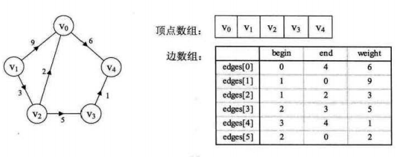

# 图的结构表示

## 总览

- 针对顶点

	便于顶点操作。

	- 邻接矩阵

	- 关联矩阵

	- 多重表

	- 邻接表（便于求出度）

	- 逆邻接表（便于求入度）

- 针对边

	便于边操作。

	- 十字链表（便于入度与出度，但结构较复杂）

	- 邻接多重表

	- 边集数组

	- 前向星

	- 链式前向星

注意各种结构的优缺点，存储空间，查找速度，入度，出度等。

邻接矩阵与关联矩阵易于理解，但容易浪费空间。

可以使用入度出度数组记录入度出度。

```c++
bool in[MANX], out[MAXN]
```

树也可采用图的存储结构，邻接表就经常被用来存储树。

## 邻接矩阵

n 个顶点 j 与 n 个顶点 i 存在边则记为 1，否则记为 0 ；（n 行 n 列）

可知其对角线上的 边 都是  自环。

带权图把 1、0 变为权重（weighted），边的权重存储进去，矩阵就不一定沿对角线对称了。


实例

a：无向图； b ：混合图； c ：带权（有向）图

注意：方向为 “行到列”，a 图因对称而有多余部分（冗余：redundancy）


## 关联矩阵

n 个顶点与 e 条边（n行e列）

顶点与对应边存在关联关系则为 1。

对于任何一列，应该只有两个单元的数值为 1，其余全部为 0；(因为一条边只能连两个顶点)


## 多重表

通过多个链表及添加的表头模拟二维数组。

适用于数据成二维数组模式但所用空间少的情况。


相当于去除了邻接矩阵中的无用空间，但增加了指针域。

## 邻接表

对每一个顶点建立链表（常用 vector），存储其邻接的顶点。（自身出边指向的顶点）

邻接表大部分情况都适用，可以方便地对边关系进行排序与查找。

```c++
std::vector<int> graph[MAXN];
```

无向图示例：


有向图时便于求出度。

若有权值，为链表元素增加数据域即可。

如果存双向边，有两种方式：

- 第一种，在起点（u）的 vector 中存下 v，同时在终点（v）的 vector 中存下 u 。
- 第二种，建立两个邻接表，一个存入边，一个存出边。（`in_edges[], out_edges[];`）

## 逆邻接表

对每一个顶点建立链表（常用 vector），存储其邻接的顶点。（作为自身入边的起点的顶点）

有向图示例：


有向图时便于求入度。

## 十字链表

便于求入度与出度。含有顶点表，边表两部分。

### 顶点表节点结构


- firstin 表示 入边表 头指针，指向该顶点的 入边表 中第一个结点。

- firstout 表示 出边表 头指针，指向该顶点的 出边表 中第一个结点。

### 边表结点结构


- tailvex 是指边 起点 在顶点表的下标，

- headvex 是指边 终点 在顶点表的下标。

（tailvex，headvex）即构成一条边。

- headlink 是指 入边 指针域，指向 终点 相同的下一条边。（入度相关）

- taillink 是指 出边 指针域，指向 起点 相同的下一条边。（出度相关)

**横向的指针指示出度（出边表），竖向的指针指示入度（入边表）**


如果是带权网，还要在其中加入权值域，来存储权值。

十字链表针对有向图。

## 邻接多重表

解决邻接表存储无向图时同一条边要存储两次的问题。（即一条边在邻接表中需要两个节点，在邻接多重表中只需要一个节点）

邻接表对已访问过的边做标记，或者要删除图中某一条边等，都需要找到表示同一条边的两个结点。

对每个顶点建立链表，链表元素存储边结点，边结点包含边起点与终点，相同起点的下一条边，相同终点的下一条边等的信息。

邻接多重表针对无向图。

### 顶点表结点结构


- vertex 域存储和该顶点相关的信息。
- firstedge 域指示第一条依附于该顶点的边。

### 边表结点结构


- mark 为标记域，可用于标记该条边是否被搜索过。

- ivex 和 jvex 为该边依附的两个顶点在图中的位置。（其前后位置与边的方向无关）

- ilink 指向下一条 起点 为 ivex 的边。

- jlink 指向下一条 终点 为 jvex 的边。

- info 为指向和边相关的各种信息的指针域。


## 边集数组

边集数组是由两个一维数组构成。一个是存储顶点的信息，另一个是存储边的信息。

边数组每个数据元素包含：一条边的起点下标（begin）、终点下标（end）和权（weight）



如上图所示，边集数组关注的是边的集合，在边集数组中要查找一个顶点的度需要扫描整个边数组，效率并不高。

因此它更适合对边依次进行处理的操作，而不适合对顶点相关的操作。

## 前向星

前向星是一种特殊的边集数组。

把边集数组中的每一条边按照起点从小到大排序，如果起点相同就按照终点从小到大。$O( nlogn )$

并且记录下以某个点为起点的所有边在数组中的起始位置和存储长度。$O( n )$

head[i] 数组记录以 i 为起点的边在边集数组中的第一个存储位置。

len[i] 数组记录以 i 为起点的边在数组中的储存长度。

实际上，head[i+1] - 1，就是以 i 为起点的边在边集数组中的最后一个存储位置。

## 链式前向星

即是链式存储的邻接表，但链式前向星在常数上优于 vector 实现的邻接表。

链式前向星无需进行排序操作，构建复杂度为 $O( n )$ ，其中 $n$ 为边数，空间也为 $O(n)$。

链式前向星存各种图都很适合，但不能快速查询一条边是否存在，也不能方便地对一个点的出边进行排序。

优点是边是带编号的，有时会非常有用，而且如果 cnt 的初始值为奇数（常用 $1$），存双向边时 i ^ 1 即是 i 的反边（常用于网络流 ）。

在数据量较大，又不必对出边进行排序时，可考虑使用链式前向星。

### 构造

edges 数组中：

- to

	第 i 条边的终点。

- next

	起点同为 i 边的上一条边。

- weight

	权值。

辅助数组 head：

**以 i 为起点的，当前的最后一条边的编号。**（head 初始化为 -1）

head 的指向就相当于邻接表中顶点表项的指向。

addEdge 函数相当于对顶点表项指向的边表进行头插法。

注：对于一条 u --> v 的边，箭头由 u 指向 v，箭头起点称为 tail，终点称为 head。

### 实现

```c++
int cnt = 0;   // 边的编号，此处 cnt 初值为 0
int head[MAXN];   // 初始化为 -1

// 结构体数组，也可分为三个单独的数组。
strcut Edge {
    int to, next, weight;
} edges[MAXN];

// 添加边
void addEdge(int u, int v, int w) {
    edges[cnt].to = v;   // 画家算法原理
    edges[cnt].next = head[u];   // 将自身指向 u 当前的最后一条边（指向前方，前向星）
    edges[cnt].weight = w;
    head[u] = cnt++;   // 自身成为 u 当前的最后一条边
}

// 简写版
void addEdge(int u, int v, int w) {
    edges[cnt] = {v, head[u], w};
    head[u] = cnt++;
}

// 遍历方式（实际上和遍历邻接表是一样的）
for (int i = 1; i <= n; ++i) {   // n 个起点
    cout<<"\n begin:"<< i;
    for (int j = head[i]; j != -1; j = edges[j].next) {   // 以 i 为起点的边
        cout<<"\n end:"<< edges[j].to;
        cout<<"\n weight:"<< edges[j].weight;
    }
}   // j != -1 也可以写成 ~j

判断 x 是否为叶子：
    if (head[x] == -1)
```

也可 $cnt$ 的初值为 $1$，令边的编号从 $1$ 开始，从而 $next$  初值为 $0$ ，此时也可利用反边性质。

注意，有时图添加虚结点，此时也会跟着引入虚边，从而链式前向星的边表需要扩大容量。
