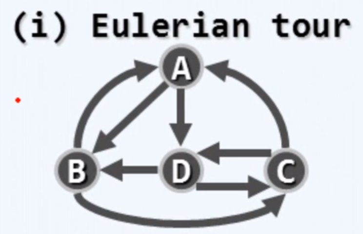
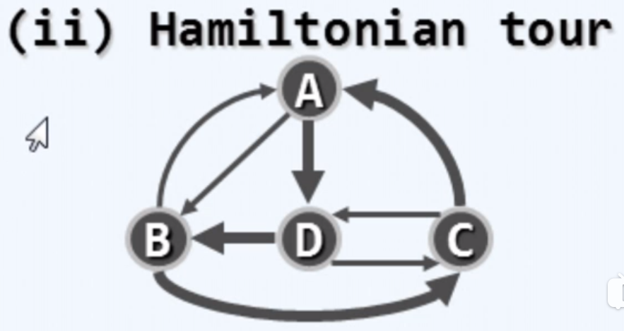

# 基本概念

- 图（graph）

    图片，图像：image
    
    地图：map

- V（vertax）：顶点集
  
  有限个顶点，数量记为 n
  
- E（edge：直边；arc：曲边）：边集

	（边：某种对应关系）
	
	有限条边，数量记为 e 
	
- 邻接关系（adjacency）
	
	顶点与顶点的关系（u ~ u）
	
- 关联关系（incideace）
	
	顶点与边的关系（u ~ v）

- 无向边（undirected edge）
	
	两个邻接顶点的次序无所谓，则（u，v）为无向边

- 无向图（undigraph）
	
	所有边都是无向边的图

- 有向边（directed edge）

	u，v 分别称为边（u，v）的   尾（tail），头（head）

- 有向图（digraph）

	所有边都是有向边的图
	
	有向图可以表示所有的无向图和混合图

- 混合图（mixed graph）

	同时存在有向边和无向边

- 带权图（也叫 网）

	边有权值的图
	
- 稀疏图

    边相对顶点非常少的图。

- 自环

	顶点自己连接自己的边

---

- 路径

	在一条路径中不含重复的节点：称为简单路径（simple path）
	
	含重复的节点：一般路径（path）

- 环路：

	路径的起点和终点重合

	在一条环路中不含重复的节点：称为简单环路（simple cycle）

	含重复的节点：一般环路（cycle）

- 有向无环图（Directed Acyclic Graph，DAG）

	在有向图中不包含任何环路
	
	能拓扑排序的图，就是 DAG，DAG 一定能拓扑排序。
	
	DAG 的判定

	- 直接拓扑排序。
	- dfs 判断是否有返祖边（即指向祖先的边）。
	
- 欧拉环路
	
	图中的一个路径包括每个边恰好一次，则该路径称为欧拉路径(Euler path)。

	如果一个环路是欧拉路径，则称为欧拉环路(Euler circuit)。
	
	

- 哈密尔顿环路

	由指定的起点前往指定的终点，途中经过所有其它节点且只经过一次。

	闭合的哈密顿路径称作哈密顿环路（Hamiltonian cycle），含有图中所有顶点的路径称作哈密顿路径（Hamiltonian path）。
	
	

- 负环

	权值总和为负的环路。

	最短路径中不能存在负环，因为每经过一次负环，路径的权值就会减少。

	负权边不一定会引起负环，所以只要没有负环，有负权边也是可以计算出最短路的。

	在无向图中，负权边就意味着负环，所以无向图中不能存在负权边。