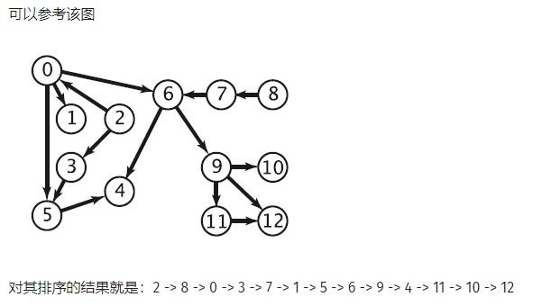

# 拓扑排序

（Topological sorting）

拓扑排序即是对 DAG 的一种遍历方式。

**拓扑排序可用来判断一个图是否存在环路，即是否是一个 DAG。**

能拓扑排序的图一定是 DAG，DAG 一定能拓扑排序。

拓扑排序保证了排序前方节点不依赖于排序后方节点（无后效性），常可与动态规划相结合。

## Kahn 算法（BFS 方式）

### 示意图



### 伪代码

```c++
bool toposort() {   //返回是否拓扑排序成功（是否是 DAG，是否有环路）
    q = new queue();
  	for (i = 0; i < n; i++)
    	if (in_deg[i] == 0) q.push(i);   //队列初始化，将所有入度为 0 的点入队。
  	ans = new vector();
  	while (!q.empty()) {
    	u = q.front(); q.pop();
    	ans.push_back(u);
    	for each edge(u, v)   //对于该点的每一条出边指向的点，将其入度减 1
      		if (--in_deg[v] == 0) q.push(v);   //一但入度为 0，加入队列。
                             // 如果是使用邻接表表示图，需要用一个新的数组记录入度，直接减去记录的入度数即可，在最后一次遍历到 v 时，让 v 入队。
    	}
  	}
  	if (ans.size() == n) {   //若点数相等
    	for (i = 0; i < n; i++)
      		std::cout << ans[i] << std::endl;
    	return true;
  	} else {
    	return false;   //若还有剩下的边，那么一定还有剩下的点
  	}
}
```
### 合理性证明

考虑一个图，删掉某个入度为 0 的节点之后，如果新图可以拓扑排序，那么原图一定也可以。反过来，如果原图可以拓扑排序，那么删掉后也可以。

### 时间复杂度

初始化要遍历图的每个点每条边，需要 $O(E + V)$。

遍历过程也需要 $O(E + V)$。

总复杂度为  $O(E + V)$

### 字典序

将队列换为优先队列即可。

总时间复杂度为 $O(E+VlogV)$

## DFS 方式

回溯，倒序，判断是否有回边。

时间 $O(V + E)$，空间 $O(V)$

```c++
vector<int> G[MAXN];  // vector 实现的邻接表
int c[MAXN];          // 标志数组
vector<int> topo;     // 拓扑排序后的节点

bool dfs(int u) {   //是否拓扑排序成功
  	c[u] = -1;   //已访问
  	for (int v : G[u]) {
    	if (c[v] < 0)   //有回边（c[v] == 1 不代表有回边）
      		return false;
    	else if (!c[v] && !dfs(v))
          	return false;
  	}
  	c[u] = 1;   //已加入排序队列
  	topo.push_back(u);   //加入拓扑排序中最后一个元素（dfs 中最深的那个）
  	return true;
}

bool toposort() {
  	topo.clear();
  	memset(c, 0, sizeof(c));   // 0 代表该点未被访问过
  	for (int u = 0; u < n; u++)
    	if (!c[u] && !dfs(u))   // 剩下点未被访问 && 有回边
        	return false;
  	reverse(topo.begin(), topo.end());   //倒序后才是拓扑排序的顺序
  	return true;
}
```

