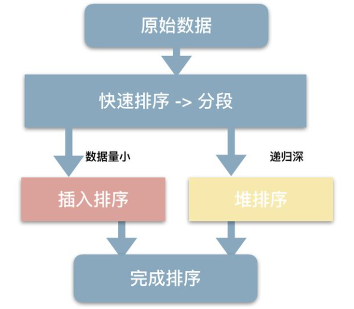
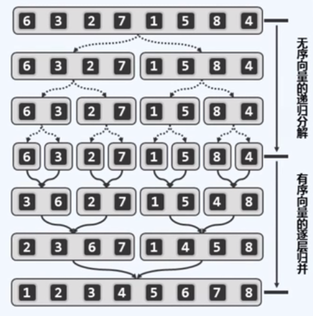

# 排序

本笔记只记录**内部排序**，外部排序请参见书籍。

## 总览

### 分类

- 内部排序
	- 插入排序（该名称默认指直接插入排序）
	  - 直接插入排序
	  - 折半插入排序
	  - 希尔排序
	- 交换排序
	  - 冒泡排序
	  - 快速排序
	- 选择排序（该名称默认指简单选择排序）
	  - 简单选择排序
	  - 堆排序
	- 归并排序（二路）
	- 桶排序
		- 计数排序
		- 基数排序
- 外部排序
	- 多路归并排序

### 时空复杂度与稳定性

Typora 不支持 script，所以以下表格公式无法正常显示，用浏览器打开其代码即可正常显示。

<div>
<script src="https://polyfill.io/v3/polyfill.min.js?features=es6"></script>
<script type="text/javascript" id="MathJax-script" async
  src="https://cdn.jsdelivr.net/npm/mathjax@3/es5/tex-chtml.js">
</script>
<script>
    MathJax = {
      tex: {
        inlineMath: [['$', '$'], ['\\(', '\\)']],
        packages: ['base', 'newcommand', 'configMacros']
      },
      svg: {
        fontCache: 'global'
      }
    };
</script>
<table border="1" style="border-collapse:collapse; text-align:center;">
      <thead>
            <tr>
                <th rowspan="2" colspan="2">种类</th>
                <th colspan="3">时间复杂度</th>
                <th rowspan="2">空间复杂度</th>
                <th rowspan="2">是否稳定</th>
            </tr>
            <tr>
                <th>最好</th>
                <th>平均</th>
                <th>最坏</th>
            </tr>
        </thead>
        <tbody>
            <tr>
                <td rowspan="3">插入排序</td>
                <td>直接插入排序</td>
                <td>$O(n)$</td>
                <td>$O(n^2)$</td>
                <td>$O(n^2)$</td>
                <td>$O(1)$</td>
                <td>是</td>
            </tr>
            <tr>
                <td>二分插入排序</td>
                <td>$O(n \log n)$</td>
                <td>$O(n^2)$</td>
                <td>$O(n^2)$</td>
                <td>$O(1)$</td>
                <td>是</td>
            </tr>
            <tr>
                <td>希尔排序</td>
                <td colspan="3">依赖于增量函数</td>
                <td>$O(1)$</td>
                <td>否</td>
            </tr>
            <tr>
                <td rowspan="2">交换排序</td>
                <td>冒泡排序</td>
                <td>$O(n)$</td>
                <td>$O(n^2)$</td>
                <td>$O(n^2)$</td>
                <td>$O(1)$</td>
                <td>是</td>
            </tr>
            <tr>
                <td>快速排序</td>
                <td>$O(n \log n)$</td>
                <td>$O(n \log n)$</td>
                <td>$O(n^2)$</td>
                <td>$O(\log n)$</td>
                <td>否</td>
            </tr>
            <tr>
                <td rowspan="2">选择排序</td>
                <td>简单选择排序</td>
                <td>$O(n^2)$</td>
                <td>$O(n^2)$</td>
                <td>$O(n^2)$</td>
                <td>$O(1)$</td>
                <td>否</td>
            </tr>
            <tr>
                <td>堆排序</td>
                <td>$O(n \log n)$</td>
                <td>$O(n \log n)$</td>
                <td>$O(n \log n)$</td>
                <td>$O(1)$</td>
                <td>否</td>
            </tr>
            <tr>
                <td colspan="2">二路归并排序</td>
                <td>$O(n \log n)$</td>
                <td>$O(n \log n)$</td>
                <td>$O(n \log n)$</td>
                <td>$O(n)$</td>
                <td>是</td>
            </tr>
            <tr>
                <td rowspan="2">桶排序</td>
                <td>计数排序</td>
                <td>$O(n)$</td>
                <td>$O(n)$</td>
                <td>$O(n)$</td>
                <td>$O(m)$</td>
                <td>否</td>
            </tr>
            <tr>
                <td>基数排序</td>
                <td>$O(d(n+r))$</td>
                <td>$O(d(n+r))$</td>
                <td>$O(d(n+r))$</td>
                <td>$O(r)$</td>
                <td>是</td>
            </tr>
        </tbody>
    </table>
</div>

注：

- 快速排序的空间复杂度最坏为 $O(n)$ 。
- 上述基数排序为链式基数排序。
- $n$ 为元素个数，$m$ 为元素范围，$d$ 为宽度，$r$ 为进制数（基数）。
- 稳定性
	若有重复元素，经排序后重复元素的相对位置（相对顺序）不变，则具有稳定性。
	（上述算法的稳定性均使用严格小于用于比较）

## 直接插入排序

（Insertion Sort）

- 从第一个元素开始（单个有序），将后序元素依次插入到前方已经有序的部分中。
- 常用于链表。

## 二分插入排序

- 将直接插入排序中的逐个比较换为二分比较，先找到位置再移动元素。
- 仅适用于顺序存储的线性表。（因为要二分）
- 二分减少了比较次数，但移动次数没有变，所以时间复杂度仍是 $O(n^2)$ 。

## 希尔排序

（Shell Sort）

- 选取步长 $d_t$，步长要小于元素个数。
- 分成 $d_t$ 组，对每组用直接插入排序（以一定间隔实现分组插入排序），
- 直到 $d_t = 1$，对所有元素进行最后一次直接插入排序。
- 步长的变化一般采用二分缩小（下整），最后一个步长为 $1$ 。

### 代码

该实现的间隔采用算法作者的选取方式，但该方式并非最优。

```c++
template <typename _RIter>
void insert_sort(_RIter st, _RIter ed, int delta) {
    for(_RIter i = st + delta; i < ed; i += delta) {
        for(_RIter j = i; j > st; j -= delta)
            if(*j < *(j - delta)) std::swap(*j, *(j - delta));
            else break;
    }
}
 
template <typename _RIter>
void shell_sort(_RIter st, _RIter ed) {
    for(int delta = ed - st; delta; delta /= 2)
        for(int i = 0; i < delta; i++)
            insert_sort(st + i, ed, delta);
}
```

## 冒泡排序

（Bubble Sort）

- 每次把序列的最小或最大元素放在应当的位置上。
- 某趟没有发生交换，说明已排好序。（最多 $n-1$ 趟）

### 代码

```c++
template<typename T, typename Rank = int >
void bubble_sort( T A[], Rank lo, Rank hi ){   // flag标记有序状态，false为无序，无序则继续扫描
    Rank i , j;
    for( bool flag = false; !flag; hi = j){
        flag = true;
        for( i = lo + 1; i < hi; i++ ){
            if( A[i] < A[i - 1] ){   // 一趟扫描
                flag = false;   // 有 逆序对 则标记无序，并交换；一但没有 逆序对，则整体有序，排序完毕
                std::swap( A[i], A[i - 1] );
                j = i;   // 记录最后一次交换的位置，该位置后的元素都为有序的（整体有序）
            }   // 只记录最后一次交换的位置而不记录第一次交换的位置，是因为本程序是 从前往后冒泡，后方元素先有序（整体有序），前方元素不能肯定其有序
        }
    }
    return ;
}
```

## 快速排序

（Quick Sort）

### 引入


### 轴点（pivot）


### 构造轴点（partition）


- 将 lo 与 hi 不断交替向内运动，使得 L 段的元素都小于轴点候选，G 段的元素都大于轴点候选，U 为待处理区间，随着 lo 与 hi 的移动，不断将 U 中的元素归入 L 或 G 中。

- 当 lo hi 相遇，即可将轴点候选者放于 m，至此，一个轴点构造完毕，其“就位”。

- 右边先动

	原因：https://blog.csdn.net/lkp1603645756/article/details/85008715

### 实例


不断与轴点候选交替比较，严格大的放右边，严格小的放左边。

通过 5a 与 5b 可知，快速排序是不稳定的。

### 基础代码

- 选取枢轴（通常取首元素）
- 一趟快排划分算法使枢轴就位。
- hi 先移动，然后再移动 lo，枢轴临时保存，最后直接就位。

```c++
void quick_sort( int lo, int hi ) {
    if (lo >= hi) {
        return;
    }
    int L = lo, R = hi-1;   //意义转换
    int pivot = arr[L];
    while (L < R) {
        while (L < R && arr[R] > pivot) {
            --R;
        }
        arr[L] = arr[R];   //归入 L 段
        while (L < R && arr[L] < pivot) {
            ++L;
        }
        arr[R] = arr[L];   //归入 G 段
    }
    arr[L] = pivot;   //轴点就位，此时 L 和 R 相等
    quick_sort(lo, L);
    quick_sort(R+1, hi);
}
```

### 效率

- 时间

	- 最好情况 $O(n\log n)$

		每次都是均衡的划分。

	- 最坏情况 $O(n^2)$

		每次的枢轴是该区域的最大或最小值时，此时枢轴就位后，一边含 $n-1$ 个元素，另一边含 $0$ 个元素。

- 空间

	- 最好情况、平均情况 $O(\log_2 n)$

		同时间最好情况。

	- 最坏情况 $O(n)$

		同时间最坏情况。

### 扩展

#### 选择情形

快排对于大量部位有序的区间或存在大量相等元素的区间会做很多不必要的操作，此时应该用归并排序。

#### 随机化

随机选取 pivot，减小最坏情况出现的概率，大量元素时使用。
（U 段元素中第一个元素随机与之间的一个元素交换位置即可）

#### STL

- 小区间插入排序
	当序列长度分割到足够小后，继续使用快速排序递归分割的效率反而没有直接插入排序高。因此可以当区间长度小于 10 后改为使用插入排序。
	（STL 中是小于 16 改为插入排序）
	（因为 pivot 会有空位，所以可以直接插入排序而不用担心大量元素平移）
- 递归深堆排序
	达到一定递归深度，采用堆排序（堆排序恒定 $O(n\log n)$）。




#### 非递归

用栈或队列记录区间端点。

#### 技巧

- 对尚未处理完毕的所有元素都处理一遍才算一趟。
- 是否是快排某趟之后
  - 快排的**进行到**第 $k$ 趟，至少有 $k$ 个元素归位（因为一趟划分过后，有一边可能没有元素），若此时序列只有 $k$ 个归位，则这 $k$ 个一定是枢轴。
  - 比较归位个数时，升序逆序都要看。
  - 如果归位的元素一定是枢轴，则在其两边（以其为界的所有元素）符合划分大小关系。
- 对于已经有序的序列，快排达到最坏情况。

### 变种

$O(n\log n)$

#### 不变性


改变了 L、G、U 的位置。

#### 单调性

构造轴点（p）：


- x 归入 G 时，直接自增 k 即可。
- x 归入 L 时，将 x 与 G 的开头元素互换。
- U 为空时，最后将 p 与 m 互换，构造轴点结束。

#### 实现（partition）


随机交换（随机选取一个与开头交换）是为了更为随机地选取候选轴点，适用于大量数据，在少量数据时大可不必。

#### 实例


其仍不具备稳定性。

#### 代码

```c++
void quick_sort_change(int lo, int hi) {
    if (lo >= hi) {   // 触底条件
        return;
    }
    int L = lo, R = hi - 1;   // 意义转换
    int pivot = arr[lo], mi = L;   // 初始轴点
    for (int k = L+1; k <= R; ++k) {
        if (arr[k] < pivot) {   // 归入 L
            std::swap(arr[++mi], arr[k]);
        }   // else：归入 G
    }
    std::swap(arr[L], arr[mi]);   // 轴点就位
    // mi 为轴点位置
    quick_sort_change(L, mi);
    quick_sort_change(mi+1, hi);
}
```

### 高速变种

```c++
void quick_sort( int lo, int hi ) {
    if (lo >= hi) {
        return;
    }
    int L = lo, R = hi-1;   // 意义转换
    int mid = nums[(L+ R)>>1];   // 候选轴点取中点（不能选第一个元素），直接赋值 mid 减少取下标次数
    do {
        while ( nums[L] < mid ) {   // 不必检查下标越界，至少会在 mid 处终止，即 nums[(L+ R)>>1] 处
            ++L;
        }
        while ( nums[R] > mid ) {   // 不必检查下标越界，至少会在 mid 处终止
            --R;
        }
        if ( L <= R ) {
            std::swap(nums[L], nums[R]);
            ++L; --R;
        }
    } while ( L <= R );   // 注意等号
    quick_sort( lo, R );   // 注意此时 L 和 R 的意义
    quick_sort( L, hi );
}
```

### 选取问题

选取第 k 个的数（升序）（以下数组以 0 开始，求全排序后秩为 k 的数）。

#### quickSelect 算法

平均 O( n ) ，最坏 O( n^2 )

最坏情况下，该算法理论上为 O(n^2)，非最优，但实际上够用。


利用 quickSort 的 partition 算法，构造轴点 x，目标为 k，若轴点 x 的秩大于 k，则 G 段可以被直接排除，同理，若 x 的秩小于 k，则 L 可以直接被排除。


代码

```c++
#include<iostream>
#include<cstdio>
#include<cstring>
#include<algorithm>

int arr[7] = {2, 7, 5, 4, 1, 9, 6};
int arrB[7] = {2, 7, 5, 4, 1, 9, 6};

void nth(int lo, int k, int hi) {   //单向尾递归，易用迭代
    while (lo < hi) {
        int L = lo, R = hi - 1;   //意义转换
        int pivot = arr[L];
        while (L < R) {
            while (L < R && arr[R] > pivot) {
                --R;
            }
            arr[L] = arr[R];   //归入 L 段
            while (L < R && arr[L] < pivot) {
                ++L;
            }
            arr[R] = arr[L];   //归入 G 段
        }
        arr[L] = pivot;   //轴点就位，此时 L 和 R 相等
        if (L == k) {   // k 轴点就位即可退出
            return;
        }
        k < L ? hi = L : lo = L + 1;   //深入
    }    
}

int main(void) {
    int n;
    scanf("%d", &n);
    nth(0, n, 7);
    std::cout<< arr[n] <<'\n';
    std::nth_element(arrB, arrB+n, arrB+7);   //注意这个函数没有返回值
    std::cout<< arrB[n];
    return 0;
}
```

#### 库函数

- nth_element() 
	属于 algorithm 库，nth_element(lo, nth, hi)
	- 其中 nth 是分割点，使用该函数后，序列中 nth 前的元素都小于它，nth 后的元素都大于它（可自定义比较器作为第四个参数）
	- 也就是说，使用该函数后，nth 的位置上的数，是其完全排序后应当存在于那个位置的数。
	- 常可用于求第 k 小的数：nth_element(arr, arr+k, arr+n);
	- 求第 k 大的数只需换位 n-k 即可：nth_element(arr, arr+n-k, arr+n);
	

#### LinerSelect 算法

理论上 O(n)，但常数很大，因此 linerSelect 算法更具有理论意义。

## 简单选择排序

(Selection Sort)

每一趟确定一个元素的最终位置，$n-1$ 趟后序列有序。

### 代码

```c++
template<typename T, typename Rank = int >
void selection_sort( T A[], Rank lo, Rank hi ){
    for( Rank i = lo, j, k; i < hi - 1; i++ ){   // i 记录正在排序的位置，注意其最大为 hi-1
        k = i;   // k 记录当前最小值位置，在没有开始第 i 个位置的扫描前，最小值位置就是 i 
        for( j = i + 1; j < hi; j++ ){
            if( A[j] < A[k] ){   //扫描，依次将当前最小值与下一个元素比较，找到扫描区间的整体最小值
                k = j;   //将当前最小值位置赋给 k ，一趟扫描结束时 k 就是扫描区间的整体最小值
            }
        }
        if( k != i ){   //扫描区间的整体最小值位置； 不是 正在排序的位置，则交换，将最小值移到扫描区间开头
            std::swap( A[k], A[i] );
        }
    }
}
```

对于链表可以不进行交换，改用将最大元素插入到末尾，然后删除原始元素，这样，选择排序便具备了稳定性（当然，直接更改前驱与后继速度将更快）
注意：需使用 >= , 因为这样才能将相同元素中的最后一个往后移。

## 堆排序

（Heap Sort）

### 堆类型

- 大顶堆

	任意结点的值**大于等于**其两个孩子的值。

- 小顶堆

	任意结点的值**小于等于**其两个孩子的值。

### 堆算法

详见《堆》

- 构造初始堆（大顶堆为例）

	**不断下滤**

	- 有 $n$ 个结点的完全二叉树，其最后一个分支结点的序号为 $\lfloor {n\over 2} \rfloor$（从 $1$ 开始），后面全是叶子结点。
	- 从最后一个分支结点开始，不断向编号小的结点判断堆性质。
	- 判断该结点是否大于等于左右孩子的值，若为否，则将其与孩子中较大的那一个交换。
	- 和孩子交换后，对交换后的孩子判断堆性质，不符合则继续下滤，
	- 符合则回到下滤的初始位置，继续往前判断堆性质，直到将根结点判断完。

- 删除

	删除堆顶，将堆的最后一个元素移至堆顶，**下滤**调整。

- 插入

	将新结点放在堆的末尾，**上滤**调整。

	- 上滤，不断向上比较并交换。

### 算法

在简单选择排序选取最值的过程中，采用堆来优化。


### 流程

大顶堆为例（升序）

不断交换堆顶（肯定是堆中最大元）与堆尾元素，然后下滤。每选出一个最大元（交换），堆的长度就减少一个单位，即待排序部分缩短，已排序部分增长。

- 构建堆，即是待排序的序列。

- 堆顶与堆尾交换

	大顶堆的堆顶元素放在序列首，将堆顶与堆尾交换，堆顶就位。

- 对**剩余元素构成的堆**从堆顶开始做**下滤**调整。

- 堆类型的选择

	- 升序排序使用大顶堆
	- 降序排序使用小顶堆
	- 因为要利用堆的下标性质，两种方式的堆顶都是在序列首。
	- 这两种方式以外的组合无法直接利用**堆的下标性质**
		- 要么不能使用数组内部空间，使用独立的堆。
		- 要么需要更进一步的下标变换计算。


### 效率

- 建堆 $O(n)$

	$n$ 个元素的堆，比较次数最少 $n-1$ 次，最多 $4n$ 次。

- 删除

	上滤 $O(h) = O(\log n)$

- 插入

	下滤 $O(h) = O(\log n)$

- 堆排序

	建堆 + $n-1$ 次下滤：$O(n) + (n-1)O(h) = O(n\log n)$

### 实现


## 二路归并排序

（Merge Sort）

### 原理

- 递归地对子表进行二路归并。
- 注意题目中是**二路**归并排序还是**多路**归并排序。
	- 对 $N$ 个元素进行 $k$ 路归并排序时，归并趟数 $m$，满足 $k^m = N\ \ \ (k^m \ge N)$， 即 $m = \lceil \log_k N \rceil$ 。
	- 每一趟对区间长度内的元素进行二路归并。区间长度的增长：$2,4,8\dots$ 。



### 二路归并


两路元素进行归并，将较小的元素移至开头，若有一区间先比较移动完，则只需将剩下的元素移至末尾即可，因为两个子序列归并前都是处于各自有序的状态。

### 效率

- 一趟二路归并的时间复杂度为 $O(n)$
- 要 $\log n$ 趟，总共 $O(n\log n)$ 。
- 一趟归并是指包含了所有元素的多次二路归并。

### 代码

```c++
template<typename T, typename Rank = int >
void merge_sort( T A[], Rank lo, Rank hi ){
    if( hi - lo < 2 ){
        return ;
    }
    Rank mi = ( lo + hi ) >> 1;   //平均向下取整
    merge_sort( A, lo, mi );
    merge_sort( A, mi, hi );
//以下为二路归并
    T * B = new T[mi - lo];   //中转，储存 A 的左半区间
    Rank i = lo, j = mi, k = 0;
    while( i < mi ){
        B[k++] = A[i++];
    }   //将左半区间移至中转区间
    i = lo, k = 0;   //复位
    while( k < mi - lo && j < hi ){
        B[k] < A[j] ? A[i++] = B[k++] : A[i++] = A[j++]; 
    }                    //下方也可 if（j == hi）
    if( k < mi - lo ){   //如果中转区间后比较完，则将剩余的元素移至 A 的末尾   //如果中转区间先比较完，则 A 区间必定有序，不必移动元素
        while( i < hi ){
            A[i++] = B[k++]; 
        }
    }

    delete[] B;
    return ;
}
```

动态内存分配将占用大量时间，在最开始直接分配数组长度一半的空间用来使用会更快。

## 计数排序

- 桶式排序（Bucket Sort）有两种
	- 计数排序（Count Sort）
	- 基数排序（Radix Sort）

计数排序前提：有 $N$ 个整数，范围为 $1$ ~ $M$（或 $0$ ~ $M-1$ ）。

使用一个计数数组记录每一个元素的数目，而这个数组的下标正是待排序的值。

### 定位

计数数组计数完毕后，将其前一个加到后一个值之上，可以将其值出现在排序后序列的位置（即第几个数）标记出来。

注意：
不存在的数，即 count 为 0 的数不能加，否则出现错误，这样会使没有元素的桶变成有元素。

## 基数排序

- 分类
	- 低位优先（LSD）（**默认 LSD**）
	- 高位优先（MSD）
- 算法
	- $r$ 进制的数需要 $r$ 个分配链（分配队列）。
	- 基数排序只能对整数排序。
	- 分配
	- 收集
	- 一定要依顺序出桶；同时，各趟扫描也保证了当数进入桶时，是依序进入的；即已扫描的每一 位 都是有序的，随着扫描反复进行，所有的 位 都会有序。
- 通常采用**链式基数排序**。
- 效率 （**基于链式**）
	- 空间复杂度 $O(r)$（链式，$r$ 个队头指针，$r$ 个队尾指针）
	- 需要进行 $d$ 趟分配和收集
		- 一趟分配需要 $O(n)$ ，
		- 一趟收集需要 $O(r)$ 。
	- 总时间复杂度为 $O(d(n+r))$，与序列初始状态无关。

### LSD

以下演示数组基数排序 LSD。

```c++
#include<iostream>
#include<queue>

void radix_sort( int nums[], int N, int M );
int get_max( int nums[], int N );
int get_breadth( int max, int M );

int main(void){
    const int N = 15;   //数组长度
    const int M = 10;   // 基数，即桶个数，也是进制基数，十进制为 10， 20 进制为 20
    int nums[N] = {234, 612, 7, 82, 464, 1, 12, 83, 24, 451, 56, 122, 471, 239, 5};
    
    radix_sort( nums, N, M );
    
    for( int i = 0; i < N; i++ ){
        std::cout<< nums[i] <<std::endl;
    }
    system("pause");
    return 0;
}

void radix_sort( int nums[], int N, int M ){
    std::queue<int> bucket[M];   //引入队列
    int max = get_max( nums, N );   //获得最大值
    int breadth = get_breadth( max, M );   //获得最大数的 宽度，即最大数的最大的进制基数是 M 的几次方

    for( int i = 0, j = 1; i < breadth; i++, j *= M ){   // i 次扫描
        for( int k = 0; k < N; k++ ){   //扫描数组
            bucket[ nums[k]/j%M ].push( nums[k] );   // 取出相应的位，放入桶中
        }
        for( int m = 0, n = 0; m < M; m++ ){   //按顺序出桶，一定要按顺序
            while( ! bucket[m].empty() ){
                nums[n] = bucket[m].front();
                n++;
                bucket[m].pop();
            }
        }
    }

    return ;
}

int get_breadth( int max, int M ){
    int i = 0;
    while( max ){
        max /= M;
        i++;
    }
    return i;
}

int get_max( int nums[], int N ){
    int i = 1, j = nums[0];
    while( i < N ){
        if( nums[i] > j ){
            j = nums[i];
        }
        i++;
    }
    return j;
}
```


### MSD

MSD 需要在桶中新建桶，会造成“**嵌套桶**”的情况（高某一位相同的数，内部又要按低位分桶），若仍按照 LSD 的各位的独立桶运行，则会出错。

### 错误演示代码

由 LSD 反位序改动而来。

```c++
void radix_sort( int nums[], int N, int M ){
    int max = get_max( nums, N );
    int breadth = get_breadth( max, M );
    std::queue<int> bucket[M];
    for( int i = breadth, j; i > 0; i-- ){
        j = pow(M,breadth-1);   //注意此处必须要减 1 
        for( int k = 0, m; k < N; k++ ){
            m = nums[k]/j%M;
            bucket[m].push( nums[k] );
        }
        for( int k = 0, m = 0; k < M; k++ ){
            while( !bucket[k].empty() ){
                nums[m++] = bucket[k].front();
                bucket[k].pop();
            }
        }
    }
}
```

错误原因：
假设有两个数  284    7
1. 最高位：284 在前桶，7 在后桶
2. 次高位：284 在后桶，7 在前桶
3. 最低位：284 在前桶，7 在后桶

以上，最后 7 在 284 的后面，顺序不对。

- 技巧：以一个数组为空间，实行分隔，记录界限下标，进行逻辑分桶，以便于“嵌套桶”。

### 正确代码

嵌套桶可以对区间递归调用，也可以用栈或队列记录区间，循环调用。

```c++
#include<iostream>
#include<cmath>

int get_max( int nums[], int N );
int get_breadth( int max, int M );
void radix_sort( int nums[], int lo, int hi, int M, int breadth );

int main(void){
    const int N = 15;   //数组长度
    const int M = 10;   // 基数，即桶个数，也是进制基数，十进制为 10， 20 进制为 20
    int nums[N] = {234, 612, 7, 82, 464, 1, 12, 83, 24, 451, 56, 122, 471, 239, 5};
    
    int max = get_max( nums, N );
    int breadth = get_breadth( max, M );
    radix_sort( nums, 0, N, M, breadth );
    
    for( int i = 0; i < N; i++ ){
        std::cout<< nums[i] <<std::endl;
    }
    system("pause");
    return 0;
}

void radix_sort( int nums[], int lo, int hi, int M, int breadth ){
    int count[M+1] = {0};   // count[M] 用来保存最后一个桶的值，使下方递归调用时 count 数组不越界
    int * bucket = new int[hi-lo];
    int k = pow(M,breadth-1);
    for( int i = lo, m; i < hi; i++ ){   //计数
        m = nums[i]/k%M;
        count[m]++;
    }
    for( int i = 1; i < M; i++ ){
        count[i] += count[i-1];   //存放各区间桶的超尾值，同时也是下一个区间桶的起始值,注意：相对于 lo 而言
    }
    count[M] = count[M-1];   //注意
    for( int i = hi-1, m; lo <= i; i-- ){   //从右端开始扫描,一定要 hi-1,一定要 lo <= i（小于等于）
        m = nums[i]/k%M;
        bucket[--count[m]] = nums[i];   //入桶与扫描方向一致，从桶的右端逐渐入桶；注意：先“减减”
    }
    for( int i = lo, j = 0; i < hi; i++, j++ ){
        nums[i] = bucket[j];   //出桶
    }
    delete[] bucket;
    for( int i = 0, begin, end; i < M; i++ ){
        begin = lo + count[i];   // 注意：加 lo
        end = lo + count[i+1];
        if( end - begin > 1 && breadth > 1 ){   //排除只有一个元素和没有元素的区间
            radix_sort( nums, begin, end, M, breadth-1 );   //注意区间要加 lo
        }
    }
}
```

注意：

- 保证稳定性原因
	以上代码为从右往左扫描，从右往左入桶（使用该方向是因为 `count[]` 数组的意义）
	假设有四个数  284    63(1)      63(2)     75
	63(2) 先入桶，63(1)后入桶，因为入桶顺序是从右往左
	所以入桶后为       63(1)      63(2)
	这样就保证了它们的相对顺序不改变，即保证了稳定性。
- 注意计数数组多设置一位空间的原因
- 倒序扫描时迭代控制变量的取值范围
- 因为是逻辑分桶，所以区间要 +lo
- 注意递归结束条件

### 注意

基数排序从低位到高位进行，使得最后一次计数排序完成后，数组有序。

其原理在于待排序的数据整体权重未知的情况，先按权重小的因子排序，然后按权重大的因子排序。

例如比较时间，先按日排序，再按月排序，最后按年排序，仅需排序三次，但是如果先排序高位就没这么简单了。

基数排序源于老式穿孔机，排序器每次只能看到一个列，很多教科书上的基数排序都是对数值排序，数值的大小是已知的，与老式穿孔机不同，**将数值按位拆分再排序，是无聊并自找麻烦的事**。

算法的目的是找到最佳解决问题的方案，而不是把简单的事搞的更复杂。

**基数排序更适合用于对时间、字符串等这些整体权值未知的数据进行排序。**

这时候基数排序的思想才能体现出来，例如字符串，如果从高位（第一位）往后排就很麻烦，而反过来，先对影响力较小，排序排重因子较小的低位（最后一位）进行排序就非常简单了。这时候基数排序的思想就能体现出来。

**又或者所有的数值都是以字符串形式存储，就像穿孔机一样，每次只能对一列进行排序。**这时候基数排序也适用，例如：对{"193";"229";"233";"215"}进行排序。


