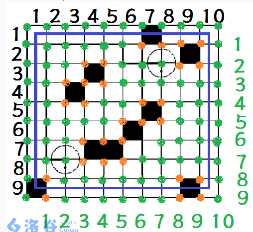

# 搜索

## 递归

即 Recursion，一种书写代码的方式，函数对自身进行嵌套调用，从而对解空间（状态树）进行某种顺序的遍历，伴有**回溯**，常需要**剪枝**优化。

### 基本框架

```c++
//返回值看情况，将递归放入表达式中时需要返回值
void recursion( /*传递控制值，记录值*/){
    if(/*判断条件，控制值 */ ){
                            //  剪枝： 包含在触底条件前，提前使延伸回溯
                            //判断是否  触底   ，一但  触底  则  延伸回溯一些  ，根据递归的调用次数决定是否  再次延伸
        return ;
    }
                // 有一组记录值，记录当前深度需要的各种变量，每调用一次递归，将新的值传入
                
    for( /*  每一个节点的子节点个数，即一个递归再调用自身的递归调用次数  */  ){   //可把操作数用作改变后的参数
        recursion( /*参数应为改变后的参数，否则会因为无法判断 延伸结束 而死递归 */);
    }
    /*
        可由循环设置  每一层的   递归调用次数，也可由下方示例调用 ：
        recursion();      有几个就调用几次，  先调用  的  先延伸
        recursion();    
     */
}
```

注意点

- 起点的判断。

- 有时需要在回溯前复原变量。

- 触底情况

	- 若触底判断条件在函数最前方

		则是在最后一个符合的深度（层）的情况的下一深度（层）触底，即  控制值  在符合条件的取值范围的边缘外触底。

	- 若触底判断条件在函数最后方

		则是在最后一个符合的深度（层）的情况的当前深度（层）触底，即  控制值  在符合条件的取值范围的边缘触底。
		
	- 触底条件可以分布在多个位置，甚至拆分开。
	
- 可以通过改变循环起始值结束值更新值等改变一个节点的子节点个数。

- 调用函数有额外开销，所以一般递归比迭代慢。

## 引例

**以下迷宫（网格）问题为例**，求迷宫的最短路径（从左上角到右下角）。

迷宫问题的注意点：

- 起始点是否需要首先打上标记及其它记录。
- 需要使用标记判断是否已经走过。
- 给初始的迷宫留下边框可以减少判断加速。
- 输出所有路径最好使用栈模拟的 DFS。
- 注意判断是否超出范围。
- 有时候各个方向不必都遍历完。
- 较大的迷宫考虑双向 BFS 或 双向 DFS。

## 深度优先搜索

（Deep First Search，DFS）

优先向状态树的深层延伸。

- 树上的 DFS（三种策略）
	- 先序
	- 中序
	- 后序
- 图上的 DFS（两种策略）
	- 先访问再深入
	- 先深入再访问

### 最少步数

```c++
#include<cstdio>
#include<queue>   //可使用队列存储路径

int N;
int graph[100][100];   // 0 为通路，1 为障碍
bool flag[100][100];   //标记是否已走过，走过为 true
int toX[4] = {-1, 0, 1, 0};   //偏移（方向数组）
int toY[4] = {0, 1, 0, -1};
int min, lenT;   //以最短路径的步数为例

void dfs(int x, int y) {
    if (x == N && y == N) {   //到达终点
        if (lenT < min) {
            min = lenT;
        }
        return;
    }
    for (int i = 0; i < 4; ++i) {   //遍历方位
        int tx = x + toX[i];
        int ty = y + toY[i];
        if (1 <= tx && tx <= N && 1 <= ty && ty <= N && graph[tx][ty] == 0 && ! flag[tx][ty]) {   //先判断是否越界
            flag[tx][ty] = true;   //标记
            ++lenT;   //增加步数
            dfs(tx, ty);
            flag[tx][ty] = false;   //回溯
            --lenT;
        }
    }
}

int main(void) {
    scanf("%d", &N);
    for (int i = 1; i <= N; ++i) {   //读入
        for (int j = 1; j <= N; ++j) {
            scanf("%1d", &graph[i][j]);   // 可以指定读入宽度。
        }
    }
    dfs(1, 1);   // 注意起点以及起点是否要事先打上标记。
    printf("%d\n", min);
    return 0;
}
```

### 具体路径

见下方 BFS。

## 宽度优先搜索

（Breadth First Search，BFS）

也叫广度优先搜索，逐步逐层遍历状态树。

注意，判断标记的位置一般有两种：

- A、在首次接触到某一格时就判断，即向四周延伸的 for 循环内就判断。（注意起点是否要先打上标记）

- B、在取出队列后立即判断。

A 比 B 占用的队列空间少一些，不过后者能保证某些权值不等问题的正确性。

注意判断标记的地方与打上标记的地方要么都在 A 处，要么都在 B 处，即要一致，否则可能会出错。

### 最少步数

到当前每个点的路径长度需要单独存储。

需要判断当前点是否已经访问过。

```c++
#include<cstdio>
#include<queue>

int N;
int graph[100][100];   // 0 为通路，1 为障碍
bool flag[100][100];   //标记是否已走过，走过为 true
int toX[4] = {-1, 0, 1, 0};   //偏移
int toY[4] = {0, 1, 0, -1};
int min;   //以最短路径的步数为例

int len[100][100];   //每个点的路径长度必须要单独存储

struct point {   //坐标
    int x, y;
};

std::queue<point> que;

void bfs(int x, int y) {
    que.push(point {1, 1});   //初始化
    flag[x][y] = true;   //起点标记，走过起点
    while (!que.empty()) {
        point t = que.front();
        que.pop();   //取出
        if (tx == N && ty == N) {
            break;
        }
        for (int i = 0; i < 4; ++i) {   //偏移
            int tx = t.x + toX[i];
            int ty = t.y + toY[i];
            if (1 <= tx && tx <= N && 1 <= ty && ty <= N && graph[tx][ty] == 0 && ! flag[tx][ty]) {   //检查
                len[tx][ty] = len[t.x][t.y] + 1;   //增加距离
                que.push(point {tx, ty});
                flag[tx][ty] = true;
            }
        }
    }
    return;
}

int main(void) {
    scanf("%d", &N);
    for (int i = 1; i <= N; ++i) {   //读入
        for (int j = 1; j <= N; ++j) {
            scanf("%1d", &graph[i][j]);
        }
    }
    len[1][1] = 1;   //初始记录
    bfs(1, 1);
    printf("%d\n", min);
    return 0;
}
```

在这个过程中，每次处理的位置所对应的距离是严格递增的，因此，一旦找到终点，当前的距离就是最短距离。

### BFS 注意点

- 这个严格递增的“距离”可以是其它含义，如时间，消耗等，相同“距离”的不同操作，仍然可以用 bfs  得到最“短”路径。
- 严格递增必须保证每一层增加的权值都是相等的，如一个操作增加 2，另一个操作增加 1，则无法得到最短路，此时应该使用优先队列 BFS。
- 搜索可移动到的位置中，判断条件不仅仅是不碰壁不超边界，还有一个条件就是没有到达过。（也为了防止大量的重复访问）因为，如果已经到达了这个位置，这说明已经有更短的路径到达了这个位置，这次到达这个位置的路径是更远的，不可能达到最优解。

### 存储路径

将每个点的上一个点到这个点的方向存下来，通过 减去 转向数组的值，从终点开始回溯到起点再输出（根据书写情况不同，可用矩阵或结构体存储方向）。

### 输出路径

可使用栈或者递归，下为一个例子。

```c++
void print(int x, int y) {
    if (x != 1 || y != 1) {
        int t = save[x][y];   //存储方向的矩阵
        print(x - toX[t], y - toY[t]);   //方向数组
        cout << str[t];   //存储方向字符的数组
    }
}
```

### 网格连通域问题

网格类问题有一些关于连通域的技巧：

- 状态标记

	- 点状态标记

		为 Point 添加点的状态（status）标记，不同状态进行不同操作，能够进行跨连通域的操作。

	- 静态状态标记

		为 Point 添加静态变量标记，记录一整块连通域的状态。

- 连通域编号

	遍历时，为不同连通域赋予一个编号。

- 求连通关系（网格连通域转关系图，grid --> graph）

	在点跨域连通域时，即从一个状态改变到另一个状态时，记录这个变化即可求连通关系。

## 优先队列 BFS

可以解决转向权值不等时的问题，使用优先队列（priority_queue），每次取出最小的或最大的，可求最短路或最长路径。

权值不相等就可能导致某些点被较长的路径优先占用并被标记，此时较短路径无法再往该点伸展。

权值不等时，即使按照每一个点周围方向权值从小到大的顺序入队，也不能保证得到的就是最短路，仍存在某些点被较长路径优先占用的情况。

事实上，优先队列 BFS 求最短路就是堆优化 Dijkstra 最短路算法。

### 权值不等时的访问标记问题

依据代码写法不同分两种情况:

- A、判断标记及添加标记的位置在向四周伸展时的位置
	这一种写法要添加标记位（即标记数组增加维数）。
	若是方向造成权值不均等，要为每个方向添加标记位。
	若是坐标位置造成权值不均等（某些点需要多余的时间才能通过，但各方向权值相等），则不必再添加标记位，只需保持二维的标记即可。

- B、判断标记及添加标记的位置在取出队列时
	这种方式可以保证每一个点都向四周延伸过，虽然队列空间多了，但具有正确性（保证了每个点的四周都入了队参与了优先队列排序）。
	解释：一个点目前是最短的路径（即先被取出），不代表从它开始的下一步也是最短的（因为权值不等），所以要先将下一步的点入队后进行比较）

上述两种方式本质上都是使周围所有方向都入队参与排序。

### P1126 机器人搬重物

https://www.luogu.com.cn/problem/P1126

#### 坐标分析：

蓝色框为能移动的范围。

黑色数字为 方格图 下标，绿色数字为 格点图 下标。



#### AC 代码

演示 A，B 两种写法，注意其标记写法，标记判断位置，终点判断位置的差异。

##### A

```c++
#include<cstdio>
#include<cstring>
#include<queue>

int graph[55][55];
bool flag[55][55][4];   //该点是否被从 i 方向查看过。
int N, M;
int x2, y2;
int toX[] = {-1, 0, 1, 0};
int toY[] = {0, 1, 0, -1};
// 0, 1, 2, 3 -> 北东南西
//朝向 x 方向时，向 y 方向旋转的消耗
int turnPrice[4][4] = {{0, 1, 2, 1}, {1, 0, 1, 2}, {2, 1, 0, 1}, {1, 2, 1, 0}};   //转向代价

struct point {
    int x, y, toward, time;   //朝向， 时间
};

//工程中应该重载为类的友元函数，以免暴露类信息。这里为了方便，重载为一般函数
bool operator < (const point & a, const point & b) {   //重载
    return a.time > b.time;   //注意符号，小的在前要大于号
};

std::priority_queue<point> que;

void bfs(int x, int y, int toward) {
    que.push(point {x, y, toward, 0});
    while (!que.empty()) {
        point ans = que.top();
        que.pop();
        if (ans.x == x2 && ans.y == y2) {
            printf("%d\n", ans.time);
            return;
        }
        for (int i = 0; i < 4; ++i) {   //去的各个方向，因为优先队列的存在，不必考虑不同权值的顺序
            for (int j = 1; j <= 3; ++j) {   //从小到大增加步数，便于判断障碍
                int tx = ans.x + j * toX[i];
                int ty = ans.y + j * toY[i];
                if (1 <= tx && tx < N && 1 <= ty && ty < M) {   //未越界
                    if (graph[tx][ty] == 1) {
                        break;   //小步数就遇到障碍，大步数肯定也会遇到障碍，直接跳出
                    } else if (! flag[tx][ty][i]) {   //该点是否被从 i 方向查看过。
                        flag[tx][ty][i] = true;   //标记查看过
                        que.push(point {tx, ty, i, ans.time + turnPrice[ans.toward][i] + 1});   // +1 为移动代价
                    }
                } else {
                    break;   //小步数就越界，大步数肯定也会越界，直接跳出
                }
            }
        }
    }
    puts("-1");   //不能到达，如果到达，上方会 return
    return;
}

int main(void) {
    scanf("%d %d", &N, &M);
    int t;
    for (int i = 1; i <= N; ++i) {    //注意：这里是从 1 开始数坐标。因为第 0 行第 0 列和其它边缘，机器人不能到达
        for (int j = 1; j <= M; ++j) {
            scanf("%d", &t);
            if (t == 1) {   //将障碍转换为四个点。   注意这里会把第 0 行第 0 列上的障碍也设置
                graph[i][j] = 1; graph[i-1][j] = 1; graph[i][j-1] = 1; graph[i-1][j-1] = 1;
            }
        }
    }
    int x1, y1;
    char ch;
    scanf("%d %d %d %d %c", &x1, &y1, &x2, &y2, &ch);
    if (!(1 <= x1 && x1 < N && 1 <= y1 && y1 < M  &&  1 <= x2 && x2 < N && 1 <= y2 && y2 < M)
        || graph[x1][y1] == 1 || graph[x2][y2] == 1) {   //起点终点越界及起点终点就是障碍特判
        puts("-1");
        return 0;
    }
    switch (ch) {
        case 'N': t = 0; break;
        case 'E': t = 1; break;
        case 'S': t = 2; break;
        case 'W': t = 3; break;
    }
    bfs(x1, y1, t);
    return 0;
}
```

##### B

```c++
#include<cstdio>
#include<cstring>
#include<queue>

int graph[55][55];
int N, M;
int x2, y2;
int toX[] = {-1, 0, 1, 0};
int toY[] = {0, 1, 0, -1};
// 0, 1, 2, 3 -> 北东南西
//朝向 x 方向时，向 y 方向旋转的消耗
int turnPrice[4][4] = {{0, 1, 2, 1}, {1, 0, 1, 2}, {2, 1, 0, 1}, {1, 2, 1, 0}};   //转向代价

struct point {
    int x, y, toward, time;   //朝向， 时间
};

//工程中应该重载为类的友元函数，以免暴露类信息。这里为了方便，重载为一般函数
bool operator < (const point & a, const point & b) {   //重载
    return a.time > b.time;   //注意符号，小的在前要大于号
};

std::priority_queue<point> que;

void bfs(int x, int y, int toward) {
    que.push(point {x, y, toward, 0});
    while (!que.empty()) {
        point ans = que.top();
        que.pop();
        if (ans.x == x2 && ans.y == y2) {
            printf("%d\n", ans.time);
            return;
        }
        if (graph[ans.x][ans.y] == 2) {   //判断是否查看过该点
            continue;
        }
        graph[ans.x][ans.y] = 2;   //标记查看过
        for (int i = 0; i < 4; ++i) {   //去的各个方向，因为优先队列的存在，不必考虑不同权值的顺序
            for (int j = 1; j <= 3; ++j) {   //从小到大增加步数，便于判断障碍
                int tx = ans.x + j * toX[i];
                int ty = ans.y + j * toY[i];
                if (1 <= tx && tx < N && 1 <= ty && ty < M) {   //未越界
                    if (graph[tx][ty] == 1) {
                        break;   //小步数就遇到障碍，大步数肯定也会遇到障碍，直接跳出
                    } else {   //不管是否查看过，直接入队
                        que.push(point {tx, ty, i, ans.time + turnPrice[ans.toward][i] + 1});   // +1 为移动代价
                    }
                } else {
                    break;   //小步数就越界，大步数肯定也会越界，直接跳出
                }
            }
        }
    }
    puts("-1");   //不能到达，如果到达，上方会 return
    return;
}

int main(void) {
    scanf("%d %d", &N, &M);
    int t;
    for (int i = 1; i <= N; ++i) {    //注意：这里是从 1 开始数坐标。因为第 0 行第 0 列和其它边缘，机器人不能到达
        for (int j = 1; j <= M; ++j) {
            scanf("%d", &t);
            if (t == 1) {   //将障碍转换为四个点。   注意这里会把第 0 行第 0 列上的障碍也设置
                graph[i][j] = 1; graph[i-1][j] = 1; graph[i][j-1] = 1; graph[i-1][j-1] = 1;
            }
        }
    }
    int x1, y1;
    char ch;
    scanf("%d %d %d %d %c", &x1, &y1, &x2, &y2, &ch);
    if (!(1 <= x1 && x1 < N && 1 <= y1 && y1 < M  &&  1 <= x2 && x2 < N && 1 <= y2 && y2 < M)
        || graph[x1][y1] == 1 || graph[x2][y2] == 1) {   //起点终点越界及起点终点就是障碍特判
        puts("-1");
        return 0;
    }
    switch (ch) {
        case 'N': t = 0; break;
        case 'E': t = 1; break;
        case 'S': t = 2; break;
        case 'W': t = 3; break;
    }
    bfs(x1, y1, t);
    return 0;
}
```

## 对比

对于一步有较多条件或操作的，BFS 比 DFS 更易控制。

涉及到系统栈调用，DFS 在调用系统栈时可能要存储多余的变量或更频繁地调用数据结构，所以 BFS 一般比 DFS 快。

因为会打上标记的原因，BFS 只适用于求最短的一条路径，多路径使用 DFS。

代码书写：

- bfs 的访问标记位置如果在向四周伸展时，则可以减少队列空间，但有时可能会影响正确性（见上文，方向权值不等时的情况）。

- dfs 的访问标记位置如果不在函数开头，而在向四周伸展时，则可以减少一层递归栈调用。

状态树空间：

- BFS 使用队列，当状态树每层的分支较多时，空间复杂度会很大。（适用于**窄深**的状态树）
- DFS 使用栈，当状态树层数较多时，空间复杂度会很大。（适用于**宽浅**的状态树）
- 对于**非常宽**或**非常深**的状态树，可以视情况尝试限制式搜索。

## 限制式搜索

- 限制深度
- 限制宽度
- 都限制

### 迭代加深搜索

迭代加深搜索是一种**每次限制搜索深度的** DFS。

如果一次搜索没有找到合法的解，就让设定的深度限制增加，重新从根开始。（也可使用记忆手段，记忆开始位置）

- 一般用于深度较小，宽度大或宽度无限的状态树。

	不能使用 BFS，因为宽度巨大会导致 BFS 队列空间爆炸。

迭代加深类似于用 DFS 方式实现的 BFS，它的空间复杂度相对较小。

### 迭代加宽搜索

迭代加宽搜索是一种**每次限制搜索宽度的** BFS。

如果一次搜索没有找到合法的解，就让设定的宽度限制增加，重新从根开始。（也可使用记忆手段，记忆开始位置）

- 一般用于深度大或深度无限，宽度较小的状态树。

	不能使用 DFS，因为深度巨大会导致 DFS 栈空间爆炸。

迭代加深类似于用 BFS 方式实现的 DFS，它的空间复杂度相对较小。

## 双向搜索

可视情况扩展为多向。

适用数据规模巨大的时候，迷宫问题，染色问题等。

主要有：

- 双向 BFS
- 双向 DFS
- 双向 A*

### 原理

以网格的 BFS 扫描为例，假定方形网格边长为 $n$，移动方向为上下左右 $4$ 个，共 $n^2$ 个节点，每个节点 $4$ 个状态。

若只有一路 BFS，则状态搜索树共 $1\times 4 \times 4 \times 4 \ldots \times 4 =  4^{n^2}$ 个节点，即待搜索的状态数为：$4^{n^2}$。

若有两路 BFS，则状态搜索树共 $2 \times ( 1 \times 4 \times 4 \times 4\ldots  \times 4 ) = 2 \times 4^{\frac {n^2} {2}}$ 个节点，即待搜索的状态数为：$2 \times 4^{\frac {n^2}  {2}}$。

可以看到，状态数的 指数 部分缩减了一半。

### 双向 BFS

以网格问题为例，若从起点和终点同时开两路 BFS，则其相遇（重叠）时，即是最短路径。

建立两个队列，每次选择 size 最小的继续搜索。

注意完全隔断的情况，一方搜索被限制在一个范围内，或者说是两个搜索无法相遇的情况。

#### 模板代码

先判断是否都有元素，一旦有一个没有，就是无法相遇的情况。

```c++
#include<queue>

int toX[4] = {};
int toY[4] = {};
int N, M;
int flag[N][M];   //可以各种标记判断相遇

struct point {
    int x, y;
};

std::queue<point> queA;
std::queue<point> queB;

void doubleBfs(void) {   //各参数
    queA.push(point {1, 1});
    queB.push(point {N, M});   //初始化

    while (!queA.empty() && !queB.empty()) {   //必须要同时都有元素才能进行，有一个为 0 就代表 bfs 无法相遇
        if (queA.size() < queB.size()) {
            // 对 queA 的操作
        } else {                    //两个操作代码多时可转化为函数
            // 对 queB 的操作
        }
    }
    
    //对无法相遇的情况作出处理

    return;
}
```

### 双向 DFS

搜索一半的“状态”，将其结果存储起来，再搜索另一半。

一般流程：

1. 一半搜索。（```dfsA()```）
2. 将结果存储到数组中，可排序去重。
3. 对另一半进行搜索，并与上一半的结果进行综合。（```dfsB()```）

#### 送礼物

https://www.acwing.com/problem/content/173/

优化：

- 平衡复杂度

	选取划分点，使得前一半搜索的数据范围稍大于后半搜索，设 $k$ 为划分点。

	dfsA 的复杂度为  $2^k$

	dfsB 的复杂度为 $2^{N-k}\times \log 2^{N-k}$

	由于 log 即二分搜索的存在，选取 $k = N / 2 + 2$ 以平衡 dfsA 和 dfsB 的复杂度，从而使总复杂度最小。（$k$ 只是选取一个估计值）

- 剪枝

	从大到小加物品，使得物品的总重量更快超过 $W$，从而剪枝。
	
	A 的复杂度比 B 小，尽量把更大的礼物分给 A 处理。

AC 代码

```c++
using namespace std;

#define ll long long

const int MAXN = 50;
int W, N, G[MAXN];
int save[1 << 25];   // 这里用 long long 会 MLE
int Max, k, cnt;

void dfsA(int n, int sum) {
    if (n <= k) {
        save[cnt++] = sum;
        return;
    }
    dfsA(n - 1, sum);
    if ((ll)sum + G[n] <= W) {   // 剪枝，注意强转，防止溢出
        dfsA(n - 1, sum + G[n]);
    }
}

void dfsB(int n, int sum) {
    if (n <= 0) {
        auto pos = upper_bound(save, save + cnt, W - sum);
        if (pos != save) {
            Max = max(Max, *(pos-1) + sum);
        }
        return;
    }
    dfsB(n - 1, sum);
    if ((ll)sum + G[n] <= W) {   // 剪枝，注意强转，防止溢出
        dfsB(n - 1, sum + G[n]);
    }
}

int main() {
    scanf("%d %d", &W, &N);
    for (int i = 1; i <= N; ++i) {
        scanf("%d", G + i);
    }
    sort(G + 1, G + N + 1);
    k = N / 2 - 2;   // 分配给 A 多一点，注意这里分给 A 的是后半部分，所以是 -2
    dfsA(N, 0);   // 从大到小，A 的复杂度比 B 低，尽量把最大的给 A
    sort(save, save + cnt);
    cnt = unique(save, save + cnt) - save;
    dfsB(k, 0);
    printf("%d", Max);
    return 0;
}
```

## 记忆化搜索

将搜索中大量重复的中间过程的结果存储起来，便于直接利用。

这种重复的过程一般出现在树形和图形的状态中。

记忆化搜索本质上是一种动态规划，是动态规划的递归版本。（更多见动态规划相关内容）

## 启发式搜索

（Heuristic Search）

启发式搜索在普通搜索算法上引入了启发函数，也叫估价函数，估值函数。

启发函数使用已有信息对搜索的分支做出价值估计，从而对分支进行决策，如优先分支，抛弃分支等。

启发函数 $f(x)$ 一般形式为：
$$
f(x) = g(x) + h(x)
$$
其中，$g(x)$ 为到达当前状态的路径代价，$h(x)$ 是当前状态到达终点的估计代价。

### A* 算法

（A*search algorithm）读作 A star 。

A* 是优先队列 BFS（亦堆优化 Dijkstra）的改进，其依据启发函数的值设置优先队列的优先级。

A* 常用作矩阵图的路径搜索任务。

关键在于 $h(x)$ 的设置，对于求网格图的最短路，最简单一种 $h(x)$ 的设置方法即是：
$$
Weigth_{priority} = f(x) = - [ g(x) + |X - x| + |Y - y| ]
$$
其中，当前坐标为 $(x, y)$ ，终点坐标为 $(X,Y)$ ，负号是因为优先级值大先出队。

依据启发函数的设置，A* 算法找到的路径不一定是最优的路线，只有当实际剩余最小代价 $h^*(x) \le h(x)$ 时，才总能找到最优路径。

### IDA* 算法

IDA* 就是采用了迭代加深策略的 A star 算法。

- 设置每次可达的最大深度depth，若没有到达目标状态则加深最大深度。
- 采用估值函数，剪掉 $f(n) \gt depth$ 的路径。

优势在于节省空间，缺点是每次 depth 增大又要重新搜索。
