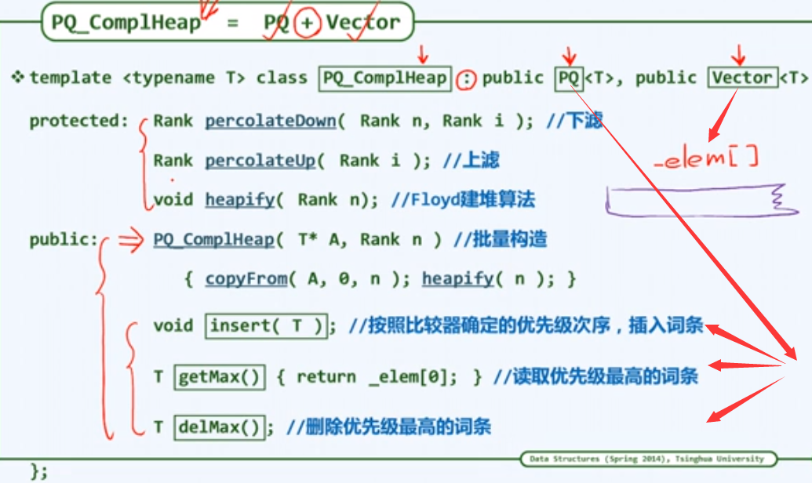
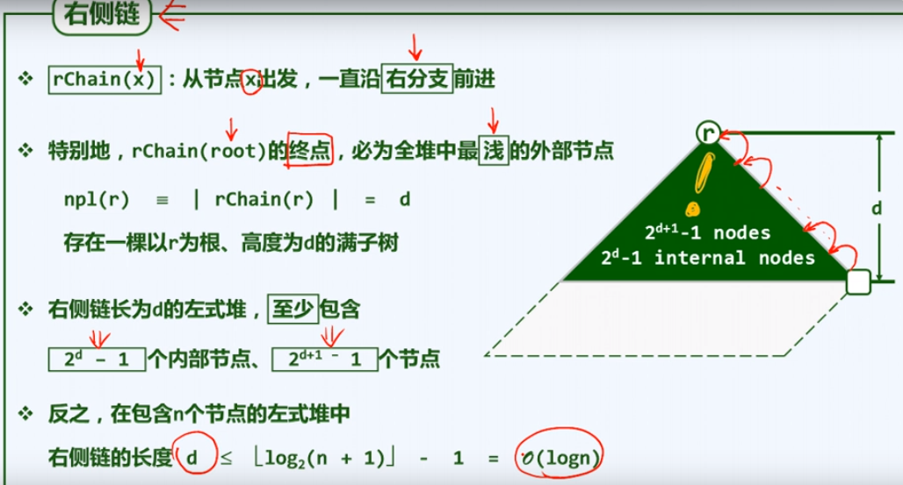

# 堆

（Heap）

## 优先队列

以下以基于向量，用堆实现的优先（级）队列为例。


上图为优先队列的功能接口（纯虚函数，抽象类）。

## 完全二叉堆

（Complete Binary Heap）

### 结构性

- 逻辑上
	等同于完全二叉树
- 物理上
	直接借助向量实现

因为等效于完全二叉树，所以也叫完全二叉堆。


### 类结构



- 上图数组是 $0$ 为起始下标的，若是改为以 $1$ 为起始下标则宏定义会更简洁。
- 上图数字为数组的秩（即下标），而不是优先级（或关键码）。
- 继承了优先队列接口，使用 Vector 实现。

### 堆序性

任何一个孩子的值（或优先级） 都不超过其父亲（非严格比较）。

getMax 函数只需直接读取向量第一个元素即可。

### 插入与上滤

（insert，percolate up）

$O(\log n)$

- 插入
  对于词条 $e$，直接插入到向量末尾即可，若堆序性被破坏，则上滤。

- 上滤
  只可能是 $e$ 与其父结点违反堆序性，不断向上换位即可。

- 上滤优化

	每次交换需要三次赋值。

	- 交换优化
		将 $e$ 备份，每次比较只移动父结点，只在最终位置赋值 $e$ 。

	- 比较优化
		对上滤路径二分，此时需要额外有一个变量记录整个堆的高度。（堆的高度一般较小，所以二分优化的实际效果不明显）


### 删除与下滤

（remove，percolate down）

$O(\log n)$

- 删除
  直接删除词条 e，直接代之以向量末尾元素，若堆序性被破坏，则下滤。

- 下滤
  - 只可能是 e 与其子结点违反堆序性，若只与一个孩子违反堆序性，则交换之；
  - 若两个孩子都违反堆序性，则与优先级较大的那个孩子交换。
  - 如此向下即可。

- 下滤优化

	每次交换需要三次赋值。

	- 交换优化
		将 $e$ 备份，每次比较只移动子结点，只在最终位置赋值 $e$ 。（注意：$e$ 是向量末尾的元素，被删除的元素需另外备份）

	- 比较优化（失效）
		下滤路径无法二分，无法确定路径分支。


### 建堆

（Heapificaiton）

堆初始化

#### 暴力法

$O( n \log n)$

树的层次遍历次序，向量一趟顺序遍历，不断插入上滤结点。（即自上而下的上滤）

分析：$n\log n$ 为各结点深度的渐进总和，优先队列只需要维护元素间的偏序关系，而 $O(n\log n)$ 的时间完全可以维护全序关系（全排序），所以暴力法是不可接受的。

#### 弗洛伊德建堆法

（floyd-heapfiy）

即自下而上的下滤。

##### 原理

若要合并逻辑上的（即树形的）堆 $H_1$、堆 $H_2$ 和结点 $p$ ：对 $p$ 下滤即可。


$p$ 相当于删除后取而代之的那个元素。


上图：
- lastInternal 为最后一个内部结点的下标（即最后一个非叶子结点，若下标从 $1$ 开始，则其值为 $n \over 2$， 其中 $n$ 为堆的元素数量）。
- 叶子结点不必下滤，先任意移动一部分元素填充为叶子，然后从最后一个内部结点位置开始遍历即可。（叶子的个数和起点都是容易计算得到的）

##### 实例


上图：蓝色框中的 $3$ 即是最后一个内部结点的下标（本例是 $0$ 为起始），其结点内的值也为 $3$，纯属巧合。

##### 效率

每个内部结点所需的调整时间，正比于其高度，而非深度，其高度的渐进总和为：$O( n )$

效率对比：为什么高度渐进总和优于深度渐进总和？

- 因为堆中（或树中）越往下，元素越多。
- 加之叶子结点不必下滤，故差距更大。

### 堆代码实现

见《基本数据结构》。

### 堆排序

见《排序》

## 左式堆

（Leftist Heaps）又名最左堆，左倾堆，左偏树，可并堆。

左式堆是利用树结构（二叉树）实现的。

以下以基于二叉树，用左式堆实现的优先（级）队列为例。

左式堆主要基于**堆合并**的问题。

### 堆合并


#### 方法一

将小堆合并到大堆中，不断( $m$ 次 )取出 $B$ 的堆顶($\log m$ )，插入到 $A$ 的堆尾( $\log (n+m)$ )，不断上滤。

总：$O( m\log ( n + m) )$ 不可接受。

其实将 $B$ 一个一个元素取出即可，不必维持其堆序性，可进一步是，总: $O( m\log n )$，仍 不可接受。

**此时 $B$ 是具有偏序关系的，而此方式在 $B$ 无序情况下复杂度也是如此，因此应该存在更高效率的数据结构或算法。**

#### 方法二

使用 floyd 建堆法，直接将两个堆的元素合并建堆。

总：$O( n + m )$ 不可接受 —— 线性还不可接受？

**$A、B$ 都是具有偏序关系的，而 floyd 建堆法对无序情况下也是线性复杂度，因此应该存在更高效率的数据结构或算法。**

### 单侧倾斜

保持堆序性，附加新条件：单侧倾斜。

结点分布偏向于左侧，合并操作只涉及右侧。

其不一定是完全二叉树，堆的结构性被破坏，所以以树结构实现，同时其本质的堆序性仍然保持。


### 空结点路径长度

（Null Path Length）即 ：NPL 值。

引入外部结点，使堆的树结构变为真二叉树（每个结点的孩子数都为偶数，亦要么有两个孩子，要么没有孩子）。（注意，不是满二叉树）

定义 $npl$：到外部结点（亦空结点）的最近距离。

- $npl( null ) = 0$
	空结点 $npl$ 值为 $0$，空结点到外部结点（自身）的最近距离为 $0$ 。
- $npl( x ) = 1 + min( npl( left ), npl( right ) )$
	非空结点 $npl$ 值为左右孩子中 $npl$ 值较小的那一个加 $1$ 。
	（注：将上式中 $min$ 换为 $max$，即成为高度定义）


- 上图中浅色结点即为外部结点，$npl$ 值为 $0$ 。
- 一个结点的 $npl$ 值亦是以其为根的最大满子树的高度。
- 虚线框部分即以 $x$ 为根的最大满子树。

### 左倾性

- 左倾
	对任何内结点，都有 $npl( left ) \ge npl( right )$ 。
- 推论
	对任何内结点，其 $npl$ 值就等于右孩子 $npl$ 值 $+1$（不必考虑左孩子）。
- 左倾性与堆序性相容而不矛盾
- 左式堆的子堆必是左式堆
- 左式堆倾向于更多结点分布于左侧，但这只是一种局部的非严格的倾向（想想 Splay 的伸展与 AVL 的旋转），比如下图，其左子树结点数就比右子树少。


### 右侧链

（right chain）

从结点 $x$ 出发，一直沿右分支前进的路径，即右侧链。

右侧链的终点，必是全堆中最浅的外部结点。

结点数为 $n$ 的左式堆中，右侧链的长度不会超过 $O(\log n)$ 。



注意上图中 $r$ 的右侧链，及其终点的外部结点，若 $r$ 的 $npl$ 值为 $d$，则其深度也是 $d$，进一步意味着存在高度为 $d$ 的满二叉树。

### 左式堆模板类


上图 PQ 为优先队列的接口，merge 为外部函数，用于合并两个左式堆。

### 合并算法

$O(\log n)$

待合并的两个堆分别以 $a$ 和 $b$ 为根，假设在递归触底之前，它们的左右子堆都是存在的。


1. 初始状态，根结点数据值（不是 npl 值）较大的堆置于左侧，由 $a$ 指向。（因为要保持合并后的**堆序性**）
2. 将 $a$ 的右子堆取出，递归地与 $b$ 合并，合并所得的结果——子堆 $c$，取代原来 $a$ 的右子堆，递归继续向右深入。（合并前必须保证 $a$ 的根的数据值大于 $b$ 的根的数据值）
3. 递归触底后，开始回溯，为保证 $a$ 的**左倾性**，要比较 $a$ 的左子堆与 $c$ 的 $npl$ 值，如果 $c$ 的 $npl$ 大，则交换 $a$ 的左右子堆的位置，继续回溯，直到根。


因为整个算法都是沿着右侧链进行，故时间复杂度不会超过右侧链的长度，即 $O(\log n)$，其中 $n$ 为 $a$ 与 $b$ 的结点数较大的那个。

### 合并实现

```c++
template<typename T>
static BinNode<T> * merge(BinNode<T>* a, BinNode<T>* b) {
    if (!a) {   // 触底，a 为空
        return b;
    }
    if (!b) {   // 触底，b 为空
        return a;
    }
    if (compare(a->data, b->data)) {   // 比较数据大小，确保合并后保持堆序性
        swap(a, b);   // 在后续过程中将 b 作为 a 的后代，交换指针指向即可
    }
    a->rightChild = merge(a->rightChild, b);   // a 的右子堆与 b 合并，合并结果取代原来的右子堆
    a->rightChild->parent = a;   // 更新父子关系
    if (!a->leftChild || a->leftChild->npl < a->rightChild->npl ) {
        swap(a->leftChild, a->rightChild);   // 交换 a 的左右子堆，确保右子堆的 npl 值不大
    }
    a->npl = a->rightChild ? a->rightChild->npl + 1 : 1;   // 更新 a 的 npl (右孩子是否存在)
    return a;   // 返回合并后的堆顶
}
```

### 实例


上图，将**根较大的那个堆置于左边（即用 $a$ 指向）**（$17 \gt 15$）

此时 $a$ 的右孩子即是 $12$，从而将问题**转化为 $a$ 的右子堆与 $b$ 的合并问题**。


上图：转化的结果，**将较大的那个根结点代表的子堆记为 $a$，**$（15 > 12）$，问题即转化为下图所示：


上图：转化后仍然是 $a$ 与 $b$ 的合并问题，此时 $a$ 的右子树为 $8$，问题进一步转化为子堆 $8$ 和子堆 $12$ 的合并问题。如下图：


上图：此时 $12(b)\gt  8(a)$，故继续转化为 $12(a)$ 与 $8(b)$ 的合并问题，如下图：


上图：此时 $a$ 的右孩子为空，下一层递归将返回 $8$，并将其作为 $a$ 的右孩子。**开始回溯。**


上图：局部情况，此时违反了左倾性，故要令左右子堆互换位置。


上图：回溯到结点 $15$，考虑其左倾性。其左右孩子的 $npl$ 值都为 $1$，故继续回溯到结点 $17$。


上图：考虑结点 $17$ 的左倾性，其左孩子 $npl$ 值为 $1$，右孩子 $npl$ 值为 $2$，违反左倾性，故要将其互换位置。


上图：交换左右子树，修复左倾性，回溯到根，合并结束。

总览图：


### 插入

借助合并操作即可，$O(\log n)$ 。


### 删除

删除根结点，再对根结点的左右子树，继续借助合并操作即可，$O(\log n)$


## AVL 的合并

### 算法

1. 把 AVL-A 与 AVL-B 按中序顺序转化为 list-A 和 list-B，$O(n+m)$ 。
2. 按中序顺序合并 list-A 和 list-B 到 list-A，$O(n+m)$ 。
3. 转化 list-A 到 AVL-A，$O(n+m)$ 。

总复杂度 $O(n+m)$

### 原理

**有序数组建树必为 AVL**，此时左右子树的高度差必定在 $1$ 内（平衡因子符合要求）。