# 散列

(Hash， 散列表，哈希表，字典）

访问方式：
- 数组（Vector）：	循秩访问（rank）		call by rank
- 链表（List）：	循位访问（position）	call by position
- 搜索树（BST）：	循键访问（key）		call by key
- 散列（Hash）：	循值访问（value）		call by value

场景：“关键码”整体空间巨大，但某时要使用的只占一小部分。

## 原理

桶（bucket）：存放关键码对应的词条（entry）。

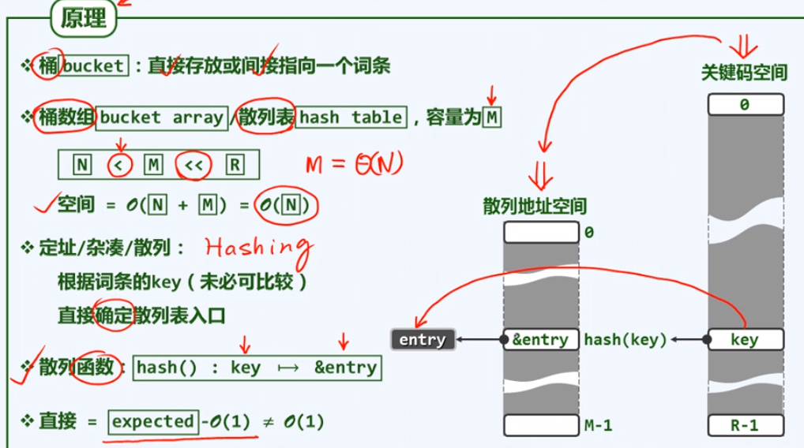

上图中 $N$ 为全体关键码个数，$M$ 为散列表容量（个数）。

- **关键码不必可比较。**

### 装填因子
（load factor）（常简记作 $\lambda$）
$$
\lambda = {N \over  M}
$$

注意：装填因子随着关键码个数的增加，会发生变化。

冲突：不同关键码映射到了同一个桶（理论上无法根本消除，除非关键码和值一一对应……（单射））

精心设计散列表与散列函数，尽可能降低冲突发生的概率，同时做好应对冲突的预案。

## 散列函数要求

标准与设计原则：

1. 确定 determinism
	同一关键码映射到同一位置。
	
2. 快速 efficiency
	计算的期望时间复杂度：O(1)。
	
3. 满射 surjection

	尽可能充分覆盖整个散列空间。

4. 均匀 uniformity

	各关键码映射到各位置的概率尽可能接近，可有效避免聚集现象（clustering）。

## 一些散列函数设计方法

### 取余法

$hash(key) = key  \% M$

$M$ 为散列表长度，一般取一个素数，以保证其均匀性，覆盖也更充分。

#### 原理

在程序中，设 for 或 while 的步长为 $S$（step），当且仅当 $gcd(S, M) == 1$时，从某个数开始，不断执行 $hash(key)$，能使得其结果映射均匀地遍历整个散列表（均匀，满射）（即应选用 M 为素数）

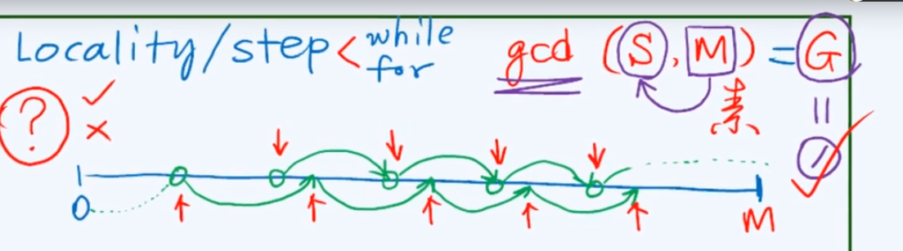

#### 缺陷

不动点，零阶均匀。

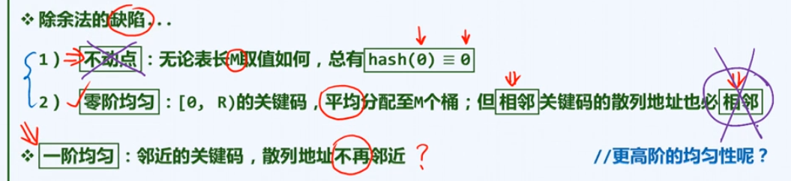

### MAD 法

$hash(key) = ( a * key + b ) \% M$

取 $M$，$a$，$b$。其中 $M$ 为素数，$a, b > 0$，$a \% M \not = 0$（$a$ 不能是 $M$ 的倍数）。

#### 原理

$b$ 相当于偏移量，可消除不动点。
$a$ 相当于间隔放大系数，使得原来相邻的元素相隔 $a$ 。

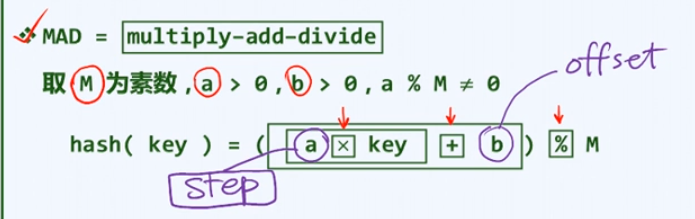

是否需要高阶的均匀性要根据实际情况分析。

### 数字分析

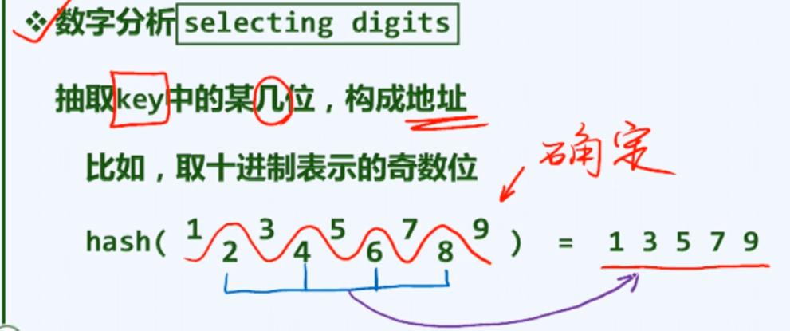

其偶数位对最终结果没有影响，缺乏均匀性。

#### 平方取中

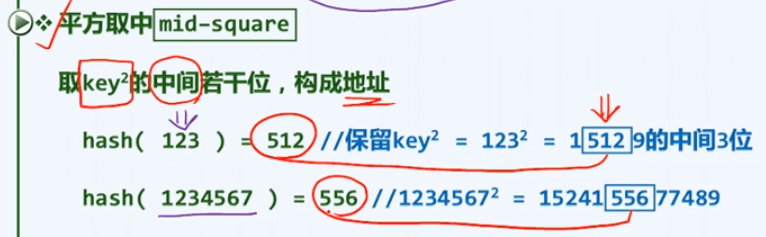

- **为什么取中？**
	为了使各数位尽可能对最终结果产生接近的影响（平均的影响力）。将乘法展开为竖式（移位和加法），可以看到，最中间的数位是由更多的数位累加作用的结果。

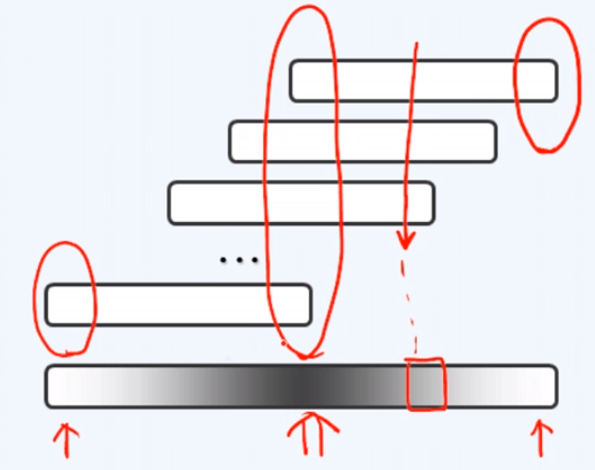

### 折叠法

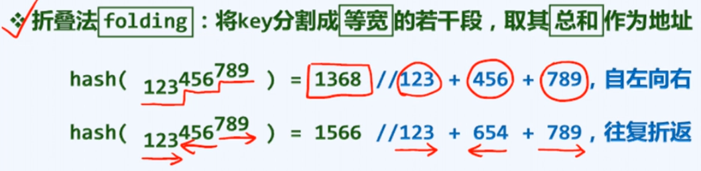

不一定要用加法，也可以：

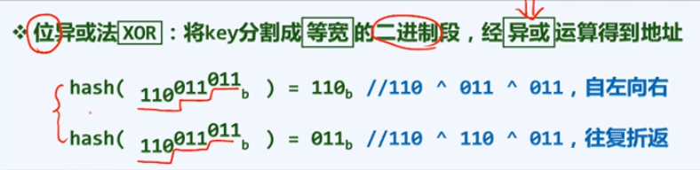

散列函数越随机，越没有规律就越好。

### 随机数法

（伪随机数法）

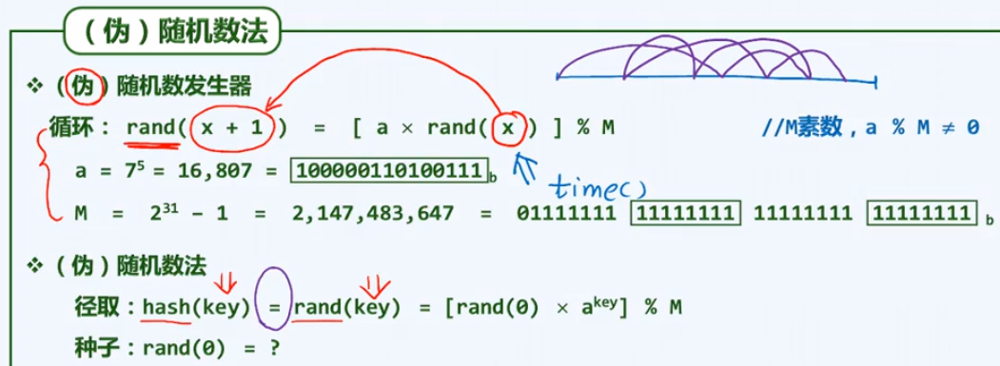

上图：$x+1$ 基于 $x$ 而来，形成一个伪随机数序列，相当于产生多个伪随机的步长（右上角图示）

伪随机数发生器实际上也是一个散列函数。

可移植性差：

**关键码 key（或 value）未必都是整数，也可能是浮点数，此时需要将其转化为散列码（hashcode），然后进一步映射为数组（bucket中的）中的地址。**

### 多项式法

对于为字符串的 key，设其为 $s$ 。

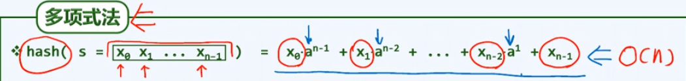

计算这个散列函数需要O(n)，**下面这种算法可以作为多项式乘法的近似：**

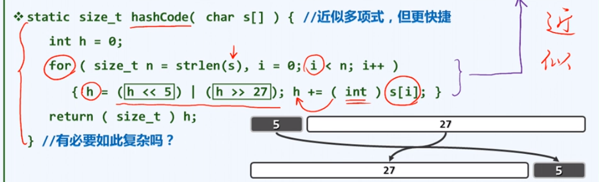

有必要如此复杂，若直接将各字符对应的数字累加得出最后的映射，将会出现频繁的冲突。字母顺序改变得出的映射仍一样。

## 冲突处理

### 多槽位

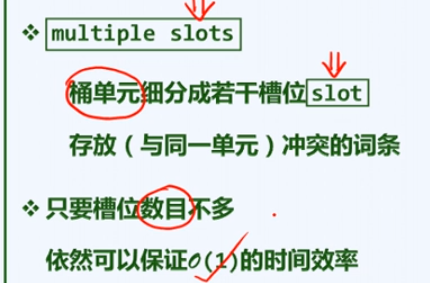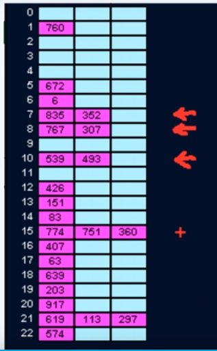

每个桶分配多少个槽位是个问题

- 预留过多，空间浪费。
- 无论预留多少，极端情况下仍可能不够用。

封闭定址

（closed addressing）

即冲突的词条在空间上不相邻。独立链即这种策略。

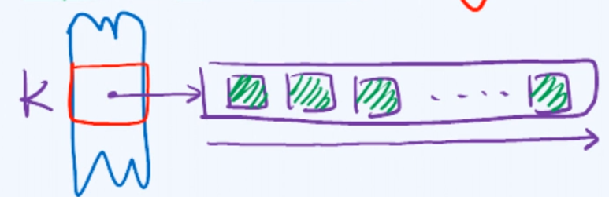

### 独立链

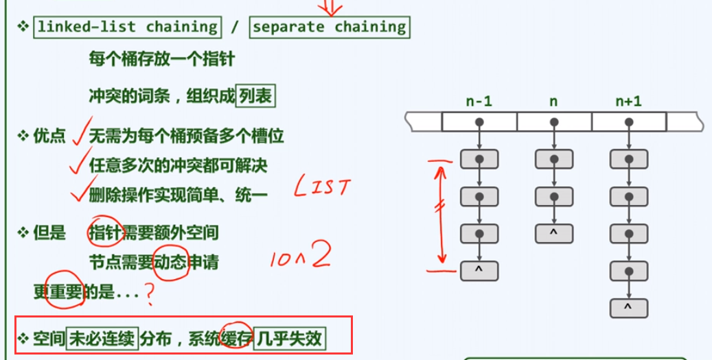

若空间的离散分布引起 IO，则时间消耗更大。

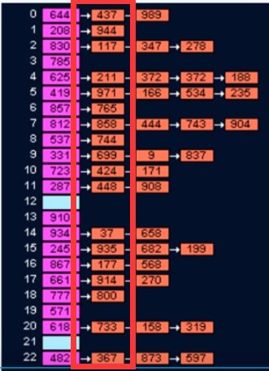

上图示：每当有新的冲突的词条，就将新的词条插入链首，而不是链尾。

### 开放定址

（open addressing）

散列表所占用的地址空间始终一段既定的连续空间，所有的冲突都在这块连续的空间中加以排解。

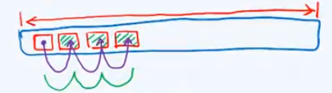

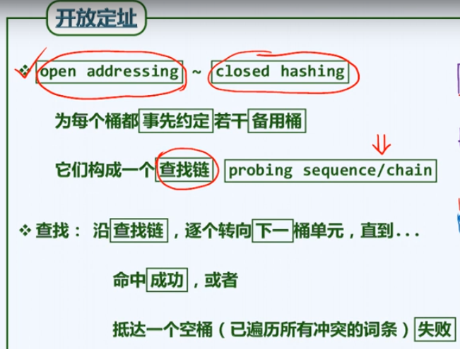

在开放定址中，每个桶单元都同时属于多个查找链。

### 查找链的组织方法

#### 线性试探

（linear probing）

##### 插入

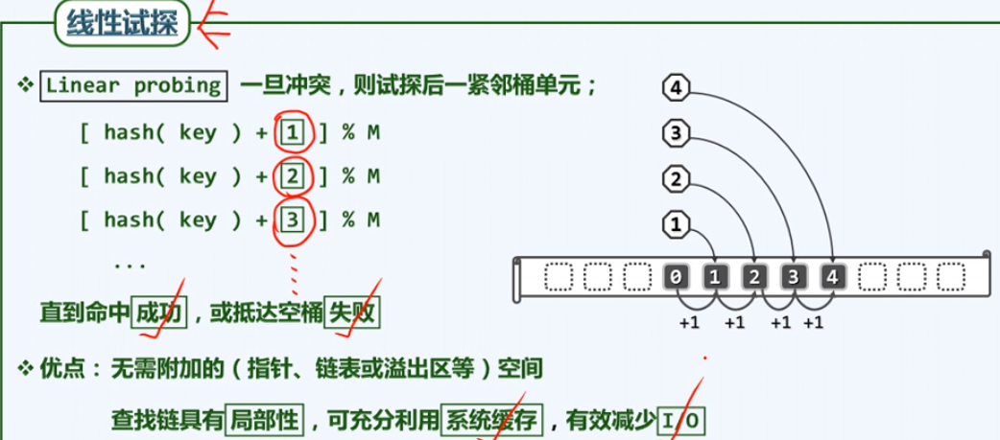

容易导致更多的冲突，即是在解决掉某个冲突的词条后，其安放的位置又占用了后续词条的位置，导致了新的冲突。

##### 删除

**懒惰删除（lazy removal）**

按照开放定址策略，互相冲突的一组词条将存在于同一查找链中（连续排列），若要删除其中一个词条，则查找链被切断，后续词条将丢失（访问不到）。

- 若只是删除一个查找链中的词条
	删除其之后，不是将桶清空，而是将其打上标记，下次查找查找链时跳过该标记位置即（解决中断问题）。
- 如果是为一个新的词条寻找能插入的空桶
	首次抵达标记位置即可将其视为空桶，继而插入新的词条。

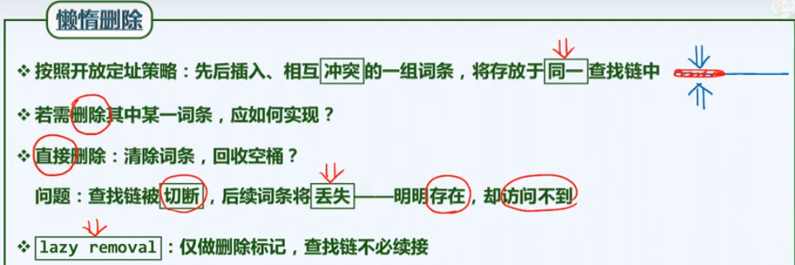

#### 平方试探

（quadratic probing）

线性试探因为试探位置距离太近，往往存在大量冲突。

适当增大其试探距离。

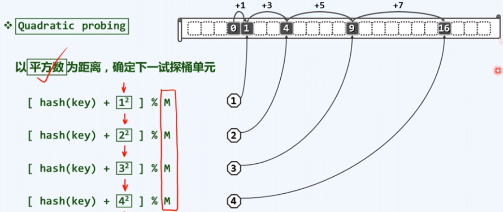

上图：依次试探距离起始点 $1^2$，$2^2$，$3^2$，$4^2$…… 个单位的位置，所有试探距离都要取模 $M$，这样即可保证所有的试探位置都在散列表内。

- 优点
	可更快远离冲突位置，减少冲突概率。
- 缺点
	若涉及外存，将会增大 IO 次数，进而消耗大量时间。
- 注意点
	可能存在有些空桶永远不会被试探到的情况（因为是跳跃的）。

1. 若表长 $M$ 为合数（下方示例为 $12$），能够被试探到的空桶必然少于 $(M+1) / 2$
	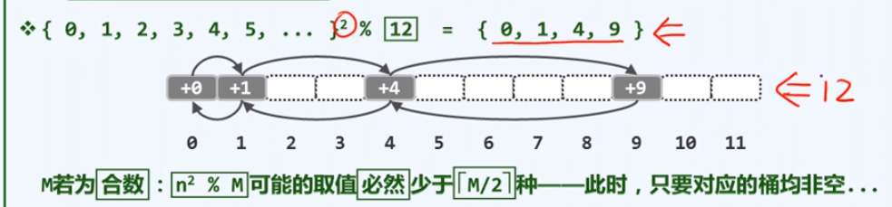
	
2. 若表长 $M$ 为素数（下方示例为 $11$），能够被试探到的空桶必然等于 $(M+1) / 2$

	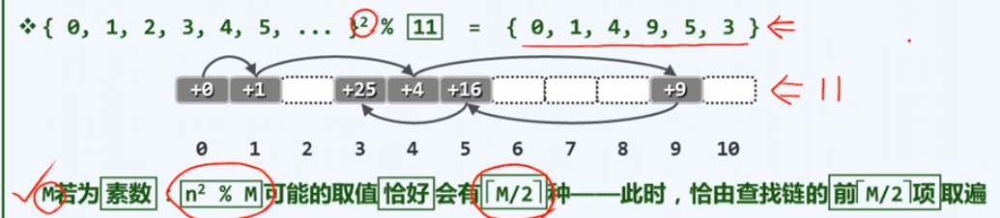

	这个情况时，能够被试探到的桶的数量正好在 50%，因为向上取整，所以可能会再大一点。

由此：在平方试探中，若 M 是素数，且装填因子 <= 0.5，则一定能试探到（利用到）一半的桶的数量。

#### 双向平方试探

一个间距分别交替向前，向后试探。

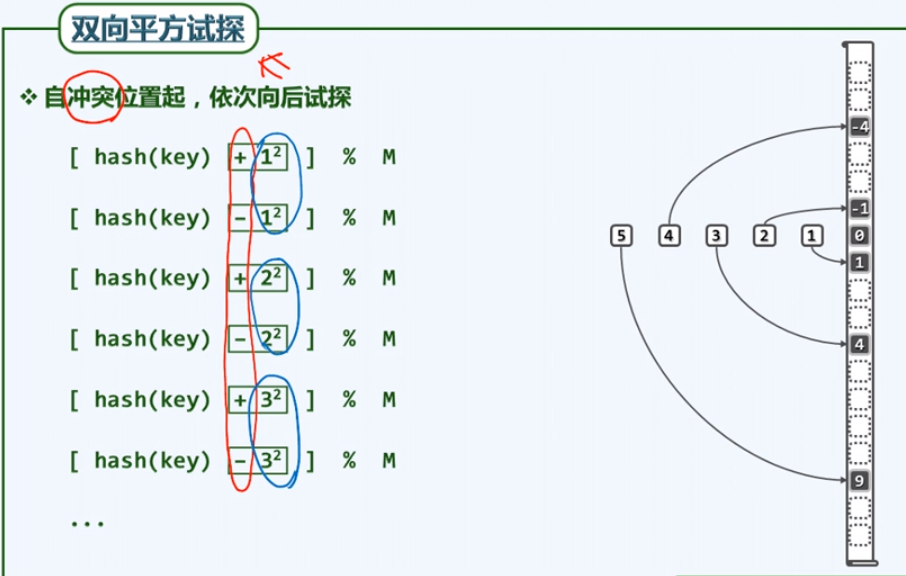

单向试探可以覆盖 $50\%$，但双向不一定能 $100\%$，下表中，$M$ 为 $5、7、11、13$（都是素数），表中所填的数是其被试探到的桶的下标。可以发现，对于 $M$ 为 $7$ 或 $11$ 时，双向试探很好的覆盖了所有位置
但对于 $M$ 为 $5$ 或 $13$ 时，双向试探的出现了重复，其只相当于单向试探的覆盖效果。

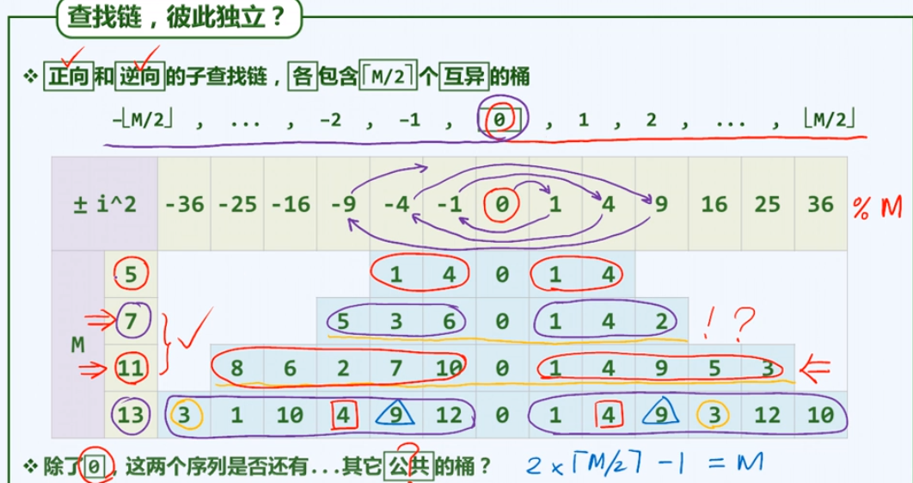

进一步：除了 $2$ 之外，所有的素数都只有两类：

- 对 $4$ 取余余 $1$
- 对 $4$ 取余余 $3$

可知，只要表长 $M$ 为 $4k + 3$ 形式的素数，必然可以保证查找链的前 $M$ 项均互异。
此时双向平方试探相当于两条查找链，尽管有重叠（交叉），但具有优秀的覆盖率。
证明略。
