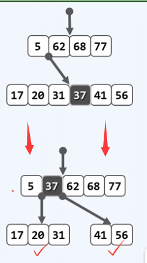
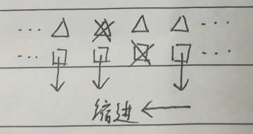

# B-树

（B-Tree）

注意：没有 “B 减树“，中间的符号是“一杠”。

B-树是平衡的多路（ multi-way ）搜索树，仍保持顺序性（中序序列单调不降）

## 总览

### 性质

- 子树与关键字个数，对于 $m$ 阶 B 树：
	- **根结点**
		- **子树个数** $[\ 2,\ m\ ]$
		- 关键字个数 $[\ 1,\ m - 1 \ ]$
	- **超级结点**
		- **子树个数** $[\ \lceil {m \over 2} \rceil,\ m \ ]$
		- 关键字个数 $[\ \lceil {m \over 2} \rceil - 1,\ m - 1 \ ]$
- B 树外部结点个数等于总关键字个数加 $1$。
	- 对 $n$ 个关键字，查找失败情况是 $n+1$ 种。

### 操作

- 查找 $O(h)$

	每经过一级 I/O 一次。

- 插入 $O(h)$

	- 查找
	- 上溢，分裂（一般 $O(1)$，最坏 $O(h)$）

- 删除 $O(h)$

	- 查找
	- 下溢
		- 旋转 $O(1)$
		- 合并（一般 $O(1)$，最坏 $O(h)$）

## 储存知识

### 发展速度差异

内存的增长速度远小于外存的增长速度。数据库规模与内存容量的比值不断变大，相对而言，内存容量在不断减小。

为什么不把内存做大一些？物理上，存储器容量越大，访问速度越慢；容量越小，速度越快

### 访问速度差异

不同容量的存储器，访问速度差异悬殊。

磁盘速度约 1 毫秒，内存 1 纳秒，相差 5 个数量级。若一次内存访问需要一秒，则一次外存访问就相当于一天，因此宁愿多次访问内存，也要尽可能避免访问外存。

### 传输大小差异

从磁盘中读写 1 B，与读写 1 KB 几乎一样快。

批量式访问：以页（page）或块（block）为单位，使用缓冲区。要么一次读入一大堆数据，要么一点都不读。

### 分级存储

常用数据放在最高层，当找不到数据时，才向低层寻找数据。

I/O：下往上传输 / 上往下传输

CPU 芯片寄存器
RAM 内存
DISK 磁盘（外存）
ARRAY 磁盘阵列（DISK ARRAY）
…………

## 基本概念

### 超级结点

每个节点称作**超级节点**，超级结点可理解为二叉树结点合并后的结果。

上图：忽略方框，就是一颗二叉树；若将父子三个节点合并：

逻辑上与二路搜索树等价。

### 多级访问

- AVL 
	若有 $n = 1$ G 个记录，每次查找需要 $\log_2 10^9 = 30$ 次 I/O 操作，每次只读出一个关键码，得不偿失。

- B-树
	在多级存储系统中，B-树可针对外部查找，大大减少 I/O 次数。利用外存的批量访问的高效支持，每下降一层，都以超级结点为单位，读入一组关键码。

一般以磁盘数据块的大小为一组，数据块的大小一般为若干 KB，如果关键码大小取做 $4$ 个字节，则一个超级节点所含的一组数据为 $200$ ~ $300$（目前多数数据库系统所采用）

若取 $m = 256$，则每次查找只需 $\log_{256} 10^9 \ge 4$ 次 I/O 操作。也可以说，一个节点的数据量应与系统一次对外存 I/O 的数据页的数据量相当 

### 外部结点

叶节点深度统一相等，外部结点深度统一相等。

外部节点就是叶节点的数值为空的不存在的孩子（但也可不为空，可以指向下一级存储）。

### 高度

B 树的高度 = 外部结点的深度。

根节点深度为 $0$ 。

- B 树的高度与磁盘存取次数成正比。(每跨越一层，就要 I/O 一次)
- 对于 $n$ 个关键字，阶数为 $m$ ，高度为 $h$ 的 B 树，满足 $h \ge \log_m(n+1)$ 。
- 最高最低问题
	- 当每个结点中关键字数最少时，高度最高。
	- 当每个结点中关键字数最多时，高度最低。
	- 注意根节点和其它结点要特别考虑。
	- 注意树结构的计算和结点内的关键字个数计算的差异。

### B 树的命名

1. 一个节点最多含有 $m$ 个分支，$m-1$ 个关键码，则是 $m$ 阶 B 树，即 $m$ 路平衡搜索树（$m \ge 2$）。
2. 通过分支数的下限，上限命名，可称为 ($\lceil {m \over 2} \rceil$, $m$)-树
	- 5 阶 B 树： （ 3，5 ）三五树
	- 6 阶 B 树： （ 3，6 ）三六树
	- 7 阶 B 树： （ 4，7 ）四七树
	- …………

其中，二四树与红黑树有极强的联系。

### 表示方法

方案一：

方案二：注意外部节点

最终方案：（省略外部节点，但要意识到它们的存在。）

## 节点类

这里的 Vector 是该课程自定义的向量，使用自定义的顺序查找算法。

返回值语义：应返回不大于它的最后一个关键码位置，若第一个关键码就大于 e，则返回 -1 。

- 第一个向量存储关键码
- 第二个向量存储孩子（ 孩子比关键码多 1 ）

上图：关键码正下方的孩子是其左孩子，指向比它小的关键码；右下方的孩子是右孩子，指向比它大的关键码。

## B-树类

关键码总数，阶次，根节点，辅助变量 _hot，再增加一个查找后记录关键码数组下标的辅助变量 _rank 更好。

## 查找

### 算法

- 只载入必需的节点，尽可能减少 I/O 操作。
- 根节点常驻于内存中。

不断顺序扫描，不断深入，如果没有找到，最后到达外部节点，外部节点可以将 B 树与下一存储级别联系起来，构成更大的 B 树。每次深入都会 I/O 。

- 为什么顺序扫描，不用二分查找？
	因为超级节点所含关键码数一般几百个，这种数据量顺序查找比二分查找快。

### 图示

以一棵 ( 3, 5 ) 树为例 单个超级节点不超过 5 个分支，4 个关键码。

查找 49 ：

若查找 45 则失败于 41 与 49 之间。

- 失败查找必然失败于叶节点，终止于外部节点
- 若一棵 B-树有 $N$ 个结点（$N$ 个成功可能），则其外部结点有 $N + 1$ 个（$N + 1$ 个失败可能）。

### 实现

### 复杂度

- 主要时间消耗
	- 读入超级节点进行的 I/O 操作（占绝大多数）
	- 节点内的查找算法（对于如此小的数据量，顺序查找比二分查找快）

## 插入

最后  _hot 才是要插入的节点，v 只是用来标记是否查找到。

### 上溢（分裂）

$m-1$ 个关键码，上升下标为中位数（$\lfloor {m-1 \over 2} \rfloor$）的关键码。

上图：在 6 阶 B 树（关键码最多 5 个，最少 2 个）中插入 37，关键码达到 6 个，上溢，需分裂处理。 

注意下图的分裂线以及下标对应关系：

注意上溢到根的情况，要考虑更换根指针。

## 删除

先确定待删除关键码位置，然后依据关键码的左右孩子情况删除。

注意删除根节点最后一个关键码时的特殊情况。

一般情况分以下 4 种（孩子均指关键码对应的左右孩子）：

| 情形 | 左孩子 | 右孩子 | 方式                                                         |
| ---- | ------ | ------ | ------------------------------------------------------------ |
| 1、  | 空     | 空     | 直接删除关键码及其中一个孩子                                 |
| 2、  | 空     | 有     | 删除关键码及左孩子                                           |
| 3、  | 有     | 空     | 删除关键码及右孩子                                           |
| 4、  | 有     | 有     | 找到其中序后继关键码，删除后继的关键码和左孩子（因为其后继左孩子一定为空） |

1、

2、

3、

4、

图略，只需交换关键码然后对后继原位置删除即可，不必交换孩子（交换了还会变麻烦）。

- 特殊情况
	对于删除根节点仅剩一个关键码时的特殊情况要融合到这几种情况中
	- 下溢蔓延到根会对根产生影响，根节点本身产生下溢的下限与其它节点不同。
	- 要注意在合并中考虑根节点只有一个元素时要更换根节点指针。
	- 根节点删除最后一个关键码后全树为空时，要给根节点留一个空指针，此时已无法恢复下溢，只有等待插入新元素。

### 下溢（旋转）

优先考虑旋转。

将下溢节点 V 的两个紧邻兄弟中最不会引起下一步变动的兄弟与其旋转。

节点 v 下溢时，必恰好包含  $\lceil {m \over 2} - 2 \rceil$ 个关键码， $\lceil {m \over 2} - 1 \rceil$ 个分支。

上图：
节点 V 发生下溢，与其左边兄弟的图示（与右兄弟的省略）。

- 错误做法
	将其兄弟 L 的一个关键码转移至 V 中（错误原因：因顺序性，P 中的 y 必定大于 L 中的任何一个关键码，小于 V 中的任何一个关键码；如此转移后，违反了此规则）
- 正确做法
	将其兄弟 P 的 y 转移至 V 中，将 L 的 x 转移到 y 原来的位置（如此，保证了中序顺序性）
- 注意
	- 检查兄弟时要先检查其 关键码 是否存在
	- x 原来的右孩子应该变成到新的 y 的左孩子；y 原来的左孩子应该变成新的 x 的左孩子

### 下溢（合并）

- 若其兄弟在旋转后也会产生下溢，则考虑合并（为简化代码，统一与左兄弟合并，左为空也合并）
- 此时不会产生上溢，因为其兄弟也处于下溢边缘。
- 与其合并的兄弟为空时也适用。

上图：将 y 转移到下方，与 L 和 V 合并成一个节点。
