# 二叉伸展树

（Splay Tree）

Splay 属于 BBST 。

## 总览

注意事项：

- 伸展
  - 之字形
  	- 双层伸展与逐层伸展效果一致。
  	- 可使用 3 + 4 重构实现旋转。
  - 直线形
  	- 需要根据形状写旋转代码。
  - 路径折叠效果
  - 先双层伸展，在最后 v 只有父亲，没有祖父时，使用一次单旋。

- 查找 $O(\log n)$
- 插入 $O(\log n)$
- 删除 $O(\log n)$

## 局部性

（locality）

- 时间局部性
	刚被访问过的数据，极有可能再次被访问。
- 空间局部性
	下一个要访问的结点，极有可能在刚被访问的结点附近。

可以利用局部性以提高搜索效率每次搜索过一个结点，就将其移至根结点（即降低深度），从而构造出一块高概率查找区域，其深度处于较低水平，以此提高效率。

## 逐层伸展

逐层单旋。

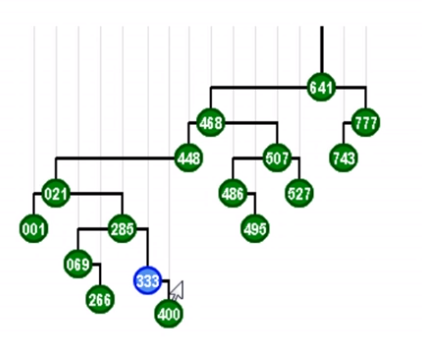

上图：起始：通过不断 zig 或 zag，将刚搜索过的结点 333 移至根结点（整棵树仍然保持平衡）。

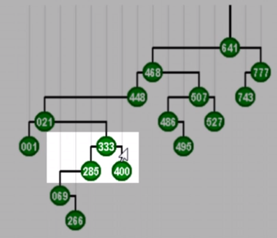

上图：zag，333上升，285下降，中序序列不变。

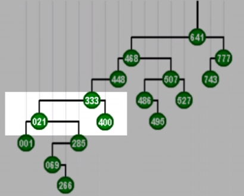

上图：zag 。

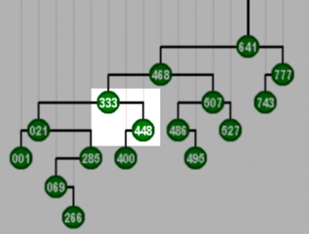

上图：zig 。

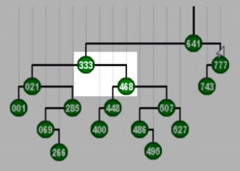

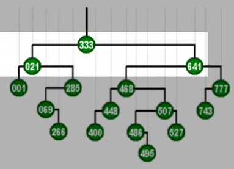

至此，333 被移动到根，移动完毕。

### 逐层伸展最坏情况

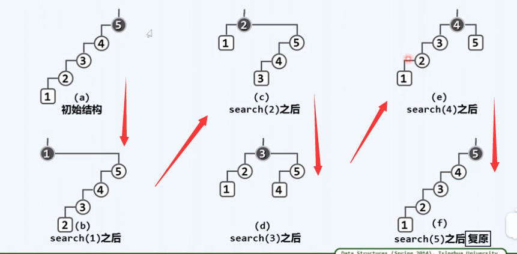

上图：在依次查找 1、2、 3、4、5 后逐层伸展到树根后树复原。

若全树规模为 $n$ ，则第一个结点访问后旋转 $n-1$ 次，第二个 $n-2$ 次…… 平均 $O(n)$ 次，其效率远低于 AVL 的 $O(\log n)$，并且退化成了链表。

## 双层伸展

反复考察祖孙三代，g、p、v，依据相对位置，经两次旋转使得 v 上升两层，成为（子）树根。

### 四种情况

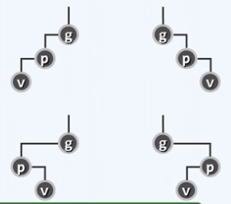

### 之字形

与逐层伸展一样（zig-zag 或 zag-zig 时）。

为简化，统一使用双层伸展。

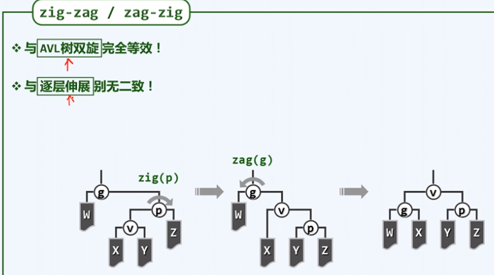

### 直线形

祖孙三代一条直线上时（zig-zig 或 zag-zag 时）。

回顾单层伸展策略（先旋转父亲，再旋转祖父）：

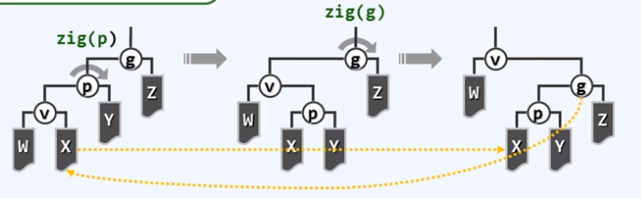

**双层伸展策略（先旋转祖父，再旋转父亲）：**

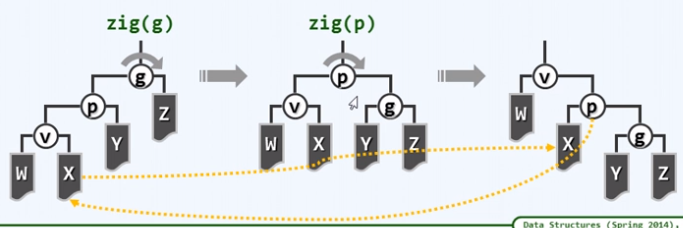

这种局部的微妙差异将导致全局的巨大改变！

## 路径折叠

只对 zig-zig，zag-zag 情况适用。

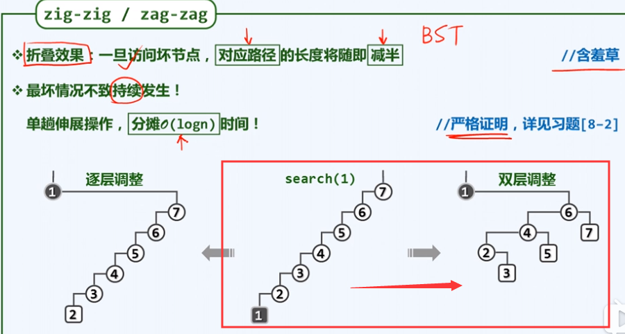

双层调整下，树的高度会缩减，减少的高度为刚刚访问那个结点的深度的一半。

## 特殊情况

v 只有父亲，没有祖父时，此时 v 的父亲必定就是根结点，且这种情况只有可能在最后出现一次，此时再做一次单旋即可。

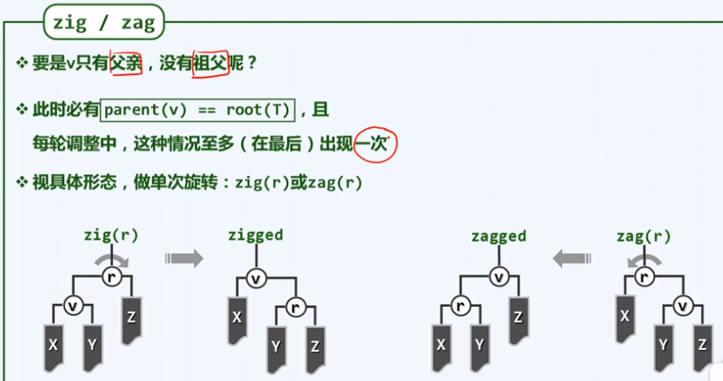

## Splay 类

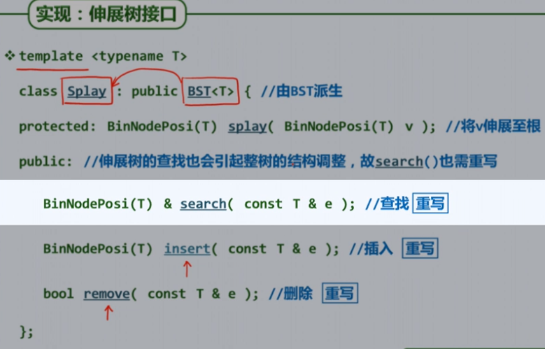

查找，插入，删除均会触发伸展。

## 伸展算法

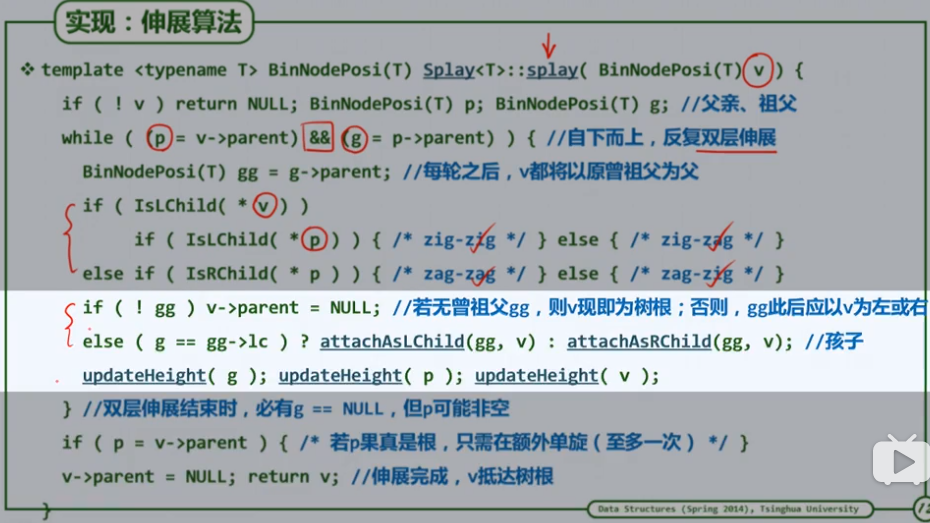

使用了短路规则，所以双层伸展结束时若还有特殊情况，则 g 未变，仍是伸展前的 g，即上图必有 `g == null` 值为假。

每次调整后，g 的位置成为新的 v 。

### 注意

- 只有局部子树为之字形时（zig-zag 或 zag-zig 时）才能使用 3+4 重构，因为 3+4 重构后的形状只符合这种情况。
- 局部子树为直线形时，只能根据形状写旋转代码。

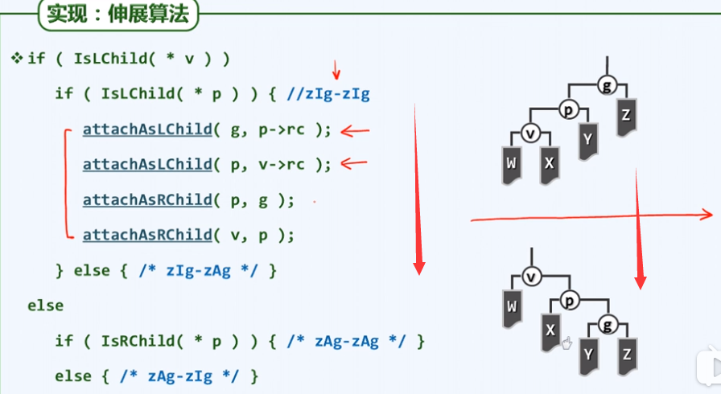

## 查找

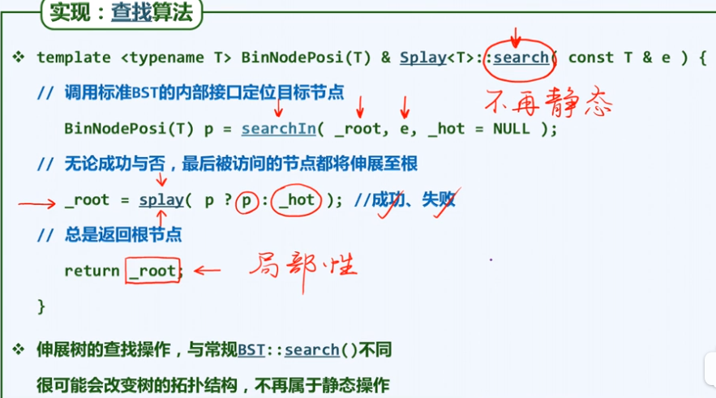

- 我的代码中对根结点的更新放在了 splay 算法里。

## 插入

- 下图所示是先伸展再插入的操作。（使用的是 Splay 的含有伸展操作的搜索算法）
- 我的代码中采用的是将结点插入后再进行 Splay 操作。（使用的是 BST 的搜素算法，搜索并插入后再伸展）

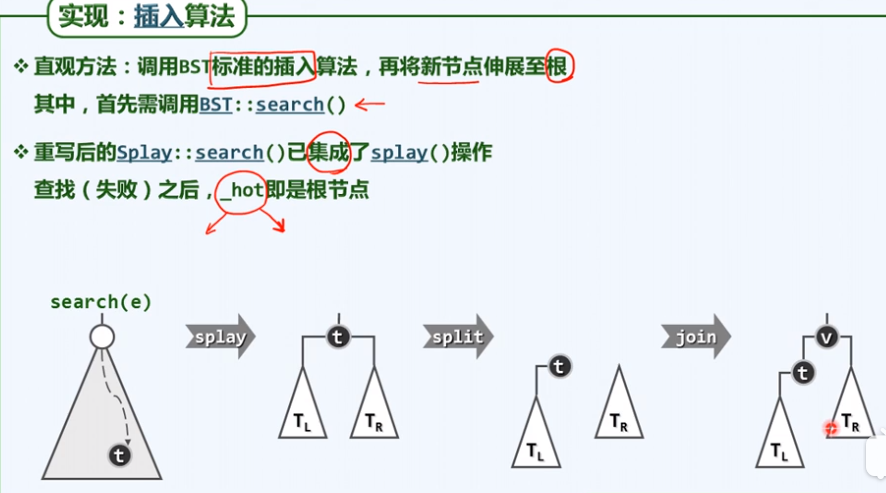

上图中的 `_hot` 是搜索算法中，指向被搜索结点位置的指针所属的那个结点，无论是否找到都是语义正确的。若没有搜索到，则 _hot 结点就会被伸展到根部。

## 删除

删除算法将被**删除结点的中序后继**伸展至根，后继为空则不伸展。

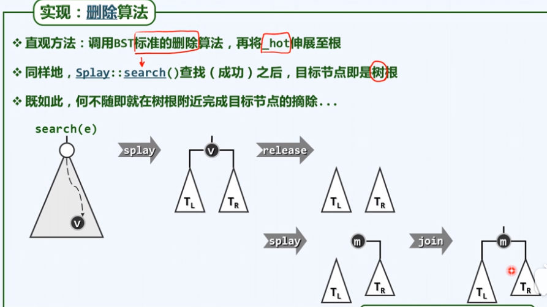

用于接替已删除结点 v 的 m 为根的左子树的最大者，根的右子树的最小者。要按中序序列找出 m，而不是直接取根的右孩子。（可利用 BinTree 的 `succ` 函数，然后直接调用 BST 的 `removeAt` 函数)

## 效率

Splay 可以不存放高度，不考虑平衡因子，节省了一点空间。

平均效率高，但不适对单次效率要求高的场合（效率敏感的场合）。

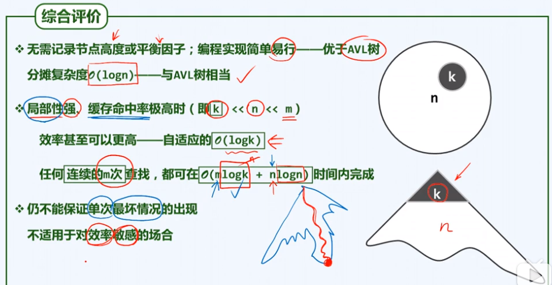

上图：k 为局部元素数， n 为总数， m 为操作次数。