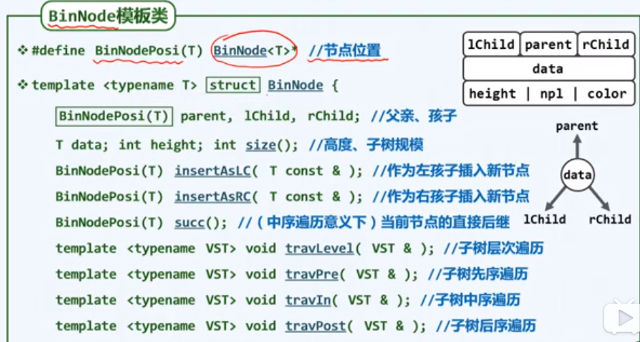
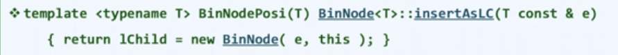
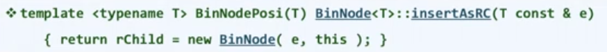
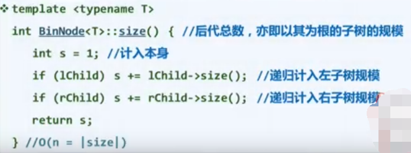
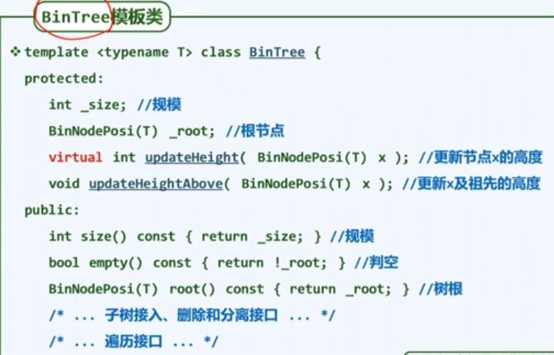
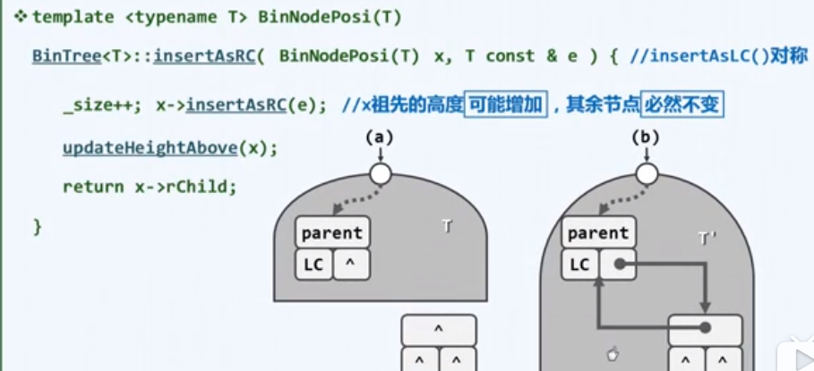

# 二叉树

（Binary Tree）

## 结点类

### BinNode 属性

- 左孩子，父亲，右孩子；
- 数据；
- 高度， npl 值， 颜色；



上图的 `BinNodePosi（T）`即 `BinNode<T> *` ，是指针类型，指向某一个结点（不建议这样使用，一行定义多个变量时会出现缺少 `*` 号的错误，应该用 `typedef`）

### 常用接口



上图：给当前结点插入一个左孩子。



上图：给当前结点插入一个右孩子。

（以上两个接口是树类插入时起辅助作用的接口）



上图：返回以当前结点为根结点的子树的规模，即总结点数。

### 重要接口 succ()

`BinNode<T>* succ( );`   返回当前结点在中序遍历下的直接后继。

约定：最后一个结点的中序后继为空。

- 两种情况（详见代码注释）
	1. 右孩子不为空时
		若右孩子的左结点为空，则所求结点就是右孩子。
		
		```c++
		this
		    \  
		      t = this->rChild
		    /
		 所求结点
		```
		
	1. 右孩子为空时
		
		向祖先追溯，直到“当前结点`t`”是其父结点的左结点时，其父结点就是要求的后继。
		
		```c++
		         所求结点
		      /
		   g
		      \
		        p
		          \
		             this
		```

```c++
template<typename T>   //中序遍历下，当前结点的直接后继，即 BST 中不小于当前结点的最小结点。约定：最后一个结点的中序后继为空
BinNode<T>* BinNode<T>::succ(){
    BinNode<T>* t = this->rChild;
    if( t != nullptr ){   //若右孩子不为空
        while( t->lChild ){   //往左深入，最左边的结点就是所求结点;若右孩子的左结点为空，则所求结点就是右孩子
            t = t->lChild;
        }
        return t;
    }
    t = this;   //若右孩子为空
    BinNode<T>* p = this->parent;
    while( p != nullptr && t != p->lChild ){   //向祖先追溯，直到“当前结点（t）”是其父结点的左结点时，其父结点就是要求的后继
        p = p->parent;                          //若追溯到根结点还是没符合要求，即 p 为空时，代表当前结点为中序遍历的最后一个结点
        t = t->parent;
    }
    return p;
}
```

以上，你甚至可以改造这个函数，进而完成中序遍历的非递归的一种写法，但这种写法需要结点存储指向父结点的指针。

## 二叉树类



注意：高度定义不同二叉树有区别，故设为**虚函数**，便于覆盖。

### 高度更新

- 高度的一般定义

	- 单个根结点的高度为 $0$，用宏定义将常规情况的高度 $[0,n]$ 与特殊情况的高度 $ -1$ 统一起来。

	- 一个结点的高度，应该等于它的左孩子与右孩子高度最大者再加 $1$ 。

- 更新历代祖先的高度：

	- 不断向上追溯，直到 x 为空，即 根结点的父结点（parent）为空。

	- 时间复杂度：$O( h )$, $h$ 为树的高度

	- 优化
		一但父亲高度不会变化就可终止，没有必要一直追溯到根结点。添加一个变量记录一个结点的高度即可，即父亲高度小于等于孩子高度$+1$ 则更新父亲高度，否则不更新。

```c++
#define stature(p) ( (p) ? (p)->height : -1 )   //统一高度语义

template<typename T>
int BinTree<T>::updateHeight(BinNode<T>* x ){
    return x->height = 1 + std::max( stature( x->lChild ), stature( x->rChild ) );
}

template<typename T>
void BinTree<T>::updateHeightAbove(BinNode<T>* x ){
    int t = x->height;
    while( x != nullptr && x->height <= t+1 ){   //优化：一但父亲高度不会变化就可终止，没有必要一直追溯到根结点
        t = updateHeight( x );   //更新并记录
        x = x->parent;   //得到其父亲
    }
}

template<typename T>
BinNode<T>* BinTree<T>::insertAsRC( BinNode<T>* x, T const & e ){   // insertAsLC 与其对称
    _size++;
    x->insertAsRC( e );   //   注意：                  结点的接口调用
    updateHeightAbove( x );   //更新自己和祖先高度
    return x->rChild;
}
```

每次插入删除都要调用 updateHeightAbove 函数，以保证高度不会出错。

### 结点插入

(注意下图演示的是一个树类方法，而不是结点类方法)



