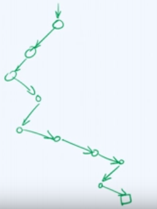
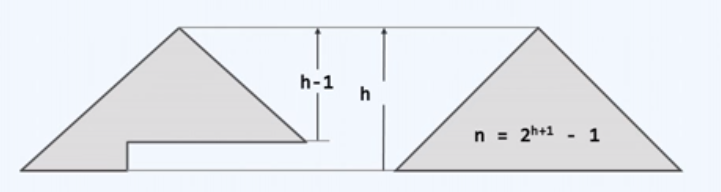
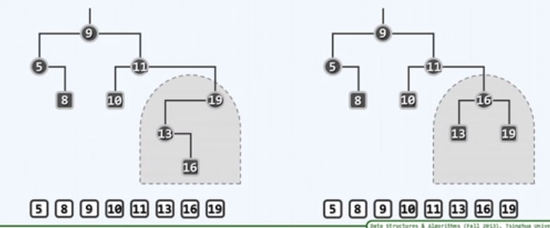
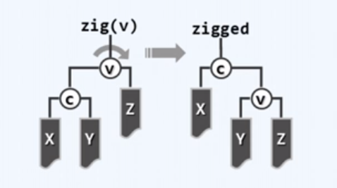
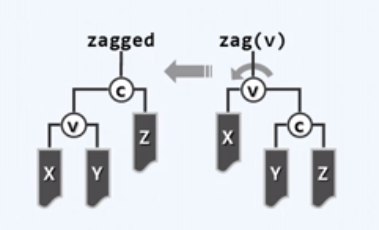

# 平衡二叉搜索树

（Balanced Binary Search Tree，BBST）

- 适度平衡的 BST，称作 BBST 。
- 对于 BST，要提升算法速度，就要控制树的高度。

## 基本概念

### 极端退化

当 BST 退化成一条单链时，其效率极低。

BST 的平均高度为  $\sqrt{ n }$ ，其中 $n$ 为结点数。

### 理想平衡

结点数固定时，兄弟子树的高度越接近，全树越平衡，高度越低（可以通过控制平衡度，进而控制高度）。

- 理想情况
	
	由 $n$ 个结点组成的二叉树，高度不会低于 $\log n$ 所以当高度恰为 $\log n$ 时，称作理想平衡。

最好为满二叉树，完全二叉树。

理想平衡出现概率低，维护成本高，所以要适当降低标准。

### 适度平衡

高度在渐进意义上不超过 $O( \log n )$，即可称作适度平衡。

### 等价 BST

结构不同，但中序序列相同的 BST，称为相互等价的 BST 。

- 等价 BST 特点

	- 上下可变

		联接关系不尽相同，承袭关系可能颠倒。

	- 左右不乱

		中序遍历序列完全一致，全局单调非降。

## 构建 BBST

通过**旋转调整**（zig，zag）进行等价变换。（关于 zig，zag 的具体内容见 AVL 树）

- 旋转是对于局部子树
- zig 和 zag 是一个结点相对于其父亲的旋转，即以其父亲为旋转中心
- 要将旋转中心的
	- 左孩子上升，则 zig（顺时针，右旋）；
	- 右孩子上升，则 zag（逆时针，左旋）
- c 与 v 旋转了，但 X，Y，Z 的中序序列不变（等价变换）（即树的中序序列保持不变，即在等价 BST 中转化）
- 初始状态为平衡状态，旋转后仍保持平衡
- 局部子树若是祖孙三代的形式，重平衡后变为两代

### zig

zig --> zigged 顺时针旋转（右旋）

### zag

zag --> zagged 逆时针旋转（左旋）

