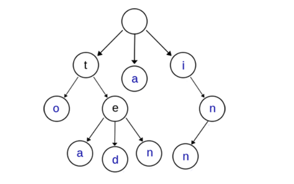

# Trie 树

也叫字典树，前缀树（Prefix Tree），单词查找树，键树。

常用来存储字符串以便快速查询，也可稍作转化存储其它类型数据。

## 基本结构

- 根节点为空，用以作为查询起始结点。
- 从根结点到某一结点的路径上经过的字符即是该结点对应的字符串。
- 任意结点的子结点应互不相同，以确定查询方向。



- 分支选择方式

	- 哈希

		一般通过哈希确定下一步查询的分支。

	- 数组

		常用于将 Trie 树应用于特殊操作时。

## 应用

- 字符串检索，词频统计

	查询一个字符串是否出现过或出现的次数。

- 字符串排序

	全部插入 Trie 树，然后先序遍历 Trie 树即可得到按字典序排序的结果。

- 输入提示

	根据已输入内容给出预测提示。

- 顺序前缀

	具有顺序、前缀性质的数据都可用 Trie 存储查询。

- 辅助结构

	作为后缀树，AC 自动机等的辅助结构。

## 效率

设字符串个数为 $n$，平均长度为 $l$ 。

- 时间
	- 插入 $O(l)$，全部 $O(nl)$
	- 查询 $O(l)$
- 空间
	- 最大 $O(nl)$，取决于重复的前缀数量。
- 对比
	- 哈希树只能做精确查询，Trie 树可以做前缀模糊查询。
	- 无法哈希和哈希计算复杂高时可以使用 Trie 树。

## 实现

ASCII 字符串为例。

```c++
int son[N][26];   // 结点的子结点   // 0 号点既是根结点，又是空结点
int cnt[N];   // 以每个结点结尾的单词数量
int idx;   // 结点编号

// 插入一个字符串
void insert(char * str) {
    int p = 0;   // 根结点开始
    for (int i = 0; str[i]; ++i) {   // 遍历字符串
        int u = str[i] - 'a';
        if (!son[p][u]) {   // 子结点为空，新建结点
            son[p][u] = ++idx;
        }
        p = son[p][u];   // 继续深入
    }
    cnt[p]++ ;
}

// 查询字符串出现的次数
int query(char * str) {
    int p = 0;
    for (int i = 0; str[i]; ++i) {
        int u = str[i] - 'a';
        if (!son[p][u]) {   // 未找到
            return 0;
        }
        p = son[p][u];
    }
    return cnt[p];   // 到达叶子
}
```