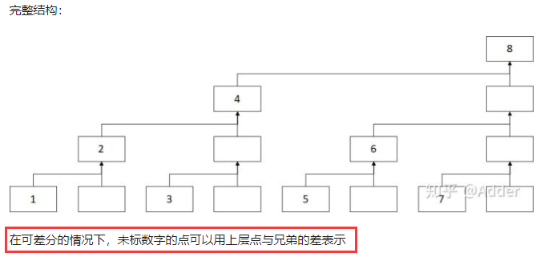

# 前缀和 差分 树状数组

## 总览

<table border="1" style="border-collapse: collapse; text-align: center;">
    <thead>
        <tr>
            <th rowspan="2">数据结构</th>
            <th colspan="2">查询</th>
            <th colspan="2">修改</th>
        </tr>
        <tr>
            <th>单点查询</th>
            <th>区间查询</th>
            <th>单点修改</th>
            <th>区间修改</th>
        </tr>
    </thead>
    <tbody>
        <tr>
            <td>前缀和数组</td>
            <td>√</td>
            <td>√</td>
            <td></td>
            <td></td>
        </tr>
        <tr>
            <td>差分数组</td>
            <td colspan="2">少量查询或最后查询</td>
            <td>√</td>
            <td>√</td>
        </tr>
        <tr>
            <td>树状数组</td>
            <td>√</td>
            <td>√</td>
            <td>√</td>
            <td></td>
        </tr>
        <tr>
            <td>树状数组 + 差分数组</td>
            <td>√</td>
            <td></td>
            <td>√</td>
            <td>√</td>
        </tr>
        <tr>
            <td>线段树</td>
            <td>√</td>
            <td>√</td>
            <td>√</td>
            <td>√</td>
        </tr>
    </tbody>
</table>

- 有区间查询就有单点查询，有区间修改就有单点修改。
- “有或没有” 仅指是否有快速实现的操作，若不追求效率，也可用多个单点修改实现区间修改等方式。
- 差分数组的单点查询需要求前缀和，较慢；若是在不断修改，最后可以直接转换为原数组再输出结果的情况，则可以较快地单点查询。


## 前缀和数组

- 满足前缀和属性的数组，在不需要修改，只需要区间和查询时，前缀和数组比树状数组高效。
- 适用于只做查询，不做修改的操作


- 前缀和数组存储第一个到某一个数的和。
- 要查询某个区间的和，只需找到两个端点再相减。

### 二维前缀和

P1387 最大正方形 https://www.luogu.com.cn/problem/P1387

## 差分数组

### 概念

差分就是将数列中的每一项分别与前一项数做差，例如：

```
原序列：1  2  5   4   7   3
差分后：1  1  3  -1   3  -4  -3
```

注意，得到的差分序列中：
- 第一个数和原来的第一个数一样（相当于第一个数减 0）
- 差分序列最后比原序列多一个数（相当于 0 减最后一个数）

### 性质

1. 差分序列求前缀和可得原序列
2. 将原序列区间 $[L,R]$ 中的元素全部 $+i$（即区间修改，也可以变为单点修改）可以转化操作为差分序列 $L$ 处 $+ i$，$R+1$ 处 $- i$ 。
	- $L$ 处 $+i$ ，相当于给 $L$ 及之后的数都 $+i$，
	- $R+1$ 处 $-i$，即给 $R+1$ 及之后的数都 $-i$，以维持平衡


适用于修改（包括单点修改，区间修改）操作多，最后可以直接转换为原数组再输出结果的情况。

## 树状数组

Binary Index Tree，二叉索引树，若以其发明者命名： Fenwick 树 。

比线段树效率高，但局限性比线段树大（因为树状数组省略了一些树节点）。

### 适用情况

所求属性 $X$ 满足：$X = f ( i, j )$，其中 $f$ 是某种运算，$i$ 是下标 $[1,i]$ 的属性，$j$ 是下标 $[1, j]$ 的属性，即**前缀属性**时。

注意，最值不属于前缀属性，所以树状数组不支持，除非再使用一些技巧，不过较复杂。

### 基本功能

- 区间查询（区间查询表示支持单点查询）
	- 只能快速求得 $[1,n]$ 的某种区间属性，
	- 若是 $[i,j]$ 区间和，将两端点相减即可（前提是属性满足此操作，即前缀属性）
- 单点修改

### 逻辑结构

元素满足前缀属性：


上图：

```
C1 = A1(C1)
C2 = A1(C1) + A2
C3 = A3(C3)
C4 = A1 + A2 + A3 + A4 = ( C2 + C3 + A4 )
C5 = A5(C5)
C6 = A5(C5) + A6
C7 = A7(C7)
C8 = A1 + A2 + A3 + A4 + A5 + A6 + A7 + A8 = ( C4 + C6 + C7 + A8 )
…………
```

- 一叉，二叉，三叉，四叉…… 的和。
- 奇数下标的元素管辖范围只有一个。
- 树状数组省去了不必要的二叉树的节点。

#### 完整结构



#### 精简结构


- 原数组的信息都会在树状数组里体现出来，只是有些被省略。（可简单计算得出，但一些元素没有直接的副本）。

### 性质

对于编号为 $i$ 的节点，其管辖的区间宽度为 $2^k$ 个元素：

- 其中 $k$ 为 $i$ 的二进制末尾 $0$ 的个数。
- $2 ^ k$ 即倒数第一个 $1$ 和其后的 $0$ 构成的二进制数，如 $10100_{(2)} \to 100_{(2)} = 4_{(10)}$ 。

因为这个区间最后一个元素必然为 $A(i)$，所以有：

$$
C(i) = A(i - 2^k + 1) + A(i - 2^k + 2) + A(i - 2^k + 3)  ... + A(i)
$$

注意，上式的下标最大为 $i$ 。

从而有：
$$
SUM(1\ldots i) = C(i) + C(i-2^{k_1}) + C(i-2^{k_1} - 2^{k_2}) + \cdots
$$

- 可以把逻辑结构图的关系式中所有 $C_n$ 的下标表示成二进制，观察关系。

### 下标跳动

#### Lowbit

由 i（即数组下标） 得到 2^k 有一个快捷的方法，定义一个函数如下即可：（注意这里的 2^k 代表什么）

```c++
int lowbit( int x ) {
	return x & ( x^(x–1) );
}

利用机器补码特性，也可以写成：
int lowbit( int x ) {
	return x & -x;
}
```

#### 操作方式

$x$ 为当前树下标：

- ```x += lowbit(x)``` （往高位节点）（更改使用）
	不断去往高位，经过偶数节点，到**最大边界**为止。
- ```x -= lowbit(x)``` （往低位节点）（求区间和使用）
	不断去往低位，经过偶数节点，到**最小边界**为止。

#### 示例

求前 7 个元素和时经过的节点顺序：


- C 数组里为下标的二进制形式。
- 注意树中奇数节点与偶数节点分布的差别，奇数节点都在最底层。
- 奇数下标的元素管辖范围只有一个。

### 代码

- 以下以区间和为例，实际中代码要依意义修改。
- 建树使用修改函数。

```c++
const int N = 10;
int num[N+1], tree[N+1];

int lowbit( int x ) {
    return x & (-x);
}

void update( int x, int p ) {  // 将第 x 个数加 p （单点修改）
    while ( x <= N ) {   // 其上层节点也要相应修改
        tree[x] += p;   // 在 tree 中改变，这里未改变原数组的值
        x += lowbit( x );   // 往高位节点
    }
    return;
}

int prefixSum( int k ) {   // 前 k 个数的和 
    int ans = 0 ;
    while( k > 0 ) {   // k >= 1
        ans += tree[k];
        k -= lowbit( k );   // 往低位节点
    }
    return ans;
}

int sum( int L, int R ) {   // 求区间和（区间查询）
    return prefixSum(R) - prefixSum(L - 1); 
}

int main( void ) {
    for ( int i = 1; i <= N; ++i ) {
        num[i] = i;   // num 记录原始数据。按需记录即可。
        update( i, num[i] );   // 使用修改函数建立树状数组
    }
    for ( int i = 1; i <= N; ++i ) {
        printf("%d ", tree[i] );
    }
    printf("%d\n", prefixSum(4) );
    update( 2, 2 );
    printf("%d\n", prefixSum(4) );

    return 0;
}
```

### 效率

- 初始化 $O( n \log n ) $

	初始化的过程可根据具体意义考虑是否能优化掉。

- 单点或区间查询和单点修改 $O( \log n ) $

- 空间 $O( n )$

### 模板题

P3374 【模板】树状数组 1 https://www.luogu.com.cn/problem/P3374

## 融合

**树状数组 + 差分数组**，即是把数据转化为差分形式存入树状数组。

- 支持区间修改，单点修改，单点查询（不支持区间查询）。

融合原理：

- 区间修改
	树状两个单点修改 + 差分区间修改
- 单点修改
	树状两个单点修改 + 差分单点修改（区间长度为 1 则为单点修改）
- 单点查询
	树状前缀区间查询 + 差分的前缀和

损失了区间查询，换取区间修改。

注意：

- 前缀和数组+差分数组

	这是没有意义的，这样的数组就是原数组。

- 树状数组+前缀和数组（极少使用）

	可以修改前缀和的前缀和，若只查询，可前缀和数组+前缀和数组。