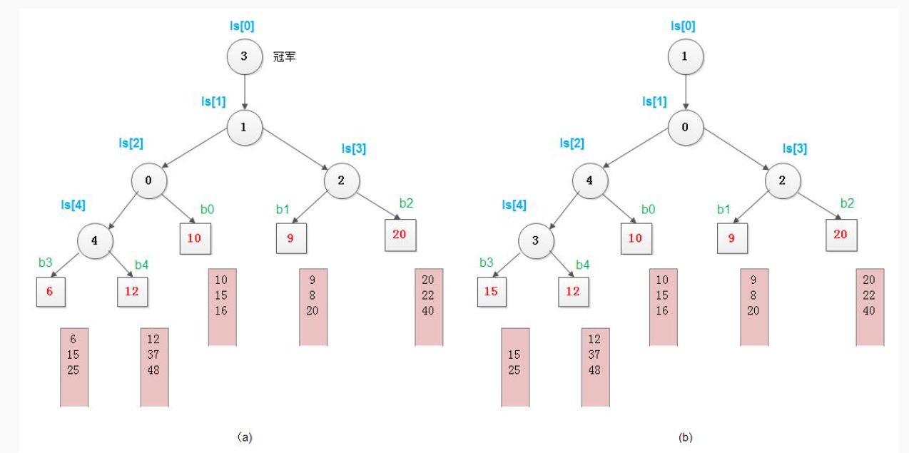

# 败者树

败者树是一颗多路归并树，常用于多路归并，外部排序。

败者树存储败者的来源路（来源归并段），输出胜者。

败者树是完全二叉树，每一个归并段的首元素都在叶子上。

以下以求最小值的败者树为例（升序归并），胜者为较小值，败者为较大值。

## 初始状态



图 （a） 所示：

- $bn$ 表示归并段，$ls$ 表示树结点。

- 叶子结点存储归并段的当前元素

	如果存储归并段的编号会更方便。

- 分支结点存储两个孩子的败者（本例为较大者）的来源段编号。

	比较时需要上推胜者参与下一轮比较（要记录胜者的来源段编号）。

- 初始冠军（初始状态最小的元素）来自 $b3$ 段，元素值为 6 。

末尾判断的方法：

- 在归并段末尾添加 $\infty$  。
- 每段元素数量计数。

## 比较更新

图 （b） 所示：

- b3 的首元素 15 顶替 6 的位置并向根结点不断比较，记录败者，得到最终胜者。
- 该图是 15 顶替 6 后的得到最终胜者之后的树结构。

## 代码示例

```c++
#include <iostream>

const int N = 5;   // 归并段数
int tree[2*N + 5];
int champion;
int data[N + 1] = {-1, 3, 4, 1, 2, 5};   // 原始数据，假设有 5 个元素数量为 1 的归并段

void check_end(int fragment_id) {
    if (1 <= fragment_id && fragment_id <= 5) {   //  本例中，表示没有元素了
        data[fragment_id] = __INT_MAX__;   // 标记结尾
    } 
}

void build_tree() {
    int winer[2*N + 5];   // 记录每次比较的 winer，只有初始化时需要使用
    // build leaf node

    for (int i = 0; i < N; ++i) {
        tree[N + i] = i + 1;   // 赋值归并段编号到叶子   // 从 1 开始时，叶子起始下标为 N
        winer[N + i] = i + 1;   // leaf 的 wienr 是自己
    }

    // build fork node
    for (int i = N - 1; i >= 1; --i) {
        if (data[ winer[i<<1] ] < data[ winer[i<<1|1] ]) {
            tree[i] = winer[i<<1|1];   // 记录败者
            winer[i] = winer[i<<1];   // 记录胜者
        } else {
            tree[i] = winer[i<<1];
            winer[i] = winer[i<<1|1];
        }
    }

    // initial champion
    champion = winer[1];
}

int get_champion_data() {
    
    // 返回当前冠军，并找到下一个冠军
    int old_champion_data = data[champion];
    
    check_end(champion);

    for (int i = (N + champion - 1) >> 1; i >= 1; i >>= 1)  {
        // 找到冠军结点对应的叶子结点(N + champion - 1)
        // 从叶子父结点 (N + champion - 1) >> 1 开始比较
        if (data[champion] >= data[tree[i]]) {
            // 记录败者，胜者继续向上比较，用交换身份实现
            std::swap(tree[i], champion);
        }
    }

    return old_champion_data;
}

int main() {
    
    build_tree();

    // for (int i = 1; i <= 2*N - 1; ++i) {
        // std::cout << tree[i] << std::endl;
    // }

    for (int i = 1; i <= N; ++i) {
        std::cout << get_champion_data() << std::endl;
    }

    return 0;
}
```

