# 算法技巧及注意事项

## 常见缩写术语

- 通过（ Accepted， AC ）
- 答案错（ Wrong Answer，WA ）
- 编译错（Compile Error，CE）
- 运行错（ Runtime Error，RE ）
- 输出格式错（ Presentation Error，PE ）
- 超时（ Time Limit Exceed，TLE ）
- 超内存（Memory Limit Exceed，MLE）

## 一些思想

（以下不计严格的全局顺序，但具有局部顺序）

- 穷举
枚举所有情况，枚举部分情况，按一定规则枚举情况。

- 模拟

  逐步实现操作，由于没有利用数据和操作的性质，可能会较慢。

- 权重
依据权重迭代简化算法

- 切割
  将内在逻辑较复杂的形状切割为内在逻辑较简单的形状：如一维数组，矩形，三角形等。

  - 例如将矩阵切割为一行一行或一列一列的一维数组而解决问题。

- 二分
  在一段范围内有多种可能性，并能够确定二分后的方向（往哪个区间深入），考虑二分试验其可能性。

  - 二分查找（在一百两百内，顺序查找是优于二分查找的）

  - 二分答案

- 分治
  将大问题划分为若干小问题，然后合并得到最终解。

  - 要特别注意局部最优解的合并不是全局最优解的情况。
  - 切割偏图形，分治更宽泛。

- 打表

  - 程序内打表，如果打表复杂度大则不可用。
  - 外部打表，然后将答案复制到源代码中，注意要用逗号分隔，方便直接赋值。（记得开氧气）
  - 打表不一定要将答案全部打出，也可只打出部分答案，但要使其余答案可根据其快速推出。

- 制表

  - 对于一些需要重复计算的关系，可以制表先存储好
  - 对于一些规律不好编码的操作可以直接用数字矩阵代替
  - 对于一次要给出多个重复过程答案的，可以考虑先在整个范围制表（答案表）。

- 公式
  公式推导化简，简化运算，转换为对数运算防止溢出等手段。

- 数论
  整数相关数学方法变换问题，从而化简、预处理或直接求值。

- 博弈
  博弈论，对抗式的最优解。

- 反序
  将正序难解的问题，逆序求解，可运用栈。

  - 反序不只是顺序的反转，也可以是关系（映射）的反转。

- 迭代
  迭代比较宽泛，大致是递归的逆形式，用循环实现的都能叫迭代。

- 递归、回溯

  - 从性质相似的大规模问题逐步到小规模问题，伴有回溯。
  - 从一个问题试探到另一个某些状态改变的相似的问题，伴有回溯。

- 搜索
  以各种顺序搜索状态树（解答树），状态图。

- 剪枝
  根据事物的性质，采取某种措施以减少搜索的状态数。

  - 有时虽然贪心（或其它思路）是错的，但却可以为我们快速求出一个较优解，从而用于剪枝。

- 记忆化
  对重叠子问题进行记忆化。

- 离散化
  对于数值绝对范围非常大的连续量，只需要相对数值时，可以依据相对关系进行离散化，赋予新的表示相对关系的小的离散量（下标）。

  - 可以将较少数量的点的大范围 grid 缩小成小范围 grid，从而表示点的相对位置关系。
  
- 贪心

  由小而大，逐步扩大局部最优解规模。

  - 只适用于局部最优解合并后是全局最优解的问题。
  - 当局部最优解（即较优解）有用处时，也可利用。

- 递推
  从性质相似的小规模问题逐步到大规模问题。

  - 没有决策过程。

- 动规
  多阶段决策问题，具有最优子结构，重叠子问题，无后效性，转态转移较为灵活。

  - 要注意递推与动规的区别。

- 图论
  架构状态关系图（网），以图论角度思考问题，动规的超集。

- 映射
  建立哈希关系、映射关系。

  - 可用于去重，枚举等。

  - 常见方式为：排列康托展开，状态压缩，键值映射，去重排序。

- 固定（基准点）
  对于多维属性的数据，考虑固定其某些维度的属性后再做处理，一般用排序固定。

- 分解固定
  将一个难以求解的两端不固定的问题  转化为两个容易求解的一端固定的问题。

  - 当然也可以对多端问题进行固定操作。
  - 基准点不会增加问题数，分解固定会增加问题数，但问题体量会变小。

- 抽样
  对于可能有简易规律的题，先暴力求出少部分解，然后找规律。

- 重构
  将复杂过程构成的问题完全拆解，寻找快捷的输入输出映射方法。

  - 尽管重构后可能有一部分速度损失，但是降低了思维难度，提高了代码的可复用性与可维护性。
  - 就像可以一次次旋转复原魔方，但也可以拆解后组装复原魔方，比如红黑树中对左旋右旋的重构。

- 换位
  对于复杂过程，如果变动身份不影响状态或结果，那么考虑交换身份或其它变动。

- 降维（升维）
  将低维解决问题的方案进行组合，穷举等解决高维问题。可以是在非整数的维度间转换。

- 特性数据问题的优化存在性
  一个算法若能解决一个数据具有特殊性的问题，且其对于数据无特殊性时也适用，说明可能存在解决这个问题的更高效率的数据结构或算法。

  - 比如左式堆的合并操作。

- 意义扭转
  在能明确所有自变量与因变量的范围时，可考虑扭转意义，分析优化，常用于动态规划。

  - 例如 $f(x, y) = z$ 可扭转为 $f(x, z) = y$ 或 $f(y, z) = x$ 等。

- 重复元

  对于重复过程，即对重复元进行重复的过程，可能得出结果只需开始与结束重复元，可能一定个数的重复元会使得状态复位，如此，依据重复元执行的性质解决问题，可模拟小部分结果，观察规律。

- 最简边缘

  对于填充，覆盖类问题，考虑其最简边缘，当边缘不规则时，考虑最简不规则边缘。
  
- 运算性质

  位运算等特殊运算具备一些特殊性质，有时需要利用这些特殊性质解题。

## 算法分析

- 符号

	在说明是平均或是最好情况时，也习惯统一使用 $O$ 。

	- $O$ （大写 O 欧（英文字母））：最坏情况
	- $\Theta$ （大写 Theta 西塔）：平均情况
	- $\Omega$ （大写 Omega 欧米伽）：最好情况

- 常数
  一般可以忽略常数，但对于时间要求严格的场合，要考虑优化常数。

- 常见错误点
  数字溢出，下标越界，时间超时，空间爆炸。

### 时间复杂度分析

一般时间限制 $1$ 秒。

#### 状态量分析

$1$ 秒内计算状态数一般在 $1$ 到 $10$ 亿左右，即 $10^7$、$10^8$  量级。（尽量不要达到 $10$ 亿，即 $10^9$。状态越大越要尽量减少状态数 ）

```c++
2^5 = 32
2^6 = 64
2^7 = 128
2^8 = 256
2^9 = 512
（估计值比实际值大，保证不会超时）
2^10 = 1024（约 1050，1.05 x 10^3）
2^20 = 1048576（约 105 万，1.05 x 10^6）
2^30 = 1073741824（约 11 亿，1.1 x 10^9）
2^40 = 1099511627776（约 1.1 万亿， 1.1 x 10^12 ）
2^50 = 1125899906842624（约 1200 万亿，1.2 x 10^15）
```

- 规律
	- 三次方的增加是因为 $2^{10} = 1024 \approx 1000 = 10^{3}$ 。
	- 科学计数底数近似值：起始近似 $1$ 。
	- 科学计数指数近似值：$10$ 次方 -> $3 \times 1 = 3$。$20$ 次方 -> $3 \times 2 = 6$。$30$ 次方 ->  $3 \times 3 = 9$。

#### 递归时间复杂度函数的分析（一般用状态数考虑即可）

- 主定理
	一般求状态数就可以解决递归的效率问题，但如果要求较精确的时间复杂度表达式，就需要用主定理。

状态数是一个数，而时间复杂度是一个函数。

主定理基本不用，内容请使用搜索引擎。

#### 状态量分析的补充

光看状态量是不够的，还要看状态的“大小”，才能准确估计时间。

出题人在出题时会根据解法的状态量来调整数据，此时并未参考状态大小，所以我们在估算时也可以适当忽略状态大小。

### 空间复杂度分析

单位：b(bit)，B(byte)，K(KB)，M，G，T，P

- 一个 int $4$ 字节，$1 M$ 有 $262144$ 个 int（约 $250000$）

	（估计值比实际值小，保证不会爆空间）

	- 即 $1 M$ 有约 一百万 字节，$25$ 万个 int
	- $10 M$ 约 $2.5\times 10^6$ 个 int，即 $250$ 万个
	- $100 M$ 约 $2.5\times 10^7$ 个 int，即 $2500$ 万个
	- 一百万个 int 需要 $4 M$
	- 一千万 个 int 需要约 $40 M$
	- 一亿 个 int 需要约 $400 M$

递归与栈空间：栈存储参数以及局部变量，空间一般 $1 \backsim 8 M$（一般不必精确考虑爆栈）。

静态变量有专门的静态变量存储区，比栈空间大。

### 数据类型范围

#### 常用类型

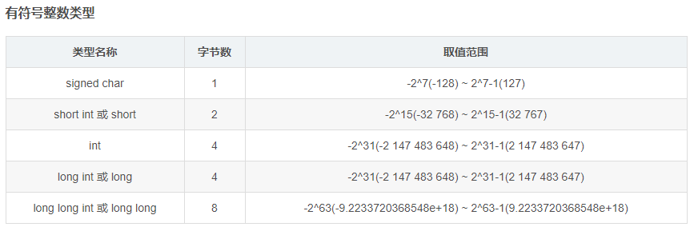

- 常用
	（估计值比实际值小，保证不会溢出）
	- int --> 正负 $21$ 亿。(unsigned int $0$ 到 $42$ 亿)
	- long long --> $2^{63}$ = $922\ 3372\ 0368\ 5477\ 5808$ --> 正负 $922$ 万万亿（正负 $9.22 \times 10^{18}$）

重要估算技巧：可根据位宽推范围（$2^{10}$ 约等于 $10^3$）

$32$ 位（$4$ 字节）有符号 int 最多能存储 $12!$。

$64$ 位（$8$ 字节）有符号 long long 最多能存储 $19!$

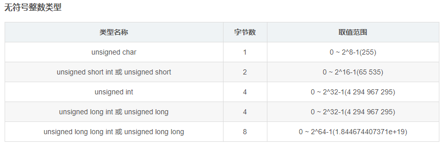

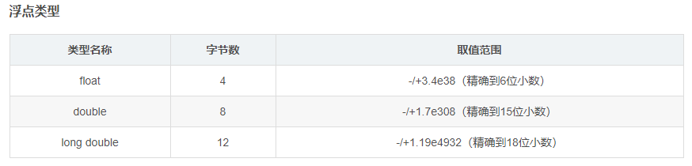

#### C++ 大整数类型

支持正负 $1.7 \times 10^{38}$ 的范围。

可一定程度上作为高精度的替代，$64$ 位以下的评测机可能无法识别，有些时候可能不允许使用。

```c++
__int128_t  ：128 位 int, 注意：正负 1.7 x 10^38
__uint128_t ：无符号 128 位 int,
（有些时候写作 __int128，依具体环境而定）
```

该类型与 int 使用方法类似，但无法直接使用 printf 和 cout 等系统函数输入输出，需要手写。

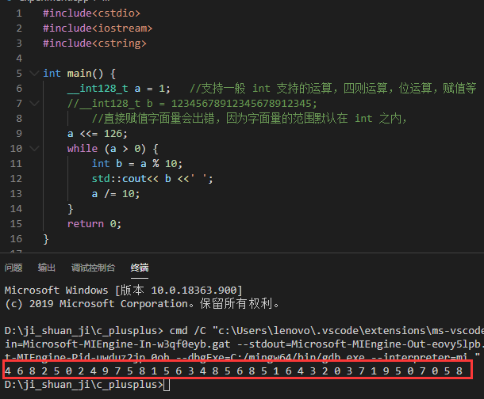

注：上图中，直接赋值超过范围的字面量会出错。红框正好 $38$ 个数。

实际上，对于 int128 的输出输出，如果输入或最终结果在 long long 内：

- 可以用 long long 输入，然后赋值给 int128。
- 可以将 int128 赋值给 long long，然后输出。
- 可以将 int128 用于强转，以临时使用。

## 数据范围反推算法

@闫学灿

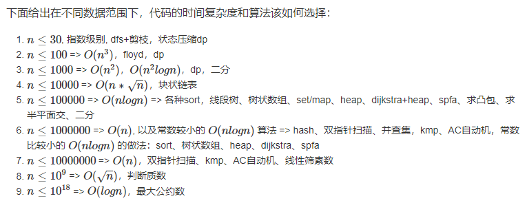

（上图只是部分算法，用于举例）

根据数据范围，很多时候都可选取“接近但不超过”的复杂度的算法。

推导出最高允许的复杂度后，必定存在小于等于该复杂度的算法，避免把一个简单问题想得太难。

## C++ 读入输出优化

```c++
std::ios_base::sync_with_stdio(false);
std::cin.tie(NULL);
std::cout.tie(NULL);
```

## 编译优化选项

### O1

在不影响编译速度的前提下，尽量采用一些优化算法降低代码大小和可执行代码的运行速度

### O2（氧气）

该优化选项会牺牲部分编译速度，除了执行 O1 所执行的所有优化之外，还会采用几乎所有的目标配置支持的优化算法，用以提高目标代码的运行速度。

### O3（臭氧）

该选项除了执行 O2 所有的优化选项之外，一般都是采取很多向量化算法，提高代码的并行执行程度，利用现代CPU中的流水线，Cache 等。

### 说明

- 上诉编译优化选项只占一部分，但是较常用。
- 在不开启优化时，代码的编译以利于调试为目的，开启后，以优化为目的。（默认是 O0，即一般编译）
- STL 等容器提供了大量抽象接口，在不开启 O2 优化的情况下，几乎全部都是函数调用，开启后，由于内联函数会被内联等各种措施，抽象降低，速度提升。
- 在大量利用 STL 的程序中开启优化，对一般程序可能会有负优化。
- 一般开 O2 优化，当程序中有大量最值比较等可并行的操作时，开 O3 优化。
- 若比赛无特殊要求，一般不开优化。
- **对于填空题，请一定把 O2 优化打开。**

### 开启优化的预编译指令

```c++
程序开头键入：
#pragma GCC optimize(1)
或
#pragma GCC optimize(2)
或
#pragma GCC optimize(3)

也可对编译器对编译命令输入参数：-O1  -O2  -O3
```

## 常用标识符

| 标识符 | 意义 |
|-|-|
| MAXN, MAXM, MAXL | 最大 N，最大 M，最长 L |
| max, min | 最大值，最小值 |
| case_num, T | 样例数 |
| i, j, k, l, m, n, ii, jj, kk | 循环变量 |
| L, R | 左闭右闭区间 |
| lo, hi | 左闭右开区间（右为超尾值） |
| ch | 一个字符 |
| t，temp | 临时变量 |
| res | 存储变量（reserve） |
| ans | 结果（answer） |
| dp, f | 动规数组 |
| bag | 背包数组 |
| check | 检查函数 |
| V, E | 顶点，边 |
| Node | 结点 |
| u, v | 边的起点与终点 |
| s, t | 图的源点与终点 |
| x, e, elem | 某个目标，某个元素 |
| p | 一个指针（pointer） |
| rank | 秩（代表某种具有顺序的规则） |
| pos, p | 某个位置（position） |
| exist | 存在 |
| save，memory | 保存，记忆 |
| deep | 深度 |
| count, cnt | 计数 |
| arr, nums, vec | 数组，数字数组，向量 |
| arrA, arrB$\ldots$ | 数组 A，数组 B（注意泛化） |
| stack, queue, deque, pqueue, set, map | 栈，队列，双端队列，优先队列，集合，映射 |
| tree，heap，graph | 树，堆，关系图 |
| map，matrix | 地图，矩阵 |
| hash | 哈希函数，哈希映射 |
| inf, pinf, ninf | （正）无穷，正无穷，负无穷 |
| w(weight) | 权值 |
| v(value)，cost | 价值，花费 |

## 重要事项

### 常用基本头文件

```c++
<iostream>
<cstdio>
<algorithm>
<cmath>
<cstring>
<cctype>
```

### 程序时间计算

头文件：<ctime>
函数：clock ( )
常量：CLOCKS_PER_SEC（即 1000） （除以其将结果转化为以秒为单位）

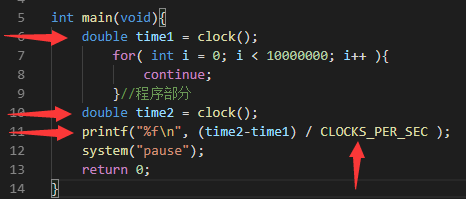

这个时间是本地机时间，可在实际测试算法时使用，竞赛中一般看复杂度。

### 重定向式文件输入输出

在 main 函数开头添加。

头文件：```<cstdio>```
函数：freopen ( )

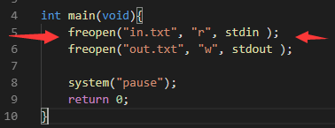

所有输入输出函数都将变为使用文件，使用后无法恢复重定向，只有重新重定向到命令行。

要注意比赛是否禁止使用重定向方式访问文件。

### 数组初始化，数组批量值移动

头文件：```<cstring>```
函数：memset ( ),   memcpy ( )

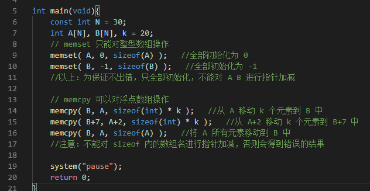

memset 对 bool 类型可用:

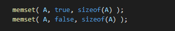

memset 对 char 可赋一字节内的任何值。


- memset 函数按 字节 对内存块进行初始化，所以尽量不要用它将 int 数组初始化为 $0$ 和 $-1$ (int：11111111 11111111 11111111 11111111) 之外的其他值
- memset 函数对整型二维数组也有效，memcpy 函数只对一维数组使用
- 为保证不出错，以上函数只对整型数组使用。
- 以下传入的形参会出错：

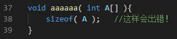

- 扩展值
	- 如果是 int 数组
		int 类型范围：$-2147483648 \backsim 2147483647$
		- $127$（极大值）
			全部初始化为 int 的较大值，即 $2139062143$ ( int 最大值为 $2147483647$ )；
		- $128$（极小值）
			全部初始化为一个很小的数，比 int 最小值略大，为 $-2139062144$。
	- 如果是 double 数组
		double 类似范围为：$-1.7 \times 10^{308} \backsim 1.7 \times 10^{308}$ 。
		- $127$：全部初始化为一个很大的数 $1.38 \times 10^{306}$；
		- $0$：全部初始化为 $0$；
		- $128$：全部初始化为一个很小的数 $-2.93 \times 10^{306}$ 。

### 二维数组的坐标

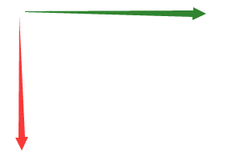

- 红色箭头指向横坐标 X 增大的方向（装数组的数组）
- 绿色箭头指向纵坐标 Y 增大的方向（装元素的数组）

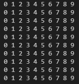

概念上可以按一般坐标系处理。

### 对数运算

有时候，可以将用科学记数法表示的数直接转化为字符串，以避免溢出。

`<cmath>` 数学函数库中： `log()` 以 $e$ 为底，`log10()` 以 $10$ 为底。

可以将导致溢出的相关过程做 log 处理，以避免溢出。

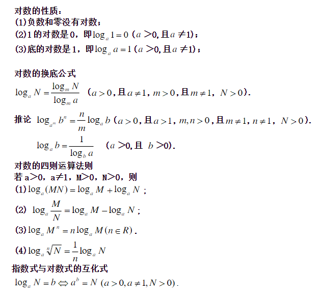

### STL 中的一些注意点

当数组空间不确定时，使用 STL 的 vector 。

- 常用排序
	- 快速排序（quick_sort）适用于数据较随机的场合；（不稳定）
	- 归并排序（stable_sort）适用于数据较多部分有序的场合。（稳定）

二路归并函数： merge()

- 二分查找函数
	前提是数组单调不降，否则出错（默认 $\lt$ 运算符）。返回值为地址，可与数组首地址相减得到下标，也可直接指针。
	- upper_bound()
		返回第一个**大于**被查找数的元素的地址。
	- lower_bound()
		返回第一个**大于等于**被查找数的元素的地址。

得到一个指向数组元素的指针后，要得出它的下标，应该与整体数组（数组名）作差，而不是与部分数组段的开头作差。

自写的二分查找函数注意参考二分查找笔记。

- nth_element() 算法，属于 algorithm 库。`nth_element(lo, nth, hi)`
  也即是快排的划分算法（partition），其中 nth 是分割点，使用该函数后，序列中 nth 前的元素都小于它，nth 后的元素都大于它（可自定义比较器作为第四个参数）也就是说，使用该函数后，nth 的位置上的数，是其完全排序后应当存在于那个位置的数。
  - 常可用于求第 $k$ 小的数：`nth_element(arr, arr+k, arr+n);`
  - 求第 $k$ 大的数只需换为 $n-k$ 即可：`nth_element(arr, arr+n-k, arr+n);`

### 边界

#### 区间标识符

- 左闭右开区间（超尾区间），使用 lo 和 hi 作为标识符。
- 左闭右闭区间（双闭区间），使用 L 和 R 作为标识符。

#### 二分元素分布

对于下标的 `mid = (左 + 右) / 2` 元素数量分布，不加上 mid 位置的元素比较时：

- 超尾区间左多右少（中心点偏末尾）。
- 双闭区间左少右多（中心点偏开头）。

#### 边界控制

- 代入特殊值
	- 取 0 ，取 1
	- 变量相等
- 分析临界、特殊状态
- 模拟具体情况
- 公式计算（若要取整则代入偏向）

#### 溢出控制

乘积为例：

```c++
if (res <= MAX / number) {   //满足条件时说明 res * number 不会溢出
    res *= number
}
```

### 整数平方根精度问题

对于 `double sqrt(double x)`，double 的整数部分完全能容纳下 32 位的 int，因此一个 int 类型的 $n$，若 $\sqrt n$ 为整数，则对 $n$ 开平方根不会产生精度问题。

对于 long long，可以使用 `long double sqrtl(long double)`（C++ 11），也不会产生上述精度问题。

对于不确定场合，可以使用以下两种方法：

```c++
for (int i = 1; i * i <= n; ++i)   // A 版本，i * i 容易导致溢出
    
for (int i = 1; i <= n / i; ++i)   // B 版本，效率稍有不足
```

对于 $\sqrt n$ 为小数时，一般使用 $\sqrt n + 1$ 即可。

### 整数趋近

$\frac a b$ 上取整可写为：$\frac {a+b-1} b$ （天然下取整）。

例：

有 $\frac {n(n+1)} 2$ 个数分层分布如下：

```c++
1
1 2
1 2 3
1 2 3 4
...
1 2 3 4 ... n
```

问第 $x$ 个数在第几层？

可以使用二分，以下演示推公式：

有 $\frac {y(y+1)} 2 = x$，即 $y^2 + y - 2x = 0$，设定 $x,y$ 都为正整数，用求根公式解这个二次方程，有 $y = \frac {\sqrt {1 + 8x} - 1} 2$。

$y$ 的所有过程使用浮点数运算，此时 $\lfloor y \rfloor$ 即是 $x$ 所在层的上一层，$\lceil y \rceil$ 即是 $x$ 所在层的下一层。

考虑的 $8x$ 若容易溢出，则可进一步化简：$y = \frac {\sqrt {1 + 8x} - 1} 2 = \sqrt {\frac 1 4+2x} - \frac 1 2$。

#### 整数趋近的误差问题

使用上述公式下取整求上一层时，当 $x$ 恰好能进行整数运算时，无法得到正确的下或上取整结果。

此时得到的 $y$ 刚好是 $x$ 所在的层数，而不是上一层。

#### 解决办法

将得出的结果 $y$，进行反向验算即可。即判断是否有：$\frac {y\times(y+1)} 2 = x$，如果有，则特判正确即可。

#### 测试程序

```c++
#define ll long long

int main() {
    ll rank = 1;
    for (ll i = 1; i <= 10000; ++i) {   // 1000 层
        for (ll j = 1; j <= i; ++j, ++rank) {
            ll pos = (ll)(sqrt(0.25 + 2 * rank) - 0.5);
            // if (i - 1 != pos) {
            //     printf("Error: rank = %lld i = %lld pos = %lld\n", rank, i, pos);
            // }

            // if (i - 1 == pos || pos * (pos + 1) = 2 * rank) {   // 正确判断
            //     puts("Correct!");
            // }
            if (i - 1 != pos && pos * (pos + 1) != 2 * rank) {
                printf("Error: rank = %lld i = %lld pos = %lld\n", rank, i, pos);
            }
            if (rank > 100) {   // 前 100 个
                goto mark;
            }
        }
    }
    mark:
    puts("Correct!");
    return 0;
}
```

**一般不要用整数趋近，容易因考虑不全面或浮点数的精度误差导致错误，此时应该用对于整数准确性高的二分，查找判断层数。**

## 重要杂项

精确到个位的四舍五入：`( int )( x + 0.5 )` 注意结果为整型

遇到浮点数要注意 EPS 的使用。

每行末尾以回车符结束，包括最后一行。一般行首不应有空格，注意判断行尾是否可以有多余空格，末尾是否可以有多余空格。另外，输出的每个数或字符串应该以单个空格隔开。

读取时注意一些字符的干扰，比如 e，可能会被当作科学计数法的标记而导致读入的数据错误

需要输入空格和特殊字符时使用 fgets 或 getchar 函数；（ fgets 会添加末尾空字符，在个数限制内，还会读入换行符，要注意换行符的处理）其参数 n ，代表所有字符包括空字符一共 n 个。输入大量数据时，getchar() 的效率较高

注意短路规则，C 与 C++ 都是如此。

涉及 long long 的输入输出一般用 C++ 输出语句，因为其输出控制符可能容易搞错（有时候是 %lld,  有时候 %64d）。
以下代码可以避开对 long long 输入控制符的选择：`scanf("%d", &n2 ); long long n = n2;`（但注意 n2 不能超过 int ）

scanf 返回成功输入的变量个数，无法再读入时，返回 0 或文件末尾返回 `EOF` 。

计算完一组数据后，注意重置变量，以便下一组数据求解。

比较大的数组尽量声明在 main 函数外，否则可能无法运行（函数内的变量开辟在栈中，函数外的变量开辟在堆中，这样可以防止爆栈）

memcmp() 比较两个缓冲区

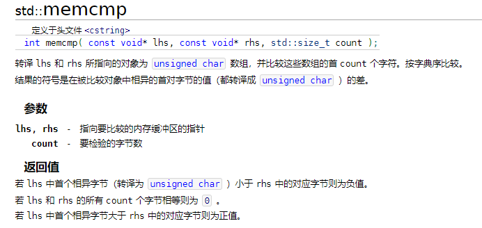

---

先检查是否越界，再取出值。

- 常用字符串函数
	- sscanf( ) 函数：从字符串输入 <cstdio>
	- sprintf( ) 函数：输出到字符串 <cstdio>（可以声明一个缓冲字符数组 buf ）
	- strchr( ) 函数：在字符串中查找一个字符 <cstring>
	- strstr( ) 函数：在字符串中查找一个字符串 <cstring>
	- strlen( ) 函数：返回所含字符个数 <cstring>（不包空字符）（strlen 返回的数字即是空字符的下标）

不要弄错 strlen 和 sizeof，对字符串操作时，sizeof 给出整体空间大小；stelen 给出字符串长度（亦从 0 开始时的末尾空字符的下标）。

字典序不必比较长度，一趟扫描即可。

使用 `str[ i ] != '\0'` 并不能比 `i < strlen( str )` 节约一次扫描的时间，使用系统函数是第一选择。

若要输出前导 $0$ 可：`printf("%03d", a);   // 宽度为 3，自动补前导 0` 。

保证结果不溢出的同时，要保证计算的中间结果不溢出。

对于一些多条命令输入，可构建命令结构体。

读入输出大量数据时，考虑快读快写。

求无限循环小数时，用除法竖式，当相同的余数再次出现时，说明小数开始循环。

goto 不能跨函数使用。

增加虚结点的同时，也增加了虚边。

- 坐标点处理
	- 用 map 将坐标映射为编号
	- 对坐标排序

需要一个较大的素数时，若不方便确定是否为素数，可使用多个 $9$ 和一个 $7$ 代替，如：$9999997$ 或一个大整数减 $3$，如： `1e^7-3` 。
