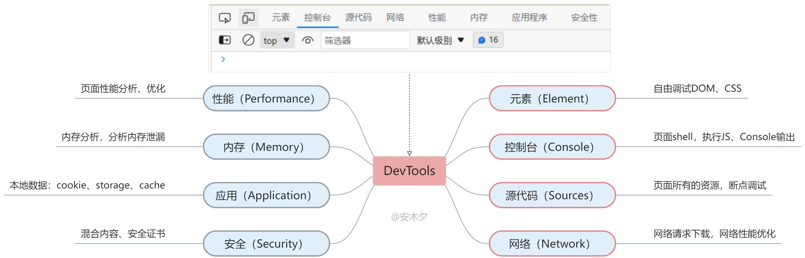
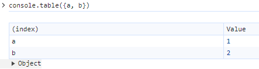
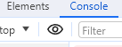

# Chrome

主要是 Web 前端调试的知识。

## 基础操作

| 功能                         | 操作                                                         |
| ---------------------------- | ------------------------------------------------------------ |
| 打开调试模式                 | `F12`，`Ctrl + Shift + I` (Windows) 或` Cmd + Opt + I` (Mac) |
| 内容搜索查找                 | `Ctrl+F`：元素、控制台、源代码、网络都支持搜索查找           |
| 隐藏显示元素                 | 选中元素，按下`h`快速隐藏、显示该元素。                      |
| 移动元素                     | 鼠标拖动到任意位置。上下移动：`[ctrl] + [⬆]` / `[ctrl] + [⬇]` （`[⌘] + [⬆] / [⌘] + [⬇]`on Mac） |
| 打开 Command 面板            | [Ctrl] + [Shift] + [P]                                       |
| 元素截图，包含隐藏滚动的内容 | 鼠标右键点击元素寻找。（Command 面板中搜索'screen shot' 可有更多截图功能） |



## 元素面板（Element）

- 调试 DOM 树。
- 调试样式。
- 颜色可以可视化编辑，查看效果。
- 可强制激活伪类，操作样式类。
- 选中 DOM 元素，右键设置中断点，可以在元素更改（JS 代码修改 DOM）时触发断点。

## 控制台面板（Console）

- 可执行任意 JS 代码，包括调用页面已有的 JS 对象、函数。

### console 对象

| console                             | 功能                                                         |
| ----------------------------------- | ------------------------------------------------------------ |
| console.**log**()                   | 控制台输出                                                   |
| console.**error**(str);             | 打印一条错误信息，类似的还有`info`、`warn`                   |
| console.**table**(data [, columns]) | 将对象数据以表格的形式显示，data 为数组或对象，第二个参数（数组）可指定输出的列 |
| console.**dir**(object)             | 树形方式打印对象，特别是 DOM 对象非常实用                    |
| console.**assert**(false, 'false')  | 断言输出，为`false`才会输出                                  |
| console.**trace**()                 | 输出当前位置的执行堆栈，用断点会更实用一些。                 |
| console.**time**(label)             | 计时器，可用来计算耗时（毫秒），三个函数配合使用：**time**(开始计时) > **timeLog**(计时) > **timeEnd**(结束) |
| console.**clear**()                 | 清空控制台，并输出 Console was cleared。                     |

用 `console.time()` 来计算代码的耗时，参数为函数名。

```js
function sum(n) {
  let sum = 0;
  for (i = 1; i <= n; i++) {
    let u = { name: 'sam', age: i }
    sum += i;
  }
  return sum
}
// 计算一个函数的耗时
console.time('sum') // 开始计时
const total = sum(100000);
console.timeLog('sum');  // 计时：sum: 4.43994140625 ms
const total2 = sum(1000);
console.timeEnd('sum');  // 计时：sum: 5.0419921875 ms
console.log({ total });  //{total: 5000050000}
```

`console.table()` ：

```js
const x = 1, y = 2;
console.log(x, y); // 1 2
console.log({ x, y }); // {x: 1, y: 2}
console.table({ x, y }); 
// 也可输出多行多列的表格
// 也可传入数组
```

效果：



### 监听

通过如下（调试工具）的全局函数可监听一个函数、事件的执行。

| 函数                        | 说明                                                   |
| --------------------------- | ------------------------------------------------------ |
| **monitor**( function )     | 监听一个函数，当被监听函数执行的时候，会打印被调用信息 |
| **monitorEvents** ( event ) | 监听一个事件，当事件被触发时打印触发事件日志           |

监听表达式：



其中，点击眼睛图标即可新建表达式。

## 源代码面板（Sources）

管理网页  JS、CSS 源代码和图片等资源文件。

- 查看代码

- 断点

- 堆栈

- 记录点

	添加记录点（Add logpoint）：添加一个日志打印。可以独立于源码添加，不用在源码下添加`console`了。

### 本地工作区

可用于调试线上代码。

对于线上环境的源代码（JS、CSS），可以创建 JS 副本到本地，页面加载本地的 JS 文件，就可以在本地 JS 文件上进行修改调试。

在 Sources 面板中找到 Override ，然后点击操作即可。

## 网络面板（Network）

- 工具栏中两个比较实用的小功能：禁用缓存、模拟弱网环境。
- 可以编辑参数，重新发起请求。

## 性能面板（Performance）

先录制，后分析，分析网络、CPU、内存、渲染FPS帧率，用于定位、解决页面性能问题。

- 性能监视器（Performance monitor）

	可以实时的监控页面性能参数。

- Lighthouse

	对页面进行综合分析，包括性能、PWA（Progressive Web App，渐进式Web应用）、SEO、无障碍访问等，分析完后产出报告，给出得分，并给出页面改进建议。


