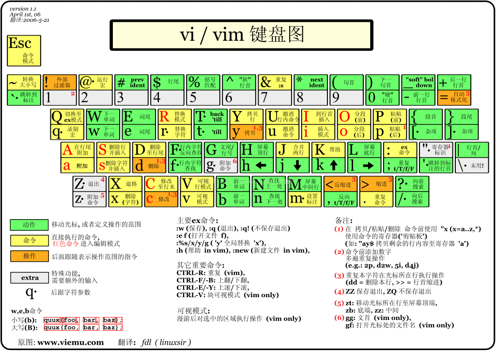

# Vim

## vim 键盘图



## 基本概念

- 注意事项

	- 注意大小写，注意区分一个键“上下”同时代表的符号，“上”按 Shift

	- 因一般命令模式光标是矩形，有左右两个边缘，一些操作语义模糊不清，在此制定以下术语：光标左，光标右，光标内。
- 三种模式

	- 一般命令模式（command mode）
	- 编辑模式（插入模式，insert mode）
	- 命令行模式（comman-line mode）
- ESC 可由 Ctrl+[ 或 Ctrl+c 替代。
- Ctrl + z
  - Ctrl + z 会使 vim 被挂到后台执行（挂起）
  - 可以使用 jobs 查看当前挂起的进程
  - 然后 fg n （n 为进程前编号）唤醒 vim

## 移动光标的方法

### 基本方向

```
左下上右：h j k l
对上下指定行数：nj 或 nk
对左右指定字符数：nh 或 nl
```

### 字符移动

```
<space>		向后移动 1 个字符的距离
n<space>	向后移动 n 个字符的距离
n<backspace>（退格键）    向前移动 n 个字符的距离
fx	在当前行 向后 移动到 x 字符处(x 字符处为光标内)
Fx	在当前行 向前 移动到 x 字符处
```

### 单词移动

```
b	上一个单词首部
w	下一个单词首部（首部在光标内）
e	移动到单词结尾，已在结尾则移动到下一个单词结尾（结尾在光标内）
大写则忽略符号
（可在参数位置间快速切换）
（可通过空格的数量快速判断移动的个数）
```

### 行移动

```
n<Enter>	向下移动 n 行,行首
n<->（减号）    向上移动 n 行，行首
- 移动到上一行的非空开头
+ 移动到下一行的非空开头

当前行
0 或 【Home】	移动到当前行“硬”开头
$ 或 【End】	移动到当前行末尾

屏幕行
H	光标移动到当前屏幕 最上方 那一行开头。（High）
M	光标移动到当前屏幕的 中央 那一行开头。（Medium）
L	光标移动到当前屏幕 最下方 那一行开头。（Low）

文件行
gg	移动到文件的第一行。
nG 移动到文件的第 n 行。
G	移动到文件的最后一行。

G 命令跳转
当你用"G"命令从一个地方跳转到另一个地方时:
使用命令【 `  ` 】可以跳回到刚才的准确位置，
使用命令【 '  ' 】可以跳回到刚才那一行行首。
```

### 段移动

```
{	段首
}	段尾（函数首末尾）
```

### 页移动

```
Ctrl + b	向上翻一页
Ctrl + f	向下翻一页
Ctrl + u	向上翻半页
Ctrl + d	向下翻半页
```

### 特殊移动

```
括号跳转
%	移动到与当前光标下的括号匹配的括号处，不分前后跳转。（在光标内）
	若当前行无括号，则无反应。
	若光标不在括号上，则会移动到附近的括号上。

函数定义
gd	跳转到函数定义 Ctrl + o 可返回（具有栈匹配效应）

悬停效果
gh	造成相当于鼠标悬停于当前位置的效果
```

### 具名标记

```
命令"ma"将当前光标下的位置标记为"a"。从(a-z,A-Z)一共可以使用 52 个自定义的标记。
使用命令【 `marks 】marks就是定义的标记的名字。

命令【 `a 】会精确定位a所在的位置。
命令【 'a 】使你跳转到a所在行的行首

命令：【:marks】用来查看标记的列表。
命令【delm！】删除所有标记。
:delmarks a b c    删除指定的一个或多个标记
:delmarks!    删除所有标记
```

## 撤销类操作

```
u	恢复前一个操作。（撤销）
Ctrl+r	重做前一个操作。
.	（小数点）重做前一个操作。
```

## 剪切板

### 删除（剪切）

注意，VIm 中删除就相当于剪切，会占用剪切板。

以下内容中“删除”与“剪切”等价。

当前行即光标所在行。

```
字符
x	在当前行内向光标左的后方删除一个字符，相当于删除光标内的字符。
X	在当前行内向光标左的前方删除一个字符。
nx, nX	连续删除 n 个字符。

单词
daw  删除当前单词(Delete A Word)
daW  删除当前单词，忽略符号
db	向前删除一个单词
dw	向后删除一个单词
dnb   向前删除 n 个单词
dnB   向前删除 n 个单词，忽略符号
dnw   向后删除 n 个单词
dnW   向后删除 n 个单词，忽略符号
(以上几个都是以光标左开始)
(刚开始的空格也算一个单词)
(以上对复制也适用)
注意：
这里的忽略符号是指将指定范围内的所有符号去掉后的字母链接在一起的“单词”，不包括空格
如：
aaaaa{bbbbb}bbb   忽略符号后是一个“单词”

行
dd	删除当前行。
ndd	删除当前行及以下的一共 n 行。

d0	删除光标左到当前行开头的所有字符。
d$ 或 D	删除光标左到当前行结尾的所有字符。

d1G	删除当前行到第一行。
dnG	删除从光标所在行到第 n 行，可向前也可向后。
dG	删除当前行到最后一行。
```

### 复制

```
单词
yaw
yaW
yb
yw
ynb
ynB
ynw
ynW
(以上几个都是以光标左开始)
(刚开始的空格也算一个单词)

行
yy	复制当前行。
nyy	复制当前行到下方共 n 行。

y0	（从光标左）
y$	（从光标左）
Y	复制一整行。

y1G
ynG
yG
```

### 粘贴及特殊操作

```
粘贴
对于字符级数据
p	从光标右开始粘贴（向后）
P	从光标左开始粘贴（向前）

对于行级数据
p	从光标下一行开始粘贴
P	从光标上一行开始粘贴

粘贴注意：
当所操作数据第一行没有满行时，都从光标右开始粘贴
（光标位于行顶且光标内为空字符时将从行首开始粘贴）

特殊操作
J	合并当前行和下一行（将下一行接到当前行末尾）。
```

### 寄存器

```
删除和剪切都要占用剪切板的寄存器。

Vim 中的复制、删除的内容都会被存放到默认（未命名）寄存器中，之后可以通过粘贴操作读取默认寄存器中的内容。
Vim 支持的寄存器非常多，其中常用的有 a-zA-Z0-9+“。其中：

0-9    表示数字寄存器，是 Vim 用来保存最近复制、删除等操作的内容，其中 0 号寄存器保存的是最近一次的复制内容。
a-zA-Z    表示用户寄存器，Vim 不会读写这部分寄存器。
"（单个双引号）    未命名的寄存器，是 Vim 的默认寄存器，保存最近一次的 删除、复制 等操作的内容。
+    剪切板寄存器，关联系统剪切板，保存在这个寄存器中的内容可以被系统其他程序访问，也可以通过这个寄存器访问其他程序保存到剪切板中的内容。
%    当前文件名。

通过下面命令可以查看所有寄存器中的内容，也可以只查看指定寄存器的内容（将寄存器名称作为参数）
:reg [register_name] 

例子：（以 " 开头使用寄存器命令）
""p   // 粘贴默认寄存器的内容
"+yy  // 复制当前行到剪切板
"+p   // 将剪切板内容粘贴到光标后面
"ayy  // 复制当前行到寄存器 a
"ap   // 将寄存器 a 中的内容粘贴到光标后面

系统寄存器
将内容复制到 + （系统剪切板寄存器）中，系统其它程序就可访问。
将内容通过 + 粘贴，就可以访问系统剪切板的内容。
```

### 匹配区域

```
（将 d 改为 y 即复制）
将光标移动到括号，引号等左右匹配性质的区域中时：
 di【(】		快速删除括号内的内容
代表的意思是 delete all content inside ( , 所以结果字符串为 ()
 da【(】		快速删除括号内的内容，包括括号

比如有字符串 "testdfat"，假设光标停留在第一个 t 位置。
di【"】		delete all content inside " , 结果字符串为 ""
对中括号等左右匹配性质的区域都适用
```

### 行内区域

```
（将 d 改为 y 即复制）
dt【a】		删除到 a 字符（被删除部分不包括 a 字符）（光标左开始向后）
delete all content to a.
df【a】		删除，直到 a 字符被找到（被删除部分包括 a 字符）（光标左开始向后）
delete all content from current location, until a is found.

dT【a】		dt【a】的反向版（光标左开始向前）
dF【a】		df【a】的反向版（光标左开始向前）
```

## 查找与替换

```
/word	向光标下查找 word
?word	向光标上查找 word
n	重复前一个查找操作
N	反向进行前一个查找操作（向上变向下，向下变向上）

:n1,n2s/word1/word2/g	在 n1 行到 n2 行之间查找 word1，并替换为 word2 。
:1,$s/word1/word2/g		从第一行到最后一行查找 word1，并替换为 word2 。
:1,$s/word1/word2/gc	gc：替换前显示是否确认。

查找后取消高亮：【:noh】

若需要被替换的字符串有特殊符号，则只需要在每个符号前加上【 \ 】转义字符，用于替换的字符串可照常。
```

## 缩进

```
>>	缩进单行代码
<<	反缩进单行代码

缩进多行：
行选择后按单个 > (缩进)，   < (反缩进)； （注意，必须是行选择（shift + v）才能缩进多行）
选择后 n> 是缩进 n 次
直接 n>>  是将当前及以下 n 行缩进一次

进入一般命令模式：
:10,100>		第10行至第100行缩进
:20,80<		第20行至第80行反缩进
```

## 插入模式

``` 
i	在当前光标左进行插入
I	在当前行首非空字符处插入

a	在当前光标右进行插入
A	在当前行末尾插入

o	在下一行插入
O	在上一行插入

r	替换当前光标内的字符
R	从光标内开始，连续替换字符，直到按下 Esc 。

s	删除当前光标内字符并进行插入模式
S	删除当前行并进入插入模式

Esc	回到一般命令模式

多行编辑
Ctrl + v	进入 visual 模式，选择范围
shift + i	在光标左插入
shift + A	在光标右插入
```

## 保存退出

``` 
:w	保存
:w!	强制保存
:q	退出
:q!	强制退出（不保存）
:wq	保存并退出
:wq! 强制保存并退出

:w [filename]	将当前数据另存为新文件
:r [filename]	读入另一个文件的数据（附加到光标所在行后面）
:n1,n2 w [filename]	将 n1 到 n2 行保存到另一个文件
:! command	查看命令行下执行 command 的结果。例如 :! ls/home 则可在 vim 中查看 /home 内执行 ls 输出的信息。
```

## 环境设置

````
:set nu		显示行号
:set nonu	不显示行号
````

## 可视区块

（Visual Block）可选择特定的范围。

```
v	字符选择，选择经过的地方。
V	整行选择，选择经过的行。
Ctrl + v	可视区块，可选择矩形区域。
y	复制已选择的数据。
d	删除已选择的数据。
p	粘贴刚刚选择的数据。（光标右开始粘贴）
选择后可使用 I 或 A 进行多行插入。
```

## 补全

在插入模式下使用快捷键。（以下的 `->` 表示先按什么，接着后按什么）

```
Ctrl + n 向下查找，使用当前文件和包含的头文件中的单词补全。
Ctrl + p 向上查找，使用当前文件和包含的头文件中的单词补全。

Ctrl + x -> Ctrl + n 使用当前文件单词补全。
Ctrl + X -> Ctrl + l 使用当前文件整行补全。
Ctrl + X -> Ctrl + f 使用当前目录内的文件名补全。
Ctrl + X -> Ctrl + 0 全能（omni）补全，以扩展名为依据，以 vim 内置关键词进行语法补全。

Ctrl + e 终止或撤销本次补全
```

## 多文件编辑

```
打开多个文件
vim [filename1] [filename2] [filename...]

:n	编辑下一个文件。
:N	编辑上一个文件。
:files	列出目前 vim 打开的文件。
```

## 分屏功能

```
打开文件分屏
:sp	为当前文件再开一个窗口
:sp	[filename]	水平分屏打开一个文件。
:vsp [filename]	垂直分屏打开一个文件。
vim -o file1 file2 ...	水平分割，打开多个文件窗口。
vim -O file1 file2 ...	垂直分割，打开多个文件窗口。

新建文件分屏
:new	水平分割，新建一个文件编辑窗口。
:vnew	垂直分割，新建一个文件编辑窗口。

分屏移动
Ctrl + w + h/j/k/l	（先按下 Ctrl + w，然后按 h/j/k/l，也可上下左右）
Ctrl + w + r	互换窗口

关闭窗口
:q
:close
Ctrl + w + q
Ctrl + w + r
:only 或者 ctrl+w+o 取消其它分屏，只保留当前分屏

改变分屏尺寸：
宽度：　　ctrl+w 加 < 左		ctrl+w 加 > 右
高度：　　ctrl+w 加 + 上		ctrl+w 加 - 下
ctrl+w 加 = 使窗口尺寸一致
(ctrl+w n h/j/k/l，窗口往该方向变动 n 距离)
```

## Vim 宏

针对重复的操作。

```
录制
1、“q{register}” 命令开启一次录制，录制内容保存到{register}指定的寄存器中。(录制时显示 recording)
2、输入你的指令
3、输入 q（后面不跟任何字符）命令结束记录。

播放
使用“n@{register}”命令执行宏。
n 代表执行次数，默认为 1。

注意点
a-zA-Z：表示用户寄存器。
从前往后删除时，注意行号的变化是否会导致错误。
```

