# Matlab 

## 基本常识

默认赋值给 ans 变量。

命令后加分号则不即时显示计算结果。

注意选择工作文件夹

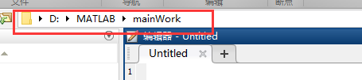

---

Matlab 中索引（下标）由 1 开始。

Tab 键弹出备选提示。

## 常见数据类型

- inf

- NaN (not a number)

- double（默认）

- 字符串

	单引号括起的内容。（字符串操作的更多内容请查阅文档。）

- 字符串数组

	char('a', 'b', 'c')
	
- 元胞 Cell

- 结构体 Struct

## 常用运算

- 加（+）

- 减（-）

- 乘以（*）

- 除以（/）

- 次方（^）

- 比较运算符

	```matlab
	>
	<
	>=
	<=
	==
	~= 不等于
	结果为逻辑值（布尔）
	
	向量与矩阵也可逻辑运算，比较每个元素。
	```

- 逻辑运算符

	```matlab
	&
	|
	~
	
	% 0 if false, not 0 is true.
	
	内置逻辑运算函数：
	any(A) 向量中任意元素非 0 返回 true，矩阵以每列判断。
	all(A) 向量中所有元素非 0 返回 true。
	xor 异或
	and()
	or()
	not()
	```

## 常用基本命令

- clc

	清屏。

- clear

	清除指定的一个或多个变量，未指定时，清除所有变量。

- who

	查看变量名列表。

- whos

	查看变量列表。
	
- help

	后接函数名，查看函数帮助文档。

- doc

	查看帮助文档。

- lookfor

	查找包含某关键词的函数。
	
- demos

	演示帮助。

## 常用函数

- sqrt

- nthroot

	开 n 次方根

- exp

- abs

- log

- log10

- 近似函数

	- round 就近取整
	- fix 向零取整
	- ceil 向上取整
	- floor 向下取整
	- rem 取余
	
- length 向量长度

- size 矩阵大小，亦可用于向量。

- find

	```matlab
	可找到矩阵中满足条件元素的位置。
	
	find(A > a)
	% A 是一个向量或矩阵
	
	查找满足条件的值，从矩阵中取出即可：
	A(find(A > a))
	```

## 向量


注：

B = A'（A 的转置）

线性分布的向量即等差数列。

跨行表达式（ ... ）表达式太长，需要换行，即可在行末使用。

## 矩阵

### 基本操作

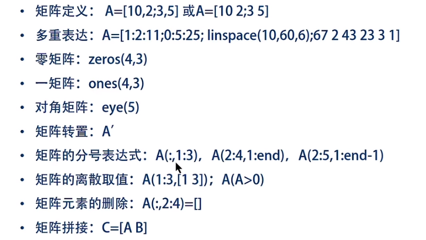

注：

分号代表矩阵一行结束。

---

分号表达式：

逗号前代表选中行，逗号后代表选中列。

A( :, 1:3) 即是选中 A 矩阵的所有行，1 到 3 列。

---

### 常用矩阵内置函数

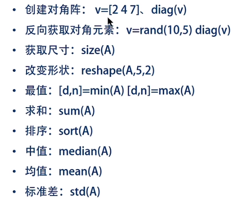


注：

min，max 函数等均是对矩阵每一列求最值。求整体最值请嵌套使用。

rand(1, 5) 产生一个 1*5 的随机数矩阵，元素默认为均匀分布，介于 0 ~ 1 之间。

## 脚本与函数

脚本文件后缀名 .m

注释：%

脚本运行：直接使用脚本文件名。

函数定义格式：

```matlab
function [输出变量] = 函数名称(输入变量）
% 注释
% 函数体
end

示例：
求 1 到 n 之和的求和函数 eg_sum。
function [s]  = eg_sum( n )
% calculate the sum of 1..n
s = 0;
for i = 1:n
    s = s + i;
end
```

匿名函数：

```matlab
使用 @ 代替函数名称即可。
可在命令行中定义。
可以将其赋值给一个函数变量。

示例：
f1 = @(x, y) x + y;
```

## 输入输出

```matlab
x = intput('提示语')
disp('输出内容')
disp(x)
fprintf()  类 C 语言用法
```

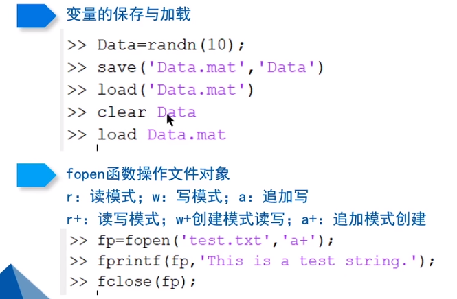

## 控制语句

```matlab
if x > 0
	x = 2;
elseif x < 2
	x = 3;
else
	x = 1;
end

switch score/10
	case 1
		x = 2;
	case 2
		x = 3;
	otherwise
		x = 4;
end

for i = 1:n   % for i = [1, 4, 7, 8] “此处要产生一个列表”
	x = x + 1;
end

while x > 100
	x = x + 1;
end

break；
continue；
```

## 二维绘图

### 散点图 plot()

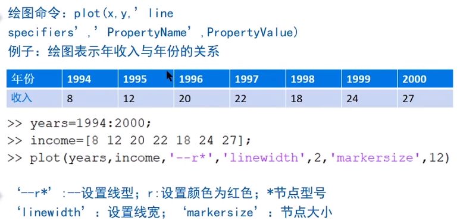

#### 可设置的节点类型

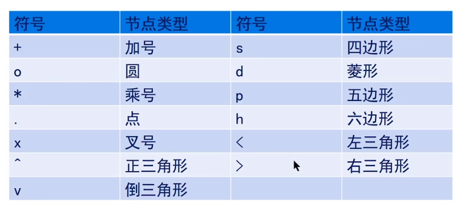

#### 可设置的线型

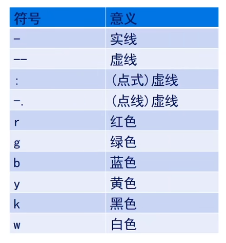

注：因为 b 被 blue 占用，所以用 k 表示 black。

#### 可设置属性

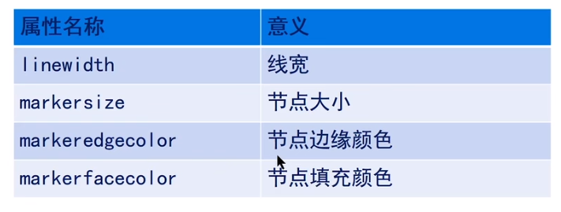

#### 命令：使用当前画板

hold on

hold off

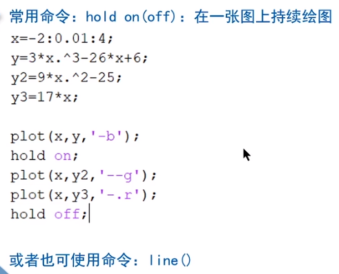

#### 图的标注

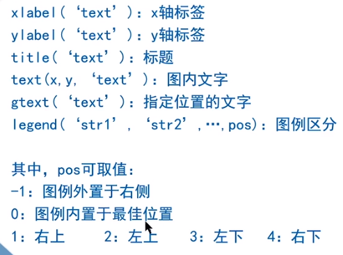

#### 输入特殊符号

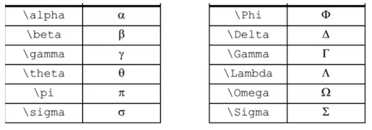

#### 设定坐标轴范围


### 直方图 bar() barh()

bar 垂直方向

barh 水平方向


### 饼状图 pie()

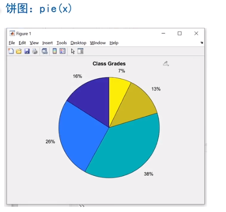

### 阶梯图 stairs()

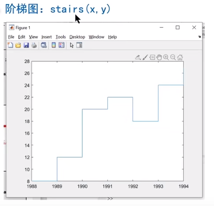

### 火柴图 stem()

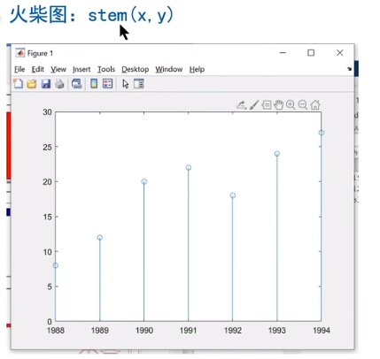

### 统计直方图 histogram()

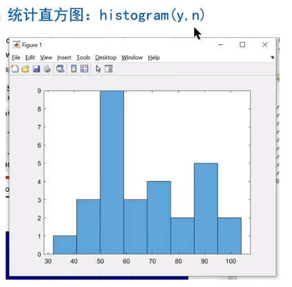

### 极坐标图 polarplot()

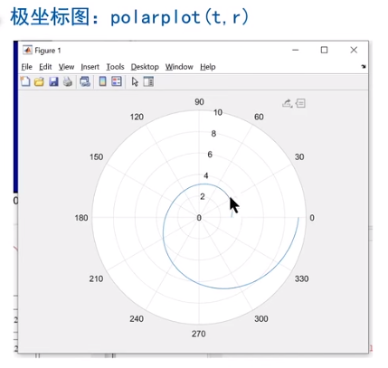

### 子图 subplot()

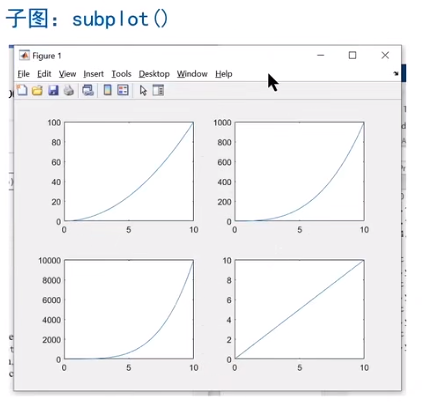

先使用 subplot 指定子图位置，再使用 plot 绘图。

```matlab
subplot(2, 2, 1) %二行二列，第 1 个位置。
plot(x, y)
```

## 三维绘图

### 三维曲线  plot3()

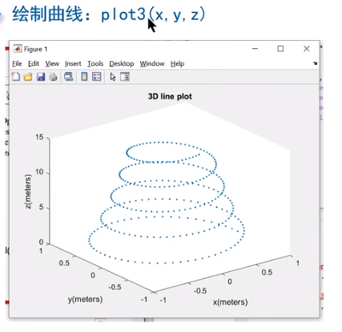

### 三维火柴图 stem3()

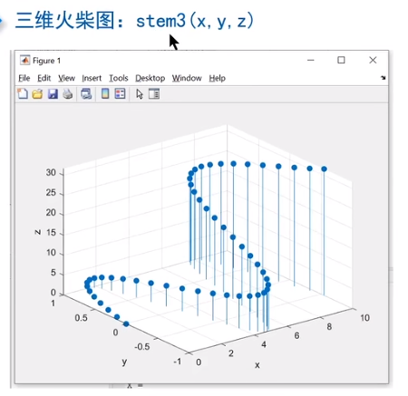

### 曲面

#### 一般曲面

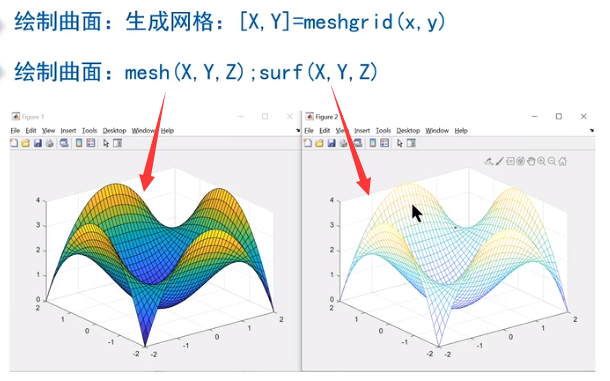

上图左为网格内部填充颜色，右为网格内部不填充颜色。

在求解 Z 维时，必须先生成 X Y 坐标的网格，再使用 mesh 绘制。

#### 底面轮廓投影

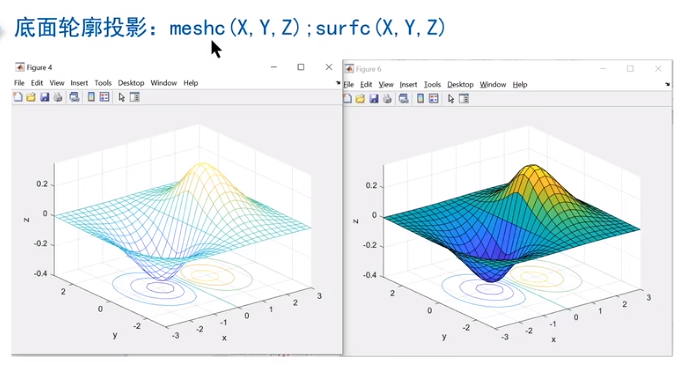

#### 轮廓图

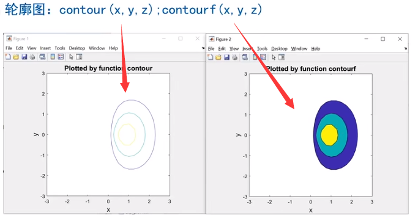

### 三维柱状图 bar3()

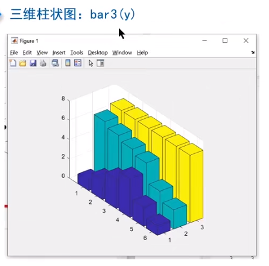

### 三维饼图 pie3()

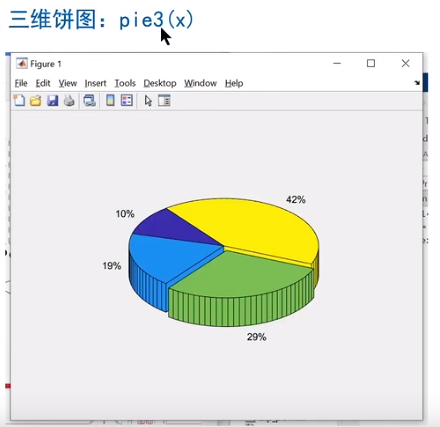

## 杂项

可以通过各种函数以及图形的组合结合参数画图。

点击函数图标可以查阅信息。

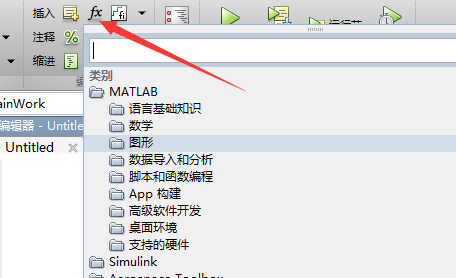

---

