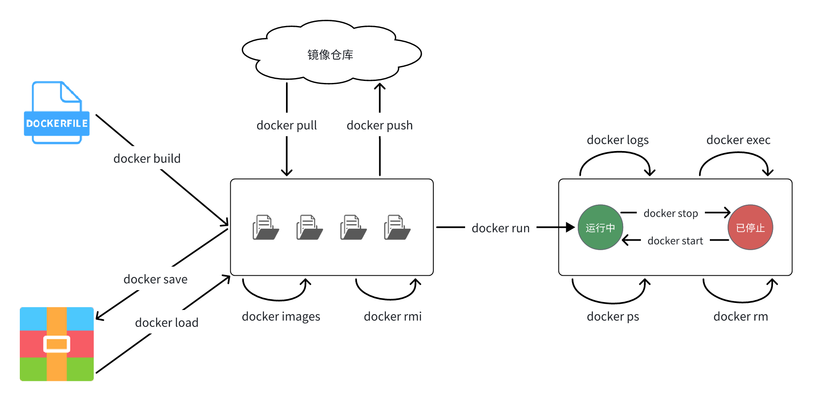
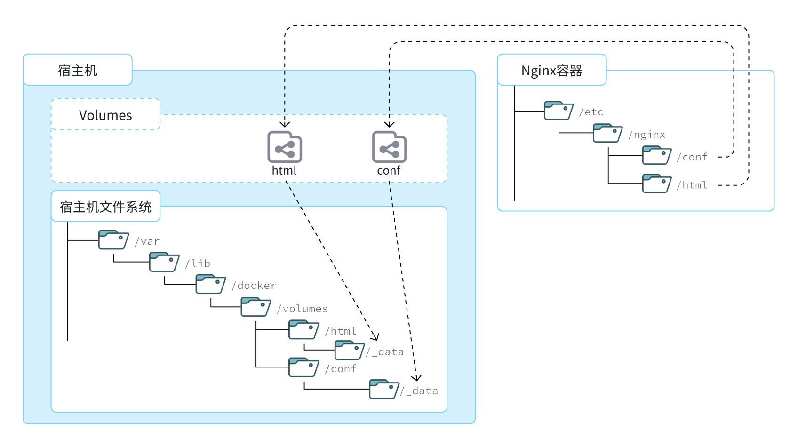
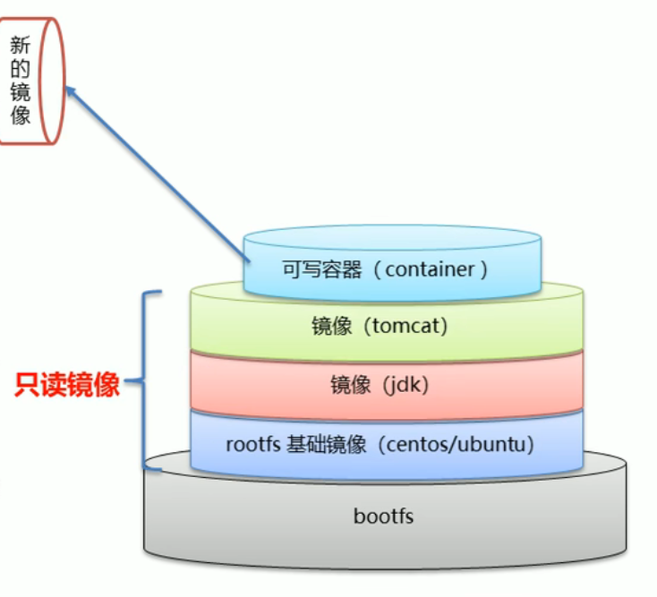

# Docker

Docker 是一个开源应用容器引擎。

可以将环境和应用封装在轻量级、可移植的隔离容器中，便于迁移与部署。

- **Docker** 是**操作系统级**隔离环境，采用沙箱机制，互不影响，应用间就像各自存在于一个操作系统。
- **虚拟机**是**硬件级**虚拟，应用间就像各自存在于一个计算机。

## 基本概念

- 镜像（Image）

	每个 Docker 镜像相当于一个 root 文件系统。

- 容器（Container）

  容器是 Docker 镜像的运行实体，相当于一个实际运行的文件系统，可以被创建、启动、停止、删除、暂停等。

  - 容器内部与宿主机是隔离的，需要通过 Docker 命令或**数据卷**才能交换数据。
  - 容器内部与外部机器是完全隔离的，需要通过**端口映射**或数据卷才能交换数据。
  - 找到应用镜像并创建容器后，不必再安装该应用，该应用及所需的环境已经存在于容器中。
  - 建议将重要配置文件和需持久化数据存放在数据卷中。

- 仓库（Repository）

	Docker 仓库服务器，可以存储 Docker 镜像，便于取用。

- 宿主机（Host）

	运行 Docker 容器的计算机。

- ID

	Docker 的镜像与容器都使用 SHA 哈希算法，使用时只指定唯一的前几位也可使用。

下文中，规定：

- 以 `容器` 同时指代 `容器名 | 容器 ID` 。
- 以 `镜像` 同时指代 `<镜像名>[:Tag] | 镜像 ID`，Tag 为版本号，默认为 `latest` 最新版本。

## 注意事项

- 在 Docker 中修改配置文件后要重新启动容器，重启某些应用也是如此。
- Docker 容器内部的环境会保持精简，所以可能会缺少许多命令，需要手动安装，建议将配置文件和重要数据作为数据卷。

## 服务命令

- `systemctl <操作> docker`（systemctl 即 system control）或 `service docker start` 。

	具体命令依操作系统而定。

	- 启动 start
	- 停止 stop
	- 重启 restart
	- 查看状态 status
	- 开机自启 enable

## 镜像命令

- `docker images`

	**查看**本地镜像列表。

- `docker inspect <镜像>`

	**查看**镜像配置信息。

- `docker search <镜像>`

	**搜索**网络镜像。

- `docker pull <镜像>`

	**拉取**镜像。

- `docker rmi <镜像>`（rmi 即 remove image）

	**删除**镜像，ID 可由镜像信息中查看。



## 容器命令

- `docker ps [-a]`

	**查看**正在运行容器的列表。`-a` 查看所有容器。

- `docker inspect [容器]`

	**查看**容器配置信息。

- `docker run <镜像>`

	**创建**（并启动）容器。

	- `-d`

	  后台运行容器（守护进程），退出容器后容器不会自动关闭。

	- `-it`

	  若要创建后立即进入容器，使用参数 `-i -t`，当使用 `-d` 创建时不会立即进入容器。

	- `--name "容器名"`

	  指定容器名。
	
	- `-p`
	
	  指定**端口映射**，`宿主端口:容器端口`
	  
	- `-e`
	
	  指定环境变量。
	
- `-v`
	
  设置挂载。
	
  - 挂载数据卷：`volume_name:容器path`
	- 挂载目录：`宿主path:容器path`
		- 宿主 path 必须以 `/` 或 `./` 开头。
		- 容器 path 必须是绝对路径。
		- path 不存在则会自动创建。
	
- `docker start <容器>`

	**启动**容器。

- `docker exec <-it> <容器> <shell 名>`

  **进入**容器。

  - `-i`

  	以交互模式运行容器，一般配合 `-t` 使用。

  - `-t`

  	为容器分配一个伪输入终端。

  - `shell 名`

  	一般写 bash 。

- `exit | logout`

  **退出**容器，像退出系统一样。

- `docker stop <容器>`

  停止容器。

- `docker rm <容器>`

	**删除**容器。

## 挂载

### 数据卷

（Data Volume）

数据卷是一个逻辑指向，它作为容器目录和宿主目录间的中转映射：

- 容器数据持久化

	删除容器后，数据卷仍然存在。

- 容器与外部通信

	容器可通过数据卷与宿主机和其它机器交换文件。

- 容器间数据交换

	一个数据卷可被多个容器同时挂载，一个容器也可挂载多个数据卷。

- 数据卷的挂载只能在创建容器时配置，创建好的容器不能再设置数据卷。



上图中：

- 创建了两个数据卷：`conf`、`html`（默认存在于宿主机的`/var/lib/docker/volumes`）
- Nginx容器内部的`conf`目录和`html`目录分别与两个数据卷关联。
- 而数据卷 conf 和 html 分别指向了宿主机的`/var/lib/docker/volumes/conf/_data`目录和`/var/lib/docker/volumes/html/_data`目录。
- 这样一来，容器内的`conf`和`html`目录就 与宿主机的`conf`和`html`目录关联起来，我们称为**挂载**。

挂载后，操作宿主机的 `/var/lib/docker/volumes/html/_data` 就是在操作容器内的 `/usr/share/nginx/html/_data` 目录。

常用命令：

```txt
docker volume create	创建数据卷

docker volume ls	查看所有数据卷

docker volume rm	删除指定数据卷

docker volume inspect	查看某个数据卷的详情

docker volume prune		清除未使用的数据卷
```

### 目录

一般来说，可以直接将宿主机目录挂载到容器上。

## 文件复制

- 基本命令

	该命令只能在宿主机执行。

	- 宿主机到容器

		`docker cp HostPath <容器>:Path`

	- 容器到宿主机

		`docker cp <容器>:PATH HostPath   `

- 补充说明

	- 该命令递归复制文件夹和文件。
	- 宿主机的路径可以是相对路径或绝对路径，容器路径只能是绝对路径。
	- 该命令操作的容器可以是运行状态也可以是停止状态。
	- 该命令不能复制 `/proc、 /sys、 /dev`、 虚拟内存和容器中 mount 的路径下的文件。

## 镜像原理

- 操作系统组成

	- 进程调度子系统

	- 进程通信子系统

	- 内存管理子系统

	- 设备管理子系统

	- **文件管理子系统**

		Docker 模拟文件管理子系统。

	- 网络通信子系统

	- 作业控制子系统

- Linux 文件系统分为两部分

	- bootfs

		包含 bootloader（引导加载程序）和 kernel（内核）。

	- rootfs

		root 文件系统。

	- 不同 Linux 发行版，bootfs 基本一样，而 rootfs 不同。

- Docker

	- Docker 是由特殊文件系统叠加而成，使用**统一文件系统（Union File System）**技术。

	- 最底层

		使用宿主机的 bootfs ，可以使用 Docker 模拟**同体系**另一个操作系统，因为同体系才能复用 bootfs。

	- 第二层

		root 文件系统（rootfs），也称为 base iamge（基础镜像）。

	- 其它上层

		可叠加其它镜像文件，比如继续叠加 jdk 镜像，其之上再叠加 tomcat 镜像。

	- 最顶层

		第二层和其它上层为**只读镜像**，若要修改，需要在最顶层添加一个读写文件系统，即**可写容器（Container）**，可写容器即是镜像运行的入口。

- 复用

	- 将某层封装为镜像需要连带下层。
	- 若只读镜像已存在，则可复用。



## 镜像制作

一般有以下两种方式：

- 容器转为镜像
- Dockerfile 制作镜像

尽量使用 Dockerfile 制作镜像。

制作为镜像的容器的内容会完全保留，包括其中创建的文件（除数据卷）。

#### 容器转为镜像

- `docker commit <容器> <镜像名:版本号>`

	将容器转为镜像。

	- 数据卷不会被提交为镜像。

- `docker save -o <压缩文件名> <镜像名:版本号>`

	将镜像压缩，便于传输分发。

- `docker load -i <压缩文件名>`

	将压缩文件还原为镜像。

#### Dockerfile 制作镜像

Dockerfile 是一个文本文件，包含多条指令，每一条指令构建一层，最终构建出一个新的镜像。

- 作用

	- 对于开发人员

		可提供一个完全一致的开发环境。

	- 对于测试人员

		可便捷迁移运行测试应用。

	- 对于运维人员

		可以实现应用的无缝移植。

- 可将项目制作为 Docker 镜像。

常见指令：

| **指令**       | **说明**                                     | **示例**                     |
| :------------- | :------------------------------------------- | :--------------------------- |
| **FROM**       | 指定基础镜像                                 | `FROM centos:6`              |
| **ENV**        | 设置环境变量，可在后面指令使用               | `ENV key value`              |
| **COPY**       | 拷贝本地文件到镜像的指定目录                 | `COPY ./xx.jar /tmp/app.jar` |
| **RUN**        | 执行Linux的shell命令，一般是安装过程的命令   | `RUN yum install gcc`        |
| **EXPOSE**     | 指定容器运行时监听的端口，是给镜像使用者看的 | EXPOSE 8080                  |
| **ENTRYPOINT** | 镜像中应用的启动命令，容器运行时调用         | ENTRYPOINT java -jar xx.jar  |

## 仓库

[Docker Hub](https://hub.docker.com/) 是 Docker 官方的公共镜像仓库。

也可以使用私有仓库存储私人的镜像，最好将私有仓库单独部署到一台服务器上。

## 虚拟网络

Docker 有多种虚拟网络（虚拟设备）类型，一般使用 bridge 类型，相当于虚拟的网桥，交换机。

在同一个 bridge 网络（即虚拟局域网）中的容器不需要端口映射（到宿主机端口）就可以互相访问。

- Docker 的默认网络中

	每个容器会有一个虚拟 IP 地址，但这个 IP 地址在部署后可能发生变化。

- 自定义网络中

	容器间可以使用名称相互访问，部署后可以避免 IP 地址改变的不利影响。

常用命令：

```txt
docker network create
创建一个网络

docker network ls
查看所有网络

docker network rm
删除指定网络

docker network prune
清除未使用的网络

docker network connect
使指定容器连接加入某网络

docker network disconnect
使指定容器连接离开某网络

docker network inspect
查看网络详细信息
```

- `docker network create -d bridge <netName>`

	创建 bridge 网络。

	- `-d`

		指定网络类型。

- `docker run -it <容器> --network <netName>`

	运行容器并连接到指定的 bridge 网络。

## 服务编排

微服务架构的应用系统一般包含多个微服务，每个微服务一般会部署多个实例。

**Docker Compose** 是一个编排多容器的分布式部署工具，能够统一管理多个容器。

1. 使用 Dockerfile 定义项目各组件的容器镜像。
2. 使用 `docker-compose.yml` 统一管理容器和其它服务（比如网络）。
3. 运行 `docker-compose up` 启动应用。

### 基本语法

基本配置项就是 docker run 命令所需的各种参数。

示例：

```yaml
version: "3.8"

services:
  mysql:
    image: mysql
    container_name: mysql
    ports:
      - "3306:3306"
    environment:
      TZ: Asia/Shanghai
      MYSQL_ROOT_PASSWORD: 123
    volumes:
      - "./mysql/conf:/etc/mysql/conf.d"
      - "./mysql/data:/var/lib/mysql"
      - "./mysql/init:/docker-entrypoint-initdb.d"
    networks:
      - hm-net
  hmall:
    build: 
      context: .
      dockerfile: Dockerfile
    container_name: hmall
    ports:
      - "8080:8080"
    networks:
      - hm-net
    depends_on:
      - mysql
  nginx:
    image: nginx
    container_name: nginx
    ports:
      - "18080:18080"
      - "18081:18081"
    volumes:
      - "./nginx/nginx.conf:/etc/nginx/nginx.conf"
      - "./nginx/html:/usr/share/nginx/html"
    depends_on:
      - hmall
    networks:
      - hm-net
networks:
  hm-net:
    name: hmall
```

### 常见命令

```Bash
docker compose [OPTIONS] [COMMAND]
```

| 类型    | **参数或指令** | **说明**                                                     |
| ------- | :------------- | :----------------------------------------------------------- |
| OPTIONS | -f             | 指定compose文件的路径和名称                                  |
|         | -p             | 指定project名称。project就是当前compose文件中设置的多个service的集合，是逻辑概念 |
|         |                |                                                              |
| COMMAND | up             | 创建并启动所有service容器                                    |
|         | down           | 停止并移除所有容器、网络                                     |
|         | ps             | 列出所有启动的容器                                           |
|         | logs           | 查看指定容器的日志                                           |
|         | stop           | 停止指定容器                                                 |
|         | start          | 启动指定容器                                                 |
|         | restart        | 重启指定容器                                                 |
|         | top            | 查看运行的进程                                               |
|         | exec           | 在指定的运行中容器中执行命令                                 |
