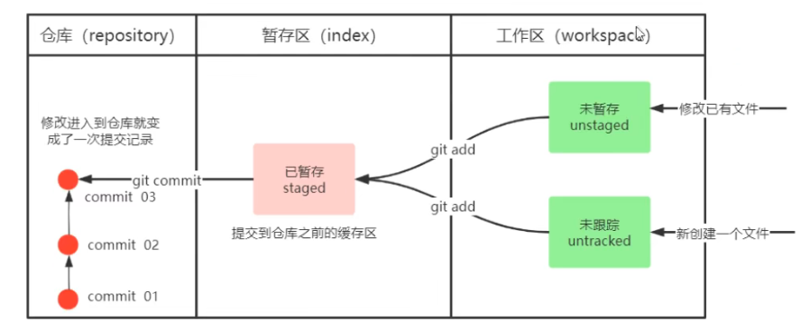
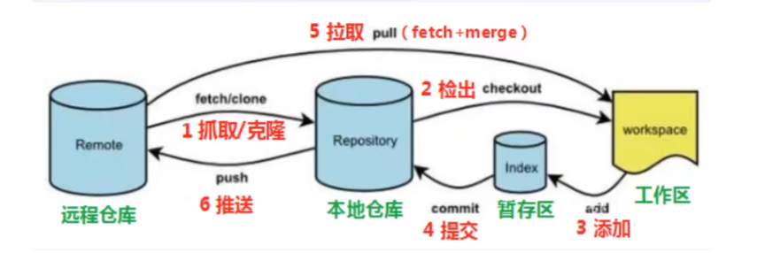

# Git

一个纯文本版本控制软件。

官方文档：[Git - Documentation](https://git-scm.com/doc)

## 基本概念

### 区域与状态

- 区域
	- 工作区
	- 暂存区（Index）（存放文件索引，称为暂存区）
	- 仓库
- 文件状态
	- 未跟踪
	- 未暂存（已跟踪且已修改但未暂存）
	- 已暂存
	- 已提交



## 工作流程图



## 本地仓库

### 常用指令

- `git init`
  在当前文件夹创建本地仓库。
- `git status`
  查看文件状态。（尚未提交的文件）
- `git add`
  - 后跟文件名：添加该文件到暂存区。
  - 后跟 `.`：添加当前目录所有文件到暂存区。（所有修改）
  - **暂存区注意点**
  	- 只有被 add 过才算加入 Git 版本控制，即被跟踪。
  	- 未被跟踪的文件不属于任何一个分支，切换到任何一个分支上都能看到。
  	- 暂存区也不属于任何一个分支，但只有首次添加到暂存区的文件才能在切换到其它分支时看到。
  	- 对于已跟踪之后又被修改的文件，在未 add 或 stash 前无法切换分支。
- `git log`
  查看仓库日志。
  - `--all` 显示所有分支。
  - `--pretty=oneline` 将提交信息显示为一行。
  - `--abbrev-commit` 使输出的 commit 的 id 更简短。
  - `--graph` 以图的形式显示。
  - 建议设置别名同时使用上述所有参数 `git-log`。
- `git commit -m "注释内容"`
  提交到本地仓库。
  - **一次 commit （提交）产生一个版本。**
  - `-m` 表示在指令参数中指定注释，若不加，则会弹出 vim 编辑器以编辑注释，其它命令的注释类似。
  - `-a` 表示将已追踪文件添加到暂存区并提交。（注意，只要曾被添加或提交过都是已追踪文件，对于全新添加的文件必须先使用 `git add`）（不建议使用这个参数）
  - `git commit --amend` 可修改上一次 commit 的注释。

### 暂存撤销

- `git restore <fileName>`

	- `--worktree` （默认参数）

		撤销工作区文件的修改。

	- `--staged`

		把文件从暂存区撤销到工作区（不再跟踪，即未 `add` 状态），保留修改。

### 版本回退

HEAD 引用指向当前分支或某个版本。

- `git reset`
  回退到某一版本（由其哈希值或 HEAD 标识符的变体指定）。

  - 定义：过程相关文件

    当前索引（**暂存区**）中**文件**（已 `add` 但未 `commit` 文件）以及 HEAD 改变带来的**差异文件**
  
  - `--soft`
  
    将 HEAD 引用指向给定提交，过程相关文件变为已提交 `add` 状态（进入暂存区），工作目录的内容不变。
    不删除工作空间改动代码，撤销 commit，不撤销 `git add . ` 操作。
  
  - `--mixed`
  
    `git reset` 的默认参数。HEAD 引用指向给定提交，过程相关文件变为未提交 `add` 状态，进入工作目录。
    不删除工作空间改动代码，撤销 commit，并撤销 `git add .` 操作。
  
  - `--hard`
  
    HEAD 引用指向给定提交，索引（暂存区）内容和工作目录内容都会变为给定提交那时的状态。（过程相关文件丢失）
    删除工作空间改动代码，撤销 commit，撤销 `git add . ` 操作。
  
- `git reflog`
  查看已经删除的记录。

- `git reset --soft HEAD^`常用于撤销上一次错误的 commit 。

### gitignore

创建文件 `.gitignore`，指定不接受 Git 管理的文件名或通配符，其会在 `git add .` 时被忽略。

#### 忽略规则

```
target   // 忽略名为 target 目录（不必是完整的 path 路径）
angular.json   // 忽略这个 angular.json 文件
log/*   // 忽略 log 目录下的所有文件
css/*.css   // 忽略css目录下的.css文件
```

注意，子文件夹中的  `.gitignore` 文件的作用范围为整个 git 管理的项目。

#### 检查

- 成功被忽略的文件或文件夹在 `git status` 时查看不到。
- 使用 `git check-ignore -v <file or folder>` ，会输出`gitignore`文件的路径，匹配行的编号和实际模式。（可接受多个文件名作为参数）
- 显示所有被忽略文件的列表：`git status --ignored` 。

## 分支操作

### 基础命令

- `git branch`

	查看本地分支。

- `git branch <分支名>`

	创建分支。

- `git checkout <分支名>`

  切换分支。

  - `-b` 若分支不存在，则创建并切换。

  - 建议切换分支前一定先提交分支。

- `git switch <分支名>`

  切换到指定分支。（新命令，用于分化 checkout 的功能）

  - `-c <分支名>`  

  	切换并创建分支。

- `git merge <分支名>`

  将指定分支**合并到当前分支**。

  - 注意，合并后若有冲突，解决冲突后当前分支变化，指定分支仍不变。

- `git branch -d <分支名>`

	删除分支。若是 `-D`，则强制删除。
	
- `git branch -m <old_name> <new_name>`

  修改分支名

### 分支编辑

- `git rebase`

	- 使用注意

		尽量只在个人分支和本地分支使用 rebase，不要在公共分支和远程分支上使用。

	- 参考

		[【B站最全Git进阶课程】git rebase: 人生无法重来，但代码可以！_哔哩哔哩_bilibili](https://www.bilibili.com/video/BV1Xb4y1773F/?spm_id_from=333.788.recommend_more_video.-1)

- 切换到 A 分支，执行 `git rebase B`

	**分支剪切**，将 A 分支剪切到 B 分支上，以 A、B 的最近公共祖先为 A 的基点，将此基点移动并接续到 B 的最新点之后。

- 切换到 A 分支，执行 `git rebase -i B`（`-i` 为 `--interactive` 简写）

	进入**交互模式**，会打开一个 vi 编辑器，在最上方可以编辑对于分支的操作指令序列（TODO List），该序列顺序执行。

	| 常用指令 | 简写 | 意义                                                         |
	| -------- | ---- | ------------------------------------------------------------ |
	| pick     | p    | 选用该提交，选用顺序就是迁移后的提交顺序。                   |
	| reword   | r    | 选用该提交，同时修改提交信息，提交信息跟在一条指令末尾即可。 |
	| squash   | s    | 选用该提交，并将其变更合并到上一个提交中，不单独作为提交。   |
	| drop     | d    | 舍弃该提交以及相关的变更。                                   |

	- **提交合并**

		多次使用 squash 可以将线性的多个提交记录合并为一个记录，减少冗余的提交记录，便于 review 。

### 分支暂存

- `git stash`

  保存当前分支的工作进度。

  - 会保存当前**暂存区与工作区**，执行后当前分支变为 working tree clean 状态。
  - 常用于此时去其它分支工作。

- `git stash save '注释'`

  在保存的基础上为其添加注释。

- `git stash list`

  显示保存进度的列表，`git stash` 可执行多次，以栈式存储。

- `git stash pop`

  恢复最新的进度到工作区，会把工作区和暂存区的改动都恢复到工作区。（会删除被恢复进度的 stash 存储）

  - `--index`

  	恢复最新的进度工作区和暂存区（将工作区恢复到工作区，暂存区恢复到暂存区）。

  - `[暂存 id]`

  	恢复指定 id 的进度到工作区，id 可由 `git stash list` 得到，形式为 `stash@{0}` 。

- `git stash apply [--index] [暂存 id]`

  不会删除被恢复进度的 stash 存储，其余用法与 `pop` 一致。

- `git stash drop [暂存 id]`

  删除一个进度的 stash 存储，若不指定暂存 id，则默认删除最新的进度存储。

- `git stash clear`

  删除所有的进度存储。

- **注意**

	- stash 只存储暂存区和工作区，不存储已经被提交的内容。
	- stash 只能在本地存储，不会被 push 上传到远端。
	- stash 不止局限于某个分支，其存储栈中的内容可以恢复到任意分支。
	- 没有加入 Git 版本控制（即从未被 add 过）的文件不会被 stash 保存。

## 解决冲突

- 修改产生冲突的文件，删除多余内容，留下想留下的内容即可。
- 远端分支也是分支，解决冲突方法一致。
- 若使用 push 失败，执行 pull 将再冲突解决掉后再 push。一般先 pull 查看是否有冲突，然后 push 。

## 常用规范

### 分支规范

- 两个主要分支

  - master 主分支（github 现在默认为 `main`）

  - develop 开发分支

  	用于开发的分支，开发完成后要合并到 master 上。

- feature 分支

	添加功能。完成后合并到 develop 分支。

- hotfix 分支

	从 master 派生的分支，用于修复 bug。完成后合并到 master，develop，test 分支。

- test 分支

	用于测试代码。

### 注释规范

指 commit message 的规范，以下为 Angular 规范。

[Commit message 和 Change log 编写指南 - 阮一峰的网络日志](https://www.ruanyifeng.com/blog/2016/01/commit_message_change_log.html)

```
<type>[scope]: <subject>   // Header
// 空一行
[body]
// 空一行
[footer]
```

#### Type（必需）

说明 commit 的类别。

- br

	针对 bug 号，用于向测试反馈 bug 修改情况。

- feat（feature）

	新功能。

- fix

	解决 bug 。

- docs

	文档

- style

	格式变动（不影响代码执行效果）

- refactor

	重构。（不新增功能，也不修改 bug 的代码改动）

- test

	增加测试。

- chore

	构建过程或辅助工具的变动。

如果 `type` 为 `feat` 和 `fix`，则该 commit 将肯定出现在 Change log 之中。其它情况（`docs`、`chore`、`style`、`refactor`、`test`）由你决定，要不要放入 Change log ，建议是不要。

#### Scope（非必需）

说明 commit 的影响范围，比如数据层、控制层、视图层等。

#### Subject（必需）

对 commit 实现任务的简短描述。

- 以动词开头，使用第一人称现在时，比如 change ，而不是 changed 或 changes 。
- 第一个字母小写。
- 结尾不加句号（`.`）。

#### Body（非必需）

对本次 commit 的详细描述，可以分成多行。

- 使用第一人称现在时，比如 change ，而不是 changed 或 changes 。
- 应该说明代码变动的动机，以及与以前行为的对比。

示例：

```

More detailed explanatory text, if necessary.  Wrap it to 
about 72 characters or so. 

Further paragraphs come after blank lines.

- Bullet points are okay, too
- Use a hanging indent
```

#### Footer（非必需）

- 不兼容变动

如果当前代码与上一个版本不兼容，则 Footer 部分以`BREAKING CHANGE`开头，后面是对变动的描述、以及变动理由和迁移方法。

```

BREAKING CHANGE: isolate scope bindings definition has changed.

    To migrate the code follow the example below:

    Before:

    scope: {
      myAttr: 'attribute',
    }

    After:

    scope: {
      myAttr: '@',
    }

    The removed `inject` wasn't generaly useful for directives so there should be no code using it.
```

- 关闭 issue

	如果当前 commit 针对某个 issue，那么可以在 Footer 部分关闭这个 issue 。

```
关闭一个
Closes #234

关闭多个
Closes #123, #245, #992
```

#### Revert（特殊情况）

如果当前 commit 用于撤销以前的 commit，则必须在 Header 前添加`revert:`，后面跟着被撤销 Commit 的 Header 。

```
revert: feat(pencil): add 'graphiteWidth' option

This reverts commit 667ecc1654a317a13331b17617d973392f415f02.
```

Body 部分的格式是固定的，必须写成 `This reverts commit <hash>.`，其中的 `hash` 是被撤销 commit 的 SHA 标识符。

如果当前 commit 与被撤销的 commit，在同一个发布（release）里面，那么它们都不会出现在 Change log 里面。如果两者在不同的发布，那么当前 commit，会出现在 Change log 的 `Reverts` 小标题下面。

## 远程仓库

- `git remote add <远程仓库简写> <URL>`

	**添加**远程仓库。github 远程仓库简写（远端名）默认为 `origin`，主分支默认为 `main` 。

- `git remote`

  **查看**远程仓库。

  - `-v` 显示所有远程仓库名与其 URL 。
  - `git remote show <远端名>` 显示详细信息。
  - `git remote rename <old_name> <new_name>` 更改远端名。
  - `git remote rm <远端名>` 删除远端。

- `git push [-f] [--set-upstream] [远端名 [本地分支名][:远端分支名]]`

	**提交**到远程仓库。

	- `-f` 强制推送，覆盖远端分支。
	- `--set-upstream` 推送并建立和远端分支的**关联**关系。
	- 若远程分支名与本地分支名相同，则可以只写本地分支。
	- 如果当前分支已经和远端分支**关联**（用 `--set-upstream` 建立），可以省略分支名和远端名：`git push` （将 master 分支推送到已关联的远端分支）。

- `git clone <仓库路径> [本地目录]`

  **克隆**默认分支（一般是 master，main）的所有版本。

  - 若不指定本地目录，会自动设为克隆的仓库名，克隆后可进一步用命令切换版本。
  - 使用 `git clone -b <分支名> <git_url>`  克隆指定分支。
  - `git clone --depth=1`，克隆最新的版本（最近一次 commit）。

- `git fetch [远端名] [远端分支名][:在本地重命名的分支名]`

  **抓取**远端分支到本地，不合并。

  - 若只指定远端名，则抓取该远端所有分支。
  - 若不指定远端名和分支名，则抓取关联远端的所有分支。
  - 若远端分支与本地分支重名，则抓取失败。

- `git pull [远端名] [远端分支名]:[本地分支名]`

	**拉取**远端分支到本地，并与指定分支和并，若不指定分支，则默认与本地当前分支合并。相当于 `fetch + merge` 。

	- 若不指定远端名和远端分支名，则拉取关联远端的所有分支。
	
- 其它

  - `git branch -v`

    查看分支，并显示与远端分支的关联关系。

  - `git branch -b`

    查看所有分支，红色的是远端有但本地还没有的分支。
  
  - `git push <远端名> --delete <分支名>`
  
    删除远端分支。


## 底层原理

- Git 结构原理

  基于 **SHA 哈希算法**的**哈希树**，每个提交结点都有一个唯一的 SHA 哈希码。

  - [这才是真正的Git——Git内部原理揭秘！ | 机器之心](https://www.jiqizhixin.com/articles/2019-12-20)

  - [Git 原理解析 | 寒枫的博客](https://hanfeng.ink/post/git_core/)

- 文件比对原理

	Myers 算法，类似以行为单位的最长公共子序列 LCS 。

	- [类似git/linux的文件对比功能(diff)是怎么实现的? - 知乎](https://www.zhihu.com/question/24755861)
	- [Git 是怎样生成 diff 的：Myers 算法 - CJ Ting's Blog](https://cjting.me/2017/05/13/how-git-generate-diff/)

## 版本标签

### 查看

- `git tag`

	打印所有标签

- `git tag -l <版本号>`

	打印指定版本号的标签，形式 `1.2.3`，`v1.2` 等，可使用通配符。

- `git checkout <版本号>`

	切换到对应标签的版本。

### 本地标签

在本地版本库创建和删除标签。

- `git tag<版本号>-light`

	给当前分支创建**轻量标签**，只相当于一个指向某个版本的指针。

- `git tag -a <版本号> -m '备注信息'`

	给当前分支创建**附注标签**，是一个独立的标签对象，含有名称、时间戳、备注等信息。

- ``git tag -a <版本号> <SHA值> -m '备注信息'``

	给指定 SHA 值的 commit 打上标签。

- `git tag -d <版本号>`

	删除标签。

### 远端标签

将标签推送到远端仓库。

- `git push <远端名> --tags`

	推送所有标签。

- `git push <远端名> <版本号>`

	推送指定标签。

- `git push <远端名> --delete <版本号>`

	删除远端指定标签。

### 发布

可以在 GitHub 页面上根据标签创建 release 。

## 杂项

### 中文显示

中文路径文件名不能正确显示，而是显示为八进制的字符编码。

将 git 配置文件的 `core.quotepath` 项设置为 `false` 。quotepath 表示引用路径，加上 `--global` 表示全局配置。

1. git bash 终端输入命令：`git config --global core.quotepath false`
2. 若乱码，则继续在 git bash 界面中右击空白处，选择`选项->文本->本地Locale`，设置为`zh_CN`，旁边的字符集选框选设为`UTF-8`。

### git 子模块（子项目）

（submodule ）

对于含有 .gitmodules 文件的项目，clone 是需要使用 `git clone --recursive <git_url>` ，以便递归获取子项目。
