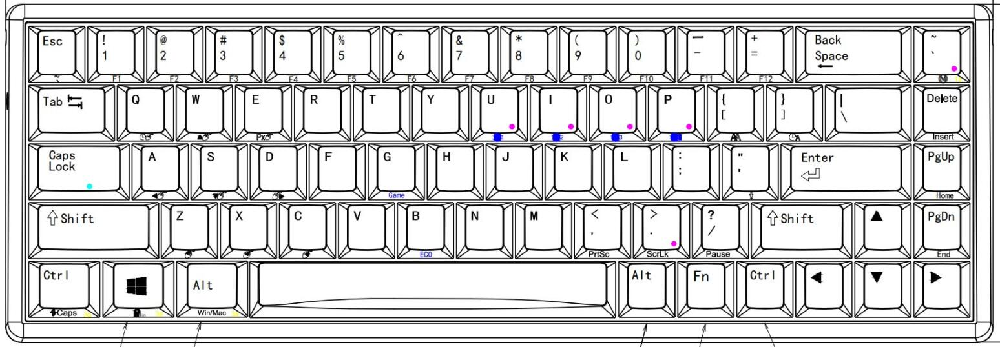
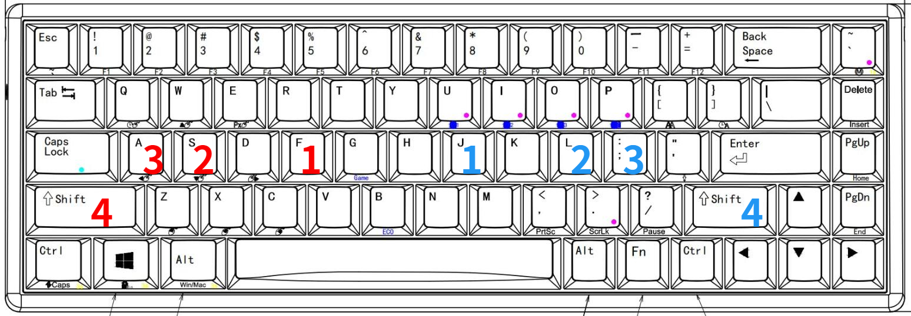
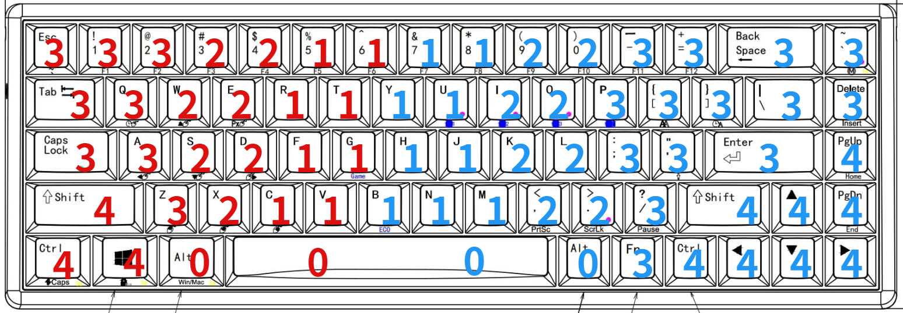

# 键盘指法

标准指法针对纯英文打字，手指都在输入区，不便于控制区操作（符号和快捷键），故自创指法，以求适应代码和文体输入，实现 68 全键盲打。

参考键盘为宁芝普拉姆（NiZ plum）静电容三模键盘，68 配列（atom 68）。

- 输入区白色键帽
- 控制区灰色键帽



## 改键

将 Home 和 End 改为单键，便于常用。

## 符号约定

- 0 拇指
- 1 食指
- 2 中指
- 3 无名指
- 4 小指
- x 某一指
- 左红右蓝

## 初始指位



食指轻微接触定位，其余指悬浮以便于移动，食指脱位时以小指定位并尽快归位。

## 单键



- Fn 都是组合键用法。
- 当 1 指移位时，适当使用 2 指按 R 或 U 。

## 组合键

- x 未指明时，按单键指法。
- 前为组合键，后为数字指法。

### 输入区

#### 数字区（F 区，功能区）

- 数字符号

	Shift + 数字符号，4x

- Ctrl 类数字符号

	左 Ctrl + 数字 123 或 456，左 4 + 2 或 1（右手即为其对称）

- F1~8

	右 Fn + F 键，右 3 左 x（78 由 1 按）

- F9~12

	右 Fn + F 键，0x
	
- Ctrl 类 F1~8

  右 Ctrl + Fn + F 键，43x

- Ctrl 类 F9~12

  左 Ctrl + Fn + F 键，40x

#### 字母符号区

- 大写

	Shift + 字母，4x 。

- 符号

	Shift + 符号，4x 。

- 特殊符号 ` ~`

	左 Shift + 符号，左 4 右 3

### 控制区

#### 左控制区

- Ctrl 类快捷键

	Ctrl + 字母，4x

- Win 类快捷键

	Win + 字母，4x

- 切应用

	Alt + Tab，03

- 切标签页

	Ctrl + Tab，43

- 切输入法

	Alt + Shift，04

	- 微软日语输入法

		- 切平假名

			Ctrl + CapsLock，43

		- 切片假名

			Alt + CapsLock，03

#### 右控制区

- Ctrl 类快捷键

	Ctrl + 字母或符号，4x

- 命令行插入

	Shift + Fn + Insert，102

- 命令行复制

	Ctrl + Fn + Insert，102

- 命令行翻页

	Shift + Fn + PagUp 或 PgDn，103

#### 联动控制

- 发送

	左 Ctrl + Enter 或 PagUp 或 PgDn 或 Home 或 End，左 4 右 3

- 一般翻页，全文开头，结尾

	左 Ctrl + PagUp 或 PgDn 或 Home 或 End，左 4 右 4

- 光标移动一个单词（或简单中文词语，编辑代码时中文会被看成一个单词，不同编辑环境可能有差别）

	左 Ctrl + Left 或 Right，左 4 右 4

- 命令行翻行

	左 Shift + Up 或 Dn，左 4 右 4

- 向前或向后删除一个单词（或简单中文词语）

	左 Ctrl + Backspqce 或 Del，左 4 右 3

### 特殊控制

- 多选

	左 Shift + 方向或 Home 或 End，44

- 键盘功能键

	- 模拟鼠标

		Fn + WASD，右 3 左常规

	- 一般蓝牙通道

		Fn + UIO，41

	- 蓝牙有线快速切换

		Fn + P，42


## 练习工具

- [Keybr](https://www.keybr.com/)

	- 自定义每次练习时间
	- 逐步扩增字符集
	- 小写字母（可设置选项）
	- 大小写字母和一般英文符号（可设置选项）
	- 练习 ASCII 打印字符（导入自定义文本）

- [Shuang](https://api.ihint.me/shuang/)

	- 双拼练习

- 字符生成器

	```c++
	#include <cstdio>
	#include <iostream>
	#include <cstring>
	#include <algorithm>
	#include <cctype>
	#include <random>
	
	/*
	
	    建议在 Linux 环境运行，避免 random_device 返回同样的值。
	
	    mode    模式选择 
	    number  生成数量
	    0   全部 ASCII （可）打印字符，含空格
	    1   小写字母，空格
	    2   大写字母，空格
	    3   数字，空格
	    4   符号，空格
	*/
	
	int main() {
	    int mode, number;
	    int (*check[])(int ) = {isprint, islower, isupper, isdigit, ispunct};
	    puts("Enter the mode and the character number:");
	    scanf("%d %d", &mode, &number);
	    if (mode < 0 || mode > 4) {
	        puts("Error mode!");
	    } else if (number < 0) {
	        puts("Error number!");
	    } else {
	        freopen("characters.txt", "w", stdout);
	        printf("mode = %d, number = %d   ", mode, number);
	        std::random_device rd;  // 将用于为随机数引擎获得种子
	        std::mt19937 gen(rd()); // 播种标准 mersenne_twister_engine
	        std::uniform_int_distribution dis(0, 127);   // ASCII 范围，均匀分布
	        for (int i = 1; i <= number;) {
	            int ch = dis(gen);
	            if (check[mode](ch) || ch == ' ') {
	                putchar(ch);
	                ++i;
	            }
	        }
	    }
	    return 0;
	}
	```

## 输入法杂项

- 使用双拼以加快打字速度。（搜狗双拼）
- `Ctrl + Shift + f` 切换繁体。
- 生僻字词
	- 按 `u` （双拼时按 `Shift + u`）进入组合查词模式（u 模式），输入偏旁部首、笔画的拼音或简写进行组合即可。
	- 输入整字的拼音后按 `Tab` ，再输入偏旁部首的拼音也可。
- 输入拼音后，按 `Ctrl + 首字母` ，快速跳转到该首字母位置，以便于修改。