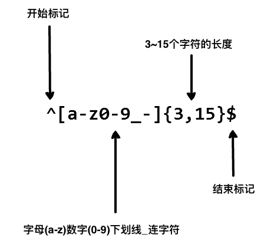

# 正则表达式

正则表达式基于匹配进行字符串的处理，可用于查找、替换、校验和提取文本数据等任务。

- 正则表达式（RegEx，RegExp）
- 模式串（grep，pattern string）
- 文本串（text）

常用 `/pattern/flags` 表示一个正则表达式。

易于描述的正则表达式可以使用 AI 给出，注意验证其正确性。

## 模式基本组分

- 字面值字符

	字母、数字、空格等，可以直接匹配它们自身。

- 元字符

  构成正则表达式的语法表示。

  - 特殊字符

  	点号 `.`、星号 `*`、加号 `+`、问号 `?` 等，它们具有特殊的含义和功能。

  - 字符类（字符集合）

  	用方括号 `[ ]` 包围的字符集合，匹配其中任意一个字符。

  - 集合简述符号

  	例如 `\d`、`\w`、`\s` 等，用于匹配特定类型的字符，如数字、字母、空白字符等。

  - 量词

    `{n}`、`{n,}`、`{n,m}` 等，用于指定匹配的次数或范围。

  - 边界符号（定位符）

    `^`、`$`、`\b`、`\B` 等，用于匹配字符串的开头、结尾或单词边界位置。

## 基本示例

在写用户注册表单时，只允许用户名包含**字符、数字、下划线和连接字符** **-**，并设置用户名的长度，可以使用以下正则表达式来设定：

```
^[a-zA-Z0-9_-]{3,15}$
```



- `^` 表示匹配字符串的开头。
- `[a-zA-Z0-9_-]` 表示字符集，包含小写字母、大写字母、数字、下划线和连接字符 **-**。
- `{3,15}` 表示前面的字符集最少出现 3 次，最多出现 15 次，从而限制了用户名的长度在 3 到 15 个字符之间。
- `$` 表示匹配字符串的结尾。

## 普通字符

普通字符包括：可打印和不可打印字符（没有显式指定为元字符的情况下）：

- 大写、小写字母
- 数字
- 标点符号
- 一些其它符号

### 可打印字符

```
[abc]
指定一个字符集合，匹配其中一个字符。
注意，集合内除了字母和数字，可以包含 \s \S 等普通字符的任意内容。

[^ABC]
指定一个反集合，不匹配该集合内的字符。

[A-Z]
所有大写字母

[a-z]
所有小写字母

.
匹配除换行符（\n、\r）之外的任何单个字符，等价于 [^\n\r]

\s
匹配所有空白符，包括换行

\S
匹配非空白符

\w
匹配字母、数字、下划线。等价于 [A-Za-z0-9_]

\d
匹配任意一个阿拉伯数字（0 到 9）
```

### 非打印字符

| 符号 | 意义                                                         |
| ---- | ------------------------------------------------------------ |
| \cx  | 匹配由x指明的控制字符。例如， \cM 匹配一个 Control-M 或回车符。x 的值必须为 A-Z 或 a-z 之一。否则，将 c 视为一个原义的 'c' 字符。 |
| \f   | 匹配一个换页符。等价于 \x0c 和 \cL。                         |
| \n   | 匹配一个换行符。等价于 \x0a 和 \cJ。                         |
| \r   | 匹配一个回车符。等价于 \x0d 和 \cM。                         |
| \s   | 匹配任何空白字符，包括空格、制表符、换页符等等。等价于 [ \f\n\r\t\v]。注意 Unicode 正则表达式会匹配全角空格符。 |
| \S   | 匹配任何非空白字符。等价于 `[^ \f\n\r\t\v]`。                  |
| \t   | 匹配一个制表符。等价于 \x09 和 \cI。                         |
| \v   | 匹配一个垂直制表符。等价于 \x0b 和 \cK。                     |

## 修饰符

也叫标记，不写在正则表达式里，标记位于表达式之外，格式如下：

```
/pattern/flags
```

| 常用修饰符 | 含义       | 描述                                                         |
| :--------- | :--------- | :----------------------------------------------------------- |
| i          | ignore     | 匹配时不区分大小写。                                         |
| g          | global     | 全局匹配，查找所有的匹配项。                                 |
| m          | multi line | 多行匹配，使边界字符 ^ 和 $ 匹配每一行的开头和结尾。（g 只匹配第一行，添加 m 之后实现多行。） |
| s          |            | 默认情况下，圆点 **.** 匹配除换行符 \n 之外的任何字符，在加上 s 修饰符之后, . 中包含换行符 \n 。 |

## 元字符

### 特殊字符

特殊字符构成语法表示。

| 符号 | 意义                                                         |
| ---- | ------------------------------------------------------------ |
| $    | 匹配输入字符串的结尾位置。（表示结尾就是与它相匹配的字符）   |
| ( )  | 显式标记一个子表达式（分组），显式标记的子表达式匹配到的值可被单独提取并存储。默认的最小子表达式就是单个字符。 |
| *    | 匹配前面的子表达式零次或多次，贪婪匹配，匹配尽量多的字符。   |
| +    | 匹配前面的子表达式一次或多次，贪婪匹配。                     |
| ?    | 匹配前面的子表达式零次或一次，或指明一个非贪婪限定符。       |
| .    | 匹配除换行符之外的任何单字符。                               |
| [ ]  | 标记一个字符集合。                                           |
| \    | 转义字符，将下一个字符标记为或特殊字符、或原义字符、或向后引用、或八进制转义符。 |
| ^    | 匹配输入字符串的开始位置，当该符号在字符集合中使用时，表示不接受该字符集合。 |
| { }  | 标记限定符表达式。                                           |
| \|   | 指明只匹配两项之中的一个。`z|food` 能匹配 `z` 或 `food`， `(z|f)ood` 则匹配 `zood` 或 `food` 。 |

转义：

- 要匹配特殊字符本身，需要使用转义字符 `\` 。
- 在程序字面量的非原始字符串中使用转义字符时，为了转义该转义字符，需要使用 `\\` 。

### 限定符（量词）

```
*
等价与 {0,}

+
等价与 {1,}

?
等价与 {0,1}

{n}
匹配确定的 n 次。

{n,}
至少匹配 n 次。

{n,m}
匹配 n 次到 m 次。（左闭右闭）
n、m 只能为非负整数。
n、m 和逗号间不能有空格。


*?
+?
??
{n}?
{n,}?
{n,m}?
通过在限定符之后放置 ? ，该表达式从"贪婪"表达式转换为最小匹配模式，匹配尽量少的字符数。
```

### 定位符

| 符号 | 意义                                             |
| ---- | ------------------------------------------------ |
| ^    | 匹配输入字符串开始的位置。                       |
| $    | 匹配输入字符串结尾的位置。                       |
| \b   | 匹配一个单词边界，即字与空格间的位置。           |
| \B   | 指示一个非单词边界匹配。（匹配的位置是单词内部） |

### 分组匹配、预查

分组匹配：

```
(pattern)
匹配 pattern 并存储这一分组的匹配结果。
所存储的匹配可以从产生的 Matches 集合得到。
不同语言可能有不同的获取方式，在 JS 中使用 $0…$9 属性获取分组匹配，使用 $& 获取完整匹配。

(?:pattern)
匹配 pattern 但不存储该分组的匹配结果。
例如： /industr(?:y|ies)/ 是一个比 /industry|industries/ 更简略的表达式。
同时：单独存储该分组的 y 或 ies 没有意义，所以指定不存储该分组的匹配结果。

\num	
引用第 num 个分组匹配，其中 num 是一个正整数。
例如：/(.)\1/ 匹配两个连续的相同字符。

```

预查：

```
(?=pattern)
正向肯定预查（look ahead positive assert）
预查该 pattern ，同时不存储该分组的匹配结果。
以 xxx(?=pattern) 为例，就是匹配后面有 pattern 的 xxx ，同时不存储 pattern 。


(?!pattern)
正向否定预查(look ahead negative assert)
预查该 pattern ，同时不存储该分组的匹配结果。
以 xxx(?!pattern) 为例，就是匹配后面没有 pattern 的 xxx ，同时不存储 pattern 。


(?<=pattern)
反向肯定预查(look behind positive assert)
预查该 pattern ，同时不存储该分组的匹配结果。
以 (?<=pattern)xxx 为例，就是匹配前面有 pattern 的 xxx ，同时不存储 pattern 。


(?<!pattern)
反向否定预查(look behind negative assert)
预查该 pattern ，同时不存储该分组的匹配结果。
以 (?<!pattern)xxx 为例，就是匹配前面没有 pattern 的 xxx ，同时不存储 pattern 。
```

## 运算符优先级

| 运算符                      | 描述                                                         |
| :-------------------------- | :----------------------------------------------------------- |
| \                           | 转义符                                                       |
| (), (?:), (?=), []          | 圆括号和方括号。                                             |
| *, +, ?, {n}, {n,}, {n,m}   | 限定符                                                       |
| ^, $, \任何元字符、任何字符 | 定位点和序列（即：位置和顺序）                               |
| \|                          | "或"操作符，对于 "m\|food"匹配"m"或"food"，若要匹配"mood"或"food"，需要使用子表达式"(m\|f)ood"。 |

## 替换

在 jS 中，可以在替换的目标串指定替换内容：

```js
const pattern = new RegExp(keyword, 'gi');

node.innerHTML = node.innerHTML.replace(pattern, '<span class="highlight">$&</span>');
```

其中，使用了 `$&` 进行完整的替换。

