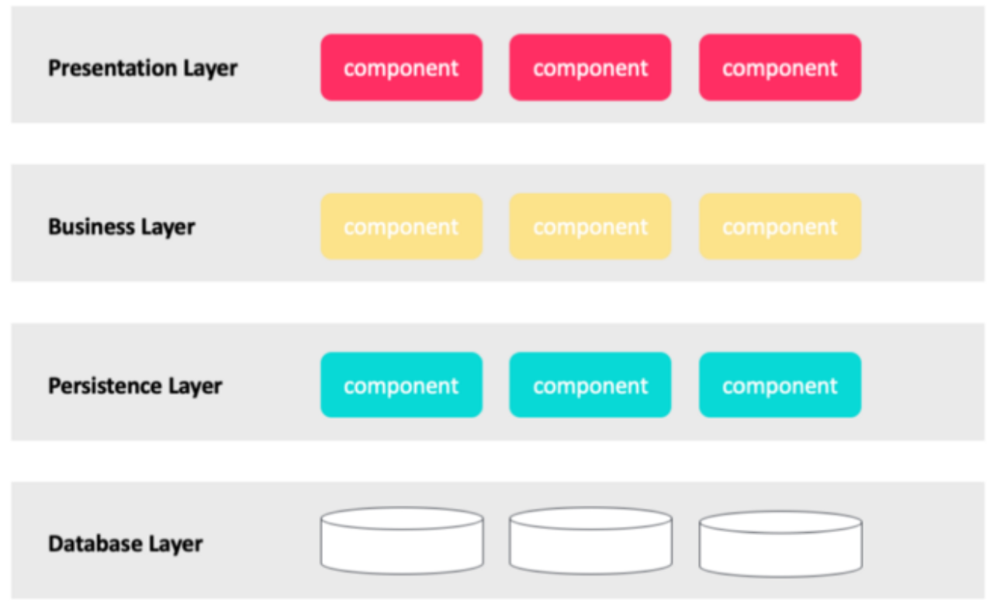
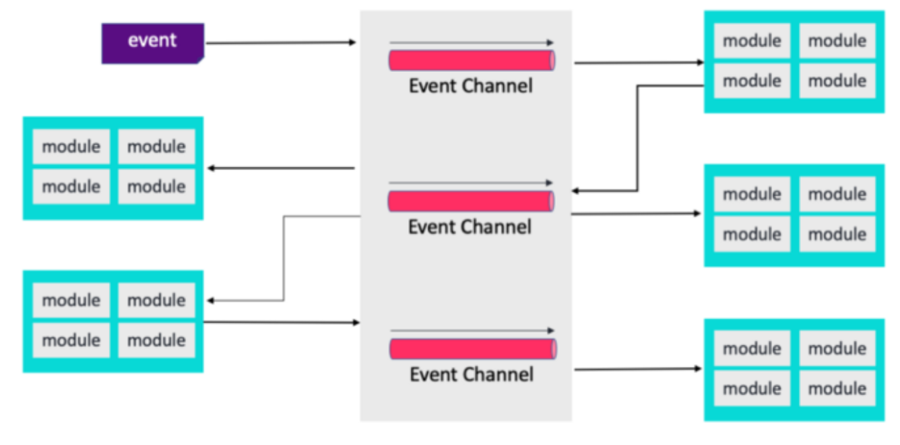
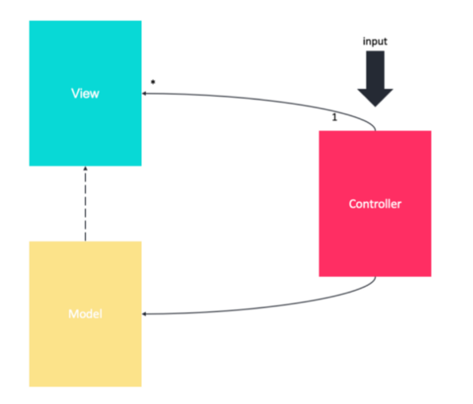
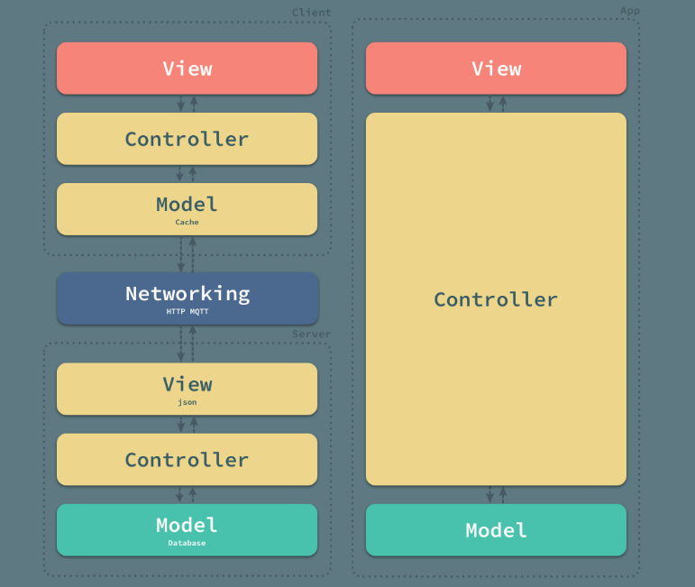
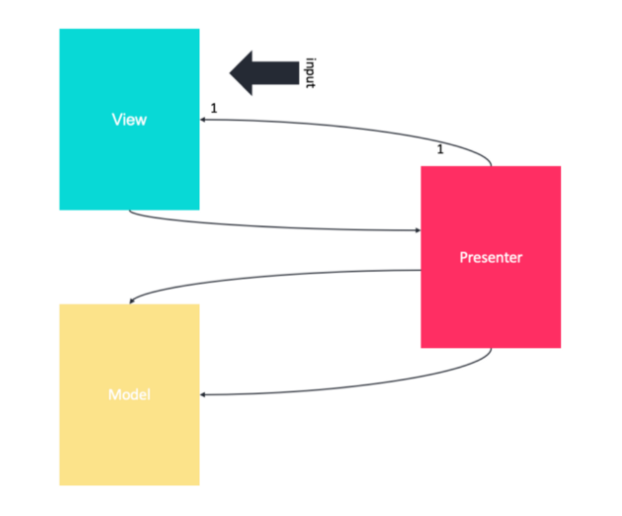
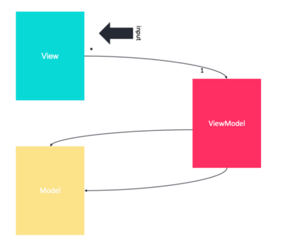
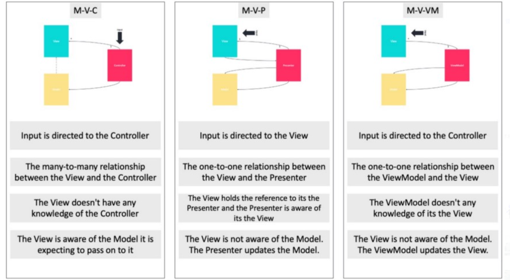
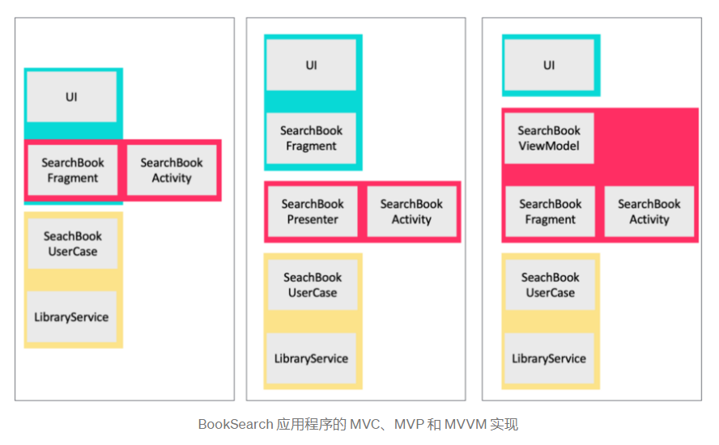
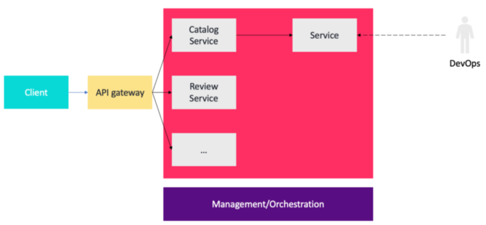
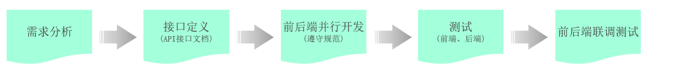

# 架构概览

不包含算法类。

## 基本概念

- 架构（架构模式，Architecture）

	系统结构。

- 框架（框架模式，Framework）

	组件规范，实例规范，事物的统一环境、操作规范。

- 设计模式（Design Pattern）

	编码经验与技巧。

- 模块（Module）

	功能逻辑。

- 组件（Component）

	物理区域，代码区域。

### 领域

- 前端

  前台，中台，后台

  - 用户界面（User Interface，UI）
  	- 外观
  	- 行为
  - 多页面
  	- 生成（渲染）
  	- 重定向

- 交互

  - 网络（物理）
  - 通讯
  	- 协议
  	- API 规范（接口规范）

- 后端（服务器端）
  - 业务逻辑
  - 操作系统
  - 文件系统

- 数据库

- 测试

- 运维

### 载体

- 客户端

	浏览器，应用，系统

	- PC
	- 手机
	- 物联网设备

- 服务器

	- Web 服务器（网页服务器）
	
		静态页面内容。
	
	- 应用服务器（后端服务器）
	
		业务逻辑，动态内容。
	
	- 中间件服务器
	
		任何结构位置起桥接作用的服务器。
	
	- 数据库服务器
	
		数据存储，供应。

### 扩展

- 虚拟化

	组合抽象，虚拟（概念）主体。

- 容器化

	环境隔离，迁移。

- 单体

	整个问题涉及的各个部分集中处理。

- 集群

	规模分解，同类聚集处理。

- 分布式

	结构分解，异类分发处理。

### 通用原则

- 程序基本原则

	- 可靠性（Reliability）

		能达成目标。

	- 健壮性（Robustness）

		能处理异常。

	- 可扩展性（Scalability）

	- 可维护性（Maintainability）

- 业务系统原则

	- 高并发（High Concurrency）
	- 高可用（High Performance）
	- 高性能（High Availability）
	- 安全
	
- 面向对象程序设计（Object-oriented Programming，OOP）

- 复用（Multiplexing）

- 高内聚，低耦合（High Cohesion & Low Coupling）

- 奥卡姆剃刀（Ockham's Razor）

## 软件架构模式

各模式不是完全隔离的，甚至可以是综合的，也可以活用到各种规模上，在不同的实例上也有相当多的变种。

### 单体架构

（monolithic software）

早期软件所有功能都写在一起，高度耦合。

### 分层模式

一般分为：

- 表现层（Presentation Layer）
- 业务层（Business Layer）
- 持久化层（Persistence Layer）
- 数据库层（Database Layer）

### SOA

面向服务架构（Service-oriented Architecture，SOA）

- 服务请求
- 服务响应
- 服务传递

以服务为单位，划分为各种服务（功能模块），服务与服务间可以交互。

### EDA

事件驱动架构（Event Driven Architecture，EDA）

- 事件收集
- 事件处理
- 事件路由

以事件为单元，不断处理，传递，非同步事件可异步处理。

### MV X

#### MVC

模型、视图、控制器（Model View Controller，MVC）

含三个部分，三者间的关系存在多种解释，但每个部分的大体职责相似。

- 模型（Model）

  - 负责应用程序的业务逻辑。
  - 管理应用程序的状态。
  - 读取和写入数据、持久化。
  - 数据管理相关的任务，例如网络和数据验证。

- 视图（View）

  - 向用户展示数据。
  - 处理用户交互。

- 控制器（Controller）

	- 视图和模型由一个或多个控制器连接控制。
	- 转发，处理，传递请求。

可将前端分为 MVC ，后端分为 MVC ，从而以双 MVC 的形式，形成一个整体的 MVC ：

#### MVP

模型、视图、表现者（Model View Presenter，MVP）

- 模型（Model）
- 视图（View）
- 表现者（Presenter）
	
	从 View 获取输入，在 Model 的帮助下处理数据，并在处理完成后将结果传回给 View 。

#### MVVM

模型、视图、视图模型（Model View View-model，MVVM）

- 模型（Model）
- 视图（View）
- 视图模型（View-model）
	- 一方面是 View 的抽象，即是 View 的数据抽象。
	- 另一方面提供要链接的 Model 数据的包装器（绑定器），即一个加装了视图的模型抽象，它还包含视图可以用来影响模型的命令。
	- 提供 View 和 Model 的同步机制。

#### 对比

实现一个 BookSeach 程序以帮助理解：（seach a fragment to find the book）

### 微服务

（Microservice）

将应用程序构建为服务套件（将服务抽象为组件），服务与服务可以组装，每个服务都可以独立部署和扩展，并且有自己的 API 边界。

不同的服务可以用不同的编程语言编写，管理自己的数据库，由不同的团队开发。

## 前后端系统架构

对于一个某种规模、程度的功能交互，前后端分离时：

- 前端
	- 逻辑（表现逻辑，前端逻辑）
	
		- 单页面逻辑（View）
	
			静态页面，动态页面展示，DOM 行为等。
	
		- 多页面逻辑（Controller）
	
			动态页面渲染，页面路由（重定向）等。
	
	- 代码
	
	- 数据
	
- 后端（Model）
	- 逻辑（业务逻辑，后端逻辑）
	- 代码
	- 数据

### 前后端未分离

表现逻辑与业务逻辑交织，全栈人员（还不分前后端）要负责表现逻辑，还要负责业务逻辑，高度耦合，会有一个文件同时出现前后端代码的情况。

（MVC）

### 前后端半分离

表现逻辑与业务逻辑半分离，前端只负责单页面逻辑，后端负责多页面逻辑和业务逻辑，会涉及动态页面生成等代码，仍然较耦合。

（前 V + 后 MC）

### 前后端分离

表现逻辑与业务逻辑完全分离，前端只负责表现逻辑，后端只负责业务逻辑，二者只采用统一数据格式交互，代码也完全分离。

（前  VC + 后 M）

开发一个功能的具体流程：

 

1. 需求分析：首先我们需要阅读需求文档，分析需求，理解需求。
2. 接口定义：查询接口文档中关于需求的接口的定义，包括地址，参数，响应数据类型等等
3. 前后台并行开发：各自按照接口文档进行开发，实现需求
4. 测试：前后台开发完了，各自按照接口文档进行测试
5. 前后段联调测试：前段工程请求后端工程，测试功能

## 交互架构

### C/S

客户端 / 服务器模式（Client / Server）

需要不同的客户端，性能更强。

### B/S

浏览器 / 服务器模式（Browser / Server）

可以统一借助浏览器交互，较为灵活。

## 服务器架构

[浏览此参考即可](https://blog.csdn.net/baidu_39511645/article/details/78345573)

- 文件
- 数据库
- 缓存
- CDN
- 反向代理
- NoSQL
- 搜索引擎
- 消息队列
